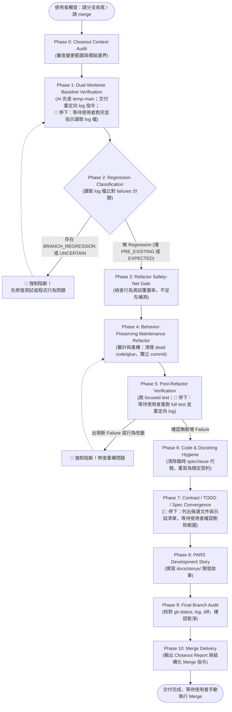

# 分支收尾標準工作流 (Branch Closeout Gated Workflow Skill) 🚀

本技能為本專案 Feature / Fix 分支開發完成後的**統一分支收尾 (Branch Closeout) 總編排技能 (Orchestration Skill)**。
負責從雙工作樹迴歸基準線 (Regression Baseline) 驗證開始，引導執行安全網檢驗、保行為維護重構 (Behavior-Preserving Maintenance Refactor)、程式碼與文件契約收斂，直到交付標準 Merge 指令。

---

## 👤 Usage Scope & 協作環境守衛 (Solo vs. Team Guard)

> [!IMPORTANT]
> **本 Skill 預設為「單人開發模式 (Solo Development Mode)」**：
> 假設由單一開發者全權管理 `main`，因此允許以本地 `temp-main` 作為個人 baseline，並在 clean 且可 fast-forward 時由 AI 輔助同步。

### 🛡️ 多人協作防護網 (Multi-Developer Guard)
若出現團隊協作特徵（如有多位活躍貢獻者、強制 PR Review、保護分支或遠端 CI 驗證）：
- 🚫 **禁止套用 Solo-Only 步驟**：不得以本地 `temp-main` 取代團隊整合環境，嚴禁本機直接 `--ff-only` 或繞過 PR/CI/Review 機制。
- ✅ **維持通用收尾步驟**：保留 HEAD baseline 測試、迴歸分類、保行為重構與文件/契約收斂等核心品質閘門。
- 🔀 **改由團隊標準流程整合**：交付物由本機 `--no-ff` 指令轉為提供 PR 描述、CI 檢查指引或協同合併審查。

---

## 🎯 觸發詞識別 (Trigger Identification)

當使用者發出以下任何指令時，一律視為啟動本工作流：
- `請分支收尾` / `分支收尾`
- `準備 merge` / `準備merge`
- `請 merge` / `請merge` / `跑merge`
- `收尾分支` / `結束分支`

> [!CRITICAL]
> **【最高硬性阻斷禁令 (Hard Blocking Invariant)】**
> 1. **「請 merge」代表「啟動分支收尾流程」，絕對不是「立刻輸出 `git merge` 指令」！**
> 2. 本流程為**硬性分段閘門工作流 (Gated Workflow)**，**嚴禁一次跑到底**！
> 3. 每當遇到需要使用者執行全套測試、確認文件清理範圍或確認重大決策的 Gate 時，AI **必須停下來等待使用者回覆，嚴禁擅自推進至下一階段**。

---

## 📁 標準工作區配置 (Worktree Layout)

收尾時標準工作樹配置如下：

```text
E:\Side_Project\
├─ BlackfireCrusade_tool\   ← 日常 Feature/Fix branch worktree (當前開發目錄)
└─ temp-main\               ← 長期保留的 main baseline worktree
```

- `temp-main` 是長期存在的基準線工作樹，**不需要每次重新建立**。
- **嚴禁假設 `temp-main` 一定已同步到最新 main**，在驗證前必須進行狀態檢查與安全同步。
- **永久雙工作樹互斥與分工鐵律 (Permanent Dual-Worktree Invariant)**：
  - **Git 限制**：同一分支（Branch Ref）在同一時間只能被一個工作樹 checkout。
  - **`temp-main` 永久持有 `main`**：專職負責 Baseline 測試、執行 `--no-ff` 合併、以及 `git push origin main`。
  - **`BlackfireCrusade_tool` 永久只持有 Feature/Fix 分支**：日常開發與單元測試。**嚴禁在此工作樹執行 `git checkout main`**（會遭 Git 拒絕）。合併完成後，直接在此目錄從最新 `main` 建立下一個 feature 分支（`git switch -c <next_feature> main`），完全不需要切回 main！

---

## 🚦 11 階段硬性狀態閘門 (The 11-Phase Gated Workflow)



---

### Phase 0 — Closeout Context Audit (變更脈絡審計)

**目標**：完整理解本分支實際改動內容與模組邊界，嚴禁直接開始 merge。

1. **執行環境與歷程審查**：
   ```powershell
   git status
   git branch --show-current
   git diff main...HEAD --stat
   git log main..HEAD --oneline
   ```
2. **變更清單盤點**：
   - 本 branch 涉及的 Production Code 檔案。
   - 相關的 Unit / Behavioral Tests。
   - 暫時性 Specs / TODOs / RFCs。
   - 相關的 Canonical Contracts 與 Architecture Docs。
3. **產出**：向使用者簡要回報當前分支名稱、變更檔案規模與核心模組，並準備推進至 Phase 1。

---

### Phase 1 — Dual-Worktree Baseline Verification (雙工作樹基準線驗證)

**目標**：確認 `temp-main` 為乾淨且最新的 main baseline，隨後由使用者分別執行 HEAD 與 main 的完整 test suite。

> [!WARNING]
> **AI 嚴禁自行執行完整 test suite (`python -m unittest discover tests`)！**

#### 1. AI 主動核驗並刷新 main baseline
於 `E:\Side_Project\temp-main`：
- 確認 `git status --short` 為 clean（無未提交修改）。
- 確認 `git branch --show-current` 為 `main`。
- 執行 `git fetch origin`。
- 比較兩者 Commit Hash：
  - `git rev-parse HEAD`
  - `git rev-parse origin/main`

**決策分流**：
- **若兩者相同**：baseline 已為最新狀態，直接進入測試。
- **若兩者不同**：僅在 worktree clean 且可 fast-forward 時執行：
  ```powershell
  git pull --ff-only
  ```
  *(注：baseline worktree 嚴禁產生 merge commit，必須使用 `--ff-only`)*
- **若出現 dirty、diverged 或無法 fast-forward**：
  - 立即停止流程並向使用者回報異常。
  - **嚴禁自行使用 `reset --hard`、`clean`、force checkout 等破壞性操作**。

#### 2. 一次性交付雙 Terminal 測試指令 (重定向至獨立 Log 檔案)
*(注：為徹底防止 Windows PowerShell 因原生應用程式 stderr 重定向產生 NativeCommandError 與 CP950/Big5 亂碼，全套測試統一透過 `cmd.exe /c "chcp 65001 >nul && ... -X utf8 ..."` 執行，確保產生純淨 UTF-8 日誌檔)*
*(注：`temp-main` 為 Git worktree，通常無獨立 `.venv`，兩組測試統一共用主專案之 Python 解譯器以保證相依套件環境 100% 一致)*
- **Terminal 1 — Feature HEAD 測試**：
  ```powershell
  cmd.exe /c "chcp 65001 >nul && cd /d E:\Side_Project\BlackfireCrusade_tool && .venv\Scripts\python.exe -X utf8 -m unittest discover tests > head_test_output.log 2>&1"
  ```

- **Terminal 2 — Main Baseline 測試**：
  ```powershell
  cmd.exe /c "chcp 65001 >nul && cd /d E:\Side_Project\temp-main && E:\Side_Project\BlackfireCrusade_tool\.venv\Scripts\python.exe -X utf8 -m unittest discover tests > E:\Side_Project\BlackfireCrusade_tool\main_test_output.log 2>&1"
  ```

> [!TIP]
> **執行順序守則**：兩組測試可以依序或平行執行；若測試涉及共享之 runtime resources（如遊戲處理序、`user_data/` 狀態檔、固定 debug 截圖/日誌等），**必須依序執行**以防互斥污染。

#### 3. 🛑 阻斷點 (Gate Invariant)
- 停在此處，**等待使用者在兩個 Terminal 執行完畢並回報「已跑完」**。
- AI 收到通知後，直接以 `view_file` 讀取 `head_test_output.log` 與 `main_test_output.log` 進行完整、零截斷之比對分析。
- 收到雙邊測試完成通知前，**絕對不得進入下一階段**。

#### 4. 結構化記錄
```text
HEAD BASELINE
- passed: <數量>
- failed: <數量>
- errors: <數量>
- failing test names: [測試方法名稱清單]

MAIN BASELINE
- passed: <數量>
- failed: <數量>
- errors: <數量>
- failing test names: [測試方法名稱清單]
```

---

### Phase 2 — Regression Classification Gate (迴歸分類閘門)

**目標**：精確比對 `MAIN BASELINE` 與 `HEAD BASELINE`，將所有失敗案例分類並阻斷潛在迴歸。

#### 失敗案例四象限分類：
1. **`PRE_EXISTING_FAILURE`**：main 與 HEAD 均失敗的測試。屬於既有基準線問題，非本次分支引入。
2. **`BRANCH_REGRESSION`**：main 通過但 HEAD 失敗的測試。確定為本分支引入的 regression！
3. **`EXPECTED_BEHAVIOR_CHANGE`**：main 的舊測試預期因本次已確認之業務需求而合法改變。
   - 必須由 Spec、Canonical Contract 或驗收條件佐證。
   - 嚴禁僅因為「現在實作改成這樣」就將失敗歸類於此。
4. **`UNCERTAIN`**：無法立即確定是 Production Bug、過期測試還是需求模糊的案例。

#### Production-vs-Test 修復守則

Regression 分析與修復必須遵循 `project-test-rules` 的
**Test-Induced Production Logic Prohibition**。

特別禁止為了相容 Mock / Fixture 而在 Production Code 新增測試專用 bypass。

> [!CRITICAL]
> **🛑 阻斷點 (Hard Gate)**：
> 若存在任何 **`BRANCH_REGRESSION`** 或 **`UNCERTAIN`**：
> - **絕對禁止進入後續 Refactor 或 Merge Closeout**！
> - 必須停下來深入分析原因，優先修復測試或 Production 程式碼行為，回到 Phase 1 重新取樣。

---

### Phase 3 — Refactor Safety-Net Gate (重構安全網閘門)

**目標**：確保在開始任何重構前，本分支的重要可觀察行為已有足夠的測試保護。

1. **核心自我詰問**：
   > 「如果下一階段修改內部實作時，不小心改壞了目前已通過的合法行為，現有測試是否具備足夠高機率能精確攔截？」
2. **補強防護網**：
   - 若測試網不足，優先提出需要補齊的：
     - Characterization Tests（特徵描摹測試）
     - Behavioral Tests（業務行為測試）
     - Contract-Level Regression Tests（契約層級迴歸測試）
   - 測試遵循 Google 軟體工程規範：**驗證可觀察行為，不依賴內部私有變數或 private helper**。
3. **提早固化**：補齊測試後，以獨立 commit 提交（依 `precise_git_commit` 白名單 stage），方可推進。

---

### Phase 4 — Behavior-Preserving Maintenance Refactor (保行為維護重構)

**目標**：在不改變任何可觀察行為的前提下，消除 dead code、重複邏輯、過渡膠水與不必要複雜度。

1. **執行 Refactor Audit（審查 `git diff main...HEAD`）**：
   - `Safe dead code removal`：確認無 caller 的死代碼
   - `Safe simplifications`：化簡過深的巢狀分支與流程
   - `Safe duplication removal`：提取超過 3 行的重複邏輯
   - `Temporary glue`：清除開發過程暫時搭建的適配層
   - `Obsolete compatibility paths`：清理已無意義的舊相容路徑
   - `Duplicated state ownership`：釐清狀態歸屬，消除重複維護
   - `Responsibility / boundary issues`：對齊模組單一職責
   - `Compatibility logic that must remain`：明確標註不可動的相容邏輯
   - `Deferred architecture work`：移出本次、記錄至未來工作
   - `Explicitly out of scope`：明確排除的項目
2. **八大硬性限制 (Strict Refactor Invariants)**：
   1. 不新增功能。
   2. 不改變可觀察行為 (Observable Behavior)。
   3. 不順便重寫無關模組。
   4. 不因為「追求漂亮」而增加過度抽象層。
   5. 不修改正確的 tests 來配合重構。
   6. 需要改變行為的問題，移出本次重構。
   7. 涉及重大架構遷移的問題，記錄為後續工作。
   8. 刪除代碼前必須全方位確認不存在：Runtime Caller、Callback、Registry、動態分發、Config 驅動調用、CLI/腳本入口、反射調用。
3. **獨立提交**：重構必須使用獨立 Commit，例如：
   ```powershell
   git commit -m "refactor: simplify <scope> after feature implementation"
   ```

---

### Phase 5 — Post-Refactor Verification (重構後驗證)

**目標**：確認維護重構完全沒有破壞任何行為或引入新錯誤。

1. **AI 執行聚焦測試**：
   - 優先執行與重構模組直接相關的聚焦單元測試，確保快速反饋。
2. **🛑 阻斷點 (Gate Invariant)**：
   - 請使用者在 Feature/Fix 工作樹再次執行全套測試套件並重定向至日誌：
     ```powershell
     cmd.exe /c "chcp 65001 >nul && cd /d E:\Side_Project\BlackfireCrusade_tool && .venv\Scripts\python.exe -X utf8 -m unittest discover tests > post_refactor_test_output.log 2>&1"
     ```
   - 停在此處，等待使用者回報執行完畢。
   - AI 讀取 `post_refactor_test_output.log` 比對確認。
3. **比對確認**：
   - 比對 `HEAD BEFORE REFACTOR` vs `HEAD AFTER REFACTOR`。
   - 必須滿足：
     - `New failures introduced: NONE`
     - `Behavior changed: NO`
   - 若產生任何新 failure，**嚴禁進入文件收斂或 merge 階段**，必須立即退回修復重構。

---

### Phase 6 — Code / Documentation Hygiene (程式碼潔淨度審計)

**目標**：徹底消除 Production 代碼中的臨時歷史痕跡。

1. **排查檢核**：
   - 檢查本次異動之 Production Code 中的 docstrings 與註解。
   - 徹底移除暫時性 spec 名稱（如 `nav_slow_bug2`、`bag_bug` 等檔名）、分支名、Task ID、WIP 註記或歷程說明。
2. **契約化改寫**：
   - Production Code 只能保留：穩定的行為語意 (Behavior Semantics)、職責邊界、公開契約。
   - 若確實需要標示架構依據，**僅限引用長效維護的 Canonical Contract**（例如 `Contract: docs/features/navigation/lobby_scene_contract.md`）。

---

### Phase 7 — Contract / TODO / Spec Convergence (契約與文件收斂)

**目標**：調用 [`canonical_contract_archival`](../canonical_contract_archival/SKILL.md) 技能，落實 **Audit-First（先審查分層再動文件）** 機制。嚴禁一看到候選就寫 Contract，必須透過語意分層審查、Invariant 語意壓縮、反事實自檢與上位契約去重，確認存在真正的 Normative Delta 後方可更新 Canonical Contract，最後清理已收斂之過期文件與日誌，防止 Doc/Artifact Drift。

#### 1. Audit-First 候選審查矩陣 (Candidate Audit Matrix)
盤點 `git diff main..HEAD --name-only` 涉及的 `docs/todos/`、臨時 Specs、RFCs、`future_work.md` 及代碼中的行為變更。在修改任何契約檔案前，**必須先輸出結構化審查矩陣**：

| Candidate | Source | Semantic Layer | Existing Parent Contract | Promote? | Canonical Wording | Excluded Implementation Details | Evidence |
| --- | --- | --- | --- | --- | --- | --- | --- |

#### 2. 審查 5 步硬性管線 (The 5-Step Convergence Pipeline)
任何 candidate 在獲准進入 Canonical Contract 規範章節前，必須依序通過以下 5 步審查：
1. **Classification (語意分層)**：分類為 7 大層級（`ARCHITECTURE_INVARIANT`, `DOMAIN_CONTRACT`, `RUNTIME_POLICY`, `IMPLEMENTATION_DETAIL`, `DIAGNOSTIC_DETAIL`, `HISTORY`, `TODO`）。只有前兩者允許進入 Normative Section。
2. **Abstraction (語意壓縮)**：強制剝離具體實作詞彙（禁止包含：timeout 秒數、retry 次數、cooldown 秒數、threshold、ROI 座標、模板檔名、私有函式名、debug 標籤、臨時 enum 等），改寫為最小穩定語意。
3. **Counterfactual Check (反事實自檢)**：逐一通過 5 大反事實提問（Rename、Policy 調整、比對演算法替換、日誌標籤變更、FSM 結構重構後是否仍必須成立？若否則降級或再抽象化）。
4. **Parent-Contract Dedup (上位去重)**：檢索既有上位契約（如 `precondition_contracts.md`）。上位已定義之鐵律（如 Click ≠ Completion、Bounded Retry、Recovery 不得偽裝成功）不得全文複製，僅記錄 Domain Specialization。
5. **Normative Delta (增量判定)**：核對是否具備真正的長效約束增量。

#### 3. 契約升格與無增量判定 (Contract Update or No-Delta Confirmation)
- **若存在 Normative Delta**：主動更新/建立對應的 Canonical Contract（`docs/architecture/` 或 `docs/features/`）。每條 Invariant 必須包含 `Scope`, `Rule (MUST/MUST NOT)`, `Observable consequence`, **`Allowed variation` (必要欄位)** 與 `Verification`。同步更新 `future_work.md` 索引。
- **若無 Normative Delta**（全部候選均已被上位契約涵蓋，或僅屬 policy/implementation）：明確記錄「**經審查無新增長效不變量**」。**嚴禁為了分支收尾硬湊或生造 Invariant**！

#### 4. 🛑 阻斷點：文件／日誌清理範圍確認 (Mandatory User Scope Confirmation)
⚠️ **嚴禁 AI 自行決定清理範圍**！確認 durable semantic knowledge 已被涵蓋、升格或移至 TODO/ADR/History 後，**停在此處向使用者呈報**：
1. 【已升格更新之 Canonical Contract 清單與章節】（或記錄「經審查無新增長效不變量」）；
2. 【已萃取完畢、建請刪除 (DROP) 的過期 Spec 清單與暫存測試日誌 (`*.log`)】（遵循「刪除是預設；封存是例外」原則）；
3. 【仍未完成需保留 (RETAIN) 的 TODO 清單】。

**等待使用者確認同意後，方可執行檔案刪除 (`git rm`)**。

#### 5. 獨立提交 (Dedicated Commit)
以 `docs: archive and converge <scope> contracts` 進行獨立精確 Commit。

---

### Phase 8 — PARS Development Story (開發故事與技術敘事歸檔)

**目標**：記錄本次開發歷程，供後續回溯複盤。

#### 1. PARS 定位與歷史邊界鐵律 (Historical Boundary)
- **PARS 是 branch 完成後的歷史敘事與工程複盤**，不是 architecture contract，**絕對不得作為 canonical architecture evidence**。
- **目標**：不是只記錄「做了什麼」，而是讓未參與開發的人理解：**在什麼條件下遇到了什麼問題、為什麼做出這個選擇、這個選擇換來什麼與付出什麼，以及證據實際支持到哪裡**。
- **歷史約束**：PARS 可以記錄當時的 architecture reasoning、trade-off 與 assumptions，但只能描述「當時為什麼這樣決定」。若 PARS 與目前 architecture contract 或 implementation 衝突，一律以目前 canonical architecture / code 為準。寫完 PARS 不等於完成架構收斂！

#### 2. 工程推理骨架 (Reasoning Checklist, Not Mandatory Template)
- 保留 **Purpose / Action / Result / So What / Influence** 作為高階敘事目的，**但不要把它當成固定標題模板**。
- 對具有實質工程決策的故事，敘事應視需要自然涵蓋：
  ```text
  Context → Premise/Assumption → Problem/Tension → Reasoning → Decision/Approach → Benefit & Trade-off → Result → Remaining Uncertainty
  ```
- **Reasoning Checklist 而非死板 H2**：不要求每篇使用 Premise、Trade-off、Unknown 等固定標題。可以依故事採用 Before/After、問題→診斷→決策→結果、或其他自然結構。推理完整性優先於模板一致性。不得為了填滿結構而捏造不存在的 trade-off、assumption 或 uncertainty。

#### 3. 核心寫作與證據規範 (Core Writing Rules)
1. **Evidence discipline (Certainty <= Evidence)**：
   - 敘事必須讓讀者能自然區分：`observed/verified facts`（實測觀察）、`evidence-backed inference`（證據推論）、`currently relied assumption`（依賴假設）、以及 `unproven uncertainty`（尚未證明之未知）。
   - 不要求固定使用 `Verified / Inferred / Assumed / Unknown` 等僵化標籤。
2. **Premises and boundaries (先揭露成立前提)**：
   - 若重要結論依賴特定版本、環境、模型行為、scope、known invariant 或 compatibility assumption，應在該結論成立的脈絡附近自然交代，不應全部藏到文章最後當作免責聲明。
3. **Decision and trade-off (Trade-off 是決策的一部分)**：
   - 對重要 architecture、workflow 或 implementation decision，說明為什麼選擇它而不是合理替代方案，以及它帶來的實際 benefit、cost、complexity 或新的 failure surface。若沒有實質 trade-off，不要硬湊。
4. **Result closes the loop (結果與假設形成閉環)**：
   - Result 不只描述「PASS」、「成功」或「改善」，而應回扣原先的問題或假設，說明證據證明了什麼，以及沒有證明什麼。優先使用實測數據、failure behavior、before/after evidence 或 deterministic observations。
5. **Mechanics over adjectives (機制與因果優先於形容詞)**：
   - 技術力度應來自機制、因果與證據，而不是形容詞。避免「完美、革命性、徹底解決、極佳、大幅提升」等沒有證據邊界的強化語。
   - 範例：寫「原本在 480 秒 hard timeout 前無法收斂；加入 step budget 後，本次 Scout 在 139 秒完成」，而不是寫「新的設計大幅提升 Scout 效率並徹底解決 timeout」。
6. **Preserve failed paths when they explain the final design (保留推動最終設計的失敗嘗試)**：
   - 僅當失敗嘗試**實質改變了對問題的診斷、暴露了原本隱含的假設、排除了看似合理的替代方案、或解釋了最終設計為何存在時**，才將其寫入故事。嚴禁為了紀錄完整性而流水帳列舉無意義的除錯細節（如打錯指令修 typo）。

---

### Phase 9 — Final Branch Audit (最終分支審查)

**目標**：合併前全面複核，確保工作區與提交歷史潔淨無暇。

1. **執行全域檢核指令**：
   ```powershell
   git status
   git log main..HEAD --oneline
   git diff main..HEAD --stat
   git diff main..HEAD --name-only
   ```
2. **確認檢核項目**：
   - [ ] Working tree 保持乾淨 (Clean)。
   - [ ] Commits scope 清楚分離 (feature, test, refactor, docs 獨立可辨)。
   - [ ] 暫時性 Spec 已正確收斂並刪除過期副本。
   - [ ] Canonical Contract 與索引已同步。
   - [ ] 無任何未追蹤或非本次任務的臨時檔案進入分支。

---

### Phase 10 — Merge Delivery (合併指令交付)

> [!CRITICAL]
> **只有當 Phase 0 至 Phase 9 的所有 Gate 均已確實完成後，才允許進入本階段！**
> AI **絕對禁止自行執行 `git merge`**，必須交付編排好的指令給使用者手動執行。

1. **輸出結構化 Closeout 報告**：
   ```markdown
   ### Branch Closeout Report

   - **Branch**: `<feature_branch_name>`
   - **Change summary**: `<本次變更核心摘要>`

   #### Test Baseline & Verification:
   - **Main baseline**: passed <P>, failed <F>, errors <E>
   - **HEAD pre-refactor baseline**: passed <P>, failed <F>, errors <E>
   - **HEAD post-refactor result**: passed <P>, failed <F>, errors <E>

   #### Failure Analysis:
   - **Pre-existing failures**: [清單]
   - **Branch regressions**: NONE
   - **New regressions after refactor**: NONE

   #### Convergence Summary:
   - **Refactor summary**: `<重構要點>`
   - **Contracts updated**: `<升格或更新的契約路徑>`
   - **Specs removed / retained**: `<刪除之 spec 與保留清單>`
   - **TODOs created**: `<建立之後續 TODO>`
   - **PARS story**: `<docs/storys/...>`

   #### Readiness:
   - **Behavior changed during refactor**: NO
   - **New failures introduced**: NONE
   - **Ready to merge**: YES
   ```

2. **分支整合路徑與後續分支管理（權限分工與永久雙工作樹模型）**：
   > [!CRITICAL]
   > **合併權限分工與禁令 (Merge Authority Invariants)**：
   > 1. **本機 AI (Gemini / Antigravity / OpenCode)**：**永遠不能自行 merge、push main 或刪除分支**。
   > 2. **遠端協調者 (ChatGPT Remote Orchestrator)**：為推薦整合路徑。僅在所有收尾閘門通過、且**使用者明確授權**後，方可透過 GitHub API 執行整合。**GitHub 整合必須使用 merge commit（嚴禁 squash 或 rebase）**。
   > 3. **使用者手動 Fallback**：若 ChatGPT 遠端整合不可用或使用者選擇手動處理，由本機提供 safe `temp-main` `--no-ff` 合併指令由使用者於終端手動執行。
   > 4. **永久雙工作樹免切回原則 (Dual-Worktree Non-Checkout Rule)**：
   >    因 `main` 分支已被 `temp-main` 永久 checkout，**嚴禁在 `BlackfireCrusade_tool` 執行 `git checkout main`**。
   >    無論採用遠端或本機手動合併，`temp-main` 始終是本機唯一的 `main` 擁有者與測試基準；遠端合併完成後，`temp-main` 僅需執行 fast-forward 同步。

   - **整合路徑 A（推薦：ChatGPT 遠端 GitHub 合併）**：
     1. 本機完成 Phase 0~9 所有收尾閘門並確保變更已 push 至 remote review branch。
     2. 向使用者交付 Convergence Summary 與 Readiness Report。
     3. 使用者審閱後，向 ChatGPT 發出明確授權指示（例如「請執行 GitHub merge」）。
     4. ChatGPT 確認 PR/branch 狀態無漂移，透過 GitHub 執行 merge commit 整合至 `main`。
     5. 遠端整合完成後，本機更新 `temp-main` 基準：
        ```powershell
        Set-Location E:\Side_Project\temp-main
        git fetch origin
        git pull --ff-only
        ```

   - **整合路徑 B（Fallback：使用者於 `temp-main` 手動 `--no-ff` 合併）**：
     若 ChatGPT 遠端整合不可用，交付以下指令由使用者在終端手動執行：
     - **Windows (PowerShell)**：目錄切換統一使用 `Set-Location`（禁止使用 `cd /d`），並使用**多個 `-m` 參數**串聯避免換行截斷：
       ```powershell
       Set-Location E:\Side_Project\temp-main
       git merge --no-ff <branch_name> -m "Merge branch '<branch_name>' into main" -m "<簡短變更摘要>" -m "Verification: All unit tests verified against main baseline (0 regressions)."
       git push origin main
       ```
     - **Windows (CMD)**：切換磁碟目錄使用 `cd /d E:\Side_Project\temp-main`。
     - **Linux / macOS**：可使用標準多行引號或多個 `-m`。

   - **共通收尾步驟：Development Worktree Parking & Branch Cleanup（停泊於基準並對稱清理舊分支）**：

     無論透過整合路徑 A（ChatGPT 遠端 GitHub 合併）或路徑 B（使用者於 `temp-main` 手動合併），當 `origin/main` 已成功包含本次完成分支後，必須先透過 Git 指令驗證遠端 `origin/main` 確實已包含該 branch 的完整 ancestry：

     ```powershell
     git fetch origin
     git merge-base --is-ancestor <old_branch_name> origin/main
     ```

     若 ancestry 驗證失敗（exit code != 0），立即停止；不得刪除任何 local / remote branch。

     驗證成功後，回到永久 Feature/Fix 工作樹 `BlackfireCrusade_tool`：

     ```powershell
     Set-Location E:\Side_Project\BlackfireCrusade_tool

     git fetch origin

     # main 已由 temp-main 永久 checkout，因此本工作樹不得 checkout main。
     # 使用 Detached HEAD 停泊於 canonical remote baseline，
     # 釋放目前 Feature/Fix branch 的 worktree ownership。
     git switch --detach origin/main

     # 確認舊 branch 已無 worktree 使用後，先安全刪除 local branch。
     git branch -d <old_branch_name>

     # local branch 成功刪除後，清除對應 remote review branch。
     git push origin --delete <old_branch_name>

     git fetch --prune
     ```

     完成後，`BlackfireCrusade_tool` 應處於：
     ```text
     HEAD detached at origin/main
     working tree clean
     old local branch absent
     old remote branch absent
     ```

     此 Detached HEAD 是永久雙工作樹模型下的合法 **Baseline Parking State**，不是異常狀態。

     #### Hard Invariants
     * `temp-main` 永久持有 `main`。
     * `BlackfireCrusade_tool` 在 branch closeout 後停泊於 `origin/main` Detached HEAD。
     * 不得為了清理舊 branch 而在 development worktree checkout `main`。
     * 不得在確認 `origin/main` 包含完成 branch 前刪除 local 或 remote branch。
     * 優先刪除 local branch，再刪除 remote branch；若 local 安全刪除失敗，保留 remote branch 供恢復與審查。
     * Branch Closeout 到此即結束，不得要求使用者立即決定下一個任務。

     #### Next Development
     若使用者之後要開始新的 Feature / Fix：
     **不要由本 Skill 建立下一個 branch。**
     改由 [`branch_start_workflow`](../branch_start_workflow/SKILL.md) 從目前 Baseline Parking State 啟動新的開發 lifecycle。

---

## 🧩 模組化職責邊界與技能引用矩陣 (Skill Matrix)

本工作流作為總編排者，遵循分工原則，嚴禁重疊複製。調用相關技能時維持各技能單一職責：

| 階段 | 職責 | 權威依歸 / 調用技能 |
| :--- | :--- | :--- |
| **Phase 1, 5** | 測試執行政策（AI 不自行跑 full test，提示使用者跑） | [`project-test-rules`](../project-test-rules/SKILL.md) |
| **Phase 3, 4, 7** | 精確 Commit 白名單 stage（嚴禁 `git add .`） | [`precise_git_commit`](../precise_git_commit/SKILL.md) |
| **Phase 7** | 文件與契約分類、提煉不變量、刪除過期 spec | [`canonical_contract_archival`](../canonical_contract_archival/SKILL.md) |
| **Phase 8** | 客觀撰寫 PARS 故事，證據確定性約束 | [`write_docs`](../write_docs/SKILL.md) |
| **Phase 10** | 強制 `--no-ff` 合併與跨平台 Shell 語法 | [`.agents/AGENTS.md`](../../AGENTS.md) 第 1 條 |

