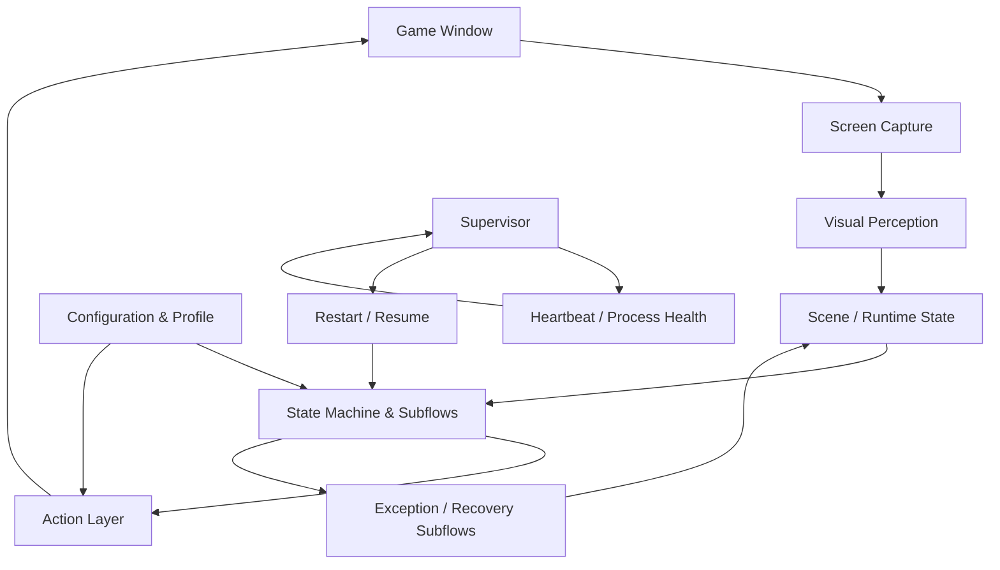

# Blackfire CV Autopilot

[English](README.md) | [繁體中文](README.zh-TW.md)

**A computer-vision-driven autonomous game agent for Blackfire Crusade, designed for long-running unattended operation with state-machine orchestration, closed-loop recovery, multi-instance isolation, and automated resource/task management.**

Blackfire CV Autopilot observes the game through screenshots and computer vision, determines the current game state, and executes the next action through foreground or Win32 background control.

The project covers repeated combat, dungeon exploration, daily activities, inventory management, town workflows, resource collection, and runtime recovery. Its current focus is not only automating individual clicks, but keeping multi-step gameplay flows running under changing visual states and recoverable failures.

---

## Features

### Gameplay automation

The agent currently supports several long-running gameplay flows:

* **Stage farming** — enters stages, enables automatic combat, processes battle results, and retries after defeat.
* **Dungeon exploration** — handles floor progression, random events, blessings, rewards, and dungeon selection.
* **Mixed operation** — switches between supported gameplay activities according to the active configuration and runtime state.
* **Daily mode** — coordinates once-per-day town tasks, scheduled Lord Boss encounters, bounty quests, and a configurable long-running fallback activity through a prioritized pipeline.
* **Inventory management** — detects full inventory conditions, classifies equipment rarity, keeps configured valuable equipment, and dismantles or destroys lower-priority items.
* **Town workflows** — executes independent town subflows such as the Blood Altar and Jewelry Workshop through a shared task pipeline.

Detailed behavior is documented under [`docs/features/`](docs/features/).

### Daily mode

`--mode daily` is the long-running mode for coordinating recurring and once-per-day activities. Instead of executing a fixed sequence and stopping, it maintains a priority hierarchy and selects work according to completion state, cooldowns, available resources, and the current gameplay state.

| Priority | Responsibility |
| :--- | :--- |
| Tier 1 — Town tasks | Runs once-per-day activities such as the treasure chest, free hero recruitment, Blood Altar / Jewelry Workshop processing, and bounty-board preparation. |
| Tier 2 — Lord Boss | Tracks available Lord Boss encounters and their cooldowns. Ready Boss work takes priority over bounty progression and the steady-state activity. |
| Tier 3 — Bounty quests | Schedules accepted bounty objectives and routes them to the corresponding stage or dungeon flow. |
| Tier 4 — Steady state | Runs the player's configured activity while higher-priority daily work is complete or waiting on cooldown. |

Priority changes are applied at suitable transition points rather than interrupting an active battle. For example, when a higher-priority Boss becomes available during stage farming, the current battle is allowed to finish before control is handed back to the daily scheduler.

Daily progress is persisted per profile, including completed subflows, Boss counters, and timing information. Restarting the bot therefore does not require rebuilding the daily workflow from the beginning; completed work can be skipped when the same profile resumes.

The scheduler also handles two long-running conditions:

* **Resource backoff** — when an activity cannot continue because stamina is insufficient, execution can fall back to `collect_only` to collect resources (bread) instead of repeatedly retrying the blocked activity.
* **Daily rollover** — the daily state is reset at 08:05. If the agent is already in combat, the current battle is completed before the new daily pipeline takes over.

Daily progress is exposed through Discord notifications, including intermediate and completion milestones and a pre-reset reconciliation check for unfinished daily work.

The detailed task definitions and scheduling rules are documented in [`docs/features/daily_task/daily8.md`](docs/features/daily_task/daily8.md).

---

## Long-running operation

Long-running automation introduces failures that do not appear in a short scripted demo: delayed transitions, unexpected dialogs, stale visual states, an unresponsive game window, screenshot failures, or a terminated bot process.

The project therefore includes runtime recovery mechanisms in addition to gameplay logic.

### Supervisor and heartbeat

For unattended operation, `run.bat` launches the bot through an external Supervisor.

The Supervisor monitors a per-profile heartbeat and can restart the bot process when the child process exits or stops making progress. Restarted processes reuse the selected target and profile through the `--resume` path instead of repeating the interactive startup configuration.

The runtime also checks whether the selected game window is unresponsive and can escalate the startup path to a game relaunch.

See [Long-running operation and automatic recovery](docs/長時間掛機與自動恢復使用說明.md) for the operational behavior.

### Recovery inside the agent

Recoverable gameplay failures are handled closer to the state in which they occur.

Examples include:

* action retries with bounded attempts;
* dedicated exception subflows for known unexpected dialogs;
* generic fallback handling when a dedicated recovery path is unavailable;
* post-action state verification for flows that require positive completion evidence;
* fallback to an unknown/recovery state when a transition cannot be confirmed.

Recovery behavior is separated from normal gameplay handlers where possible instead of accumulating special-case patches in the main loop.

See [`exception_subsystem_architecture.md`](docs/architecture/exception_subsystem_architecture.md).

---

## Multi-instance and background control

The application can target a specific game window through `--target`, including native and Sandboxie instances.

Each instance can use an independent profile under:

```text
user_data/<profile>/
```

Profile-specific state includes configuration and runtime data required to resume the same instance after a restart.

Native and Sandbox instances also use separate heartbeat files, allowing two supervised bot instances to run without treating the other instance's heartbeat as their own.

Backend production is the default: supported actions are sent to the target Windows game window without requiring ownership of the physical mouse for every interaction. Use `--foreground` for visible demo operation.

---

## Computer vision

The perception layer combines several techniques depending on the task rather than relying on one global detector.

### Template and region-based detection

UI elements and scene anchors are detected with OpenCV template matching. Detection can be scoped to regions of interest when the location of an element is constrained.

Scene recognition and action logic are kept as separate responsibilities so gameplay handlers can operate on recognized state instead of embedding every visual check directly into the main control loop.

### Equipment rarity classification

Inventory automation uses HSV-based color features to distinguish equipment rarity.

The classifier samples a ring-shaped region inside an equipment slot so that the feature is less affected by the center selection mark and unrelated parts of the item artwork.

The resulting classification is used by inventory-cleaning flows to preserve configured rarity levels while removing lower-priority equipment.

See [`bag_color_classification.md`](docs/features/bag_color_classification.md) for the current rules and thresholds.

### OCR-assisted workflows

Some task and cooldown flows use localized image crops and OCR-derived information when template matching alone is insufficient.

OCR configuration is kept separate from higher-level navigation and task scheduling rules.

---

## Architecture

At a high level, the runtime follows a perception → state → action loop, with recovery and supervision surrounding the normal gameplay path.



The implementation separates several responsibilities that were originally part of a single automation loop:

* screen capture and visual recognition;
* gameplay state handlers;
* reusable subflows;
* action execution;
* profile and configuration management;
* exception recovery;
* runtime supervision and process recovery.

The project documentation index is available at [`docs/README.md`](docs/README.md).

---

## Engineering highlights

### State-machine orchestration

Gameplay is represented as explicit states and subflows rather than one linear macro.

This allows combat, navigation, result handling, inventory processing, town activities, and recovery logic to retain their own transition rules while sharing the same runtime.

Longer operations are progressively moving toward tick-driven state transitions instead of blocking waits, allowing the main loop to remain responsive to new observations and recovery conditions.

### Task and subflow composition

Town activities and other multi-step features are implemented as composable subflows.

A parent workflow can enqueue work such as inventory cleanup, Blood Altar processing, or Jewelry Workshop processing and return to the previous steady-state activity after the queued work completes.

This avoids placing each new activity directly into the central state loop.

### Time as a runtime dependency

Time-dependent behavior uses a clock abstraction in migrated runtime paths rather than requiring every test to wait for real wall-clock delays.

Production execution retains real delays, while tests can inject a controllable clock and advance time deterministically.

This is also used to migrate blocking retry and result flows toward tick-driven behavior.

---

## Testing

The test suite focuses on externally observable state transitions, recovery behavior, configuration boundaries, and gameplay subflows.

The latest recorded full-suite run on `main` passed:

```text
1,092 tests
243.013 seconds
```

The previous full-suite baseline was above 380 seconds. The reduction came primarily from removing real test-time waits, isolating time behind a clock seam, and converting selected blocking flows to tick-driven transitions without changing their production timing behavior.

Tests can be executed with:

```powershell
.\.venv\Scripts\python.exe -X utf8 -m unittest discover tests
```

---

## Quick start

### Requirements

The project targets the Windows version of Blackfire Crusade and uses Windows-specific automation interfaces.

Clone the repository and create a virtual environment:

```powershell
git clone https://github.com/alu98753/Blackfire-CV-Autopilot.git
cd Blackfire-CV-Autopilot

python -m venv .venv
.\.venv\Scripts\activate

pip install -r requirements.txt
```

The main runtime dependencies include OpenCV, MSS, PyAutoGUI, NumPy, Pillow, and pywin32.

### Recommended launch

For normal long-running use, start from the repository root:

```powershell
.\run.bat
```

`run.bat` starts the supervised execution path and provides the interactive configuration required for the selected instance.

Running `main.py` directly is useful for development and targeted execution, but bypasses the outer Supervisor.

---

## CLI examples

Run the daily pipeline:

```powershell
.\.venv\Scripts\python main.py --mode daily
```

Daily activities can also be selectively enabled or disabled:

```powershell
.\.venv\Scripts\python main.py --mode daily --no-boss
.\.venv\Scripts\python main.py --mode daily --no-dungeon
.\.venv\Scripts\python main.py --mode daily --no-town
```

Run the default mixed mode:

```powershell
.\.venv\Scripts\python main.py --mode mix
```

Run dungeon exploration:

```powershell
.\.venv\Scripts\python main.py --mode dungeon
```

Run stage farming:

```powershell
.\.venv\Scripts\python main.py --mode stage
```

Enable background control:

```powershell
.\.venv\Scripts\python main.py --mode mix
```

Target the Sandbox instance:

```powershell
.\.venv\Scripts\python main.py --target sandbox --profile sandbox
```

Target the native Steam instance:

```powershell
.\.venv\Scripts\python main.py --target native --profile native
```

The current primary modes are:

```text
daily
mix
dungeon
stage
golden_empire
collect_only
```

Additional switches can independently enable or disable supported activities such as dungeon exploration, stage farming, town daily work, Lord Boss, and Demon Lords.

Run:

```powershell
.\.venv\Scripts\python main.py --help
```

for the current CLI contract.

---

## Documentation

The root README intentionally stays at the system and user-facing level. Detailed implementation rules live in the project documentation.

| Topic                            | Document                                                                                                         |
| -------------------------------- | ---------------------------------------------------------------------------------------------------------------- |
| Documentation index              | [`docs/README.md`](docs/README.md)                                                                               |
| System components                | [`docs/system_components_index.md`](docs/system_components_index.md)                                             |
| Scene recognition and navigation | [`docs/architecture/scene_recognition_and_navigation.md`](docs/architecture/scene_recognition_and_navigation.md) |
| Exception and recovery subsystem | [`docs/architecture/exception_subsystem_architecture.md`](docs/architecture/exception_subsystem_architecture.md) |
| Dungeon flow                     | [`docs/features/dungeon_flow.md`](docs/features/dungeon_flow.md)                                                 |
| Daily scheduling pipeline        | [`docs/features/daily_task/daily8.md`](docs/features/daily_task/daily8.md)                                       |
| Inventory color classification   | [`docs/features/bag_color_classification.md`](docs/features/bag_color_classification.md)                         |
| Town task pipeline               | [`docs/features/town_building/pipeline.md`](docs/features/town_building/pipeline.md)                             |
| Long-running operation           | [`docs/長時間掛機與自動恢復使用說明.md`](docs/長時間掛機與自動恢復使用說明.md)                                                               |
| Frequently asked questions (FAQ) | [`docs/faq.md`](docs/faq.md)                                                                                     |

Development decisions and completed implementation stories are recorded separately under [`docs/storys/`](docs/storys/) so that the README does not become a changelog.

---

## Project status

The project is under active development.

The current work is focused on improving long-running reliability, reducing blocking runtime behavior, strengthening recovery contracts, and keeping gameplay features isolated behind testable state and subflow boundaries.
