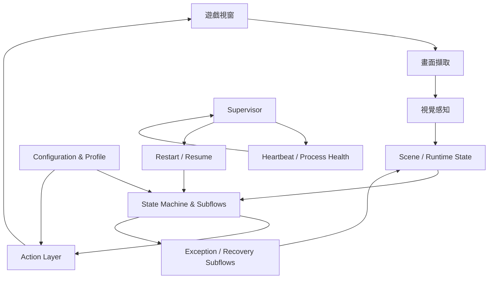

# Blackfire CV Autopilot

[English](README.md) | [繁體中文](README.zh-TW.md)

**以電腦視覺驅動的《Blackfire Crusade》自主遊戲 Agent，透過狀態機、閉環異常恢復、多實例隔離與任務調度，實現可長時間無人值守的遊戲自動化。**

Blackfire CV Autopilot 透過遊戲截圖與電腦視覺辨識目前畫面狀態，再依據執行中的遊戲流程決定下一個動作，並支援前台操作與 Win32 後台控制。

目前涵蓋連續戰鬥、地下城探索、日常活動、背包管理、城鎮工作、資源領取以及 Runtime 異常恢復。專案目前處理的問題已不只是自動執行個別點擊，而是讓多階段遊戲流程能在畫面狀態持續變化、部分操作可能失敗的情況下繼續運作。

---

## 功能

### 遊戲流程自動化

目前 Agent 支援數種可長時間執行的遊戲流程：

* **普通關卡**：進入關卡、啟用自動戰鬥、處理結算，並在戰敗後重新嘗試。
* **地下城探索**：處理樓層推進、隨機事件、祝福、獎勵與地下城選擇。
* **混合模式**：依據設定與 Runtime 狀態，在支援的遊戲活動之間切換。
* **日常與定時活動**：處理城鎮工作、資源領取、Boss 類活動與依冷卻時間觸發的流程。
* **背包管理**：偵測背包已滿、分類裝備品質、保留設定中的高品質裝備，並分解或銷毀低優先級物品。
* **城鎮工作流**：透過共用任務 Pipeline 執行血之祭壇、珠寶加工廠等獨立 Subflow。

各功能的完整行為規格收錄於 [`docs/features/`](docs/features/)。

---

## 長時間運行

短時間腳本通常不會遇到長時間自動化中的問題，例如畫面轉場延遲、突發彈窗、過期的畫面判斷、遊戲視窗未回應、截圖連續失敗，或 Bot 程序意外結束。

因此，本專案除了遊戲流程本身，也包含 Runtime 層級的恢復機制。

### Supervisor 與 Heartbeat

長時間執行時，`run.bat` 會透過外層 Supervisor 啟動 Bot。

Supervisor 監控各 Profile 獨立的 Heartbeat；當子程序結束或停止持續回報時，可重新啟動 Bot。重新啟動後會沿用原本選定的 Target 與 Profile，透過 `--resume` 路徑恢復，而不重新進入互動式啟動設定。

Runtime 也會檢查指定的遊戲視窗是否處於未回應狀態，必要時將啟動流程升級為重新拉起遊戲。

完整操作行為請參考 [長時間掛機與自動恢復使用說明](docs/長時間掛機與自動恢復使用說明.md)。

### Agent 內部恢復

可局部處理的遊戲流程異常，會優先在接近問題發生的位置處理，而不是全部交由程序重啟。

目前包含：

* 有上限的動作重試；
* 已知突發彈窗的專用 Exception Subflow；
* 無專用處理流程時的通用 fallback；
* 需要明確完成證據之流程的動作後狀態驗證；
* 無法確認轉移成功時回到 Unknown / Recovery 狀態。

恢復流程會盡量與正常 Gameplay Handler 分離，避免將特殊情況持續加入主迴圈。

架構說明請參考 [`exception_subsystem_architecture.md`](docs/architecture/exception_subsystem_architecture.md)。

---

## 多實例與後台控制

程式可透過 `--target` 指定要控制的遊戲視窗，包括 Native Steam 與 Sandboxie 實例。

不同實例可以使用各自獨立的 Profile：

```text
user_data/<profile>/
```

Profile 保存重新啟動同一實例時所需的設定與 Runtime 資料。

Native 與 Sandbox 也使用不同的 Heartbeat 檔案，因此可以同時由各自的 Supervisor 執行，而不會將另一個實例的存活訊號視為自己的 Heartbeat。

啟用 `--backend` 後，支援的動作可以直接送往指定的 Windows 遊戲視窗，不需要每次互動都佔用實體滑鼠。

---

## 電腦視覺

感知層依照不同問題採用不同視覺方法，而不是使用單一全域 Detector 處理所有畫面。

### Template Matching 與區域偵測

UI 元素與場景 Anchor 主要透過 OpenCV Template Matching 辨識。當目標位置具有明確範圍時，偵測可限制在 ROI 或局部 Crop 中。

場景辨識與操作決策是不同責任，使 Gameplay Handler 可以依辨識後的場景狀態進行決策，而不是將所有圖像比對直接寫入主控制迴圈。

### 裝備品質分類

背包自動化使用 HSV 色彩特徵判斷裝備品質。

分類器會從裝備格內部擷取環狀區域，使特徵降低受到中央勾選圖示與部分裝備圖案的影響。

分類結果會提供給背包清理流程，用來保留設定中的品質並移除較低優先級裝備。

目前的規則與 Threshold 請參考 [`bag_color_classification.md`](docs/features/bag_color_classification.md)。

### OCR 輔助流程

部分任務與冷卻相關流程會對局部畫面進行 Crop，並在 Template Matching 不足以取得所需資訊時使用 OCR 辨識結果。

OCR 設定與高階導航、任務排程規則分開管理。

---

## 系統架構

整體 Runtime 可以概括為 perception → state → action 的循環，外層再由 Recovery 與 Supervisor 負責處理不同層級的失敗。



目前實作將原本容易集中在單一自動化迴圈中的責任拆分為：

* 畫面擷取與視覺辨識；
* Gameplay State Handler；
* 可重用 Subflow；
* 動作執行；
* Profile 與設定管理；
* Exception Recovery；
* Runtime Supervisor 與程序恢復。

完整文件索引請參考 [`docs/README.md`](docs/README.md)。

---

## 工程實作重點

### State-machine orchestration

遊戲流程以明確的 State 與 Subflow 表達，而不是單一線性 Macro。

戰鬥、導航、結算、背包、城鎮活動與 Recovery 可以各自保有自己的 Transition Rule，同時共享相同 Runtime。

較長的流程也持續由 Blocking Wait 改為 Tick-driven State Transition，使主迴圈在等待期間仍可以重新取得畫面狀態並處理 Recovery 條件。

### Task 與 Subflow Composition

城鎮活動與其他多階段功能以可組合的 Subflow 實作。

上層流程可以依序安排背包清理、血之祭壇、珠寶加工廠等工作，任務完成後再回到原本的 Steady-state Mode，而不需要把每一個新功能直接加入中央 State Loop。

### 將時間視為 Runtime Dependency

已遷移的時間相關流程透過 Clock abstraction 存取時間，而不是讓測試依賴真實 Wall-clock Wait。

Production Runtime 維持原本的實際等待行為；測試則可以注入可控制的 Clock，直接推進時間。

這項設計也用於將部分 Blocking Retry 與結算流程轉為 Tick-driven 行為。

---

## 測試

測試主要涵蓋外部可觀察的 State Transition、Recovery 行為、設定邊界與各 Gameplay Subflow。

目前 `main` 最近一次紀錄的完整測試結果為：

```text
1,092 tests
243.013 seconds
```

先前完整測試 Baseline 超過 380 秒。後續透過移除測試中的真實等待、將時間隔離在 Clock Seam 後方，以及把部分 Blocking Flow 改為 Tick-driven Transition，在不改變 Production Timing 行為的前提下降低完整測試時間。

執行完整測試：

```powershell
.\.venv\Scripts\python.exe -X utf8 -m unittest discover tests
```

---

## 快速開始

### 環境

本專案目前以 Windows 版 Blackfire Crusade 為目標，並使用 Windows-specific Automation Interface。

Clone 專案並建立虛擬環境：

```powershell
git clone https://github.com/alu98753/Blackfire-CV-Autopilot.git
cd Blackfire-CV-Autopilot

python -m venv .venv
.\.venv\Scripts\activate

pip install -r requirements.txt
```

主要 Runtime Dependency 包含 OpenCV、MSS、PyAutoGUI、NumPy、Pillow 與 pywin32。

### 建議啟動方式

一般長時間執行請從專案根目錄啟動：

```powershell
.\run.bat
```

`run.bat` 會走 Supervisor 管理的執行路徑，並提供目前實例所需的互動式設定。

直接執行 `main.py` 適合開發與指定流程測試，但不會包含外層 Supervisor。

---

## CLI 範例

執行預設 Mix Mode：

```powershell
.\.venv\Scripts\python main.py --mode mix
```

執行地下城：

```powershell
.\.venv\Scripts\python main.py --mode dungeon
```

執行普通關卡：

```powershell
.\.venv\Scripts\python main.py --mode stage
```

開啟後台控制：

```powershell
.\.venv\Scripts\python main.py --mode mix --backend
```

指定 Sandbox：

```powershell
.\.venv\Scripts\python main.py --target sandbox --profile sandbox
```

指定 Native Steam：

```powershell
.\.venv\Scripts\python main.py --target native --profile native
```

目前 Primary Mode 為：

```text
mix
dungeon
stage
golden_empire
collect_only
```

此外，可透過獨立 Switch 開啟或關閉地下城、普通關卡、城鎮日常、Lord Boss 與 Demon Lords 等活動。

目前完整 CLI Contract 可透過：

```powershell
.\.venv\Scripts\python main.py --help
```

查看。

---

## 文件

根目錄 README 保留在系統與使用者需要快速理解的層級；詳細行為與實作規則則收錄於專案文件中。

| 主題                       | 文件                                                                                                               |
| ------------------------ | ---------------------------------------------------------------------------------------------------------------- |
| 文件總索引                    | [`docs/README.md`](docs/README.md)                                                                               |
| 系統組件                     | [`docs/system_components_index.md`](docs/system_components_index.md)                                             |
| Scene Recognition 與導航    | [`docs/architecture/scene_recognition_and_navigation.md`](docs/architecture/scene_recognition_and_navigation.md) |
| Exception / Recovery 子系統 | [`docs/architecture/exception_subsystem_architecture.md`](docs/architecture/exception_subsystem_architecture.md) |
| 地下城流程                    | [`docs/features/dungeon_flow.md`](docs/features/dungeon_flow.md)                                                 |
| 背包色彩分類                   | [`docs/features/bag_color_classification.md`](docs/features/bag_color_classification.md)                         |
| 城鎮 Task Pipeline         | [`docs/features/town_building/pipeline.md`](docs/features/town_building/pipeline.md)                             |
| 長時間運行                    | [`docs/長時間掛機與自動恢復使用說明.md`](docs/長時間掛機與自動恢復使用說明.md)                                                               |

開發決策與已完成工作的紀錄另外保存在 [`docs/storys/`](docs/storys/)，避免 README 逐漸變成功能 Changelog。

---

## 專案狀態

本專案仍持續開發中。

目前開發重點包含長時間運行可靠性、降低 Blocking Runtime Behavior、強化 Recovery Contract，以及讓遊戲功能持續維持在可測試的 State 與 Subflow 邊界內。
