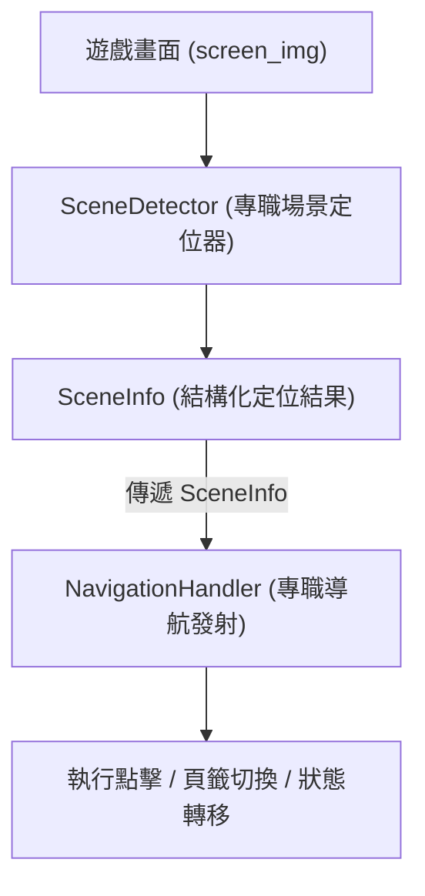

# 重構場景定位 (Scene Recognition) 與導航 (Navigation) 解耦實作計畫

本計畫旨在解耦原本過於龐大且職責混雜的 [navigation.py](file:///e:/Side_Project/BlackfireCrusade_tool/states/handlers/navigation.py)，抽離出專屬的 **場景定位辨識器 (`SceneDetector`)**，實現「**定位歸定位、導航歸導航**」的單一職責架構。

---

## User Review Required

> [!IMPORTANT]
> 1. **架構分工調整**：抽離 `SceneDetector` 後，`NavigationHandler` 將不再自己執行散亂的圖像比對邏輯，而是向 `SceneDetector` 詢問當前畫面情境 (`SceneInfo`)，大幅提升可讀性與後續擴充性。
> 2. **零破壞性與 100% 相容**：現有的導航路徑與狀態機行為保持完全一致，僅對底層判斷邏輯進行模組化重構。

---

## Open Questions

> [!NOTE]
> 目前設計規劃已相當明確，無阻礙執行的開放性疑問。如有特定新增場景辨識需求，可在評估後隨時擴充 Enum。

---

## Proposed Changes

### 1. 場景定位與辨識模組 (`utils/scene_detector.py`)

#### [NEW] [scene_detector.py](file:///e:/Side_Project/BlackfireCrusade_tool/utils/scene_detector.py)
- 定義場景類型列舉 `SceneType`：
  - `TOWN`: 城鎮畫面 (匹配 `common/door.png` 或 `diamond.png`)
  - `LOBBY_STAGE`: 活動大廳 - 普通關卡頁籤
  - `LOBBY_DUNGEON`: 活動大廳 - 地下城頁籤
  - `LOBBY_OTHER`: 活動大廳 - 中立/其他頁籤
  - `IN_DUNGEON`: 地下城內部戰鬥/探索中 (`dungeons/leave.png`, `dungeons/dungeon_bless.png` 等)
  - `DUNGEON_PREPARE`: 地下城備戰畫面 (`dungeons/dungeon_fight.png`)
  - `POPUP_TASK_COMPLETE`: 任務完成彈窗 (`task_complete.png`)
  - `WINDOW_DIAMOND` / `WINDOW_BREAD`: 鑽石 / 體力對話框開啟
  - `UNKNOWN`: 未知或切換中
- 封裝 `SceneInfo` 資料結構與 `SceneDetector` 類別：
  - 提供 `detect(screen_img, machine_state=None)` 方法，集中管理畫面範本比對與狀態解析。
  - 回傳包含場景類型、已開啟頁籤 (`active_tabs`) 與匹配信心度的 `SceneInfo` 物件。

---

### 2. 尋路與導航分發器 (`states/handlers/navigation.py`)

#### [MODIFY] [navigation.py](file:///e:/Side_Project/BlackfireCrusade_tool/states/handlers/navigation.py)
- 導入並實例化 `SceneDetector`。
- 在 `handle(screen_img, rect)` 方法開頭呼叫 `scene = self.scene_detector.detect(screen_img)` 取得場景資訊。
- 將原先散落於 `handle()` 內部的繁雜比對（如 `pos_door`, `pos_goback`, `res_tabs` 等）替換為清晰的 `scene.scene_type` / `scene.is_town` / `scene.is_lobby` 條件分支。
- 精簡與清理重複或冗餘的判定程式碼，保留純粹的導航動作發射與狀態轉移。

---

### 3. 單元測試單元 (`tests/test_scene_detector.py`)

#### [NEW] [test_scene_detector.py](file:///e:/Side_Project/BlackfireCrusade_tool/tests/test_scene_detector.py)
- 建立 `SceneDetector` 的專屬單元測試集。
- 測試各場景情境（城鎮、關卡大廳、地下城大廳、地下城內部、彈窗等）之辨識正確性。
- 驗證頁籤互斥判定 (`match_mutually_exclusive_tabs`) 與防呆回傳邏輯。

---

## Verification Plan

### Automated Tests
1. **執行全新場景定位測試**：
   ```bash
   .venv\Scripts\python -m unittest tests.test_scene_detector
   ```
2. **執行導航與狀態機相關測試**：
   ```bash
   .venv\Scripts\python -m unittest tests.test_state_machine_logic
   ```
3. **執行全域單元測試（確保全綠，無 Regression）**：
   ```bash
   .venv\Scripts\python -m unittest discover tests
   ```

### Manual Verification
- 檢視 `navigation.py` 行數與結構，確認職責清分明確且可讀性提升。
Listed directory utils
Searched for "match("
Viewed matcher.py:1-150

現有程式碼架構中的**畫面定位與場景辨識（Positioning / Scene Detection）**運作方式的完整 Survey 與架構分析報告如下：

---

# 🔍 專案現有畫面定位架構完整 Survey 報告

## 1. 核心定位引擎 (Vision Engine Layer)

目前全專案所有的畫面圖形定位與辨識，底層皆依賴 [vision/matcher.py](file:///e:/Side_Project/BlackfireCrusade_tool/vision/matcher.py) 中的 **`TemplateMatcher`** 類別。

### 核心定位技術：
1. **標準化相關係數配對 (OpenCV `matchTemplate` with `TM_CCOEFF_NORMED`)**：
   - 將畫面 `screen_img` 與 `templates/` 下的 PNG 圖檔比對，計算 0.0 ~ 1.0 的信心度 score。
2. **圖像金字塔加速 (Image Pyramids Acceleration)**：
   - 畫面大於 720p 且模板 $\ge 50 \times 50$ 時，先進行 1/2 採樣預檢，快速過濾不匹配區域。
3. **非極大值抑制與亮度比例過濾 (NMS & Brightness Filter)**：
   - 支援 `brightness_threshold`，過濾背景殘影或暗色特效，防止誤觸。
4. **互斥頁籤比對 (`match_mutually_exclusive_tabs`)**：
   - 用於對比普通關卡頁籤 `select_stage_after.png` 與地下城頁籤 `dungeon_after.png` 的相對匹配度差距 (`margin=0.02`)。

---

## 2. 目前「場景定位」在各層級的分佈現狀

現有的場景定位**並沒有統一的 Scene Detector 模組**，而是將定位邏輯**散落**在各個 Handler 中。主要分為以下三大層級：

### 階層 A：全域與狀態機層級 ([states/state_machine.py](file:///e:/Side_Project/BlackfireCrusade_tool/states/state_machine.py))
- **任務完成彈窗全域攔截**：在 `_run_task_complete_subflow()` 中，透過比對 `task_complete.png` 定位是否有獎勵彈窗阻擋。
- **狀態標記位控管**：維護 `need_bag_cleaning`, `diamond_window_opened`, `bread_window_opened` 等記憶體狀態旗標。

### 階層 B：尋路導航層級 ([states/handlers/navigation.py](file:///e:/Side_Project/BlackfireCrusade_tool/states/handlers/navigation.py))
這是目前最為冗長且定位邏輯最集中（但也最混雜）的地方：
1. **城鎮定位 (Town Detection)**：
   - 檢查是否存在 `common/door.png`（大廳大門）或 `diamond.png`（領鑽石圖標）。
2. **大廳定位 (Lobby Detection)**：
   - 檢查是否存在 `goback_town.png`（返回城鎮按鈕）或 `common/bread.png`（體力圖標）。
3. **大廳頁籤定位 (Lobby Tab Detection)**：
   - 呼叫 `match_mutually_exclusive_tabs` 比對 `select_stage_after.png` vs `dungeon_after.png`。
   - 若無法決定，逐一掃描關卡模板 (`stage_templates`) 或地下城入口模板 (`dungeon_entries`)。
4. **地下城內部定位 (In-Dungeon Detection)**：
   - 掃描 `dungeons/leave.png` (離開按鈕)、`dungeon_bless.png` (女神祝福)、`Treasure.png` (寶箱) 或 `gungeon_godown.png` (下樓梯)。
   - 一旦比對成功，定位為已在地下城內部，狀態切換至 `DUNGEON_EXPLORING`。
5. **地下城備戰定位 (Dungeon Prepare Detection)**：
   - 掃描 `dungeons/dungeon_fight.png`（出擊按鈕）。
6. **地下城卡片與冷卻定位 (Dungeon Cards & Cooldown)**：
   - 使用 OpenCV 多尺度 Template Match 定位卡片位置。
   - 在卡片局部區域 `crop` 呼叫 OCR (`detect_cooldown_sign_and_time`) 與亮骨頭模板 (`light_skull.png`) 進行二階段定位。

### 階層 C：獨立子流程與業務 Handler 層級
- [explore.py](file:///e:/Side_Project/BlackfireCrusade_tool/states/handlers/explore.py)：在 `DUNGEON_EXPLORING` 狀態下，定位下樓梯、陷阱、怪物與寶箱按鈕。
- [battle.py](file:///e:/Side_Project/BlackfireCrusade_tool/states/handlers/battle.py) / [result.py](file:///e:/Side_Project/BlackfireCrusade_tool/states/handlers/result.py)：定位戰鬥介面、勝利標誌 (`win.png`) 與結算退出按鈕。
- [bulletin_board.py](file:///e:/Side_Project/BlackfireCrusade_tool/states/handlers/bulletin_board.py)：定位懸賞告示牌、任務卡片與領取彈窗。
- [blood_altar.py](file:///e:/Side_Project/BlackfireCrusade_tool/states/handlers/blood_altar.py)：定位血之祭壇頁籤 (`Daily_Blood`, `Sacrifice`) 與離開按鈕 `exitfromhouse_and_to_town.png`。
- [hero_draw.py](file:///e:/Side_Project/BlackfireCrusade_tool/states/handlers/hero_draw.py)：定位酒館抽取按鈕與「分解英雄」(`deassemble_hero.png`) 按鈕。

---

## 3. 目前定位架構的主要痛點

| 痛點項目 | 具體表現 | 影響 |
| :--- | :--- | :--- |
| **1. 職責過度耦合** | `NavigationHandler.handle()` 一個函數高達 800+ 行，同時包含了「畫面是哪裡」、「要點哪個按鈕」、「地下城要不要滑動」、「冷卻時間 OCR 辨識」與「狀態切換」。 | 代碼難以閱讀，修改導航邏輯容易誤傷畫面定位判定。 |
| **2. 定位指標散落** | 城鎮/大廳/地下城內部的辨識圖檔硬編碼在 `navigation.py` 的不同分支裡（例如 line 180, line 204, line 244, line 250）。 | 當新增遊戲介面時，無法在一處集中維護。 |
| **3. 缺乏單一事實來源 (Single Source of Truth)** | 每次循環都由 `handle()` 臨時做一連串 `if pos_door: ... elif pos_goback: ...` 判斷，沒有統一的「場景狀態物件 (`SceneInfo`)」。 | 無法方便地在 Log 中印出「當前辨識到的完整場景情境」。 |

---

## 4. 解耦與重構方案設計

為了解決上述痛點，我們預計導入的 **解耦架構** 如下：



### 具體分工職責：
1. **`SceneDetector` (場景定位器)**：
   - 負責**「看」**。
   - 輸入 `screen_img`，集中執行範本比對與頁籤檢測。
   - 產出 `SceneInfo`，明確告知：
     - 當前場景類型：`TOWN`, `LOBBY_STAGE`, `LOBBY_DUNGEON`, `IN_DUNGEON`, `DUNGEON_PREPARE`, `POPUP_TASK_COMPLETE`...
     - 已開啟的 UI 頁籤：`["stage"]`, `["dungeon"]`
     - 包含的特徵信心度與座標。
2. **`NavigationHandler` (導航分發器)**：
   - 負責**「走」**。
   - 直接讀取 `SceneInfo` 的診斷結果，根據目前的 `config` 決定要點擊哪個按鈕、滑動卡片或切換至哪個狀態。
   - 不再親自執行細節圖像比對。

---

以上為現有程式碼定位架構的完整報告。如有任何細節想要進一步了解或討論，請隨時告知！

這份 Survey 報告整理了目前專案中所有畫面定位的邏輯分佈、依賴之底層 OpenCV 比對機制，以及現有架構遭遇的 3 大痛點與解耦建議。

若您已審閱完成且對重構方向沒有其他想法，請告知我或點擊 `implementation_plan.md` 的「Proceed」，我將立即為您建立 `utils/scene_detector.py` 模組並開始進行解耦與測試！