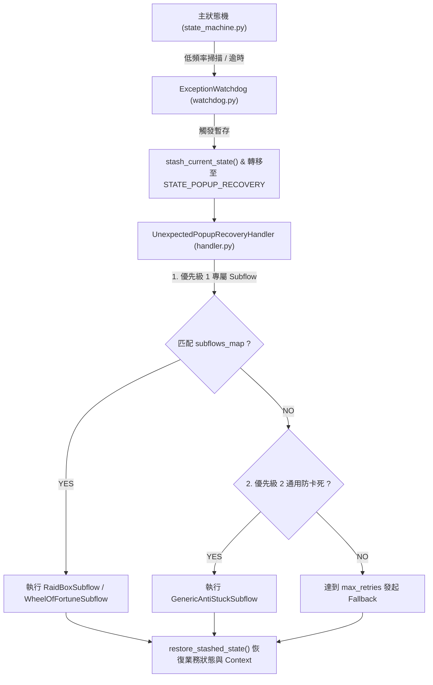

# 例外處理與卡死復原子系統架構文檔 (Exception Subsystem Architecture)

本文件詳細說明專案中 **意外彈窗、未預期 UI 阻礙與防卡死處置** 的集中化架構設計 (`states/exceptions/`)。

---

## 🎯 設計理念與原則

1. **集中化處置 (Single Source of Truth)**：
   所有意外彈窗 (如 `Raid_Box.png` 掃蕩、`Wheel_of_Fortune.png` 幸運輪盤) 與逾時卡死點擊，**嚴禁在 `state_machine.py` 或業務狀態中寫 ad-hoc `if` 判斷**，統一由 `states/exceptions/` 子系統處置。
2. **純粹執行介面 (Pure Execution Subflows)**：
   Subflow 僅負責單純的圖像識別與點擊。狀態的暫存 (`stash_current_state`) 與復原 (`restore_stashed_state`) 由 [UnexpectedPopupRecoveryHandler](../../states/exceptions/handler.py) 統一發起與維護。
3. **雙層優先級調度 (2-Priority Dispatching)**：
   * **優先級 1 (專屬 Subflows)**：根據 `config/exception_features.json` 特徵點對點精確處置。
   * **優先級 2 (通用防卡死兜底 Subflow)**：**僅當完全沒有任何專屬 Subflow 圖片被匹配到時**，執行全域按鈕掃描與點擊。

---

## 🏗️ 系統運轉流程 (Architecture Workflow)



---

## 📁 目錄結構與關鍵組件

```text
states/exceptions/
├── __init__.py                 # 匯出對外 Facade 介面
├── watchdog.py                 # ExceptionWatchdog (逾時與 Mismatch 監控)
├── handler.py                  # UnexpectedPopupRecoveryHandler (生命週期、雙層調度、Stash Lock)
└── subflows/                   # 純粹執行子流程目錄
    ├── __init__.py
    ├── base.py                 # BaseExceptionSubflow 基礎抽象類別與 safe_match
    ├── raid_box.py             # RaidBoxSubflow (懸賞/掃蕩對話框)
    ├── wheel_of_fortune.py     # WheelOfFortuneSubflow (幸運輪盤與城鎮門口檢測)
    └── generic_anti_stuck.py   # GenericAntiStuckSubflow (全域防卡死兜底)
```

---

## 🛠️ 開發者指引：如何新增一個 Exception Subflow

當遊戲新增一種意外彈窗或 UI 阻礙時，請依據以下 4 個步驟進行擴充：

### 1. 建立 Subflow 檔案
在 `states/exceptions/subflows/` 下新增 `my_popup.py`：
```python
from states.exceptions.subflows.base import BaseExceptionSubflow, safe_match

class MyPopupSubflow(BaseExceptionSubflow):
    name = "my_popup_subflow"

    def can_handle(self, screen_img, matcher, detector=None) -> bool:
        pos, conf = safe_match(matcher, screen_img, "exceptions/My_Popup.png", threshold=0.75)
        return pos is not None

    def execute(self, screen_img, mouse, rect, matcher=None) -> bool:
        # 進行精確點擊處置...
        return True
```

### 2. 登錄設定檔 ([config/exception_features.json](../../config/exception_features.json))
在 `subflow_feature_mapping` 新增對應關係：
```json
"my_popup_subflow": {
  "trigger_template": "exceptions/My_Popup.png",
  "description": "我的自訂意外彈窗"
}
```

### 3. 註冊 Subflow 模組 ([handler.py](../../states/exceptions/handler.py))
在 `UnexpectedPopupRecoveryHandler.__init__` 註冊：
```python
self.register_subflow(MyPopupSubflow())
```

### 4. 新增行為單元測試 ([test_behavior_popup_recovery.py](../../tests/test_behavior_popup_recovery.py))
撰寫獨立單元測試驗證 `can_handle` 與 `execute` 點擊動作。
