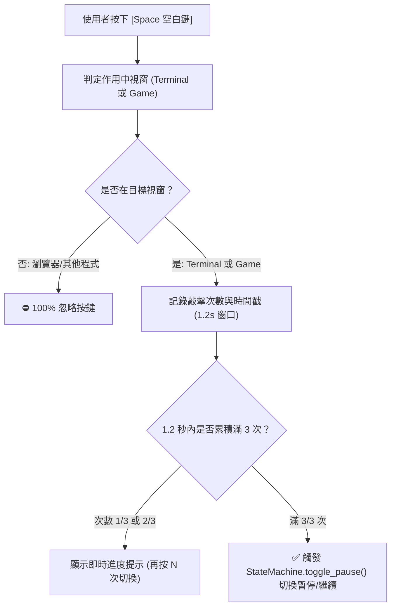
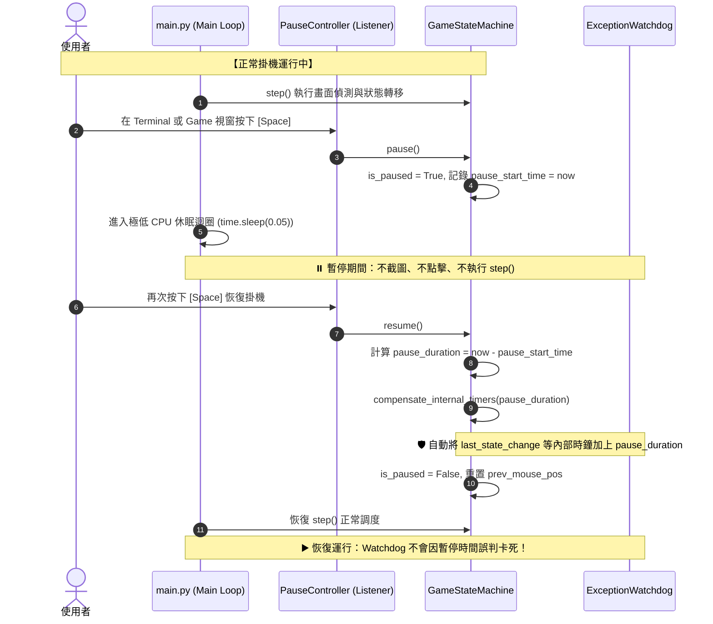

# ⏸️ 終端機與遊戲視窗空白鍵暫停/繼續技術規格與架構手冊 (Pause/Resume Control Spec)

> 本文檔詳細規範「終端機 (Terminal) 與 遊戲視窗 (Game) 雙焦點 [Space 空白鍵] 隨時暫停與繼續」之底層架構、Clean Code 邏輯時鐘與內部防卡死計時器補償機制。

---

## 🏛️ 一、架構背景與核心設計哲學

### 1. 痛點分析
在自動掛機運行期間，若使用者欲臨時手動操作遊戲（如手動調整裝備、臨時領取獎勵或查看狀態），過去僅能依賴 `Ctrl + C` 強制終止 Python 行程並透過 `run.bat` 重啟。這會導致：
* 當前巡邏/尋路進度中斷，必須重新執行完整的登入與尋路判定。
* 長任務（如地下城多層探索、每日任務流水線）狀態遺失。

### 2. Clean Code 核心哲學：時鐘職責分離 (Clock Separation)
為避免計時器散落於各 Handler 導致未來維護時「漏補償某個時間變數而引發逾時誤判」，系統明確劃分兩大時鐘體系：

```mermaid
graph TD
    subgraph 🌐 1. 客觀真實時鐘 (Wall Clock / Real Time)
        RC["真實世界時間 (time.time())<br>【暫停期間不凍結，正常流逝】"]
        RC --> R1["地下城 30 分鐘 CD (dungeon_cooldowns)"]
        RC --> R2["首領討伐 120 分鐘 CD (lord_boss_cooldowns)"]
        RC --> R3["定時領麵包/鑽石冷卻 (last_bread_collection_time)"]
        RC --> R4["每日懸賞重置時間 (daily_manager)"]
    end

    subgraph 🛡️ 2. 腳本內部安全時鐘 (Internal Logic Clock / Watchdog)
        IC["內部安全與防卡死計時器<br>【暫停期間完全凍結，恢復時完整補償】"]
        IC --> I1["狀態變更 Watchdog 90s/30s 門檻 (last_state_change)"]
        IC --> I2["單場戰鬥逾時與統計計時 (battle_start_time)"]
        IC --> I3["畫面過渡 15s 逾時判定 (loading_start_time)"]
        IC --> I4["例外彈窗暫存狀態時間戳 (stashed_state_time)"]
        IC --> I5["動態模板防重複冷卻時間戳 (missing_time_*)"]
        IC --> I6["滑鼠動作與手動介入時間戳 (mouse.last_action_time)"]
    end
```

---

## 🎯 二、連按 3 次空白鍵 (Triple-Space) 與視窗焦點過濾機制

為了徹底防止使用者在遊戲走位、跳躍或打字時因「單按一次空白鍵」造成意外暫停或無意間恢復掛機，系統採用 **「1.2 秒內連敲 3 次空白鍵 (Triple-Space)」** 搭配 Windows 前景焦點判定：



### 關鍵 API 與實作規範：
* **觸發條件**：預設推薦 `[Ctrl + Space]`；或 `1.5 秒` 內連續按下 `3 次` 空白鍵 (`triple_space`)。
* **路徑 1 (游標懸停感知 Cursor Hover - 雙開核心)**：透過 Win32 `GetCursorPos()` + `WindowFromPoint()` 與 `get_window_rect()` 座標邊界檢測。當滑鼠游標停在目標遊戲畫面上時，按 `Ctrl + Space` 直接觸發該實例暫停/繼續（**免點擊焦點切換**）。
* **路徑 2 (遊戲視窗焦點 Focus)**：透過 `GetForegroundWindow()` 比對 `capturer.get_hwnd()` 綁定之實例 HWND，僅在聚焦特定遊戲視窗時響應。
* **路徑 3 (終端機焦點 Console)**：透過 `GetConsoleWindow()` 與進程 PID 精準比對當前 Python 運行的 Console 視窗。
* **即時回饋**：終端機即時輸出 `[*] [Ctrl + Space 觸發] 正在切換暫停/繼續狀態...`。
* **雙開實例隔離保證**：本機與沙盒兩隻腳本同時運行時，按鍵只會影響游標當前懸停或聚焦的特定實例，另一實例不受干擾。

> [!IMPORTANT]
> **雙開實務操作要點**：
> 1. 欲暫停或恢復某一特定遊戲時，**請滑鼠左鍵點擊該遊戲畫面**使其獲得前台焦點，再按下 `Ctrl + Space`。
> 2. **請點擊「遊戲畫面」而非 Terminal 視窗**，以確保 Windows 前景焦點精確綁定至目標遊戲實例，避免多終端機焦點混淆。

---

## 🔄 三、暫停與恢復完整生命週期 (Lifecycle & Hooks)



---

## 🧮 四、內部計時器集中補償規格 (`compensate_internal_timers`)

當暫停期間經過 $\Delta t_{\text{pause}} = \text{now} - t_{\text{pause\_start}}$ 秒時，狀態機內部必須原子化完成以下補償：

| 補償對象 | 變數名稱 / 位置 | 補償公式 | 目的與防護效果 |
| :--- | :--- | :--- | :--- |
| **全域狀態卡死 Watchdog** | `state_machine.last_state_change` | `+= pause_duration` | 防止暫停超過 90 秒後，恢復瞬間被 Watchdog 誤判為卡死而發起遊戲重啟。 |
| **單場戰鬥逾時統計** | `state_machine.battle_start_time` | `+= pause_duration` (若非 None) | 保持戰鬥實際作戰時長統計精確，防止戰鬥逾時例外誤觸。 |
| **例外彈窗暫存狀態** | `state_machine.stashed_state_time` | `+= pause_duration` (若非 None) | 保持 POPUP_RECOVERY 例外處理生命週期精確。 |
| **畫面載入過渡逾時** | `LoadingHandler.loading_start_time`| `+= pause_duration` (若非 None) | 防止載入畫面暫停後被誤判為載入超時 (15s)。 |
| **結算畫面偵測逾時** | `BattleHandler.non_battle_feature_start_time` | `+= pause_duration` (若非 None) | 防止戰鬥結算特徵等待被誤判為結算丟失。 |
| **動態模板冷卻記憶** | `state_machine.missing_time_*` | `+= pause_duration` (自動反射) | 遍歷所有以 `missing_time_` 開頭之屬性，全自動補償。 |
| **滑鼠手動操作防呆重置** | `mouse.last_action_time`<br>`prev_mouse_pos` | 重置為當前時間與當前座標 | 防止恢復瞬間因滑鼠位置差觸發「使用者手動操作」暫停。 |

---

## 🧪 五、驗證標準與測試規格

1. **單元測試 (`tests/test_behavior_pause_resume.py`)**：
   * **Test 1**: 驗證暫停 100 秒後呼叫 `compensate_internal_timers(100.0)`，`ExceptionWatchdog.check()` **絕對不觸發逾時**。
   * **Test 2**: 驗證 `dungeon_cooldowns` 與定時領取冷卻在補償後**數值維持不變**（真實時間正常流逝）。
   * **Test 3**: 驗證 `PauseController` 焦點過濾：當前景 HWND 為非目標視窗時，空白鍵被 100% 忽略。
2. **實機端到端驗證**：
   * 啟動 `run.bat`，在導航中按下 [Space] 暫停，等待 2 分鐘，再按 [Space] 恢復，確認腳本無縫繼續尋路且不觸發任何重啟或報錯。
