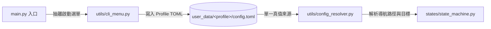

# 執行期設定熱重載架構與分界規範 (Runtime Config Hot Reload Architecture) 🔄

本文件記錄《黑火遠征》專案在多實例長掛機情境下，**執行期設定動態熱重載（Hot Reload）** 的架構設計、核心邊界劃分與重構規劃。

---

## 🎯 一、 核心設計原則：分層分界 (Separation of Concerns)

在執行期自動化掛機中，設定依其**生命週期**與**影響層級**嚴格劃分為兩大類：

```mermaid
flowchart TD
    subgraph SystemLayer [1. 系統與進程層級 (不可熱重載 - 啟動時綁定)]
        CLI[CLI 參數 / 硬體環境]
        CLI --> P1["--target / --title (HWND 視窗綁定)"]
        CLI --> P2["--backend (後台 SendMessage 通訊)"]
        CLI --> P3["--profile (監聽目錄 user_data/&lt;profile&gt;/)"]
        CLI --> P4["--monitor (DXGI / GDI 顯示器)"]
        CLI --> P5["--subflow (Dev 階段單體除錯)"]
    end

    subgraph BusinessLayer [2. 遊戲業務行為層級 (100% 動態熱重載 - SSOT)]
        TOML["user_data/&lt;profile&gt;/config.toml"]
        TOML --> B1["關卡與小關 (tier4_stage_level, tier4_sub_stage)"]
        TOML --> B2["地下城選擇與貪婪 (tier4_dungeon_index, greedy_dungeon)"]
        TOML --> B3["祝福模式 (bless_mode)"]
        TOML --> B4["活動與領取開關 (auto_bread, auto_diamond, enable_lord_boss)"]
        TOML --> B5["裝備與城鎮過濾 (disassemble_colors, keep_colors, goods_settings)"]
    end

    SystemLayer -.->|固定硬體與實例管道| SM[GameStateMachine]
    BusinessLayer ==>|主迴圈安全點即時套用| SM
```

---

## 🏗️ 二、 兩大層級詳細定義與分界

### 1. 進程與系統環境綁定（不可熱重載）
此類參數在腳本啟動時用於初始化 Win32 控制代碼、通訊管道與顯示裝置，一旦執行即在記憶體定型：

| 參數 | 職責 | 不可熱重載原因 |
| :--- | :--- | :--- |
| `--target` / `--title` | 鎖定目標遊戲視窗與 Win32 HWND | 腳本已對準特定沙盒/本機視窗進行截圖與發送點擊，無法動態跳轉目標視窗。 |
| `--backend` | 前台 (`pyautogui`) 或後台 (`SendMessage`) | 底層滑鼠控制器的通訊協定在初始化時已決定。 |
| `--profile` | 指定使用者資料目錄 (如 `sandbox`, `native`) | 決定當前進程監聽哪一個 `user_data/<profile>/` 目錄。 |
| `--monitor` | 綁定全螢幕/截圖之顯示器編號 (1 或 2) | DXGI / GDI 截圖裝置在啟動時完成配置。 |
| `--subflow` | 開發者一次性子流程除錯 (如 `--subflow blood_altar`) | 屬於 Dev 模式除錯佇列，完成即退出。 |

### 2. 遊戲業務行為設定（100% 動態熱重載）
所有記錄於 `user_data/<profile>/config.toml` 的業務行為設定，狀態機在每個主迴圈安全點（`refresh_config_at_safe_point`）必須**無條件直接吃進最新值**：

* **關卡與小關**：`tier4_stage_level`、`tier4_sub_stage`、`enable_stage_farming`
* **地下城設定**：`tier4_dungeon_index`、`greedy_dungeon`、`greedy_allowed_indices`、`auto_resume_dungeon_on_cd`
* **戰鬥與祝福**：`bless_mode`（`combat` / `life` / `exp`）
* **領取與活動開關**：`auto_bread`、`auto_diamond`、`enable_lord_boss`、`enable_dungeon`、`enable_town_daily`
* **城鎮與過濾**：`disassemble_colors`、`keep_colors`、`sacrifice_settings`、`goods_settings`
* **領地探索**：`bread_cost`、`nemesis_action`

---

## 🏛️ 三、 模組職責劃分與重構對照

為消除既有代碼中的「啟動快取鎖死 (overrides cache)」與「重複解析邏輯 (DRY 違規)」，架構演進方向如下：



1. **`utils/cli_menu.py`（自 `main.py` 抽離）**：
   - 專職處理命令列參數解析、視窗列舉與終端機互動選單。
   - 使用者在選單中所做的設定變更，直接寫入 `user_data/<profile>/config.toml`。
2. **`utils/config_resolver.py`（自 `state_machine.py` 抽離）**：
   - 統一宣告式設定（TOML 欄位）與衍生路徑（`stage_target`, `stage_navigation_path`, `navigation_path`）之換算邏輯。
   - 消除跨模組重複的關卡與地下城路徑組裝程式碼。
3. **`states/state_machine.py`**：
   - 廢除 `runtime_config_overrides` 差異快取。
   - 在主迴圈安全點呼叫 `ConfigResolver` 同步套用最新 Profile 設定，並透過 `_sync_runtime_collection_policies` 維護常駐旗標。

---

## 🔗 四、 關聯文檔與規範索引

* **待辦事項與重構排程**：[docs/todos/future_work.md](../todos/future_work.md)（第 4 項：全域架構審查與 AGENTS.md 規範對齊）
* **全域開發規範**：[.agents/AGENTS.md](../../.agents/AGENTS.md)
* **多實例掛機指南**：[docs/guides/sandboxie_dual_instance_guide.md](../guides/sandboxie_dual_instance_guide.md)
