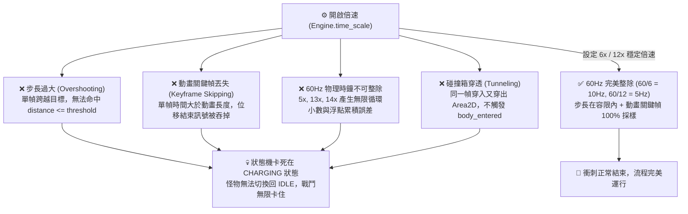

# 遊戲戰鬥倍速破解與切換指南 (Battle Speed Guide) ⚡

本文件詳細記錄如何透過修改本地 Godot 存檔 `battle_settings.save` 達成 10x ~ 50x 原生超光速戰鬥，以及如何一鍵恢復為原廠預設倍速（2.0x / 1.45）。

---

## 🚀 一、極速戰鬥原理解析

在遊戲本體架構中，戰鬥動畫與結算時鐘由 `time_scale` 變數控制：
- **原廠預設最大值**：UI 介面上的 2.0x 倍速對應儲存數值為 **`1.45`**。
- **破解機制**：
  - 存檔路徑：`%APPDATA%\Godot\app_userdata\Blackfire Crusade\battle_settings.save`
  - 格式為純文字 JSON：`{"time_scale": 50.0}`
  - 為防止遊戲在啟動或退出時將數值覆蓋回原廠設定，修改後必須為該檔案加上 Windows 系統級 **唯讀屬性鎖 (`attrib +r`)**。

---

## 🛠️ 二、一鍵切換與恢復工具 ([set_battle_speed.py](../tools/set_battle_speed.py))

專案已內建全自動設定腳本，自動處理解除唯讀 ➔ 寫入數值 ➔ 加上唯讀鎖：

### 1. 切換為 50 倍速 (極速刷圖模式，戰鬥 1~2 秒結束)
```powershell
.\.venv\Scripts\python tools/set_battle_speed.py --speed 50.0
```

### 2. 切換為 10 倍速 (平穩高速模式)
```powershell
.\.venv\Scripts\python tools/set_battle_speed.py --speed 10.0
```

### 3. 恢復為原廠預設倍速 (2.0x 倍速 / 1.45) 🔄
```powershell
.\.venv\Scripts\python tools/set_battle_speed.py --reset
```

---

## ✋ 三、手動修改教學 (Manual Adjustment)

如果您希望手動修改或確認檔案：

1. **解除唯讀保護**：
   ```powershell
   attrib -r "$env:APPDATA\Godot\app_userdata\Blackfire Crusade\battle_settings.save"
   ```
2. **開啟並編輯檔案**：
   使用記事本開啟 `battle_settings.save`，修改為您要的倍數：
   - 恢復原廠 2.0x：`{ "time_scale": 1.45 }`
   - 50 倍速：`{ "time_scale": 50.0 }`
3. **重新鎖定唯讀**：
   ```powershell
   attrib +r "$env:APPDATA\Godot\app_userdata\Blackfire Crusade\battle_settings.save"
   ```

---

## 🔬 四、特定倍率衝刺技能卡死問題剖析 (為何 5x/13x/14x/15x 會卡死，而 6x 不會？)

在實戰測試中，當設定特定倍速（如 **5.0x、13.0x、14.0x、15.0x**）時，某些帶有衝刺/位移技能的怪物（如野豬/狼/半人馬的 `savage_charge`、`avalanche_charge`、`valiant_charge` 等）會陷入無限位移或滯留在衝刺狀態機無法進入下一階段，但在 **6.0x 倍速** 卻能完美運行。



### 1. 跨幀穿透與距離判定失效 (Overshooting / Distance Threshold Failure)
* **衝刺狀態機機制**：怪物衝刺時每幀計算位移量 $\Delta s = \text{speed} \times \text{time\_scale} \times \Delta t$，並以 `if position.distance_to(target) <= threshold (如 10px)` 判定是否到達並切換為攻擊/收招狀態。
* **高倍速穿透**：
  * 在 **13x~15x** 高倍速下，單幀位移跨度可能高達 `40~60px`。
  * 上一幀怪物在目標前方 `25px` ($> 10\text{px}$，判定未到達繼續衝刺)；
  * 下一幀怪物直接越過目標出現在身後 `30px` ($> 10\text{px}$，依然未命中距離門檻)；
  * 導致狀態機永遠無法滿足轉移條件，怪物卡死在衝刺狀態。

### 2. 動畫關鍵幀與回調訊號被跳過 (Animation Keyframe Skipping)
* **事件觸發點**：衝刺位移動畫（例如時長 `0.2 秒`）通常在時間軸末端綁定 Method Call Track 發射 `_on_charge_complete()`。
* **吞幀現象**：在 **14x~15x 倍速** 下，單幀經過的遊戲邏輯時間達到 `0.23 ~ 0.25 秒`，**單單 1 幀就直接跳過了整段動畫時間**，Godot 引擎在離散採樣時跳過關鍵幀事件，未發射結束回調，AI 決策永久滯留。

### 3. 60Hz 物理時鐘整除性與浮點數對齊 (Delta Time Alignment)
Godot 引擎預設物理步進頻率為 **60 FPS (`physics_ticks_per_second = 60`)**，每物理幀基礎時間 $\Delta t = \frac{1}{60} \approx 0.016667\text{s}$：

| 倍速設定 (`time_scale`) | 單幀等效邏輯時間 ($\Delta t \times \text{time\_scale}$) | 數值數學特徵 | 穩定性與測試結果 |
| :---: | :---: | :---: | :--- |
| **`6.0x`** | **`0.100000 秒`** | **完美有限小數 (剛好 10Hz)** | 🟢 **極度穩定**。與所有以 0.1s/0.2s/0.5s 為基準的 Timer/Tween 完美對齊。 |
| **`12.0x`** | **`0.200000 秒`** | **完美有限小數 (剛好 5Hz)** | 🟢 **穩定高速**。60Hz 完美整除因數。 |
| **`5.0x`** | `0.083333... 秒` | 無限循環小數 | 🔴 浮點累積誤差造成位移計時器精確度偏移。 |
| **`13.0x`** | `0.216666... 秒` | 無限循環小數 | 🔴 步長過大 + 浮點偏差，極易吞掉短時動畫關鍵幀。 |
| **`14.0x`** | `0.233333... 秒` | 無限循環小數 | 🔴 步長過大，高頻穿透碰撞箱。 |
| **`15.0x`** | `0.250000 秒` | 有限小數 (1/4秒) | 🔴 單幀跨度達 1/4 秒，位移步長已超過碰撞箱安全容限。 |

### 4. 碰撞箱穿透 (Collision / Area2D Tunneling)
* 若衝刺停止條件為 `Area2D.body_entered`（碰撞目標即停下），當怪物在單幀內從碰撞體前方瞬間跨越至碰撞體後方時，物理引擎判定未產生重疊，不觸發碰撞訊號，導致衝刺無法終止。

---

### 💡 五、倍速設定推薦與避坑總結

1. **推薦倍速梯隊**：
   * **平穩通用模式**：**`6.0x`**（零穿透、零卡頓、最安全）。
   * **高速刷圖模式**：**`12.0x`**（60Hz 完美因數整除）。
   * **極速秒殺模式**：**`50.0x`**（純數值秒殺碾壓關卡適用）。
2. **避開倍速名單**：
   * 避開 **`5.0x`、`13.0x`、`14.0x`、`15.0x`** 等存在循環小數或步長失衡的倍率，防止特定位移怪物卡死戰局。
