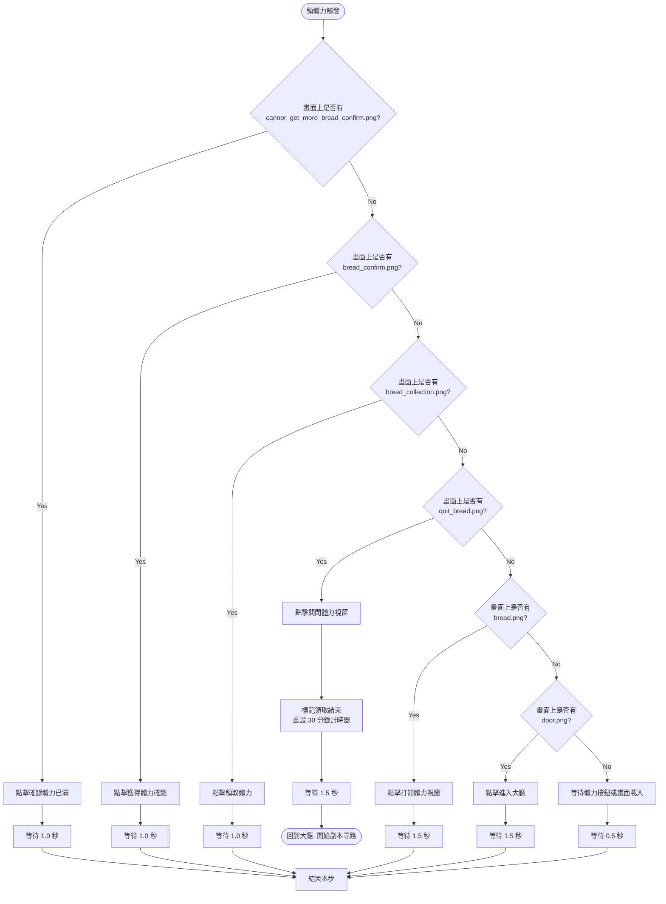
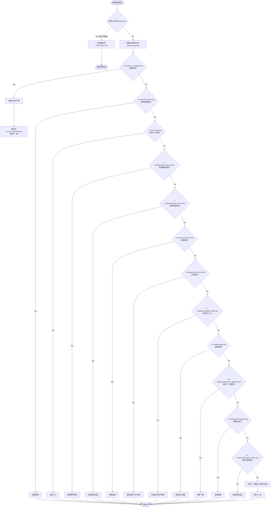
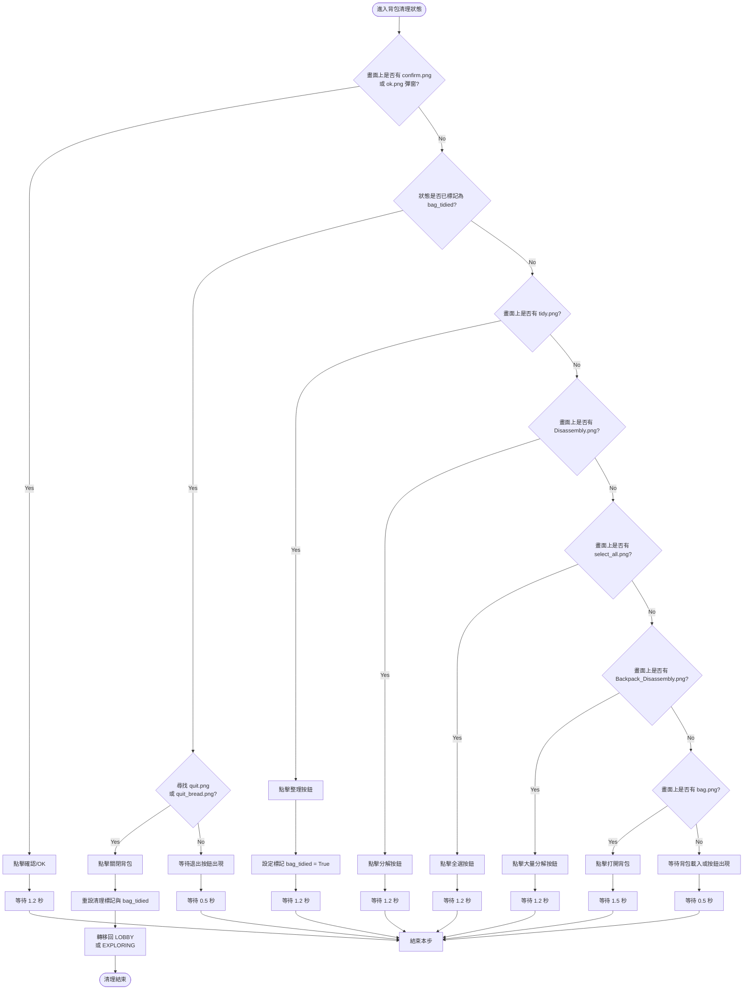

# 地下城與體力領取決策流程圖 (Decision Tree / Flowchart) 📊

本文件詳細記錄了 `dungeon_slime`（史萊姆地下城）模式下，體力自動領取與探險隨機事件的決策樹結構。這有助於理解程式運作時的優先判定邏輯。

---

## 1. 🍞 自動領體力決策樹 (Stamina Collection Flow)

自動領體力功能在啟動時或每 30 分鐘計時器觸發時執行。程式會在尋路頁面進行攔截，並依照以下決策樹進行比對與點擊：

---

## 2. 🏰 地下城探索決策樹 (Dungeon Exploring Flow)

進入地下城內部後，程式處於 `STATE_DUNGEON_EXPLORING` 狀態。每 0.5 秒截圖一次，並以下方的**優先級（由高到低）**掃描畫面。一旦匹配到對應按鈕，就執行操作並**結束本步**，以防止點擊背景物件：

---

## 3. 🎒 自動清理背包決策樹 (Backpack Cleaning Flow)

當戰鬥結算偵測到 `common/bagfull_quit.png`（背包已滿）時，程式會點選退出結算並設定清理標記。一旦程式回到準備大廳（普通關卡）或地圖探索畫面（地下城），會**優先攔截並進入 `STATE_BAG_CLEANING` 狀態**，依以下流程進行全自動大量分解與整理：

