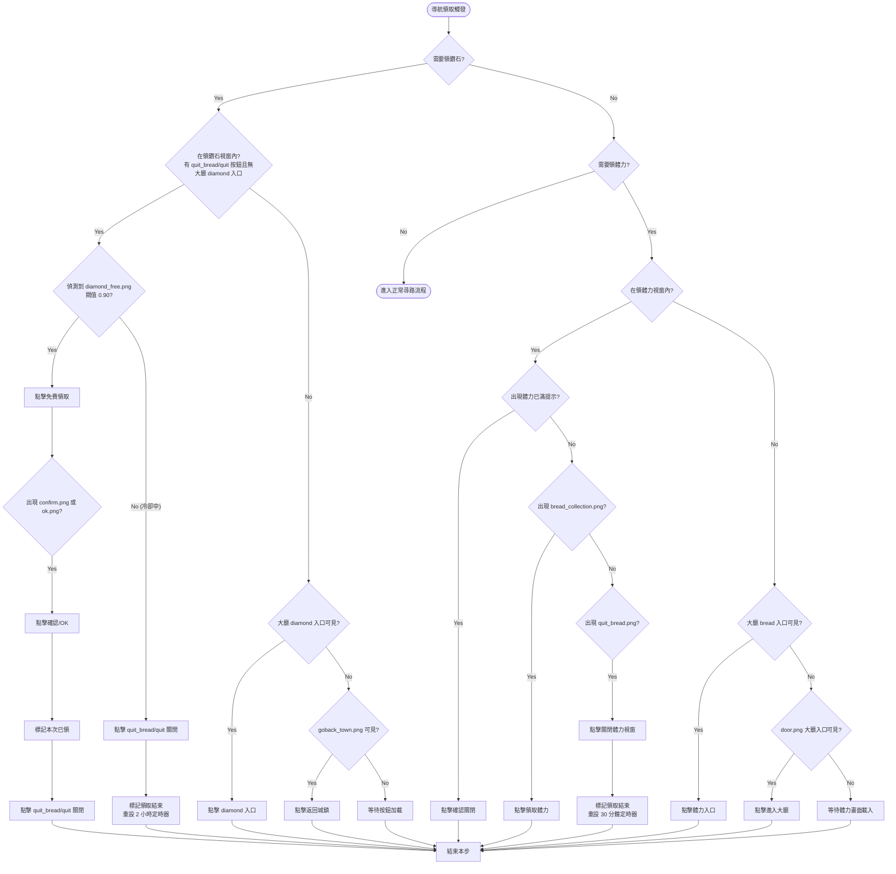
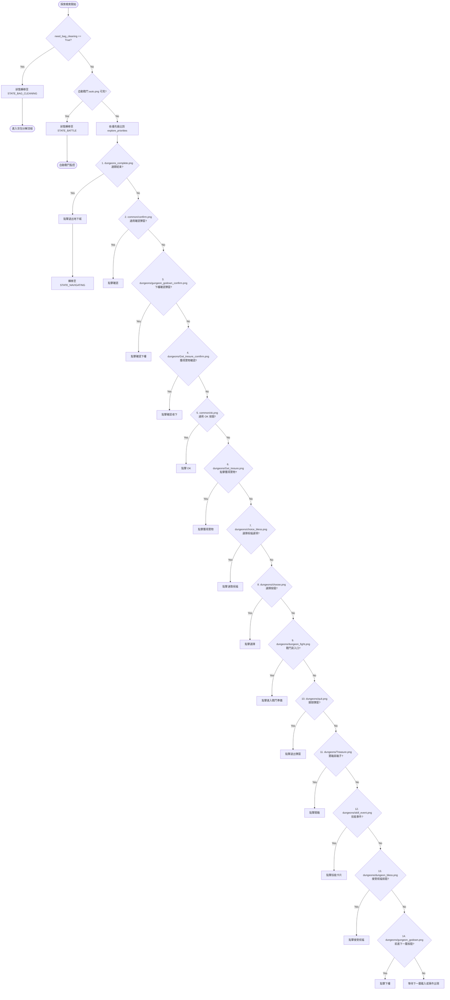
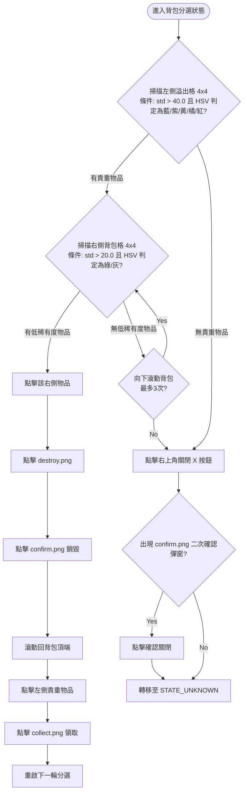
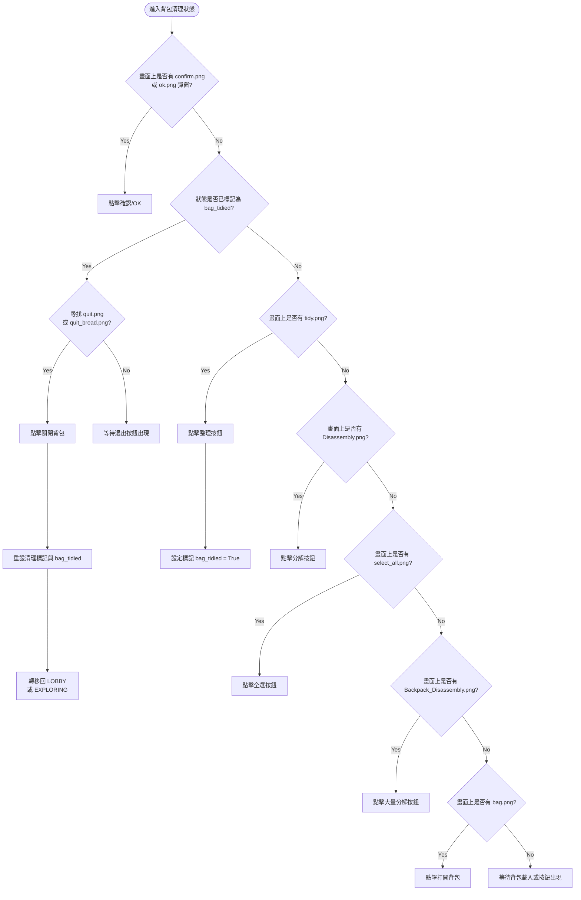
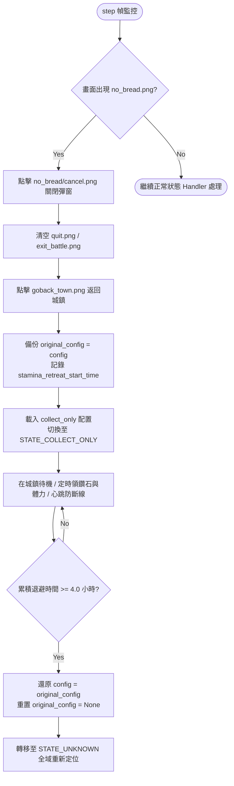

# 地下城、混合模式與體力退避決策流程圖 (Decision Tree / Flowchart) 📊

本文件記錄了地下城模式、混合模式 (`mix`)、體力/鑽石自動領取、體力退避自適應、探險隨機事件、以及背包已滿自適應分選的決策樹結構。

---

## 1. 領取體力與鑽石決策流程 (Stamina & Diamond Claim Flow)

領取鑽石（每 2 小時）與領體力（每 30 分鐘）由 `NavigationHandler` 在大廳/尋路頁面進行攔截，領取鑽石的優先級高於領體力。



---

## 2. 地下城探索決策流程 (Dungeon Exploring Flow)

進入地下城內部後，程式處於 `STATE_EXPLORING` 狀態。每 0.5 秒擷取一次畫面，並依以下優先級順序（由高至低）比對畫面：



---

## 3. 背包滿自適應分選決策流程 (Backpack Full Sorting Flow)

當畫面上彈出「無法容納的物品 (背包已滿)」彈窗 (`backpack_full.png`)，狀態機轉移至 `STATE_BACKPACK_FULL_SORTING`，並設定 `need_bag_cleaning = True`。



---

## 4. 背包分解整理決策流程 (Backpack Cleaning Flow)

當狀態機退出 `STATE_BACKPACK_FULL_SORTING` 後，或戰鬥結算後回到大廳且 `need_bag_cleaning == True` 時，狀態機會自動轉移至 `STATE_BAG_CLEANING` 並執行大量分解：



---

## 5. 混合模式 (`mix`) 雙向動態切換決策流程 (Hybrid Mix Mode Flow)

在 `mix` 模式下，導航引擎會動態評估地下城 CD 狀態並在大廳進行切換：

```mermaid
graph TD
    StartMix([NAVIGATING 導航觸發]) --> CheckAvail{has_available_dungeon()<br>有可用地下城?}
    
    CheckAvail -- Yes --> CheckDunTab{目前在地下城頁籤?<br>dungeon_select_open == True}
    CheckDunTab -- Yes --> SelectDungeon[對齊與點擊地下城入口] --> EnterDungeon([進入地下城探索])
    CheckDunTab -- No --> ClickDunTab[點擊 dungeons/dungeon.png 切換至地下城頁籤] --> SelectDungeon
    
    CheckAvail -- No (全冷卻) --> CheckStageTab{目前在普通關卡頁籤?<br>select_stage_after == True}
    CheckStageTab -- Yes --> SelectStage[地圖滑動與點擊 stage_target 小關卡/魔王關] --> EnterStage([進入普通關卡準備/戰鬥])
    CheckStageTab -- No --> ClickStageTab[點擊 common/select_stage.png 切換至普通關卡頁籤] --> SelectStage
```

---

## 6. 全域體力不足 (`no_bread`) 退避與恢復流程 (Stamina Retreat Flow)


