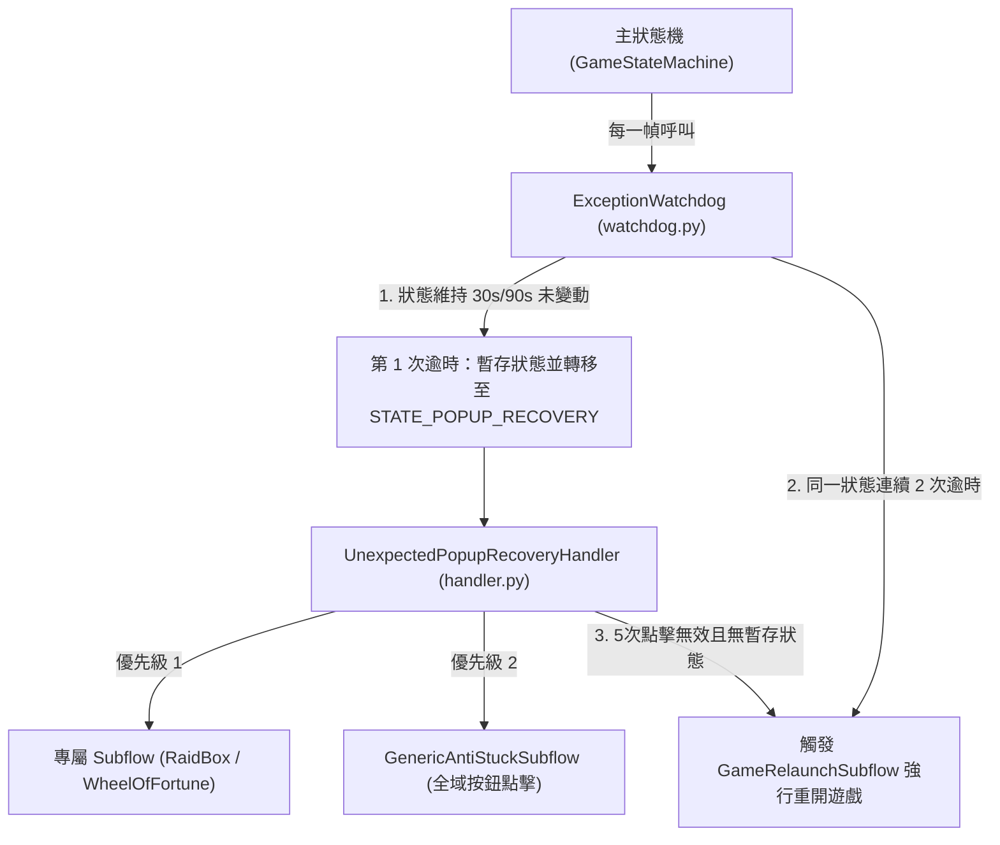

 這個文件不要commit

 Listed directory exceptions
Listed directory subflows
Viewed exception_subsystem_architecture.md:1-93
Viewed watchdog.py:1-142
Viewed handler.py:1-148
Viewed game_relaunch.py:1-93

專案中處理例外與卡死的模組位於 [states/exceptions/](file:///e:/Side_Project/BlackfireCrusade_tool/states/exceptions) 目錄，主要採用 **雙層救援機制 + 重開遊戲兜底** 的架構。

以下為該模組的架構作法，以及 **「為何有時卡死卻不會自動重開遊戲」** 的原因深度分析與解決建議。

---

### 一、 例外處理專用模組架構與作法

例外處理子系統主要由以下三個核心組件組成：

#### 1. 看門狗監控器：[ExceptionWatchdog](file:///e:/Side_Project/BlackfireCrusade_tool/states/exceptions/watchdog.py)
* **狀態時間判斷**：
  * **短任務**（如大廳、結算）：30 秒狀態未變動即算逾時。
  * **長任務**（如 `NAVIGATING` 導航、`BATTLE` 戰鬥、`DUNGEON_EXPLORING` 地下城探索、`BAG_CLEANING` 背包整理）：90 秒未變動算逾時。
* **分階段處置邏輯**：
  * **第 1 次逾時**：暫存當前業務狀態 (`stash_current_state()`)，切換至 `STATE_POPUP_RECOVERY` 進行彈窗掃描與輕量救援。
  * **第 2 次連續逾時 (`consecutive_stuck_count >= 2`)**：若輕量救援後退回原狀態，且原狀態**再次逾時 30s/90s**，認定輕量救援無效，強制呼叫 `GameRelaunchSubflow` 殺進程並重開遊戲。

#### 2. 意外彈窗恢復處理器：[UnexpectedPopupRecoveryHandler](file:///e:/Side_Project/BlackfireCrusade_tool/states/exceptions/handler.py)
* **雙層優先級點擊**：
  * **優先級 1**：匹配 `subflows_map` 專屬彈窗（如掃蕩盒 `RaidBoxSubflow`、輪盤 `WheelOfFortuneSubflow`）。
  * **優先級 2**：若無專屬圖案，觸發 `GenericAntiStuckSubflow` 掃描全域 `X` 關閉按鈕或確認按鈕進行點擊。
* 點擊處理成功或達重試上限後，呼叫 `restore_stashed_state()` 恢復原狀態。

#### 3. 遊戲重開自癒子流程：[GameRelaunchSubflow](file:///e:/Side_Project/BlackfireCrusade_tool/states/exceptions/subflows/game_relaunch.py)
* **執行步驟**：
  1. 使用 Win32 API 找到遊戲 HWND 取得 PID，發起精確 `taskkill /f /pid <pid>` 及 `taskkill /f /im BlackfireCrusade.exe`。
  2. 呼叫 `SteamGameLauncher` 重新開啟遊戲並自動鎖定 1080p 視窗位置。
  3. 重置所有連鎖卡死計數器、暫存與視窗旗標。
  4. 切換至 `STATE_NAVIGATING` 由全域登入流程接管。

---

### 二、 🔍 為何有時卡死無法觸發「重新開遊戲」？（原因分析）

雖然 `GameRelaunchSubflow` 本身功能正常，但 **Watchdog 觸發重開的條件相當嚴格**。當卡死發生時，如果滿足以下情況之一，系統就不會發起重開：

#### 1. 狀態產生了「假切換 / 頻繁刷新」（最常見原因）
* Watchdog 的逾時計算是根據 `now_t - machine.last_state_change`。
* 如果遊戲卡在某個畫面，但程式內部的 Handlers 在重複執行時，**頻繁觸發了 `transition_to()`**（例如在 `NAVIGATING` 與 `LOBBY` 之間來回切換，或切換到相同狀態），`last_state_change` 會被持續更新為「現在時間」。
* **結果**：狀態持續時間 `state_duration` 永遠無法累積到 30 秒或 90 秒，Watchdog 完全無法感知到卡死。

#### 2. 連續卡死計數器 `consecutive_stuck_count` 被重置
* Watchdog 要求「**同一狀態連續 2 次逾時**」才會觸發重開 (`last_stuck_state == current_state`)。
* 如果第 1 次逾時後，`GenericAntiStuckSubflow` 誤點到了某個按鈕，導致狀態短暫變成 `STATE_UNKNOWN` 或被恢復成不同的狀態，`last_stuck_state` 就會被改寫。
* 下一次再卡死時，Watchdog 會視為「新狀態的第 1 次逾時」，計數器重新歸零為 1，因此永遠無法達到 `>= 2` 的重開門檻。

---

### 三、 💡 建議的優化方向

若希望在嚴重卡死時更靈敏地觸發遊戲重開，可以進行以下小幅調校：

1. **降低第二階段重開的門檻**：
   在 [handler.py](file:///e:/Side_Project/BlackfireCrusade_tool/states/exceptions/handler.py) 中，當 `UnexpectedPopupRecoveryHandler` 重試 5 次點擊仍無法消除畫面阻礙（且畫面未發生任何變化）時，可直接呼叫 `GameRelaunchSubflow` 重開，而不需要退回原狀態再等第二次 90 秒。
2. **避免無效的狀態切換**：
   檢查業務 Handler 中是否有在相同狀態下的無意義 `transition_to(self.machine.current_state)`，防止更新 `last_state_change` 刷洗時間戳。