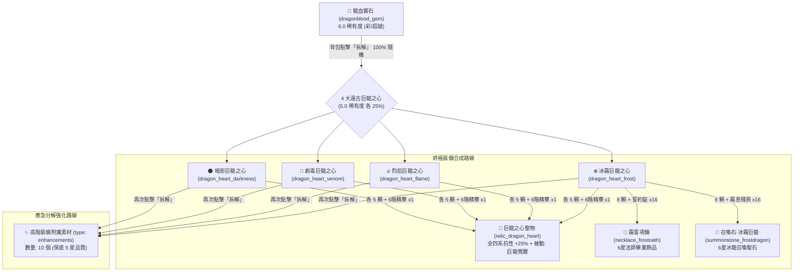

# 💎 龍血寶石與巨龍之心底層機制深度解析與進度最佳化決策

> **數據源**：本分析完全依據遊戲核心資料庫 `meta_datas.tres`、裝備附魔體系與當前玩家陣容進度 [我目前的資訊.md](file:///e:/Side_Project/BlackfireCrusade_tool/meta_data/Game_docs/My_progress/%E6%88%91%E7%9B%AE%E5%89%8D%E7%9A%84%E8%B3%87%E8%A8%8A.md) 校對編寫。

---

## 🔍 一、`meta_datas.tres` 底層結構與完整鏈路



---

## 🗺️ 二、龍血寶石與 4 大巨龍之心【全產出來源清單】（含關卡與等級）

在遊戲底層中，獲得龍心除了「**拆解龍血寶石**」外，**四大巨龍領主 BOSS 均有各自的專屬直接掉落**！

### 1. 💎 龍血寶石 (`dragonblood_gem`) 產出來源

| 來源途徑 | 具體關卡 / 系統 | 怪物 / 機制 | 等級門檻 | 獲取方式與機率說明 |
| :--- | :--- | :--- | :---: | :--- |
| **首領討伐 (Lord Boss)** | **巨龍之巢** (`dragon_lair`) | **No. 5 炎鱗幼龍克羅諾** (`dragon_krono`) | **Lv. 79** | 領主專屬掉落物資庫 (`droppable_items`)，刷新 CD 3 小時 |
| **領域秘境 (Domain 1)** | **黃金帝國** (`golden_empire`) | **古國寶藏抽獎池** (`treasures`) | **Lv. 49 ~ 69** | 探索開箱抽取（單抽 2.22%，十連抽命中率約 20.13%） |
| **遠征系統 (Expedition)** | **世界遠征排名/結算** (`world.item_chance_datas`) | 遠征高階掉落池 | **全等級** | 遠征第四檔極稀有掉落（機率 0.025，約 2.5%） |

---

### 2. 🐉 4 大遠古巨龍之心專屬產出來源（免靠寶石抽）

| 龍心名稱與 ID | 專屬產出 Boss | 出沒關卡與系統分類 | 關卡等級 (Level) | 備註與前置條件 |
| :--- | :--- | :--- | :---: | :--- |
| **❄️ 冰霜巨龍之心**<br>(`dragon_heart_frost`) | **霜龍阿祖洛斯**<br>(`dragon_azulos`) | **領域秘境 2：冷誓要塞**<br>(`coldoath_citadel`) | **Lv. 69 ~ 89** | 消耗門票【霜縛印記】進入秘境，探索遭遇 Boss 擊殺掉落 |
| **🔥 烈焰巨龍之心**<br>(`dragon_heart_flame`) | **炎龍卡爾索斯**<br>(`dragon_karsos`) | **主線地下城：巨龍之巢**<br>(`dragon_lair`) | **Lv. 74 ~ 79**<br>(地下城 5 層) | 地下城最終 Boss 候選之一，通關熾熱火山後解鎖 |
| **🧪 劇毒巨龍之心**<br>(`dragon_heart_venom`) | **毒龍瑟雷薩斯**<br>(`dragon_therezas`) | **主線地下城：遠古墓穴**<br>(`ancient_tomb`) | **Lv. 84 ~ 89**<br>(地下城 5 層) | 地下城最終 Boss 候選之一，通關亡者領域後解鎖 |
| **🌑 暗影巨龍之心**<br>(`dragon_heart_darkness`) | **暗黑巨龍梅內亞**<br>(`dragon_meneia`) | **領域秘境 5：紊亂鐵工廠**<br>(`disordered_ironworks`) | **Lv. 99 ~ 119** | 消耗門票【穿孔磁卡】進入秘境，探索遭遇 Boss 擊殺掉落 |

> 💡 **產出結構關鍵規律**：
> 1. **烈焰龍心 (炎龍)**：最早在中期 **Lv. 74~79**【巨龍之巢】地下城即可直接刷怪產出。
> 2. **冰霜龍心 (霜龍)**：在 **Lv. 69~89**【冷誓要塞】秘境刷霜龍即可產出。
> 3. **劇毒龍心 (毒龍)**：在 **Lv. 84~89**【遠古墓穴】地下城直接掉落。
> 4. **暗影龍心 (黑龍)**：屬於超後期 **Lv. 99~119**【紊亂鐵工廠】高難秘境的產物。
> 5. **龍血寶石的戰略定位**：由於暗黑巨龍遠在 Lv.99~119，**「龍血寶石」是在前期與中後期（Lv.49~79）提前取得暗影龍心與劇毒龍心唯一的最早跳板**！

---

## 🎲 三、二度拆解產出：`type: enhancements` 到底是什麼？

當巨龍之心在背包中被二度拆解時，其底層參數為：
```json
"options": {
    "dismantle": {
        "count": 10.0,
        "guaranteed": 5.0,
        "type": "enhancements"
    }
}
```
底層判定為：從 `enhancement`（裝備強化/附魔）素材池中，產出 **10 個**、品質保底為 **5.0（金色神話級）** 的強化素材。

### 📋 5 星保底附魔/強化素材池清單

| 類別 | 物品 ID | 物品名稱 | 品級 | 功能與用途 |
| :--- | :--- | :--- | :---: | :--- |
| **強化石** | `weapon_shard_5` | **5 階武器強化石** | 🌟 5.0 (金) | 鐵匠鋪用於強化武器基礎攻擊力 (+1 ~ +10) |
| **強化石** | `armor_shard_5` | **5 階防具強化石** | 🌟 5.0 (金) | 鐵匠鋪用於強化防具護甲與生命值 |
| **強化石** | `charm_shard_5` | **5 階飾品強化石** | 🌟 5.0 (金) | 珠寶工坊用於強化飾品屬性 |
| **強化晶石**| `enhancement_crystal_6` | **6 階裝備強化晶石** | 🌟 5.0 (金) | 高階裝備突破精煉關鍵媒介 |
| **打孔器** | `piercing_hammer_5` | **5 階打孔錘** | 🌟 5.0 (金) | 為 5 星金色裝備開闢額外寶石鑲嵌槽位 |
| **技能卡** | `skill_card_6` | **6 階技能強化卡** | 🌟 5.0 (金) | 英雄高階技能升級專用材料 |
| **附魔卷軸**| `scroll_damage_3` | **3 階傷害附魔卷軸** | 🌟 5.0 (金) | 永久/附魔增加物理與法術傷害 |
| **附魔卷軸**| `scroll_hp_3` | **3 階生命附魔卷軸** | 🌟 5.0 (金) | 永久/附魔增加巨額生命值 |
| **附魔卷軸**| `scroll_crit_2` | **2 階暴擊附魔卷軸** | 🌟 5.0 (金) | 提升暴擊率 |
| **附魔卷軸**| `scroll_dodge_2` | **2 階閃避附魔卷軸** | 🌟 5.0 (金) | 提升全隊閃避率 |
| **附魔卷軸**| `scroll_block_2` | **2 階格擋附魔卷軸** | 🌟 5.0 (金) | 提升坦克格擋率 |
| **附魔卷軸**| `scroll_hit_2` | **2 階命中附魔卷軸** | 🌟 5.0 (金) | 提升命中率 |
| **附魔卷軸**| `scroll_luck_2` | **2 階幸運附魔卷軸** | 🌟 5.0 (金) | 提升掉寶與暴擊抗性 |

> **備註**：若拆解的是 6.0 紅色彩虹罪核（如 `sin_core_*` 或 `frostoath_emblem`），則其 `guaranteed` 為 **6.0**，產出將會是 6 階頂級強化石（如 `weapon_shard_6`、`enhancement_crystal_7` 等）。

---

## 🏆 四、結合 My Progress（當前進度）的最佳實戰指引

### 1. 當前處境分析
* **戰略目標**：全隊戰力衝破 **`2800`** 門檻解鎖【遺忘荒地 (Lv. 61~70)】。
* **隊伍構成**：
  1. 🛡️ **光輝艾麗娜**（騎士 / 4.0 橘 / 坦）
  2. 🏹 **疾弓芬奇**（遊俠 / 4.0 橘 / 輔助物理）
  3. 🐺 **德魯戈**（神話 6.0 紅 / 核心核彈主 C）
* **現狀特徵**：
  * **無任何法師與召喚獸需求**：法師項鍊（`necklace_frostoath`）與冰龍召喚石（`summonstone_frostdragon`）在目前全物理暴擊隊伍中完全派不上用場。
  * **德魯戈等級尚在攀升**：戰力暫時不到 2800 是因為德魯戈等級尚未拉滿，只要等級上來面板會迎來質變。

### 2. 三大核心原則與操作建議

#### ✅ 建議一：絕對不要直接賣給商店（800 金幣是血虧）
* `sell_price: 800.0` 在金幣通膨的後期連買瓶高級藥水都不夠，變賣屬於嚴重浪費。

#### ✅ 建議二：在累計獲得 5 顆前，一律【入庫保留】
* 遊戲內成就 `collector_4`（收藏家 IV）目標為 `dragonblood_gem_collected: 5.0`。
* 達成後將獎勵珍貴稱號 **`collecter`（收藏家）**。提前將寶石拆成龍心會直接延遲稱號的解鎖進度。

#### ✅ 建議三：長線目標直指【巨龍之心聖物 (`relic_dragon_heart`)】
* 配方：4 種龍心各 5 顆（需約 20 顆龍血寶石，或後續結合對應龍系關卡手動刷取）+ 6 階精華 ×1。
* 屬性：**暗抗 +25%、火抗 +25%、冰抗 +25%、毒抗 +25%**，附帶神技 `draconic_awakening`。
* 這是中後期面對深淵、高難地牢各種混亂元素傷害與 Dot 的最強全能畢業聖物，且全職業通用。

#### ⚠️ 建議四：應急拆解時機（極限衝分備案）
* 只有在德魯戈已經滿等、穿滿 5~6 星裝備，但戰力卡在 2780 左右差臨門一腳，且倉庫極度匱乏 5 星強化石/晶石時，才考慮將溢出的龍血寶石拆成龍心，再拆出 10 個 5 星強化材料（`weapon_shard_5`、`armor_shard_5`、`scroll_*`）精煉裝備拉戰力。其他常態情況下一律以長線保留為最優解。
