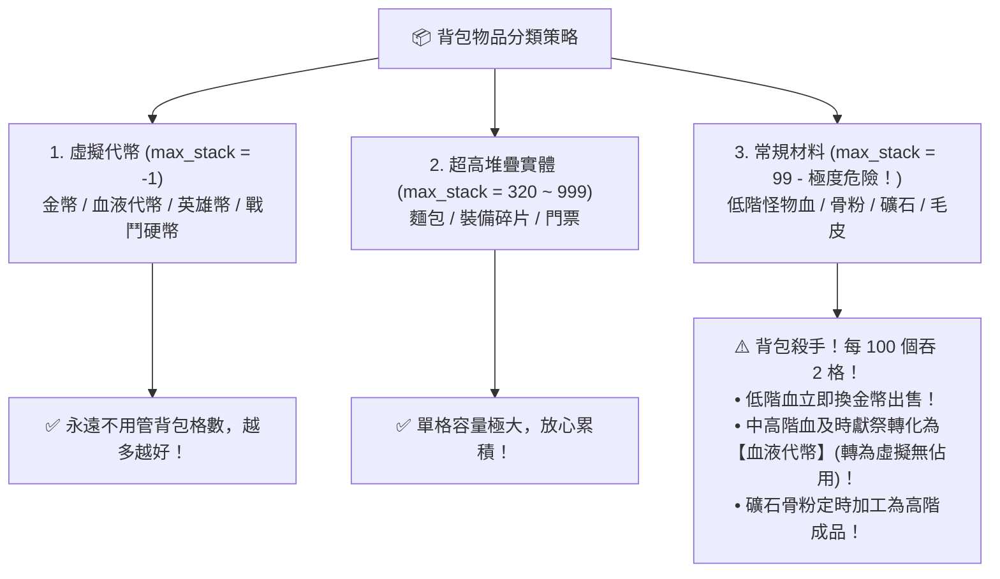

# 📦 Blackfire Crusade 物品堆疊上限全解析手冊 (超越 99 上限清單)

> 本文檔依據遊戲底層資源庫 `meta_data/raw_tres/meta_datas.tres`（`.tres` 原始資料庫）全面檢索提取，系統性梳理遊戲中所有**堆疊上限（`max_stack`）超過預設值 99** 的特殊物品、道具與貨幣機制。

---

## 🧭 一、底層堆疊規則與機制綜述 🔍

根據 `meta_datas.tres` 中 `items.settings` 的全局配置：

```json
"settings": {
    "default_max_stack": 99.0
}
```

1. **常規物品（預設上限 99）**：
   - 包含所有**怪物材料**（如各階怪物之血 `monster_blood`、獸皮、骨頭、爪牙）。
   - 包含所有**精煉錠與礦石**（精煉鋼錠、冰霜鋼錠、鐵礦石）。
   - 包含所有**煉金藥水**（生命藥水、合劑、解毒劑）。
   - 包含所有**符文、打孔錘與強化石**（`rune_...`、`weapon_shard_...`、`piercing_hammer_...`）。
   - 包含所有**技能卡片**（`skill_card_...`）。
   - 只要數量達到 100，系統就會自動開闢第二格背包欄位，對背包空間造成巨大壓力。
2. **裝備類（單件獨立，不可堆疊）**：
   - 所有武器、防具、飾品、戒指均為單格 1 件（`max_stack = 1`）。
3. **超限堆疊物品（`max_stack > 99` 或 `max_stack = -1`）**：
   - 遊戲底層針對特定「超高消耗頻率」的實體道具，開放了 **320** 或 **999** 的高額堆疊上限。
   - 針對「帳號級核心代幣」，設定了 **`-1.0`**（無上限無限堆疊，且**不佔用背包空間**）。

---

## 📊 二、全遊戲堆疊上限「不只 99」完整清單速查表

在整個 `meta_datas.tres` 資料庫中，超越常規 99 上限的項目僅有以下 **11 種**：

| 物品 ID (`item_id`) | 中文名稱 / 圖示 | 所屬類別 (`categories`) | 堆疊上限 (`max_stack`) | 佔用背包空間 | 底層設計邏輯與用途深度解析 |
| :--- | :--- | :--- | :---: | :---: | :--- |
| **`equipment_scraps`** | 🔨 **裝備碎片** | `consumable`, `crafting` | **`999`** | ✅ 佔用 (每 999 佔 1 格) | **批量裝備分解產物**。掛機自動分解大量白/綠/藍裝時產生的基礎殘渣，專門設定 999 防爆包。 |
| **`arena_ticket`** | 🎫 **競技場門票** | `consumable`, `1_ticket` | **`999`** | ✅ 佔用 (每 999 佔 1 格) | **PVP 競技場挑戰憑證**。防止玩家長期積攢門票時擠爆日常背包，特批 999 堆疊。 |
| **`bread`** | 🍞 **麵包 (體力)** | `food`, `bread` | **`320`** | ✅ 佔用 (每 320 佔 1 格) | **地下城掃蕩專用體力**。對應麵包房 (`bakery`) 單次產量 160 的 2 倍上限 (`160 × 2 = 320`)。 |
| **`coin`** | 🪙 **金幣** | `currency` | **`-1` (無上限)** | ❌ 虛擬計數 (0 格) | 全局基礎流通貨幣（強化裝備、升級技能、商店採購）。 |
| **`gem`** | 💎 **鑽石 / 寶石** | `currency` | **`-1` (無上限)** | ❌ 虛擬計數 (0 格) | 高級付費與成就獎勵貨幣（抽卡、重置天賦、商場禮包）。 |
| **`battle_coin`** | ⚔️ **戰鬥硬幣** | `currency` | **`-1` (無上限)** | ❌ 虛擬計數 (0 格) | 副本掃蕩核心體力代幣（解鎖衝等掛機主要消耗來源）。 |
| **`blood_coin`** | 🩸 **血液代幣** | `currency` | **`-1` (無上限)** | ❌ 虛擬計數 (0 格) | **血之祭壇專屬代幣**。獻祭怪物血液後即轉為此虛擬貨幣，不佔背包空間。 |
| **`hero_coin`** | 👑 **英雄幣** | `currency` | **`-1` (無上限)** | ❌ 虛擬計數 (0 格) | 酒館招募與傳奇英雄購買代幣（如 12,800 購買德魯戈）。 |
| **`expedition_coin`** | 🌍 **遠征幣** | `currency` | **`-1` (無上限)** | ❌ 虛擬計數 (0 格) | 大地圖世界遠征排行與掛機獎勵，用於遠征商店兌換精煉鋼錠。 |
| **`glory_arena_point`** | 🏆 **榮耀競技場點數** | `currency` | **`-1` (無上限)** | ❌ 虛擬計數 (0 格) | 榮耀競技場結算點數，用於兌換競技場專屬飾品與戒指。 |
| **`concept_shard`** | 🔮 **概念碎片** | `currency` | **`-1` (無上限)** | ❌ 虛擬計數 (0 格) | 高階技能突破與特殊概念系統之核心虛擬貨幣。 |

---

## 💡 三、三大實體高堆疊道具機制深析

### 1. 🍞 麵包 (`bread`)：上限 320 的巧妙幾何設計
- **底層關聯**：
  - 城鎮麵包房模組設定：`bakery: { "food_count": 160.0, "time_per_food": 80000.0 }`。
  - 進入一次普通地下城固定消耗 5 個麵包（`food_per_dungeon: 5.0`）。
- **設計用意**：
  - 麵包單格堆疊上限剛好為 **`320`**，意味著剛好可以容納 **整整 2 輪滿產能的麵包房產出**，可支援連續打滿 64 場常規地下城，既保障掛機續航，又避免背包被食物淹沒。

### 2. 🔨 裝備碎片 (`equipment_scraps`)：上限 999 的防爆包閥門
- **底層關聯**：
  - 分解裝備產率：`character_decompose_rate: 0.125`，品質偏移 `equipment_scraps_rarity_offset: 2.0`。
- **設計用意**：
  - 腳本在執行後台掛機時（如 `bag_cleaning` 自動清理），會連續分解數百件綠裝與藍裝。
  - 若堆疊上限只有 99，背包會在幾十分鐘內被裝備碎片徹底塞爆；設定為 **`999`** 能讓 1 格背包承載近千個碎片，保證數小時連續自動掛機不翻車。

### 3. 🎫 競技場門票 (`arena_ticket`)：上限 999 的囤票機制
- **設計用意**：
  - 競技場門票由每日登入、任務、遠征等零星獎勵累積。
  - 將其設定為 **`999`** 堆疊上限，便於玩家「平日囤票、賽季末爆發衝榜」，而不需要頻繁為了騰出背包格子被迫打掉門票。

---

## 🎒 四、背包空間管理核心策略啟示

從上述數據出發，我們能得出極為清晰的背包管理準則：



1. **善用「血液代幣 (`blood_coin`)」的無佔用特性**：
   - 實體怪物血液（`monster_blood_1` ~ `monster_blood_5`）**每一種、每 99 個就吃掉 1 格背包**。
   - 但只要將它們獻祭進【血之祭壇】，立刻轉化為 `blood_coin`（`max_stack = -1`），**0 佔用、無上限儲存**！
   - 這也是為何「與其留著一堆 3~5 階血塞爆背包，不如直接獻祭成血液代幣」的背後關鍵機制。
2. **無情清理常規 99 上限垃圾**：
   - 1~2 階怪物之血（只能補 50~100 HP，已淘汰）請直接一鍵出售換成金幣（金幣同樣無佔用）。
   - 雜質過多的 99 堆疊白色邊角料及時出售或熔煉為高階錠，即可永久告別「背包已滿無法拾取」的窘境。
