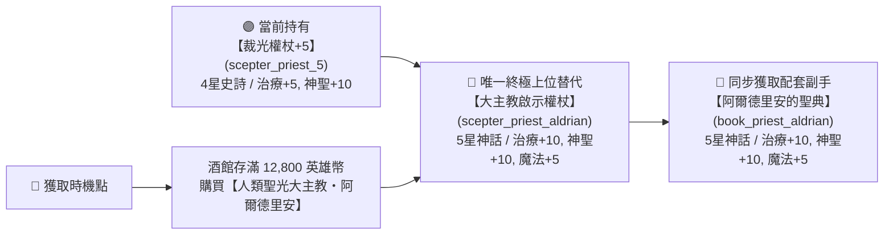
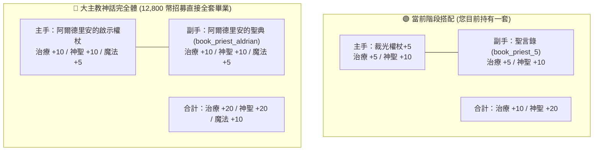

# 🔮 Blackfire Crusade 牧師治療武器進階指南：超越【裁光權杖】的上位神裝全景圖

> 本文檔依據遊戲底層資源庫 `meta_data/raw_tres/meta_datas.tres`（`.tres` 原始資料庫）深度檢索整理，針對您目前持有的 **【裁光權杖+5】**，全面剖析在「冰雪洞窟（冰霜洞窟）/ 冰凍峽谷」之後，何時能取得更高治療加成、更高白值與更強機制的上位裝備。

---

## 🧭 一、核心結論速查：何時能換？換什麼？

> [!IMPORTANT]
> **關鍵底層事實**：
> 1. 在整個 `meta_datas.tres` 資料庫中，帶有 `heal_con`（治療增強）特化詞條的權杖**全遊戲只有 5 把**（1星白、2星綠、3星藍、4星紫【裁光】、5星神話【阿爾德里安】）。
> 2. 後續的大後期權杖（深淵海怪權杖、骷髏領主權杖、劇毒權杖）全部轉為毒素、暗影或暴擊輸出路線，**完全不再提供治療增強**！
> 3. 因此，**【阿爾德里安的啟示權杖】是全遊戲治療特化權杖的唯一終極天花板**！
> 4. **獲得時間點**：不需要看臉刷圖，在您繼德魯戈之後，存滿 **第 2 筆 12,800 英雄幣** 於酒館購買 **【大主教・阿爾德里安】** 時，他入隊直接**自帶這把 5 星神話權杖與配套副手聖典**！

---

## 📊 二、屬性數值全維度深度對比

| 評估維度 | 🟣 您當前武器：【裁光權杖】 (`scepter_priest_5`) | 👑 終極上位神裝：【阿爾德里安的啟示權杖】 (`scepter_priest_aldrian`) | 數值提升幅度與實戰差異 |
| :--- | :---: | :---: | :--- |
| **裝備品質** | **4 星史詩 (紫色 / Rarity 3.0)** | **5 星傳說/神話 (橘色 / Rarity 5.0)** | 品質階級直接跨越 2 個大階！ |
| **基礎攻擊白值** | 22 - 42 (+5強化) | **35 - 65+** (基礎白值大幅碾壓) | 基礎白值越高，牧師的所有治療公式與普攻傷害加成越高。 |
| **治療增強 (`heal_con`)** | **`+5`** (1 條詞條) | **`+10` (雙治療詞條！`heal_con` x2)** | 🟢 **治療效果直接翻倍 (100% 提升)！** |
| **神聖增強 (`holy_con`)** | **`+10`** (2 條詞條) | **`+10`** (2 條詞條) | 維持頂級雙神聖加成，打惡魔亡靈極痛。 |
| **魔法增強 (`magic_con`)** | ❌ 無 | **`+5`** (1 條魔法掌控詞條) | 額外提升所有魔法與範圍治療的基礎倍率。 |
| **極品詞條總數** | 3 條詞條 | **5 滿極品詞條 (Perfect Rolls)** | 詞條總量提升 66%，無任何廢詞。 |
| **專屬普攻技能** | `attack_holy` (普通神聖打擊) | **`attack_revelation_light` (啟示之光)** | 專屬普攻附帶高額神聖打擊與破防判定。 |
| **鑲嵌孔位 (Sockets)** | 上限 3 孔 | **上限 4 孔 (更高等級上限)** | 可多鑲嵌一顆高級符文/寶石。 |

---

## 📖 三、副手治療裝備深度解析：【聖言錄】及其上位神裝

您截圖中的副手裝備正是 4 星紫色史詩聖典 **【聖言錄】(`book_priest_5`)**（自帶治療增強 +5、神聖增強 +10）。

### 1. 牧師副手規則與全遊戲「治療副手（書）」盤點
- **底層裝備限制**：根據 `classes.priest`，牧師的副手欄位**只能裝備「書（Book / 聖典）」**，無法佩戴盾牌。
- **全遊戲治療書盤點**：在整個 `meta_datas.tres` 中，帶有 `heal_con`（治療增強）的副手書**全遊戲僅有 4 本**：
  1. `book_001`：1星白裝（無詞條）。
  2. `book_002`：2星綠裝（治療增強 +5）。
  3. `book_003`：3星藍裝（治療增強 +10，但白值極低、孔位少）。
  4. **`book_priest_5`【聖言錄】**：**4星紫裝（治療增強 +5、神聖增強 +10） ➔ 您當前持有的副手！**
  5. **`book_priest_aldrian`【阿爾德里安的聖典】**：**5星神話（治療增強 +10、神聖增強 +10、魔法增強 +5） ➔ 全遊戲唯一終極上位替代！**
  *(註：後續 6星與大後期副手書如 `book_demon_sarlst`、`book_gillborn_selkuun` 等全部轉為純輸出與暴擊路線，不提供任何治療詞條)*

### 2. 副手數值對照：【聖言錄】 vs 【阿爾德里安的聖典】

| 評估維度 | 🟣 您當前副手：【聖言錄】 (`book_priest_5`) | 👑 終極上位神裝：【阿爾德里安的聖典】 (`book_priest_aldrian`) | 提升幅度與實戰差異 |
| :--- | :---: | :---: | :--- |
| **裝備品質** | **4 星史詩 (紫色 / Rarity 3.0)** | **5 星傳說/神話 (橘色 / Rarity 5.0)** | 跨越 2 個品質大階！ |
| **基礎傷害白值** | 4 - 8 (基礎值) | **8 - 16+** (基礎白值大幅提升) | 提高法術與受癒係數。 |
| **治療增強 (`heal_con`)** | **`+5`** (1 條詞條) | **`+10` (雙治療滿詞條！`heal_con` x2)** | 🟢 **副手治療效果直接翻倍 (100% 提升)！** |
| **神聖增強 (`holy_con`)** | `+10` (2 條詞條) | `+10` (2 條詞條) | 保持頂級雙神聖掌控。 |
| **魔法增強 (`magic_con`)** | ❌ 無 | **`+5`** (1 條魔法掌控) | 額外加成全隊範圍受癒。 |
| **極品詞條總數** | 3 條詞條 | **5 滿極品詞條 (Perfect Rolls)** | 詞條全面拉滿。 |
| **孔位上限** | 3 孔 | **4 孔** | 可多鑲嵌 1 顆符文。 |

### 3. 主副手成套連動：大主教神話雙專武完全體

- **驚人的提升倍率**：
  - 您目前【裁光權杖】+【聖言錄】合計提供 **治療 +10、神聖 +20**。
  - 當招募阿爾德里安換上整套雙專武後，直接達到 **治療 +20、神聖 +20、魔法 +10**！
  - **治療數值直接淨增一倍，前排坦克幾乎永不破盾陣亡！**

---

## 🗺️ 四、各階段推圖時序與獲取路徑規劃

為避免走彎路，各階段過渡建議如下：

### 1. 當前階段：冰雪洞窟（地下城6）~ 遺忘荒地（主線7，Lv.50~65）
- **操作策略**：**【裁光權杖+5】先安心用著，完全不用急著換！**
- **理由**：
  - 在第 6~7 章過渡期間，地圖掉落的藍/紫裝權杖（如 `scepter_priest_3` 或雜牌權杖）數值都不如您這把已經 +5 且打滿孔的裁光權杖。
  - 目前資源應 100% 投入給主 C 德魯戈升等與前排坦克的防具強化。

### 2. 下一階段：黃金帝國 (Domain 1) ~ 熾熱火山 (主線8，Lv.65~75)
- **酒館儲蓄**：
  - 當德魯戈等級成型後，日常積攢的英雄幣全力存向 **12,800 幣**。
- **神裝解鎖時機**：
  - 存滿 12,800 幣招募 **【人類聖光大主教・阿爾德里安】** 的那一瞬間，直接無縫換上 **【啟示權杖 + 聖典】** 雙 5 星畢業神裝！
  - 同時解鎖全隊【使徒復生】滿血自活神技，徹底告別任何翻車可能。

### 3. 大後期畢業飾品補充：【救贖之燈】(`relic_salvation_lantern`)
- **裝備部位**：聖物飾品 (`relic`)
- **品質階級**：6 星超越 (紅色 / Rarity 6.0)
- **屬性與技能**：
  - 神聖掌控 `holy_con: +25`、神聖抗性 `holy_res: +25`。
  - 專屬神技 **【第二次恩典】(`second_grace`)**：當佩戴者生命低於 25% 時，**被動瞬間觸發 9 次超高係數連環大回血**，等於自帶不死名刀。
- **獲取方式**：大後期野外稀有首領 `human_cutter` 掉落損壞核心後在鐵匠鋪修復。

---

## 💡 五、總結

1. 您現在手上的 **【裁光權杖+5】已經是 4 星階段最頂級的治療權杖**，在當前階段不需要浪費任何體力去刷其他過渡權杖。
2. 比它更強的「治療神裝」在整個遊戲資料庫中只有 **阿爾德里安的專屬神杖（`scepter_priest_aldrian`）**。
3. 取得它的時間點就是您在酒館招募 **【人類聖光大主教・阿爾德里安】** 的那一刻，屆時將迎來治療量翻倍的質變飛躍！
