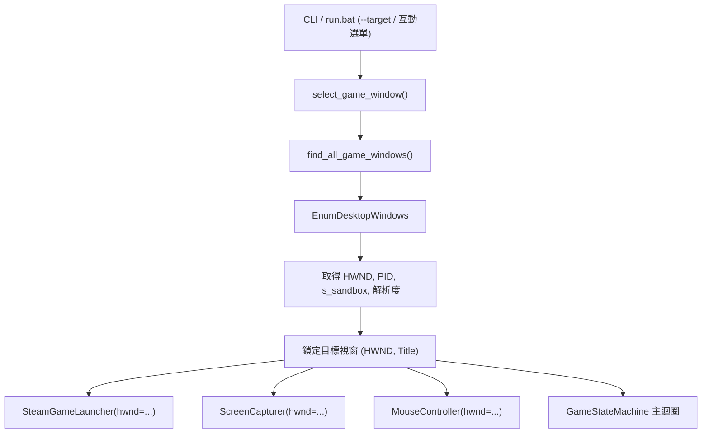

# Sandboxie-Plus 雙開掛機與多視窗自動化技術指南 🪟🎮

本指南詳細記錄了在單台 Windows 電腦上，透過 **Sandboxie-Plus** 實現 Steam 雙帳號同時登入與《黑火遠征》(Blackfire Crusade) 雙開掛機的底層機制、存檔隔離原理，以及自動化腳本的多實例辨識與控制架構。

---

## 一、 背景與雙開架構挑戰

Steam 原生客戶端限制單一使用者登入與單一遊戲實例執行。此外，《黑火遠征》的本地存檔（Godot 引擎架構）預設儲存於 `%APPDATA%\Godot\app_userdata\Blackfire Crusade\`。

在同台電腦上進行雙開掛機時，面臨兩大核心挑戰：
1. **存檔與 Steam 登入衝突**：兩個帳號若共用相同本機目錄，會造成存檔互相覆蓋。
2. **視窗與自動化控制衝突**：傳統腳本透過單一視窗標題 (`FindWindow`) 無法區分多個實例，且無法精準指定截圖與操作目標。

---

## 二、 Sandboxie-Plus 隔離機制與驗證

透過 **Sandboxie-Plus**（沙盒工具）啟動第二個 Steam 客戶端與遊戲，實現輕量且完全無衝突的實體隔離。

### 1. 存檔與資料隔離實體路徑

| 實例類型 | 登入帳號 | 本地存檔 (Godot AppData) | Steam 雲端與使用者快取 |
| :--- | :--- | :--- | :--- |
| **實例 A (本機 Steam)** | 帳號 1 | `C:\Users\<User>\AppData\Roaming\Godot\app_userdata\Blackfire Crusade\` | `D:\Steam\userdata\` |
| **實例 B (沙盒 Steam)** | 帳號 2 | `C:\Sandbox\<User>\New_Box\user\current\AppData\Roaming\Godot\app_userdata\Blackfire Crusade\` | `C:\Sandbox\<User>\New_Box\drive\D\Steam\userdata\` |

> [!NOTE]
> Sandboxie 會以 Copy-on-Write 機制將第二個實例對註冊表、AppData 與 Steam UserData 的所有讀寫行為硬性重導向至 `C:\Sandbox\` 內部，確保兩組帳號的進度、設定與雲端存檔 **100% 獨立隔離**。

### 2. 視窗特徵差異

Sandboxie-Plus 在保護模式下會為被隔離的應用程式注入視窗邊界特徵：
* **原生視窗標題**：`Blackfire Crusade`
* **沙盒視窗標題**：`[#] Blackfire Crusade [#]`
* **獨立 PID 與 HWND**：兩個遊戲程序具有不同的 Process ID 與視窗控制代碼 (HWND)。

---

## 三、 自動化腳本多實例架構設計

為支援雙開或多開環境，腳本進行了分層重構：



### 1. 視窗管理工具 (`utils/window.py`)
- **`WindowHandle(window_title, hwnd)`**：支援顯式綁定 `hwnd`；當視窗重開或 handle 失效時，自動 fallback 回 `window_title` 重新查詢。
- **`find_all_game_windows()`**：透過 Win32 `OpenInputDesktop` + `EnumDesktopWindows` 掃描所有符合 `Blackfire Crusade` 的頂層視窗，並自標題中辨識 `is_sandbox = "[#]" in title`。
- **`select_game_window(target, auto_prompt)`**：
  * 當僅有 1 個視窗時，零干擾直接綁定。
  * 當有 2 個以上視窗時，依據傳入參數直接選定，或跳出終端機互動選單。

### 2. 控制器與截圖器解耦 (`capture/screen.py`, `actions/mouse.py`)
- `ScreenCapturer` 與 `MouseController` 均接收明確的 `hwnd` 參數，保證後續前台/後台截圖與座標轉換 (`ClientToScreen`) 均作用於指定的特定實例。

---

## 四、 終端機與命令列使用說明

### 1. 互動選單模式 (預設)
直接執行 `run.bat` 或 `python main.py`，偵測到多個遊戲實例時會自動提示：
```text
============================================================
[*] 偵測到多個 Blackfire Crusade 遊戲實例：
------------------------------------------------------------
  [1] 【本機 Steam】 Blackfire Crusade
      -> PID: 11128 | HWND: 0x2707a8 | 解析度: 1536x793

  [2] 【沙盒 Steam】 [#] Blackfire Crusade [#]
      -> PID: 10452 | HWND: 0xe0a96 | 解析度: 1920x1009
------------------------------------------------------------
請選擇要控制的遊戲視窗 (1-2) [預設 1]: 
```

### 2. CLI 參數快速指定
適用於捷徑啟動或批次指令：
* **指定沙盒帳號**：
  ```bash
  python main.py --backend --mode daily --target sandbox
  ```
* **指定本機原生帳號**：
  ```bash
  python main.py --backend --mode daily --target native
  ```
* **依選單序號或指定 HWND**：
  ```bash
  python main.py --target 2
  python main.py --target 0x0E0A96
  ```

---

## 五、 雙開掛機下的熱鍵暫停操作規範 (實務操作備忘)

> [!IMPORTANT]
> **雙開暫停操作兩大實務鐵律**：
> 1. **必須點擊「遊戲畫面」而非 Terminal**：
>    - 當雙開掛機時，若想暫停其中一邊（例如沙盒實例），**請滑鼠左鍵點一下該遊戲視窗畫面**（使其獲得 Windows 前景焦點），然後按下 **`Ctrl + Space`**。
>    - **嚴禁點擊 Terminal 終端機視窗後按熱鍵**（因為 Windows Terminal 多頁籤/多終端機的焦點事件容易交疊，點擊遊戲畫面才是 100% 精確區分目標實例的唯一基準）。
> 2. **點擊哪一個遊戲視窗，就只暫停哪一個**：
>    - 點選沙盒遊戲畫面 ➔ 按 `Ctrl + Space` ➔ **僅沙盒腳本暫停/繼續**。
>    - 點選本機遊戲畫面 ➔ 按 `Ctrl + Space` ➔ **僅本機腳本暫停/繼續**。
>    - 另一邊正常掛機中的實例完全不受干擾！

---

## 六、 相關模組與測試索引
* 沙盒管理器模組：[`utils/sandbox_manager.py`](../../utils/sandbox_manager.py)
* 視窗管理器模組：[`utils/window.py`](../../utils/window.py)
* 鍵盤熱鍵控制器：[`utils/keyboard_listener.py`](../../utils/keyboard_listener.py)
* 啟動器與視窗準備：[`utils/steam_launcher.py`](../../utils/steam_launcher.py)
* 截圖前沿控制器：[`capture/screen.py`](../../capture/screen.py)
* 滑鼠與點擊控制器：[`actions/mouse.py`](../../actions/mouse.py)
* 視窗管理單元測試：[`tests/test_window_handle.py`](../../tests/test_window_handle.py)
* 沙盒管理單元測試：[`tests/test_sandbox_manager.py`](../../tests/test_sandbox_manager.py)
* 暫停控制行為測試：[`tests/test_behavior_pause_resume.py`](../../tests/test_behavior_pause_resume.py)
