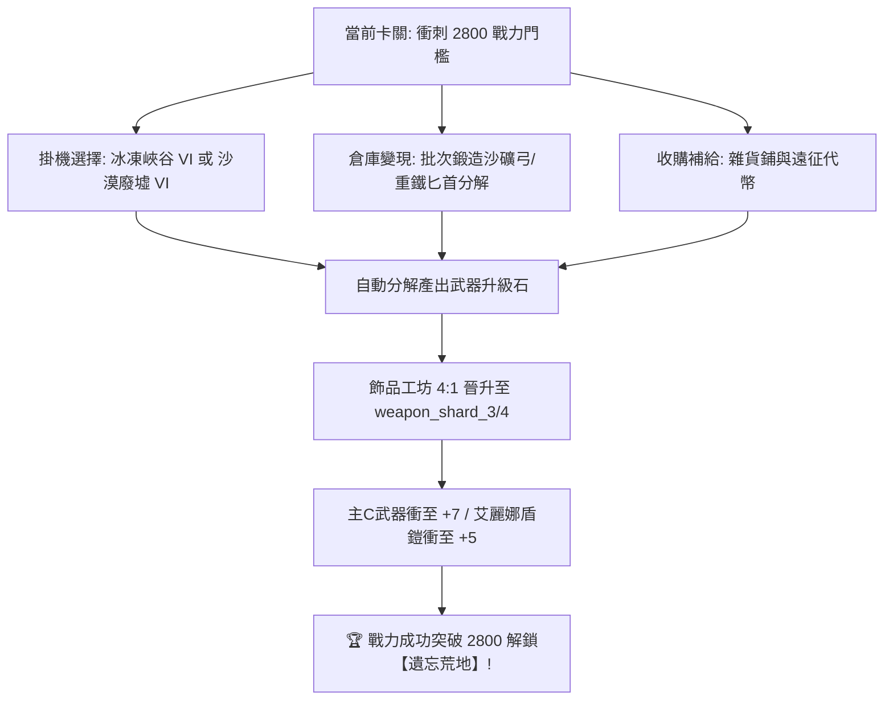

# 武器升級石頭獲取途徑與當前進度最佳方案指南 💎

本指南基於遊戲底層元數據 `meta_datas.tres`（`.tres` 資源檔）與用戶當前掛機進度，全面盤點**武器升級石（Weapon Shards）**的獲取管道，並為您量身定制最高效率的獲取方案。

---

## 一、 用戶當前進度與環境分析 🔍

根據 [`user_data/native/config.toml`](../../user_data/native/config.toml) 與 [`user_data/native/daily_status.json`](../../user_data/native/daily_status.json) 記錄：
- **當前主線進度**：第 4 大區 **沙漠廢墟 (Desert Ruins)** 第 6 關 (`tier4_stage_level = 6, tier4_sub_stage = "final"`)，同時已解鎖第 5 章 **冰凍峽谷 (Frozen Gorge，Lv.50~59)**。
- **當前地下城進度**：第 5 地下城 **神秘遺跡 (Mysterious Ruins)** (`tier4_dungeon_index = 5`)。
- **每日日常子流程**：寶箱、英雄召喚、血之祭壇、首領討伐 (育母蜘蛛/古代惡靈)、飾品工坊已排程或已完成。
- **自動分解設定**：已啟用 `["gray_or_empty", "green", "blue", "purple"]` 自動分解。

---

## 二、 武器升級石頭 (Weapon Shard) 全途徑盤點 🗺️

在元數據中，武器升級石頭分為 `weapon_shard_0` 至 `weapon_shard_6`（白 ➔ 綠 ➔ 藍 ➔ 紫 ➔ 金 ➔ 紅 ➔ 彩），每 4 顆低階可合成 1 顆高階（4:1 比例）：

### 1. 鍛造低階武器/盾牌再分解（主動量產方案）
- **機制**：武器或盾牌被分解時，會產出對應品質的武器碎片/強化石。
- **推薦低成本鍛造配方**：
  - **T1 白/綠色武器**：
    - `dagger_heavy_iron` / `staff_heavy_iron` / `spear_heavy_iron`：只需 4~6 個 `hardened_rock_shard`（硬化岩石碎片）+ 1 個 `essence_1`（初級精華）。
    - `bow_sand_ore` / `scepter_sand_ore` / `staff_sand_ore`：只需 6 個 `sand_ore`（沙礦石）+ 1 個 `essence_1`。
  - **T2 藍色武器/盾牌**：
    - `bow_beast_fang`：6 個 `beast_fang` + 2 個 `boar_tusk` + 1 個 `essence_2`。
    - `sword_003`：5 個 `hard_armor_plate` + 1 個 `essence_2`。
  - **T3 紫色盾牌/武器**：
    - `shield_rune_shard`：6 個 `rune_shard` + 6 個 `ingot_quality` + 1 個 `essence_3`。
    - `axe_rune_shard`：6 個 `rune_shard` + 6 個 `ingot_quality` + 1 個 `essence_3`。

### 2. 雜貨鋪 (Grocery Store) 定時採購
- **機制**：雜貨鋪 (`grocery_store.sell_items`) 每輪商品刷新中，均有固定機率刷出 `weapon_shard_0` ~ `weapon_shard_6`。
- **操作建議**：
  - 每次城鎮刷新或定時巡檢時，掃清雜貨鋪中用金幣出售的武器石頭與各階精華 (`essence_1` ~ `essence_6`)。

### 3. 神秘寶箱 (Mystery Chest) 每日免費與抽獎
- **機制**：神秘寶箱池 (`mystery_chest.chest_items`) 包含全階級武器升級石與強化水晶。
- **操作建議**：每日 4 次免費寶箱必開（掛機腳本已自動涵蓋）。

### 4. 命運轉盤 (Fate Wheel)
- **機制**：轉盤獎池中各檔次均包含高階武器碎片：
  - `other_items` (綠/藍)：`weapon_shard_2`
  - `epic_items` (紫)：`weapon_shard_3`
  - `legendary_items` (金)：`weapon_shard_4`
  - `mythic_items` (紅)：`weapon_shard_5`
  - `ancient_items` (彩)：`weapon_shard_6`
- **操作建議**：日常獲取的命運金幣集中投在轉盤上。

### 5. 野外首領與稀有哥布林 (Goblin Barney)
- **機制**：野外遭遇稀有首領 `goblin_barney`（巴尼哥布林，出現機率 0.1%，必掉 5 件物品），其專屬掉落物為 `weapon_shard_3` ~ `weapon_shard_6` 以及大量金幣。

### 6. 掛機刷關特定掉落武器的怪物關卡（掛機首選）
- **機制**：怪物穿戴或掉落武器/副手裝備時，拾取後經由背包自動分解 (`bag_cleaning`)，能持續穩定產出升級石。

---

## 三、 熱門掛機點深度評估：【冰凍峽谷 VI~VIII】 vs 【沙漠廢墟 VI~X】 ⚔️

### 1. 冰凍峽谷 (Frozen Gorge) 關卡 VI、VII、VIII 差異分析：
- **掉落物與掉落率**：**完全相同 (0 差異)**。三關的怪物陣容均為「雪山惡魔 + 夜幕霜法師 + 霜巨人」，均裝備 2 階藍色武器（惡魔之斧、夜幕法杖、夜幕冰書）並掉落 `ice_fur`（冰皮毛）。
- **經驗值 (EXP)**：關卡 VI (Lv.55) ➔ VII (Lv.56) ➔ VIII (Lv.57)，每關經驗僅微幅遞增 3%~5%。
- **最優選擇**：**無腦選「關卡 VI」**！因為怪物等級最低 (Lv.55)、血量與防禦最薄、殺怪速度最快，單位時間總通關場次最多。

### 2. 兩大掛機點特性對比：

| 評估維度 | ❄️ 冰凍峽谷 VI (Frozen Gorge 6) | 🏜️ 沙漠廢墟 VI (Desert Ruins 6) |
| :--- | :--- | :--- |
| **產出裝備階級** | **T2 藍色裝備 (稀有度 2.0)** (惡魔之斧、夜幕法杖、夜幕冰書) | **T1 綠色/白色裝備 (稀有度 1.0)** (骷髏劍、骷髏盾、骷髏法杖) |
| **分解碎片品質** | 直接產出 **`weapon_shard_2`（藍色武器石）** (等於 4 顆綠石 / 16 顆白石) | 產出 **`weapon_shard_1`（綠色武器石）** |
| **通關耗時與難度** | 怪物血厚帶護盾，約 5~10 秒/場 | 澤穆爾 AOE 秒殺，約 2~3 秒/場 |
| **核心優勢** | 單件質量高，直接省去 4:1 合成步驟 | 通關極速、掉落數量極多、材料產量大 |

---

## 四、 針對您目前卡進度的最佳組合方案 🚀

### 推薦執行步驟：

1. **掛機產出最大化（零操作負擔）**：
   - **實測通關速度**：在 **【冰凍峽谷 VI】** 掛機。若能在 5 秒內快速清場，優先在此處收割 2 階藍色武器分解出的 **藍色武器石 (`weapon_shard_2`)**；若清怪偏慢，則切回 **【沙漠廢墟 VI】** 以極速秒怪獲取大量綠石。

2. **清空背包溢出材料（主動爆產）**：
   - 到鐵匠鋪檢查背包中的 `sand_ore`、`hardened_rock_shard`、`beast_fang`。
   - 大量製作 `bow_sand_ore`、`staff_sand_ore`、`dagger_heavy_iron` 後直接分解，將積存材料 100% 變現為武器升級石。

3. **飾品工坊 4:1 集中晉升**：
   - 累積足夠低階碎片後，在飾品工坊將 `weapon_shard_0` ~ `weapon_shard_2` 合成為 `weapon_shard_3`（紫）及更高階。
   - 依據「反向強化哲學」，優先將 **主 C 武器強化至 +7**、**艾麗娜盾牌與胸甲強化至 +5**，快速達成 2800 戰力！
