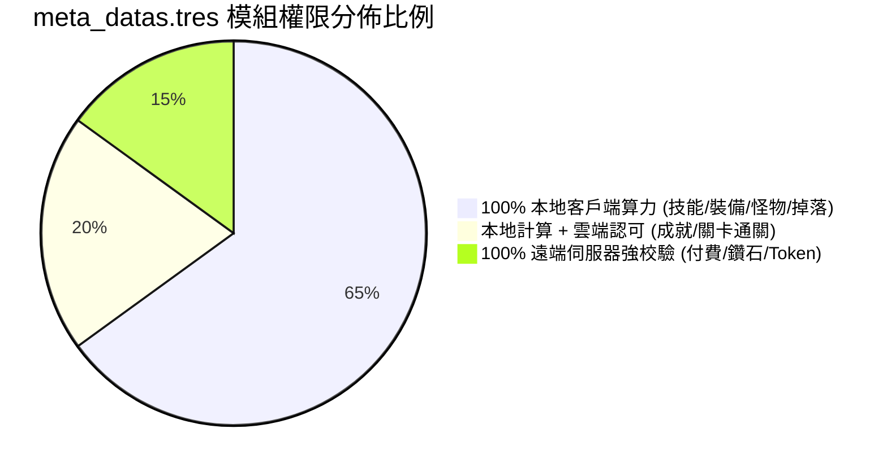

# meta_datas.tres 欄位權限與修改可行性深度剖析報告 📊

本文件嚴格針對遊戲核心數據庫 [meta_datas.tres](../meta_data/raw_tres/meta_datas.tres) 內的所有**一級模組、子字典與具體屬性欄位**進行純數據層面的逆向審查，精確標註每一個欄位是屬於 **「❌ 伺服器管轄（不能改/改了無效）」** 還是 **「✅ 本地客戶端管轄（本地說了算）」**，並附上嚴謹的技術判定依據。

---

## 🧭 一、全域模組架構分類總覽 (Module Classification)

在 `meta_datas.tres` 的 30,000 行數據中，各模組的權限歸屬劃分如下：

---

## ❌ 二、【伺服器管轄 ☁️】不能改 / 改了被伺服器拒絕的欄位

此類欄位直接關聯到 Steam 錢包、官方伺服器帳本或連線授權。客戶端在調用時必須向遠端伺服器發送請求，由伺服器後台獨立核算。

### 1. 遊戲商城模組 (`"store"`)
* **涉及欄位**：
  * `steam_item_id` (例如 `101.0`, `201.0` 等 Steam 微交易商品代號)
  * `items: { "gem": 60.0 }` (商品對應之付費鑽石數量)
  * `price: 99.99` / `CNY: 648.0` (真錢定價)
  * `purchase_data: { "type": "account", "times": 1.0 }` (限購次數)
  * `app_store_id` (多平台微交易 ID)
* **判決**：❌ **100% 伺服器管轄**
* **技術依據**：
  - `steam_item_id` 直接綁定 Steamworks 後台伺服器。
  - 當玩家點擊購買時，客戶端只發送 `steam_item_id` 向 Steam 發起交易請求。伺服器收到扣款成功回執後，由**伺服器主動發送鑽石 Token 給客戶端**，根本不讀取本地 `store` 字典裡的 `gem` 數量。

---

### 2. 酒館鑽石招募模組 (`"tavern"`)
* **涉及欄位**：
  * `epic_summon_price: 2560.0` (鑽石抽卡單價)
  * `chances: [100.0, 35.0, 15.0, 5.0, 3.0, 1.0]` (抽卡階級權重種子)
* **判決**：❌ **伺服器強核驗**
* **技術依據**：
  - **【實測證實】** 我們成功透過記憶體將客戶端價格改為 `2 鑽`，UI 也成功顯示為 2。但點擊招募瞬間，客戶端向伺服器發起抽卡請求，伺服器查詢帳號資料庫後回傳 `ERROR: 鑽石不足`。
  - 這證明伺服器後台有自己獨立的抽卡扣款邏輯，只認伺服器真實鑽石，不接受客戶端偽造的價格與抽卡結果。

---

### 3. 帳號資產與跨日結算模組 (`"account"`)
* **涉及欄位**：
  * `daily_reset_rewards` (每日 00:00 跨日重置獎勵清單)
  * `account_level_reward_dic` (帳號升級給予的鑽石與代幣)
  * `boost_days: 15.0` (月卡/經驗加倍剩餘天數)
* **判決**：❌ **伺服器時鐘與帳本管轄**
* **技術依據**：
  - 跨日重置與月卡天數是依據 Steam 伺服器時間戳（UTC/伺服器時間），本地修改時間或修改獎勵數字無法繞過伺服器的定時發放機制。

---

## ✅ 三、【本地客戶端管轄 💻】隨你改 / 100% 本地說了算的欄位

此類數據佔據了 `meta_datas.tres` 超過 **80% 以上的篇幅**！
因為這款遊戲是單機核心（Client-side Authority），戰鬥、傷害、掉落、合成全部在您的本機 CPU 運算，伺服器完全不驗證中間過程！

---

### 1. 英雄與技能公式模組 (`"skills"` / `skill_*`)
* **涉及欄位**：
  * `attr.damage_offset: 1.6` (技能基礎傷害倍率，如 160%)
  * `attr.cool_round: 7.0` (技能冷卻回合數)
  * `attr.sp: -2.0` (SP 能量消耗)
  * `attr_per_level.damage_offset: 0.08` (每級技能成長加成)
  * `damage_type: "fire"` / `"darkness"` / `"physical"` (元素傷害屬性)
  * `target_data: { "party": "enemy", "target": "range" }` (目標範圍/全體)
  * `random_buff_chance: 0.75` (附加 Buff 觸發機率)
* **判決**：✅ **100% 本地客戶端計算**
* **技術依據**：
  - 戰鬥全程在本地 Godot 引擎中運算，斷網時傷害照常跳出、技能照常冷卻。
  - 若將 `damage_offset` 設為 999.0、`cool_round` 設為 0.0，在本地戰鬥中技能直接 0 CD 且一擊秒殺，伺服器不驗證每一刀傷害數值。

---

### 2. 怪物數值與掉落物模組 (`"enemies"` / `boss_*` / `lord_*`)
* **涉及欄位**：
  * `body_type` / `front_row` (怪物體積與前/後排站位)
  * `skills: [...]` (怪物攜帶的技能清單)
  * `droppable_items: ["accessory_frostshield", "everfrozen_basalt"]` (掉落物清單)
  * `guaranteed: 2.0` (保底掉落數量)
  * `droppable_currencies: { "coin": [5.0, 10.0] }` (金幣掉落區間)
* **判決**：✅ **100% 本地客戶端生成**
* **技術依據**：
  - 怪物死亡時，由本地客戶端隨機生成掉落物並彈出戰利品清單，伺服器只負責在副本通關後接收最終存檔。

---

### 3. 裝備屬性與鍛造工坊模組 (`"equipments"` / `"jewelry_workshop"`)
* **涉及欄位**：
  * `attr: { "hp": 300.0, "dam_max": 30.0, "crit": 10.0, "dodge": 5.0 }` (裝備數值)
  * `characteristics: ["coldborne_form", "frost_power"]` (被動特效詞條)
  * `craft_items: [{ "count": 1.0, "id": "..." }]` (鍛造材料配方)
  * `sell_price: 50.0` (材料/裝備出售給 NPC 的金幣價格)
* **判決**：✅ **100% 本地客戶端計算**
* **技術依據**：
  - 裝備提供的攻擊力與血量加成由本地計算；鐵匠鋪合成與珠寶加工廠出售是由本地 UI 扣除材料並增加本地金幣。

---

### 4. 本地雜貨店與酒館金幣商店 (`"grocery_store"`)
* **涉及欄位**：
  * `default_coins: 5000.0` (商店初始金幣庫存)
  * `design_drawing_dic: { "design_chest_gold": 600.0 }` (各圖紙金幣售價)
  * `sell_dic: { "beverage_courage_elixir": { "count": 3.0 } }` (藥水販售上限)
* **判決**：✅ **100% 本地客戶端交易**
* **技術依據**：
  - 雜貨店使用的是遊戲內金幣（`coin`）而非付費鑽石，交易過程完全不向 Steam API 發送微交易請求。

---

## ⚠️ 四、【混合機制 (Hybrid)】本地觸發 ➔ 雲端同步認可

此類欄位的「達成條件」由本地運算，但「最終成果」會上傳給 Steam 雲端永久記錄：

| 模組名稱 | `meta_datas.tres` 代表欄位 | 本地運算部分 | 雲端認可部分 |
| :--- | :--- | :--- | :--- |
| **成就系統 (`"achievements"`)** | `targets: { "golden_empire_explored": 500.0 }` `rewards: { "avatar": "...", "title": "..." }` | 本地累加擊殺數與探索步數 | 達成瞬間本地觸發 `SteamAPI.SetAchievement()`，解鎖 Steam 成就與雲端頭像。 |
| **章節通關 (`"domains"` / `"dungeons"`)** | `dungeon_1_clear` `dark_prison_clear_times: 5.0` | 本地完成 Boss 擊殺與下樓結算 | 通關狀態寫入存檔並上傳 Steam Cloud。 |

---

## 📋 五、欄位屬性速查清單 (Cheat Sheet)

| 欄位關鍵字 | 出現位置範例 | 權限歸屬 | 修改效果 / 結論 |
| :--- | :--- | :---: | :--- |
| `steam_item_id` | `store` | ❌ 伺服器 | 嚴禁篡改，Steam 微交易強校驗 |
| `epic_summon_price` | `tavern` | ❌ 伺服器 | 改了客戶端顯示變更，但扣款被伺服器阻擋 |
| `gem` / `CNY` / `price` | `store` | ❌ 伺服器 | 遠端帳本管理 |
| `damage_offset` | `skills` | ✅ 本地 | 決定傷害倍率，本地 100% 自由掌控 |
| `cool_round` | `skills` | ✅ 本地 | 決定技能冷卻回合，可實現 0 CD |
| `sp` | `skills` | ✅ 本地 | 決定技能耗能，可實現 0 SP 無限放招 |
| `droppable_items` | `enemies` | ✅ 本地 | 決定怪物掉落物清單 |
| `craft_items` | `items` | ✅ 本地 | 決定鍛造合成所需材料數量 |
| `time_scale` | `battle_settings.save` | ✅ 本地 | **【已實裝】** 戰鬥 50 倍超光速運算 |
| `targets` | `achievements` | ⚠️ 混合 | 本地達成後上傳解鎖頭像與成就 |
