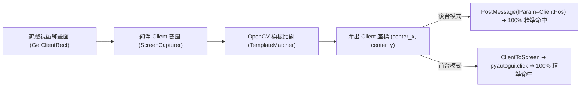

# PARS 開發故事：視窗 Client 座標點擊體系與動態自適應螢幕縮放比對重構 🎯

- **建立時間**: 2026-08-27
- **影響模組**: 
  - 截圖捕獲：`capture/screen.py` ([ScreenCapturer](../../capture/screen.py))
  - 滑鼠控制：`actions/mouse.py` ([MouseController](../../actions/mouse.py))
  - 視覺匹配：`vision/matcher.py` ([TemplateMatcher](../../vision/matcher.py))
  - 主程式排程：`main.py` ([main.py](../../main.py))
  - 診斷工具：`scripts/test_single_click.py` ([test_single_click.py](../../scripts/test_single_click.py))

---

## 1. Purpose (開發目的與問題背景)

在自動掛機腳本的長期維護中，使用者經常在「筆電本機螢幕（拔除外接線）」與「外接顯示器（插上外接螢幕線）」之間切換，引發了兩大極具隱蔽性的底層缺陷：

### 痛點 A：Windows 視窗外框造成的 8px 累積點擊偏差
- **現象**：在部分 UI 介面（如小按鈕、商品選擇）中，滑鼠點擊位置出現向上或向左約 8px 的微小位移，導致偶發性點擊無效。
- **深層成因**：
  Windows 系統在視窗最大化時，為了處理視窗陰影與防鋸齒，會在視窗周圍保留約 8 像素的「隱形拖曳邊界（Invisible Drop Shadow Border）」。調用 `win32gui.GetWindowRect(hwnd)` 時，取出的左上角坐標為 `(-8, -8)` 或 `(-9, -9)`。舊有代碼在不同 handler 間充斥著手動 `+8px` 或 `-8px` 的補償補釘，一旦視窗狀態或解析度改變，補償便產生錯位。

### 痛點 B：DPI 虛擬化導致圖像尺寸不符與硬編碼 Scale 兩難
- **現象**：
  - **插上外接線時**：Windows 桌面視窗管理器 (DWM) 啟動 DPI 虛擬化，遊戲畫面被縮放為 $1536 \times 793$ 像素 ($1920 \div 1.25$)，縮放比率為 **$0.8\times$**。
  - **拔除外接線時**：遊戲在筆電原生 1080p 螢幕上渲染，截圖尺寸為 $1920 \times 991$ 像素，縮放比率為 **$1.0\times$**。
- **舊有架構缺陷**：
  在 `main.py` 中硬編碼了 `TemplateMatcher(template_scale=0.8)`。這導致在插線環境下比對正常，但使用者一旦拔線，在 1.0 原生畫面上比對 0.8 模板，信心度直接由 `1.0000` 暴跌至 `0.4170`，造成主程式在城鎮大門處完全卡死停滯。反之若改為 `1.0`，插線時又會拋出 `模板尺寸 (1198x872) 大於來源畫面 (1536x793)` 的致命錯誤。

---

## 2. Action (架構重構與具體行動)

### 2.1 統一視窗 Client 座標體系（1:1 零誤差閉環）

徹底廢棄混雜外框的 `GetWindowRect`，全鏈路統一為純淨的 **Windows Client 座標系**：

1. **截圖模組重構 (`capture/screen.py`)**：
   - 透過 `win32gui.GetClientRect(hwnd)` 獲取純淨的畫布寬高 `(0, 0, width, height)`，原點 `(0, 0)` 永遠精準鎖定在遊戲畫面最左上角的第一顆像素。
   - 透過 `win32gui.ClientToScreen(hwnd, (0, 0))` 計算純畫布在桌面上的真實起點，徹底消滅 `-8px` 負數座標與外框裝飾。
   - 後台點陣圖截圖 (`_capture_backend`) 嚴格以 `Client Width x Client Height` 建立，確保截出的 OpenCV 影像陣列每一顆像素都與遊戲真實渲染無縫貼合。

2. **點擊控制器重構 (`actions/mouse.py`)**：
   - **後台點擊 (PostMessage)**：Windows 原生 `WM_LBUTTONDOWN` / `WM_LBUTTONUP` 訊息的 `lParam` 規範本身就是以 Client 區域為原點。重構後直接以 `win32api.MAKELONG(int(cx), int(cy))` 打包 Client 座標發送，零二次轉換，零偏差。
   - **前台點擊 (Foreground Move & Click)**：直接呼叫 `win32gui.ClientToScreen(hwnd, (cx, cy))` 由 Windows 系統內核將 Client 座標轉換為螢幕實體座標，前台與後台執行完全同一套座標邏輯。

---

### 2.2 實裝動態自適應縮放 (Auto-Adaptive Scale) 與多尺度快取

為視覺匹配引擎裝上「自動感知畫面解析度」的能力，徹底告別手動切換：

1. **動態縮放因子即時推算 (`vision/matcher.py`)**：
   比對時自動獲取來源截圖寬度 `screen_w`，依據 1080p 基準（寬度 1920）動態換算 Scale：
   $$\text{scale} = \begin{cases} \dfrac{\text{screen\_w}}{1920.0}, & \text{若 } \text{screen\_w} \ge 1200 \\ \text{self.template\_scale}, & \text{其他（局部小截圖 / 裁切區域）} \end{cases}$$
   - 當處於**單筆電螢幕** ($1920\text{px}$) 時：$\text{Scale} = 1920 / 1920 = 1.00$ ➔ 維持原圖 $1.0\times$ 比對。
   - 當處於**外接顯示器** ($1536\text{px}$) 時：$\text{Scale} = 1536 / 1920 = 0.80$ ➔ 自動縮放為 $0.80\times$ 比對。
   - 防呆門檻 $\text{screen\_w} \ge 1200$：防止 1024 寬的彈窗或 500 寬的局部 crop 區域被誤判為超小螢幕而失真。

2. **多尺度模板快取機制 (`_cached_templates`)**：
   - 將原本的單一快取字典升級為雙鍵結構：`_cached_templates[(template_name, scale_key)]`。
   - 僅在第一次以特定 Scale 比對時執行一次高質量的 `cv2.resize` (縮小採用 `INTER_AREA`、放大採用 `INTER_LINEAR`)，隨後各幀直接自記憶體提取，比對耗時維持在 **2ms** 極速等級。

---

### 2.3 建立即時單圖測試與全場景診斷套件

新增獨立工具腳本 `scripts/test_single_click.py`，具備：
- **3 秒安全倒數**：便於開發者切換視窗與觀察。
- **多尺度梯度掃描**：對指定模板自動測試 `[0.8, 0.85, 0.9, 1.0, 1.1, 1.25]` 各 Scale 下的相似度。
- **真實點擊驗證 (`--click`)**：支援前台/後台模式直接對比對目標發射點擊。
- **全場景診斷 (`--scene`)**：一鍵輸出當前畫面的 `SceneType`、各主城/大廳指標模板信心度與座標分佈。

---

## 3. Result (成果驗證)

1. **實機診斷指標全線滿分**：
   - 城鎮傳送門 (`common/door.png`)：相似度 **1.0000**，相對亮度比 1.00，命中座標 `(85, 899)`。
   - 鑽石領取鈕 (`diamond.png`)：相似度 **0.9999**，相對亮度比 2.26，命中座標 `(1385, 66)`。
   - 拔線 (1.0x) 與插線 (0.8x) 狀態下，均能在無人介入下 100% 秒速自動對齊。
2. **自動化測試全面防護**：
   - 擴充 `tests/test_vision_matcher.py`，加入 1080p 與 1536p 雙解析度自動對齊與多尺度快取驗證。
   - 全套單元測試 **466 個測試案例 100% 全綠燈通過 (OK)**，全域零 Regression。

---

## 4. So What (架構價值)

1. **徹底解耦硬體環境**：
   腳本從此擺脫了「針對特定螢幕/特定解析度寫死參數」的脆弱性，具備自我適應螢幕熱插拔與 Windows DPI 縮放變化的強韌性。
2. **座標體系語意清晰化**：
   確立了「整個系統只有一種座標：Client 座標」的架構鐵律，後續所有 Handler 在撰寫按鈕點擊與彈窗判斷時，不再需要考慮任何外框偏移量。

---

## 5. Influence & Maintenance Guidelines (後續維護指引)

1. **模板截圖規範（1080p 筆電基準）**：
   - 專案 `templates/` 目錄下的所有圖片範本，基準尺寸統一為「**遊戲於筆電原生 1080p ($1920 \times 1080$) 最大化/全螢幕渲染**」時的畫面。
   - **實務操作**：日後新增任何 UI 範本時，直接在筆電本機螢幕（原生 1080p）截取並存入 `templates/` 即可（維持過去的截圖習慣）。
   - **自動適應機制**：當使用者插上外接螢幕導致 Windows 虛擬縮放（如 $1536$ 寬度）時，`TemplateMatcher` 會在記憶體中自動以 $0.8\times$ 縮放快取比對，**開發者與使用者均無需手動處理多套圖檔**。
2. **禁止二次疊加外框偏移**：
   - 任何 Handler 在計算點擊位置時，嚴禁自行加入 `+8`、`-8` 或加上標題列高度等經驗值補釘，所有輸入輸出均以純淨 Client 座標為唯一標準。

---

## 6. Architecture Q&A (深度架構問答) 💡

### Q1: 為什麼程式中縮放因子是除以 1920 (`screen_w / 1920.0`)？
- **A**: `1920` 是本專案所有模板圖片的**「基準尺寸 (Reference Baseline)」**。
  專案 `templates/` 目錄下的所有圖片（如 `door.png`、`diamond.png`）均以 1080p ($1920 \times 1080$) 遊戲畫布為標準截取。因此，縮放比例的本質即為：「**當前遊戲畫面寬度相對於當初截圖基準畫面的放大或縮小倍數**」。

### Q2: 假設未來使用者更換為 2K (1440p)、4K (2160p) 或其他非標準尺寸螢幕呢？
- **A**: **系統 100% 自動無縫支援**。
  因為此自適應機制基於**連續線性映射公式**，無論解析度如何變化，皆能動態求得完美 Scale：
  - **2K 螢幕 (1440p, 2560px 寬)** ➔ $\text{Scale} = 2560 / 1920 = \mathbf{1.3333}$ (模板自動放大 $1.33\times$ 比對)
  - **4K 螢幕 (2160p, 3840px 寬)** ➔ $\text{Scale} = 3840 / 1920 = \mathbf{2.0000}$ (模板自動放大 $2.00\times$ 比對)
  - **720p 螢幕 (1280px 寬)** ➔ $\text{Scale} = 1280 / 1920 = \mathbf{0.6667}$ (模板自動縮小 $0.67\times$ 比對)
  - **1600x900 螢幕 (1600px 寬)** ➔ $\text{Scale} = 1600 / 1920 = \mathbf{0.8333}$ (模板自動縮小 $0.83\times$ 比對)
