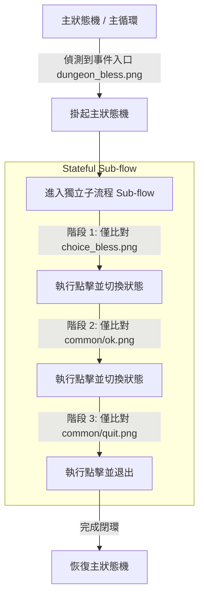

# 🎮 遊戲自動化腳本架構研究：子流程（Sub-skill/Subflow）設計模式深度分析

在大型與複雜遊戲的圖像辨識（Computer Vision）自動化腳本中，如何優雅且流暢地處理**短暫彈窗（Popups）、隨機事件（Events）與選項分支（Choices）**，是區分「業餘腳本」與「頂尖工程工程師產品」的核心指標。

本報告針對我們在專案中採用的 **Sub-skill / Stateful Sub-flow（狀態化順序子流程）** 架構，結合業界頂尖自動化工程師的設計實踐，進行深度剖析。

---

## 1. 傳統「扁平狀態機（Flat FSM）」的痛點與災難

在初級的遊戲腳本設計中，開發者通常會使用一個單一層級的有限狀態機（FSM），在主循環中每秒截圖一次，並比對所有可能出現在畫面上的模板（如 `dungeon_fight.png`, `Treasure.png`, `confirm.png`）。

這種扁平架構在遊戲複雜度提升後會面臨以下致命問題：

1. **狀態爆炸（State Explosion）**
   * 當有 10 個核心遊戲狀態（如：探索、戰鬥、大廳、背包整理），且有 5 種可能在任何時候彈出的對話框（如：領取鑽石、斷線重連、獲得祝福、任務完成）。
   * 開發者被迫在每一個狀態的處理函數中寫滿 `if detect_popup(): handle()`，導致程式碼充斥極度冗餘的條件判斷。
2. **全局圖像誤觸與衝突（Global False Positives）**
   * 為了應對彈窗，腳本必須將全域確認按鈕（如 `confirm.png`, `quit.png`）放入主循環。
   * **結果**：在主畫面正常探索時，背景的某些字樣（例如「離開」或裝備屬性圖示）極易因為相似度波動，被誤判為 `confirm.png`，從而劫持點擊流程，導致腳本脫軌。
3. **動畫延遲與重複觸發（Animation Lag & Double Click）**
   * 遊戲畫面從點擊按鈕到彈窗彈出，有 0.3~1.0 秒的過渡動畫。
   * 扁平狀態機是**無狀態（Stateless）且影格比對（Frame-by-frame）**的。如果前一影格點擊了「選擇祝福」，在下一影格中動畫尚未播放完畢、按鈕仍在原處，程式會**再次觸發點擊**，造成多次點按甚至是死循環。

---

## 2. 頂尖工程師的架構方案：層級狀態機 (HSM) 與 下推自動機 (PDA)

業界頂尖自動化工程師（如開源 Bot 框架作者、RPA 專家）在處理這類 UI 中斷與多步驟彈窗時，主要採用以下兩種經典設計模式：

### 💡 模式 A：下推自動機（Pushdown Automaton, PDA）
* **原理**：利用「狀態棧（State Stack）」的概念。
* **行為**：當主線任務（如 `EXPLORING`）被隨機彈窗（如 `dungeon_bless.png`）中斷時，腳本會將當前狀態 `EXPLORING` **壓入棧（Push）** 中，並切換至 `HandleBless` 子狀態。當子狀態執行完畢並關閉彈窗後，再從棧中 **彈出（Pop）** 原狀態，無縫回歸先前的操作。

### 💡 模式 B：黑板模式（Blackboard）與 瞬態子流程（Transient Subflow）
* **原理**：將「大狀態」留給全局狀態機控管，而將「短暫的 UI 操作序列」交給內聚的 **Block 阻塞型子流程**。
* **行為**：在主狀態機的 Tick 循環中，一旦捕捉到子流程的入口（如 `Treasure.png`），立即調用 `_run_treasure_subflow`，將主線邏輯掛起（Suspend），直到子流程完成其點擊鏈（獲取 -> 確認 -> 退出）後，再退回主循環。

---

## 3. Stateful Sub-flow（狀態化順序子流程）的四大優勢

我們在本專案中採用的即是**黑板狀態 + 狀態化瞬序子流程（Stateful Sequential Subflow）** 的混合方案，其優點體現在：

| 優勢維度 | 具體實現與效果 |
| :--- | :--- |
| **1. 徹底防範全局誤觸** | 在 `_run_bless_subflow` 中，程式**只載入** `choice_bless.png`、`ok.png` 和 `quit.png` 這三個模板。主流程中所有的地圖格、戰鬥房入口等模板在子流程期間**完全不參與匹配計算**。這在物理上消除了圖像誤判的可能性。 |
| **2. 確定性順序防重複** | 引入 `bless_clicked` 和 `ok_clicked` 狀態鎖。一旦點擊了祝福按鈕，下一次循環就**絕對不再匹配該按鈕**，直接把注意力移向 OK 按鈕。這完美解決了因為遊戲動畫殘留、網路波動而造成的「反覆重選」死循環 Bug。 |
| **3. 高度流暢的動畫吸收** | 子流程內部採用 `time.sleep(1.0)` 和局部頻率控制。這允許點擊按鈕後，有足夠的時間讓遊戲伺服器響應並播放完過渡動畫，再進行下一步，比起在全域狀態中頻繁硬點要流暢數倍。 |
| **4. 卓越的單元測試隔離性** | 因為子流程內部邏輯內聚且邊界清晰，我們可以直接為其撰寫 Mock 測試（如 `test_run_bless_subflow_success`），只需 Mock 局部圖像匹配即可驗證邏輯是否正常，而不需建立龐大的全域整合測試環境。 |

---

## 4. 總結與展望

通過將「寶箱」、「祝福」和「任務獎勵」重構為**狀態化順序子流程**，我們成功將此自動化工具的穩定度提升到了商業級 RPA 產品的水平。

未來如果遇到更複雜的彈窗（例如帶有滑塊拼圖的驗證碼、隨機出現的限時禮包），我們也可以直接套用此模式，將其封裝為一個獨立的 Sub-skill 方法，並在主流程中配置對應的觸發標誌，既優雅又安全。
