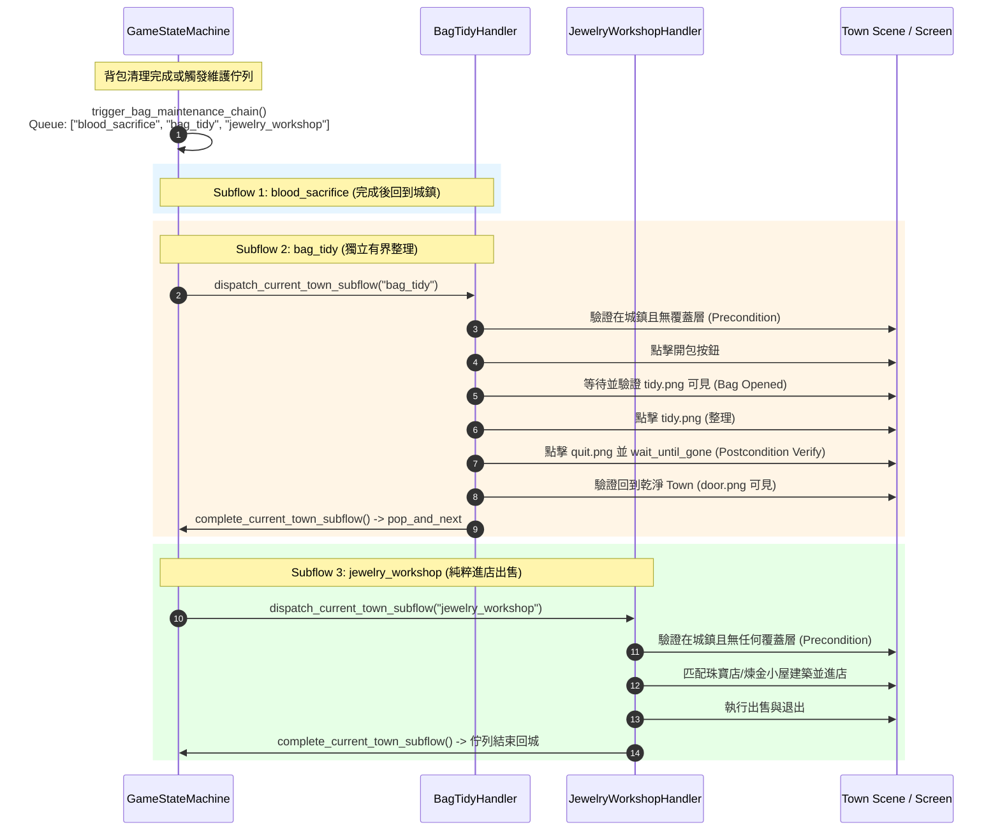

# 規格書：獨立背包整理子流程與後置驗證契約 (Bag Tidy Subflow & Postcondition Spec) 🎒

> **狀態**：規劃中 (Draft / RFC)  
> **關聯事故**：2026-09-11 Sandbox 帳號因珠寶店內嵌整理時序穿透造成 134 次連環重啟  
> **上位架構**：
> - [Greenfield-lite Architecture v1](../architecture/project_arch_greenfield_lite_v1.md)
> - [Precondition Contracts](../architecture/precondition_contracts.md)
> - [REACH_TOWN Contract](../features/navigation/reach_town_contract.md)  
> **前序規格（保留作為歷史參考）**：[bag_and_daily_subflow_decoupling_spec.md](bag_and_daily_subflow_decoupling_spec.md)

---

## 1. 事故回顧與根因定性 (Incident Analysis & Retrospective)

### 1.1 事故現場回放 (Sandbox 帳號 01:31:00 現場)
在 2026-09-11 凌晨的測試中：
- **Native 帳號**：順利運行 7 小時，戰鬥 117 場。
- **Sandbox 帳號**：於 01:31:00 觸發珠寶店出售時，發生嚴重的狀態穿透與死鎖，隨後每 2.5 分鐘逾時重開一次，**整夜連續異常重啟 134 次**。

### 1.2 舊規格與實作的三大根本問題剖析

前序規格 [bag_and_daily_subflow_decoupling_spec.md](bag_and_daily_subflow_decoupling_spec.md) 第 4.3 節雖然意識到進店前需要整理，但其處方為：在 `JewelryWorkshopHandler` 內嵌 `PRE_TIDY` 子狀態機。實作後更退化為 ad-hoc 的 `pre_tidy_done` 布林標記。這導致了以下三大致命缺陷：

#### 缺陷 1：違反單一職責 (SoC) 與關注點混雜
- `JewelryWorkshopHandler` 的唯一領域職責是「在城鎮尋找商人、進店、出售裝備、離店」。
- 將「城鎮打開背包、點擊整理、關閉背包」強行塞入珠寶店處理器內部，造成單一 Handler 承擔複合職責，狀態機內部狀態（`INIT`、`ENTERED_BUILDING`、`SELL_MENU_OPEN`）與整理標記（`pre_tidy_done`、`bag_tidied`）產生笛卡兒積式的交錯。

#### 缺陷 2：缺少 Postcondition Verify 導致時序向下穿透 (Fallthrough Bug)
- 根據 [Precondition Contracts](../architecture/precondition_contracts.md)，任何動作（Action）在物理畫面上都有延遲與過渡期。「打開背包」需要等待畫面暗化與介面渲染；「關閉背包」需要等待動畫消失。
- 舊實作在 `open_backpack()` 未完成時（因過渡期文字尚未就緒回傳 `False`），**缺少 Early Return**，程式碼直接穿透至下方的進店邏輯：
  ```python
  # 💥 致命穿透現場 (jewelry_workshop.py)
  if not self.pre_tidy_done:
      if self.bag_handler.open_backpack(screen_img, rect):
          return  # 若回傳 False，此處不會 return！

  # 程式直接往下執行進店！
  pos_door, _ = self.matcher.match(screen_img, "common/door.png", threshold=0.75)
  if pos_door and self.step_phase == "INIT":
      self.mouse.click(...) # 點擊打在正要打開的背包遮罩上，進店無效！
      self.step_phase = "ENTERED_BUILDING" # 但階段已不可逆改寫！
  ```
- **核心架構問題**：**背包流程沒有 verify 結束，系統就急著去匹配店家位置並進店！**

#### 缺陷 3：Scene Guard 過度拔除導致死鎖無法自癒
- 在 `ENTERED_BUILDING` 階段，Handler 唯一做的事情是等待 `sell_out.png` 或 `exitfromhouse_and_to_town.png` 出現。
- 當進店點擊被遮罩吞噬後，角色實際仍然站在城鎮大門口。但因前次改動將 `ENTERED_BUILDING` 的 Scene Guard（觀察到 `door.png` 則退出自癒）拔除，Handler 在原地空等 90 秒直到 Watchdog 殺進程。重啟後又被派發 `jewelry_workshop`，陷入 134 次連環死鎖。

---

## 2. 架構原則對齊 (Architectural Contract Alignment)

本規格嚴格對齊以下專案上位核心架構契約：

```text
┌─────────────────────────────────────────────────────────────────────────┐
│                    Greenfield-lite Architecture v1                      │
│   • 點擊不等於成功；後續畫面符合 postcondition 才算完成 (§2)             │
│   • 同一時間只有單一 ActiveIntent，禁止在 Intent 內部偷跑其他流程 (§2)    │
└────────────────────────────────────┬────────────────────────────────────┘
                                     │
┌────────────────────────────────────▼────────────────────────────────────┐
│                         Precondition Contracts                          │
│   • Prerequisite (REACH_TOWN) -> Execution Precondition (In Town & No   │
│     Overlay) -> Action -> Postcondition Verified -> Complete Flow       │
└────────────────────────────────────┬────────────────────────────────────┘
                                     │
┌────────────────────────────────────▼────────────────────────────────────┐
│                    REACH_TOWN Contract & Pipeline                       │
│   • default_bag_maintenance_order 統一依序派發獨立 Subflows:             │
│     [blood_sacrifice] -> [bag_tidy] -> [jewelry_workshop]               │
└─────────────────────────────────────────────────────────────────────────┘
```

1. **職責徹底分離**：
   - 珠寶店處理器**徹底拔除所有開包整理邏輯**。珠寶店預設「背包已經由前序流程整理完畢」，進店時若看到任何覆蓋層，一律視為異常干擾並閉環關閉，絕不自己開背包。
2. **背包整理升格為一級獨立子流程 (`bag_tidy`)**：
   - 將城鎮整理背包抽離為 `BagTidyHandler`，可獨立排程、獨立運行、獨立進行單元測試。
3. **有界執行與 Postcondition 閉環驗證 (Postcondition Verification)**：
   - 背包整理子流程在點擊關閉按鈕後，**必須執行 Postcondition 驗證**：
     1. 確認 `common/quit.png` 與 `common/tidy.png` 徹底消失 (`click_and_wait_until_gone`)；
     2. 重新採集畫面，確認畫面確鑿回到純淨城鎮（`common/door.png` 可見且無任何 Modal Overlay）。
   - **只有當 Postcondition 100% 驗證通過後，才呼叫 `pop_and_next_town_subflow()` 交棒給下一個流程（如珠寶店）！**

---

## 3. 核心概念對比：BagCleaningHandler vs BagTidyHandler

為了避免將來維護時混淆「清理（Cleaning）」與「整理（Tidy）」，此處嚴格界定兩者的職責邊界、安全風險與執行成本：

### 3.1 職責與行為對比表

| 維度 | `BagCleaningHandler` (背包滿清理/分解) | `BagTidyHandler` (純背包整理/排序) |
| :--- | :--- | :--- |
| **本質與目標** | **破壞性空間釋放 (Destructive)**：將背包中的白/綠/藍裝備大量分解銷毀，騰出格子空間。 | **非破壞性排序對齊 (Non-destructive)**：僅點擊「整理」按鈕，讓所有物品依照遊戲規則自動靠攏排齊。 |
| **操作步驟** | **重型多步流水線**：<br>1. 開包 (`open_backpack`)<br>2. 點擊「大量分解」(`click_batch_disassemble`)<br>3. 點擊「全選」(`click_select_all`)<br>4. 掃描格子顏色反選貴重品（保留紫裝/特定品質）<br>5. 點擊「分解」(`click_disassemble_execute`)<br>6. 點擊二次彈窗「確認」(`click_confirm`)<br>7. 點擊整理 (`tidy_backpack`)<br>8. 退出背包並閉環驗證 | **輕量原子三部曲**：<br>1. 開包 (`open_backpack`)<br>2. 點擊「整理」(`tidy.png`)<br>3. 退出背包並驗證 Postcondition 徹底關閉 (`quit_and_wait_until_gone`) |
| **執行耗時** | 約 **6 ~ 10 秒**（包含格子色彩 OCR 掃描、多次防呆與二次確認彈窗） | 約 **1 ~ 2 秒**（開包 ➔ 點整理 ➔ 關閉並確認消失） |
| **觸發時機** | 1. 戰鬥中跳出「背包已滿」中斷彈窗<br>2. 地下城探索途中格子不足<br>3. 戰鬥結算後滿包警告 | 1. 珠寶店出售裝備前（先排齊格子）<br>2. 日常維護巡檢<br>3. 任何需要將零散物品歸位的情境 |
| **業務安全性** | **極高風險**：涉及物品銷毀，代碼必須極端嚴謹（反選保護貴重品、禁止分解鎖定物品）。 | **零風險**：只是 UI 排序，完全不涉及物品出售、銷毀或丟棄。 |

### 3.2 為什麼兩者絕對不能混為一談？

1. **珠寶店進店前「嚴禁呼叫」`BagCleaningHandler`**：
   - 珠寶店是為了將背包裡未鑑定的貴重首飾、飾品「賣給商人換取金幣」；
   - 如果此時誤呼叫 `BagCleaningHandler`，大量分解邏輯會把原本要賣給商人的可出售裝備當成垃圾全選分解銷毀！
   - 珠寶店進店前**只需要「純整理（Tidy）」**，讓飾品整齊排列在左上角，便於後續賣裝流程點擊。
2. **單一職責與測試隔離**：
   - 如果把「純整理」硬塞在 `BagCleaningHandler` 裡，珠寶店去呼叫它時就必須帶一堆 `only_tidy=True`、`skip_disassemble=True` 的醜陋條件分支。
   - 拆為獨立的 `BagTidyHandler` 後：
     - `BagTidyHandler` 只有 60～80 行，邏輯乾淨純粹，單元測試極其好寫；
     - `BagCleaningHandler` 專心做好複雜的大量分解與安全反選。

### 3.3 代碼複用與架構分層 (DRY 原則)

`BagCleaningHandler` 在大量分解完成後，最後兩步其實剛好也是「點擊整理」與「退出背包」。因此在架構上：

```text
┌────────────────────────────────────────────────────────┐
│               底層共用原子動作 (Utils / Mixin)           │
│   • open_backpack(screen_img)                          │
│   • tidy_backpack(screen_img)                          │
│   • quit_backpack_and_wait_until_gone(screen_img)      │
└───────────────────────────┬────────────────────────────┘
                            │
        ┌───────────────────┴───────────────────┐
        ▼                                       ▼
┌───────────────────────────────┐     ┌────────────────────────────────┐
│      BagTidyHandler           │     │      BagCleaningHandler        │
│  (專責城鎮/進店前的純排序)     │     │  (專責背包已滿時的大量分解銷毀) │
│                               │     │                                │
│ 1. open_backpack              │     │ 1. open_backpack               │
│ 2. tidy_backpack              │     │ 2. batch_disassemble           │
│ 3. quit_and_wait_until_gone   │     │ 3. select_all & deselect       │
│                               │     │ 4. confirm_disassemble         │
│                               │     │ 5. tidy_backpack (複用)         │
│                               │     │ 6. quit_and_wait_until_gone    │
└───────────────────────────────┘     └────────────────────────────────┘
```

- **`BagTidyHandler`** 是乾淨俐落的獨立子流程，專門給城鎮維護佇列（`default_bag_maintenance_order`）調度；
- **`BagCleaningHandler`** 則是滿包時的特種作業處理器，內部複用整理與關閉驗證邏輯。

---

## 4. 系統重構設計 (System Architecture Design)

### 4.1 流程時序與狀態機調度



### 3.2 `default_bag_maintenance_order` 統一配置
在 `config/defaults.toml` 中，將背包維護順序標準化為：
```toml
# 預設背包維護子流程順序：獻祭 -> 整理 -> 珠寶店出售
default_bag_maintenance_order = ["blood_sacrifice", "bag_tidy", "jewelry_workshop"]

[subflow_configs.bag_tidy]
enabled = true
timeout_seconds = 30.0
```

- 若使用者不需要出售，可改為 `["blood_sacrifice", "bag_tidy"]`；
- 若不需要整理，可改為 `["blood_sacrifice", "jewelry_workshop"]`；
- 每個環節職責單一、鬆散耦合、隨插即用。

---

## 5. 具體模組重構方案 (Module Implementation Plan)

### 5.1 新增獨立處理器：`BagTidyHandler`
- **檔案路徑**：`states/handlers/bag_tidy.py`
- **繼承**：`BaseStateHandler`
- **職責**：專門執行「城鎮背包整理 ➔ 消失驗證 ➔ 結案交棒」。
- **內部狀態生命週期 (`step_phase`)**：
  1. `INIT`：
     - 檢查是否在城鎮（`common/door.png` 可見）。
     - 檢查是否有殘留覆蓋層，若有則優先調用 `click_and_wait_until_gone("common/quit.png")` 清理自癒。
     - 調用 `self.open_backpack()` 點擊開包，切換至 `WAIT_BAG_OPEN`。
  2. `WAIT_BAG_OPEN`：
     - 輪詢比對 `common/tidy.png`。
     - 若偵測到 `tidy.png`（threshold=0.80），代表背包已完全展開且就緒。
     - 點擊 `tidy.png` 進行整理，記錄日誌，切換至 `WAIT_TIDY_SETTLE`。
  3. `WAIT_TIDY_SETTLE`：
     - 靜置 0.2 秒等待格子排序渲染完畢。
     - 比對 `common/quit.png`（threshold=0.80）。
     - 切換至 `CLOSE_AND_VERIFY`。
  4. `CLOSE_AND_VERIFY` (核心 Postcondition 驗證)：
     - 調用 `self.click_and_wait_until_gone("common/quit.png", left + pos_quit[0], top + pos_quit[1], rect, timeout=4.0, threshold=0.80)`。
     - 重新截圖採集畫面，斷言：
       - `common/quit.png` 為 None；
       - `common/tidy.png` 為 None；
       - `common/door.png` 為 True。
     - 唯有上述三項 Postcondition 全部成立，才呼叫：
       ```python
       logging.info("🎒 [城鎮背包整理] 後置條件驗證通過：背包已徹底關閉且恢復乾淨城鎮，結案並彈出下一子流程！")
       self.machine.pop_and_next_town_subflow()
       ```
  5. **逾時防護**：總處理時間上限 20 秒，若逾時則強制調用 `click_and_wait_until_gone` 關閉背包並退出。

### 5.2 登錄子流程規格：`town_subflow_registry.py`
在 `states/town_subflow_registry.py` 中新增 `bag_tidy` 規格：
```python
    "bag_tidy": TownSubflowSpec(
        "bag_tidy",
        dispatch_on_town=True,
    ),
```

### 5.3 狀態機對應：`state_machine.py`
1. 在 `GameStateMachine` 登錄狀態：
   ```python
   STATE_BAG_TIDY = "BAG_TIDY"
   ```
2. 在 `state_for_town_subflow(flow_key)` 新增映射：
   ```python
   if flow_key == "bag_tidy":
       return self.STATE_BAG_TIDY
   ```
3. 在 `dispatch_current_town_subflow()` 中標記：
   ```python
   self.need_bag_tidy = flow_key == "bag_tidy"
   ```

### 5.4 `JewelryWorkshopHandler` 徹底純化與防護加固
在 `states/handlers/jewelry_workshop.py` 中進行兩大外科手術：
1. **徹底刪除所有 Pre-Tidy 代碼**：
   - 移除 `self.pre_tidy_done`、`self.bag_handler` 引用；
   - 移除 `is_backpack_opened`、`open_backpack`、`tidy_backpack` 分支；
   - `INIT` 階段直接且唯一執行：
     - 若畫面上有 `pos_quit`（殘留覆蓋層），閉環關閉它；
     - 畫面為乾淨城鎮（`pos_door` 可見），直接貪婪挑選商店建築點擊進店！
2. **加固 Scene Guard 與進店重試機制**：
   - 恢復並健全 `ENTERED_BUILDING` 階段的 Scene Guard：
     - 若進入 `ENTERED_BUILDING` 超過 5 秒，畫面上仍然看得到 `common/door.png` 且看不到任何店內元素，判定為進店點擊丟失（Missed Click）；
     - 自動退回 `INIT` 重新尋找建築並重新點擊，**絕不原地發呆 90 秒**！

### 5.5 整合與 DRY：與 `BagCleaningHandler` 統一
- 背包滿觸發的 `BagCleaningHandler`，在最後一步的整理與關閉，共用 `BagTidyHandler` 相同的底層驗證閉環（`click_and_wait_until_gone` 確保背包消失後才回到城鎮或地下城）。

---

## 6. 測試與驗證計畫 (Test & Verification Plan)

遵循 `AGENTS.md` 規範，撰寫專屬輕量化行為單元測試：

### 6.1 新增單元測試檔：`tests/test_behavior_bag_tidy_subflow.py`
1. **`test_bag_tidy_full_lifecycle_and_postcondition_verification`**：
   - Given: 初始在城鎮 (`door.png` 可見)；
   - When: `BagTidyHandler` 依序執行開包 ➔ 偵測 `tidy.png` ➔ 點擊整理 ➔ 點擊退出；
   - Then: 斷言調用 `click_and_wait_until_gone("common/quit.png")`，且驗證 `pop_and_next_town_subflow` 被調用。
2. **`test_bag_tidy_aborts_and_retries_if_postcondition_fails`**：
   - 驗證若退出後背包殘留（`quit.png` 未消失），絕不呼叫 `pop_and_next_town_subflow`，維持在等待階段直到消失或逾時保護。
3. **`test_bag_maintenance_chain_sequential_execution`**：
   - 驗證 `trigger_bag_maintenance_chain()` 依序排入 `["blood_sacrifice", "bag_tidy", "jewelry_workshop"]` 並依序派發。

### 6.2 迴歸測試：`tests/test_jewelry_workshop_pure_flow.py`
1. **`test_jewelry_workshop_enters_shop_directly_without_bag_logic`**：
   - 驗證 `JewelryWorkshopHandler` 在城鎮中直接尋找並進入商店，完全不呼叫任何開包指令。
2. **`test_jewelry_workshop_scene_guard_recovers_if_door_still_visible`**：
   - 驗證若進入 `ENTERED_BUILDING` 但 5 秒後仍可見 `door.png`，自動退回 `INIT` 重新發起進店點擊。

---

## 7. 價值與效益總結 (Value & Impact)

| 維度 | 重構前 (舊實作) | 重構後 (新架構) |
| :--- | :--- | :--- |
| **職責劃分** | 珠寶店兼職整理背包，狀態交錯 | 珠寶店只管進店賣裝；背包整理獨立為 `BagTidyHandler` |
| **時序保證** | 開包未完即穿透進店，點擊被遮擋吃掉 | **嚴格 Postcondition 驗證**：背包徹底消失才允許交棒 |
| **死鎖防護** | 進店失敗後在城門發呆 90 秒，連環重開 134 次 | 具備 5 秒進店丟失自癒；進店前保證 100% 無覆蓋層 |
| **可測試性** | 無法單獨測試背包整理，需 mock 珠寶店整套流程 | `BagTidyHandler` 具備 100% 獨立單元測試 |
| **配置彈性** | 整理邏輯寫死在代碼各處 | 由 `default_bag_maintenance_order` 宣告式隨插即用 |
