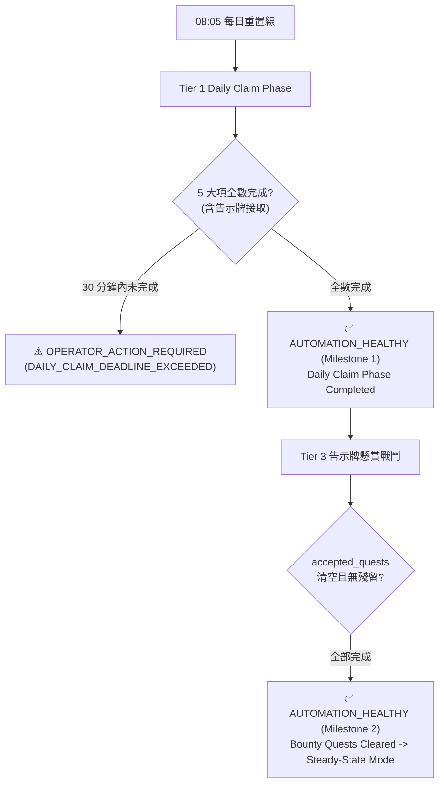

# Feature Spec: Daily Status Notifier (feat-daily-status-notifier) 📢

## 一、 自動化責任與通知契約 (Automation Responsibility Contract)

本規格並非流水帳日誌推送，而是建立系統邊界與操作員之間的責任契約：

> **「早上我不打開遠端、不看遊戲，也能相信腳本自己處理；只有真的需要我介入時才打擾我。」**

### 通知語意契約 (Notification Semantics)
1. **靜默代表自動化持續負責 (Silence means automation is still responsible)**：
   腳本在正常巡航、遇可自癒之輕微異常（單次逾時、自動彈窗排除、正常體力退避）時，一律保持靜默，不發送任何通知。
2. **通知代表責任移交操作員 (A notification indicates an operator handoff)**：
   系統發送的通知嚴格分為兩類，絕無模糊空間：
   - **里程碑通報 (`Milestone Notification` / `AUTOMATION_HEALTHY`)**：特定業務階段達成，宣告自動化進度無虞，目前無需操作員介入 (`NO_ACTION_REQUIRED`)。
   - **人工介入求救 (`Operator Action Required` / `OPERATOR_ACTION_REQUIRED`)**：自動化已耗盡既定恢復政策 (`Recovery Policy`)，發生不可恢復故障 (`Unrecoverable Failure`)，必須由操作員接管遠端。

---

## 二、 通報策略：策略 A（雙階段里程碑通報 / Two-Phase Milestone Notifications）

採用雙階段里程碑設計，兼顧早晨起跑進度確認與終局責任交割 (`Completion Handoff`)：



### 里程碑 1：Daily Claim Phase 與告示牌任務接取完成 (`EVENT_DAILY_CLAIM_PHASE_COMPLETED`)
* **觸發時機**：每日 08:05 重置後，Tier 1 5 個子流程全數完成（[`DailyManager.status["subflows"]`](../../utils/daily_manager.py) 中 `chest`、`hero_draw`、`blood_altar`、`jewelry_workshop`、`bulletin_board` 的 `completed_today == True`）。
* **告示牌完成之嚴謹定義**：
  - 任務已成功在告示牌內完成掃描、比對與點擊接受，寫入 `accepted_quests` 存檔。
  - 退出至城鎮後，經 `detect_building_with_red_dot` 確認告示牌建築物下方之驚嘆號/紅點已消除。
  - **任務本身此時尚未開打，先接到即算完成，不算卡死**。
* **通知訊息內容範例**：
  ```text
  ✅ [AUTOMATION_HEALTHY] Daily Claim Phase 完成，懸賞任務已全數接取
  • 時間: 08:14
  • 速領項目: 寶箱(✓) 酒館(✓) 祭壇(✓) 商店(✓)
  • 已接懸賞 (5項): 破除森林的枷鎖、清除蛤蟆、討伐惡魔、擊敗冰元素、消滅幼蟲
  • 後續動作: 狀態機已接管，依優先序依序討伐中。
  ```

### 里程碑 2：告示牌懸賞任務清空並切換至 Tier 4 (`EVENT_BOUNTY_QUESTS_CLEARED`)
* **觸發時機**：[`QuestScheduler.is_all_completed()`](../../utils/quest_scheduler.py) 成立，`accepted_quests` 列表中所有項目均已討伐完成並移除，狀態機解除懸賞排程器，正式轉入 Tier 4（Transition to Tier 4 Steady-State Mode / Fallback Mode，如關卡刷怪、領地探索或體力耗盡進入 `collect_only` 待機）。
* **通知訊息內容範例**：
  ```text
  🎉 [AUTOMATION_HEALTHY] 告示牌任務全數清空，早晨日常 Completed！
  • 時間: 08:42
  • 懸賞成果: 5/5 項任務已全部討伐完成
  • 當前狀態: 已轉入 Tier 4 Steady-State Mode
  • 自動化責任交割完成 (Completion Handoff)，無需手動介入。
  ```

### 冪等性防重複規則 (Idempotency)
每個日曆天（依據 `DailyManager.status["last_daily_reset_date"]`）的里程碑 1 與里程碑 2 **各自僅允許發送一次**。即使 Child Bot 中途重啟，重新載入狀態後亦嚴禁重複推送已完成之里程碑。

---

## 三、 異常警報判定機制：恢復政策耗盡之不可恢復故障 (`OPERATOR_ACTION_REQUIRED`)

警報必須精確，嚴禁虛警報。僅當符合以下兩項硬性阻斷條件時，立即發送 `OPERATOR_ACTION_REQUIRED`：

### 規則 1：Supervisor 連續崩潰 / 重啟超限 (`SUPERVISOR_CRASH_LOOP_EXCEEDED`)
* **配置統一收攏 ([config/defaults.toml](../../config/defaults.toml))**：
  於 `config/defaults.toml` 新增看守者配置區塊：
  ```toml
  [supervisor]
  watchdog_timeout = 90.0        # 心跳逾時門檻 (秒)
  relaunch_buffer_seconds = 30.0 # 重啟後遊戲載入與狀態辨識緩衝 (秒)
  max_restarts = 5               # 滑動窗口內允許之最大重啟次數
  ```
* **滑動觀測窗口公式**：
  - 單次重啟可再次觀測遊戲之週期：
    $$T_{\text{relaunch}} = \text{watchdog\_timeout} + \text{relaunch\_buffer\_seconds} = 90.0 + 30.0 = 120.0 \text{ 秒}$$
  - 滑動觀測窗口時長：
    $$T_{\text{window}} = T_{\text{relaunch}} \times \text{max\_restarts} = 120.0 \times 5 = 600.0 \text{ 秒} = 10.0 \text{ 分鐘}$$
* **觸發條件**：
  在 $T_{\text{window}}$（10.0 分鐘）時間範圍內，[`Supervisor`](../../runtime/supervisor.py) 對 Child Bot 發起的非手動重啟次數（crash、heartbeat stale、unexpected exit）累計超過 `max_restarts`（預設 5 次），判定外部重啟無法自癒恢復。
* **Supervisor 成功修復定義（重置計數與窗口的標準）**：
  當 Child Bot 重啟後，**連續維持有效 Heartbeat 心跳達到 $T_{\text{relaunch}}$（即 $90\text{s} + 30\text{s} = 120\text{s}$），且向 Heartbeat 回報之狀態屬於有效業務狀態（如非 `UNKNOWN`、非 `POPUP_RECOVERY`，已進入 `NAVIGATING`、`BATTLE`、`COLLECT_ONLY` 等）**，Supervisor 即判定本次重啟修復成功，將重啟次數累計清零並重置窗口。
* **警報內容範例**：
  ```text
  🚨 [OPERATOR_ACTION_REQUIRED] Supervisor 連續重啟超限！
  • 警報代碼: SUPERVISOR_CRASH_LOOP_EXCEEDED
  • 狀態: 在 10.0 分鐘內已連續重啟 5 次，仍無法恢復遊戲運行。
  • 最後終止原因: heartbeat_stale (NAVIGATING 逾時)
  • 請連線遠端查看遊戲與進程狀態。
  ```

### 規則 2：關鍵路徑超時卡死 (`DAILY_CLAIM_DEADLINE_EXCEEDED`)
* **觸發條件**：
  08:05 跨日重置後，若時間已超過 **30 分鐘**（即到達 **08:35**），Tier 1 5 大速領項目（`chest`、`hero_draw`、`blood_altar`、`jewelry_workshop`、`bulletin_board`）中，仍有任一項目之 `completed_today == False`（且未被配置顯式停用）。
* **判定語意**：
  正常情況下 Daily Claim Phase 在 5~10 分鐘內必定完成。若超過 30 分鐘仍未全部完成，代表腳本卡在未知的阻塞（如未識別的全螢幕活動強制彈窗、登入反覆失敗、或建築點擊未如期觸發），立即升級發報。
* **警報內容範例**：
  ```text
  🚨 [OPERATOR_ACTION_REQUIRED] Daily Claim Phase 超時卡死！
  • 警報代碼: DAILY_CLAIM_DEADLINE_EXCEEDED
  • 狀態: 08:05 重置後超過 30 分鐘仍未完成所有速領項目。
  • 未完成子流程: bulletin_board (告示牌尚未成功接取)
  • 當前狀態機狀態: POPUP_RECOVERY
  • 請連線遠端檢查是否有未知彈窗阻擋。
  ```

---

## 四、 延後處理的潛在風險清單 (Deferred Risk Backlog)

下列項目暫不阻礙第一階段通訊骨架與核心契約之建立，列為後續強化子項目：

1. **地下城冷卻停滯與 Tier 4 插隊調度 (Dungeon Cooldown Stalling)**：
   若所接懸賞任務依賴特定地下城，而該地下城尚在冷卻中，狀態機會先退守 Tier 4。需確保在冷卻結束時能由 `ResultHandler` 順暢插隊切回 Tier 3，不被誤判為停滯。
2. **懸賞執行途中體力耗盡退避 (Stamina Retreat in Collect-Only)**：
   若懸賞任務尚未清空但麵包歸零，狀態機會轉入 `STATE_COLLECT_ONLY` 等待體力自然恢復或定時領取。此情況屬預期內生理待機，後續可擴充於 Milestone 1 附加「麵包偏低，預期可能觸發體力退避」之提示。
3. **告示牌任務已滿彈窗處理 (Task Already Full Handling)**：
   若帳號身上既有歷史任務未解導致告示牌彈出 `task_already_full.png`，目前邏輯會直接退出。需防範因任務滿額未能接滿 5 項時，外部紅點檢查可能反覆退避之邊界狀況。
4. **商店與祭壇之網路重試延遲 (Network & Dialogue Delay)**：
   部分商店造訪或祭壇獻祭偶遇伺服器結算延遲，後續可針對單一子流程加入有界超時以防止長時間拖延。

---

## 五、 系統架構與事件所有權 (Architecture & Event Ownership)

```text
[ Process-Internal: Bot Child ]
DailyManager / StateMachine
       │
       ▼ (Milestone 1 & 2 Events)
 NotificationPort ──────────┐
       ▲                    │
       │ (Crash Loop Events)│
[ Process-External: Supervisor ]    ▼
                           DiscordWebhookAdapter
                                    │ (Outbound HTTP POST)
                                    ▼
                             Discord Channel (iPhone)
```

1. **六角架構與職責邊界 (Hexagonal Architecture)**：
   - 建立抽象介面 `NotificationPort`，僅提供 `notify_milestone(event)` 與 `notify_alarm(event)`。
   - 業務核心（`state_machine`、`daily_manager`、`supervisor`）只依賴抽象埠，不直接引用任何第三方 HTTP 庫或通訊協定。
   - `DiscordWebhookAdapter` 負責將領域事件轉換為 Discord Embed 訊息。未來若更換為 Telegram 或 LINE，僅需新增 Adapter，核心業務零改動。
2. **事件所有權劃分 (Event Ownership by Process Boundary)**：
   - **Process-Internal (Bot Child)**：負責業務成功事件（里程碑 1、里程碑 2）。
   - **Process-External (Supervisor)**：負責看守進程生命週期。當 Bot 進程崩潰、無心跳或連續重啟超限時，由 Supervisor 直接發送 `OPERATOR_ACTION_REQUIRED`。
3. **非同步與超時保護 (Non-blocking & Timeout)**：
   - 所有 Webhook 請求強制設定 `timeout = 3.0` 秒，並於獨立背景執行緒發送。
   - 網路異常、DNS 解析失敗或 Discord 伺服器錯誤時，僅記錄 `logging.warning`，**絕不反向阻礙遊戲畫面處理或主迴圈調度**。
4. **憑證與隱私安全**：
   - Webhook URL 統一自環境變數 `DISCORD_WEBHOOK_URL` 或未被 Git 追蹤的本地設定讀取，嚴禁寫入任何追蹤之設定檔或腳本中。
