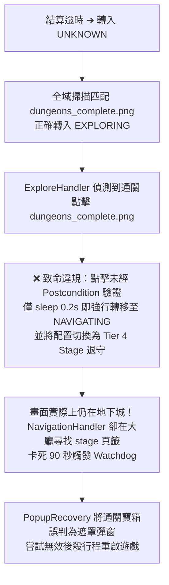

# Bug Specification: 地下城通關狀態早產與大廳導航迷航 (Navigation Dungeon Status Bug) 🐛

> **狀態**：規劃中 (Drafting / Under Review)  
> **上位架構**：[Greenfield-lite Architecture v1](../architecture/project_arch_greenfield_lite_v1.md)  
> **條件語意**：[Precondition Contracts](../architecture/precondition_contracts.md)  
> **關聯契約**：[REACH_TOWN Contract](../features/navigation/reach_town_contract.md) | [Lobby Scene Contract](../features/navigation/lobby_scene_contract.md)  
> **核心模組**：[`states/handlers/explore.py`](../../states/handlers/explore.py) | [`utils/scene_detector.py`](../../utils/scene_detector.py) | [`states/handlers/navigation.py`](../../states/handlers/navigation.py)  

---

## 1. 問題現象與日誌時間軸 (Incident Timeline)

在 2026-09-10 實機掛機日誌中，系統於地下城 Boss 戰通關後發生了卡死重啟事件：

```text
2026-09-10 21:28:27 [WARNING] ⚠️ 結算畫面連續 5 次未偵測到任何結算按鈕，重設狀態為 UNKNOWN 進行重新定位。
2026-09-10 21:28:30 [INFO] 成功匹配模板 'dungeons/dungeons_complete.png'！相似度: 1.0000 ➔ 轉移至 EXPLORING
2026-09-10 21:28:31 [INFO] 🎉 偵測到【地下城通關結束】(dungeons/dungeons_complete.png)，點擊退出。
2026-09-10 21:28:32 [INFO] ⏳ [混合模式] 地下城全冷卻！切換至 Tier 4 退守配置 (Stage: 冰凍峽谷)
2026-09-10 21:28:32 [INFO] 🔄 狀態轉移: EXPLORING -> NAVIGATING
2026-09-10 21:28:35 [INFO] [LobbyTabUpgrade] Expected tab 'stage' missed; upgrading to FULL_RELOCALIZE
2026-09-10 21:28:40 [INFO] ⌛ 尋路按鈕已不在畫面上，正在等待畫面載入或大廳開始按鈕出現...
... (卡在 NAVIGATING 狀態 90 秒，畫面上實際仍為地下城通關畫面) ...
2026-09-10 21:30:03 [WARNING] ⚠️ [Watchdog] 狀態 [NAVIGATING] 已卡住逾時 91.3s，轉移至 POPUP_RECOVERY
2026-09-10 21:30:04 [INFO] 🛡️ [PopupRecovery] 啟動意外彈窗處置 | 明暗度: 中央 51.5 / 邊框 33.0 (遮罩: True)
2026-09-10 21:30:13 [ERROR] ❌ [PopupRecovery] 彈窗救援無效，發起 GameRelaunchSubflow 強制 taskkill 重開遊戲！
```



---

## 2. 架構根因分析 (Root Cause Analysis)

1. **探索層「狀態早產」與「點擊假裝完成 (Click != Completion)」**：
   - 參見 [`states/handlers/explore.py:L81-L110`](../../states/handlers/explore.py#L81-L110)。`ExploreHandler` 點擊 `dungeons_complete.png` 後，僅執行 `time.sleep(0.2)`，在**完全沒有檢驗下一幀是否真正離開地下城（無 Postcondition 驗證）**的情況下，直接強制設定 `self.machine.is_in_dungeon = False` 並跳轉 `STATE_NAVIGATING`。
   - 點擊通關寶箱後，遊戲客戶端需要轉場動畫、淡入淡出或二次確認。此時畫面依然留在地下城，但狀態機已被強行切入大廳導航。

2. **退守配置覆蓋導致感知層「被動眼瞎」**：
   - 進入 `NAVIGATING` 時，狀態機因地下城全冷卻切換為 Tier 4 普通關卡退守配置（`config["type"] = "stage"`）。
   - 參見 [`utils/scene_detector.py:L239`](../../utils/scene_detector.py#L239)，`SceneDetector` 設有硬性守護：
     ```python
     if config_type in ["dungeon", "mix"]:
         # 才執行地下城內部特徵檢測
     ```
   - 由於配置被改為 `"stage"`，`SceneDetector` 直接掠過所有地下城特徵檢測，導致客觀的地下城畫面被回報為 `SceneType.UNKNOWN`。

3. **地下城內部特徵漏失 `dungeons_complete.png`**：
   - 即使 `config_type` 為 `"mix"`，`SceneDetector.dungeon_inner_btns` 僅包含 `leave.png`, `dungeon_bless.png`, `Treasure.png`, `gungeon_godown.png`，遺漏了 `dungeons_complete.png`。
   - 這導致 `NavigationHandler` 頂部的自癒機制（`if scene.scene_type == SceneType.IN_DUNGEON: transition_to(EXPLORING)`）無法被觸發，陷入死循環。

---

## 3. 架構契約批判：先前修復建議之越界檢討 (Critique of Naive Fixes)

在初步討論中曾提出若干直覺修復建議，依據本專案規範文件，確認以下方案存在嚴重**架構越界 (Architectural Violations)**，必須堅決摒棄：

### 🚫 越界檢討 1：將 `dungeons_complete.png` 納入 `login_flow.py` 的 ready 特徵清單
- **違反原則**：[Precondition Contracts Section 2 & Section 5](../architecture/precondition_contracts.md#2-統一術語)（關注點分離、Recovery 邊界）。
- **批判**：`login_flow.py` 的唯一責任是「啟動與登入後的 Startup Readiness 裁決（進入 Town 或 Lobby）」。地下城通關寶箱純屬地下城探索領域（Dungeon Domain）的業務元素。將探索業務邏輯滲透至開機啟動流程，屬於嚴重的層級職責污染。日誌中的登入超時純粹是卡死 90 秒誤殺重啟後的次生災害，不可本末倒置。

### 🚫 越界檢討 2：在導航層 `NavigationHandler` 中反向修補地下城通關業務
- **違反原則**：[Precondition Contracts Section 7](../architecture/precondition_contracts.md#7-intent-commitment-與-maintenance-condition)（Maintenance Ownership 不可中斷性）與 [Greenfield-lite Section 4.3.1](../architecture/project_arch_greenfield_lite_v1.md#431-全域活動排程階梯與-tier-優先級契約-activity-tier-hierarchy-contract)（導航層剝離任務選擇）。
- **批判**：地下城通關退出 100% 是 `ExploreHandler` 的領域職責。探索流程在達成 Safe Point（確認返回大廳/城鎮）前，**維護擁有權 (Maintenance Ownership) 絕不能提前釋放**。絕不能放任 `ExploreHandler` 早產甩鍋，然後要求 `NavigationHandler` 替地下城做擦屁股式的業務收尾。

### 🚫 越界檢討 3：感知層 `SceneDetector` 以業務配置 (`config_type`) 遮蔽客觀世界
- **違反原則**：[Lobby Scene Contract Invariant 4](lobby_scene_contract.md#invariant-4純領域契約與單一真相保證-pure-domain--single-truth-invariant) 與 [Precondition Contracts Section 6](../architecture/precondition_contracts.md#6-evidence-與-dispatch-readiness)。
- **批判**：`SceneId` 是客觀物理世界的唯一真實反映。契約明文規定「**不能以 FSM state 或 config type 代替世界 observation**」。感知層僅負責回報看見了什麼 Evidence，決策層才負責如何反應。用 `if config_type in [...]` 來決定是否檢驗地下城，是主觀猜測干預客觀感知的反模式。

---

## 4. 大廳 (Lobby) 的本質定義與低負載感知方法 (Lobby Definition & Scoped Perception)

上位架構文件 [Greenfield-lite Architecture v1 Section 4.2, 4.4](../architecture/project_arch_greenfield_lite_v1.md) 與 [Lobby Scene Contract Section 2, 3](lobby_scene_contract.md) 已對大廳做出精確定義，並確立了**無需每一幀大量比對無關模板**的感知機制：

### 1. 什麼是大廳 (What is Lobby)？
- **拓撲樞紐**：大廳是連接城鎮與 5 大活動選關的專屬中樞（`TOWN ↔ LOBBY`、`LOBBY → STAGE_SELECT / DUNGEON_SELECT / ...`）。
- **正向物理特徵**：
  - **頂部 5 大頁籤列**：普通關卡 (`select_stage`)、地下城 (`dungeon`)、禁域 (`Domains_entry`)、首領 (`Lord_entry`)、魔王 (`demon_lords_entry`)。任一出現即為身處大廳之客觀充分證據。
  - **大廳專屬功能按鈕**：左上方回城按鈕 [`goback_town.png`](../../templates/goback_town.png) 與領麵包按鈕 [`common/bread.png`](../../templates/common/bread.png)。
- **負向排他守護 (Invariant 3)**：
  - **大廳絕無大門 (No-Door in Lobby)**：確認身處大廳（`is_lobby=True`）時，客觀世界絕不可能出現城門，路徑過濾保證剔除 [`common/door.png`](../../templates/common/door.png)。

### 2. 如何不需比對很多的方法 (Low-Overhead Two-Tier Perception)？
根據 [Lobby Scene Contract Invariant 5](lobby_scene_contract.md#invariant-5兩階段感知與預期頁籤最小化保證-two-tier-perception--expected-tab-invariant) 與 Greenfield-lite 低負載排程：
- **極速大廳錨點驗證 (Lobby Presence Fast-Check)**：
  - 僅需單次檢查 `goback_town.png` 或 `common/bread.png`（Matcher 次數 $\le 2$），即可瞬時確認 `is_lobby = True`。
- **穩態預期頁籤最小化 (Tier 1 Fast-Path)**：
  - 當導航目標明確時（由 `resolve_detection_request` 傳入 `expected_tab`），系統**保證僅比對該目標頁籤的一對 active/inactive 模板（Matcher 次數 $\le 2$）**，嚴禁全量掃描 10 模板造成停頓。
  - 只有在 miss 時才升級到 **Tier 2 全局重定位 (`FULL_RELOCALIZE`)** 進行 5 頁籤紅色光環消歧。
- **應用於地下城通關後置條件**：
  - `ExploreHandler` 點擊通關後，驗證離場無需掃描全量模板。只需驗證：
    `dungeons_complete.png` 消失 **AND**（觀測到 `goback_town.png` **OR** `common/door.png`）。
  - 僅需 1~2 次輕量模板比對，即可確鑿驗證完成離場！

---

## 5. `if config_type in ["dungeon", "mix"]:` 的歷史成因與影響調研 (Git Survey & Impact Analysis)

### 1. 歷史出處與當時意圖 (Git Archeology)
- **引入時間**：Commit `20c8232` (2026-07-12) 首次引入 `NavigationHandler`，後於 Commit `ba90389` (2026-07-27) 抽離 `SceneDetector` 時平移沿用。
- **當初為何寫此限制？**：
  1. **算力節流保護 (CPU Throttle Guard)**：在過去未實作 `DetectorRegistry` / Scoped Perception 的年代，地下城內部包含 `leave.png`, `dungeon_bless.png`, `Treasure.png`, `gungeon_godown.png` 等多個模板。為避免普通關卡模式（`type="stage"`）在每一幀都平白多消耗 4~5 次 TemplateMatch，以 `config_type` 作為廉價 Guard。
  2. **防止普通關卡背景雜訊誤命中**：避免普通關卡或大廳介面因類似紋理誤匹配到地下城圖標。

### 2. 當前架構衝突與影響評估
- **衝突點**：當地下城通關全冷卻切入 Tier 4 Stage 退守時，`config["type"]` 被切為 `"stage"`，導致此硬限制觸發，使 `SceneDetector` 被動眼瞎，看不見眼前的地下城通關畫面。
- **直接移除限制的潛在影響**：
  - 普通關卡每幀多做 4~5 次 TemplateMatch，推高 CPU 負載，違反 Greenfield-lite 24/7 低負載目標。
  - 在大廳或關卡可能引入非預期的地下城模板誤判風險。

### 3. 架構處置策略
- **短期應急（本次修復）**：
  - 核心在於 `ExploreHandler` 落實 Postcondition 閉環（確鑿離場才切換配置，大廳導航絕不會在地下城畫面啟動）。
  - 在 `SceneDetector` 中，將 `dungeons_complete.png` 納入地下城錨點，並在 `config_type == "stage"` 時僅於非 Town 且非明確 Lobby 頁籤的場景下，進行極限防禦性地下城檢測，兼顧 CPU 負載與防禦自癒。
- **長期架構演進**：
  - 記錄於文末 **Future Work**：全面落實 [Greenfield-lite Section 4.2 Scoped Perception (`DetectorRegistry`)](../architecture/project_arch_greenfield_lite_v1.md#42-範圍化感知與低負載排程)，由統一的 Profile 決定每幀允許的 Detector 集合，徹底根除 `utils/scene_detector.py` 內部所有殘留的 `if config_type ...` 特判。

---

## 6. 規範架構修復方案 (Normative Architectural Fix)

本修復遵循「**感知客觀純潔、探索閉環擁有、導航守護邊界**」三大原則：

### 契約 1：`ExploreHandler` 通關退出落實 Postcondition 閉環（核心修復點）
- **職責單元**：[`states/handlers/explore.py`](../../states/handlers/explore.py)
- **規範行為**：
  1. 偵測到 `dungeons/dungeons_complete.png` 時發送點擊。
  2. **嚴禁在點擊當下立即切換狀態至 `STATE_NAVIGATING`，嚴禁立即切換 Tier 4 退守配置**。
  3. 維持探索維護權（Maintenance Ownership），透過下一幀觀察驗證退出後置條件：
     - **情況 A（離開地下城）**：若畫面中 `dungeons_complete.png` 已消失，且偵測到大廳特徵（如 `goback_town.png` / 頁籤）或城鎮大門（`door.png`），確認通關完全閉環。此時方可結算冷卻、切換退守配置並轉移至 `NAVIGATING`（或呼叫 `evaluate_next_activity`）。
     - **情況 B（仍停留在通關畫面）**：若下一幀仍可見 `dungeons_complete.png` 或衍生之確認按鈕，在探索擁有權內安全重試點擊。
     - **情況 C（有界等待逾時）**：若連續多次（如超過 3~5 秒）未能觀察到大廳亦未匹配到任何操作按鈕，安全轉移至 `STATE_UNKNOWN` 交由全域定位仲裁，絕不擅自猜測已回到大廳。

### 契約 2：`SceneDetector` 領域模型純潔化與被動防護
- **職責單元**：[`utils/scene_detector.py`](../../utils/scene_detector.py)
- **規範行為**：
  1. 在地下城特徵清單中納入 `dungeons/dungeons_complete.png`。
  2. 調整地下城檢驗前置守護，在非大廳且非城鎮的不明環境下允許被動檢驗地下城錨點，回報 `SceneType.IN_DUNGEON`。

### 契約 3：`NavigationHandler` 的被動防禦自癒
- **職責單元**：[`states/handlers/navigation.py`](../../states/handlers/navigation.py)
- **規範行為**：
  1. 當 `NavigationHandler` 收到 `scene.scene_type == SceneType.IN_DUNGEON` 時，不執行任何大廳頁籤比對或尋路點擊。
  2. 立即將狀態轉移回 `STATE_DUNGEON_EXPLORING`，將控制權歸還給唯一合法擁有人（`ExploreHandler`）。

---

## 7. 受影響檔案與改動範圍 (Impact Scope)

| 檔案路徑 | 修改性質 | 變更說明 |
| :--- | :--- | :--- |
| [`states/handlers/explore.py`](../../states/handlers/explore.py) | **核心修改** | 實作通關退出 Postcondition 機制，杜絕盲目 sleep(0.2) 與早產轉移。 |
| [`utils/scene_detector.py`](../../utils/scene_detector.py) | **核心修改** | 納入 `dungeons_complete.png` 至地下城內部特徵，解耦/改善 `config_type` 守護。 |
| [`tests/test_explore_subflow.py`](../../tests/test_explore_subflow.py) | **行為測試** | 增加通關後置條件確認與延遲退出的單元測試。 |
| [`tests/test_behavior_navigation.py`](../../tests/test_behavior_navigation.py) | **行為測試** | 驗證身處地下城時導航層能透過 SceneDetector 即時轉回 EXPLORING，不盲目搜尋頁籤。 |
| [`docs/todos/future_work.md`](future_work.md) | **文件追蹤** | 登記 Scoped Perception 遷移與清理 `scene_detector` 中殘留 `config_type`。 |

---

## 8. 活契約驗收標準 (Acceptance Criteria)

- [x] **AC 1 (點擊不等於完成)**：`ExploreHandler` 點擊 `dungeons_complete.png` 後，若下一幀模擬畫面仍為通關畫面，狀態機必須保持在 `EXPLORING`，且不得切換 `config` 或呼叫 `transition_to(NAVIGATING)`。
- [x] **AC 2 (確鑿離場才轉移)**：當且僅當新畫面驗證無通關特徵且出現大廳/大門特徵時，狀態機才標記離場並轉移至 `NAVIGATING`。
- [x] **AC 3 (感知客觀性)**：即使 `machine.config["type"] == "stage"`，當畫面傳入包含 `dungeons_complete.png` 的影像時，`SceneDetector.detect()` 必須精準回傳 `SceneType.IN_DUNGEON`。
- [x] **AC 4 (導航自癒)**：若狀態機處於 `NAVIGATING` 但畫面為地下城特徵，`NavigationHandler` 必須在首幀立刻轉移回 `STATE_DUNGEON_EXPLORING`，嚴禁觸發 `LobbyTabUpgrade` 或等待超時。

---

## 9. 未來優化規劃 (Future Work)

- **[FW-NAV-01] 推進 Scoped Perception (`DetectorRegistry`) 全面遷移，根除 `SceneDetector` 中所有殘留的 `config_type` 硬特判**：
  - **相關檔案與具體位置**：
    - [`utils/scene_detector.py:246-266`](../../utils/scene_detector.py#L246-L266)：步驟 1 主動路徑目前仍以 `is_dungeon_mode = config_type in ["dungeon", "mix"]` 進行硬特判守衛。
    - [`utils/scene_detector.py:301-313`](../../utils/scene_detector.py#L301-L313)：步驟 3.5 過渡期後備感知防禦，在排除城鎮與大廳後執行地下城內部特徵匹配。
  - **架構關鍵洞見**：
    - ⚠️ **「非城鎮且非大廳」絕不代表必然處於地下城**：客觀畫面在此時可能處於戰鬥（BATTLE）、載入中（LOADING）、戰鬥結算（RESULT）、各類獨立玩法（Domain/Lord Boss）或各種彈窗（告示牌/祭壇/抽卡/背包清理）。
    - 目前全域 `detect_scene` 在排除城鎮與大廳後檢測地下城，僅是過渡期的防衛性補救；若長期讓全域盲目輪詢地下城模板，會造成不必要的 CPU 消耗與誤匹配風險。
  - **長效重構目標**：
    - 依據 [Greenfield-lite Architecture v1 Section 4.2](../architecture/project_arch_greenfield_lite_v1.md#42-範圍化感知與低負載排程) 落地 `DetectorRegistry`。
    - 全域 `SceneDetector` 嚴格僅負責 `TOWN` 與 `LOBBY` 頂層拓撲第一階段識別；
    - 所有地下城探索與通關特徵比對完全下放至 `ExploreHandler` / `DungeonScope` 專屬的 Scoped Detector，隨狀態生命週期調度，徹底解耦業務配置與全域感知。