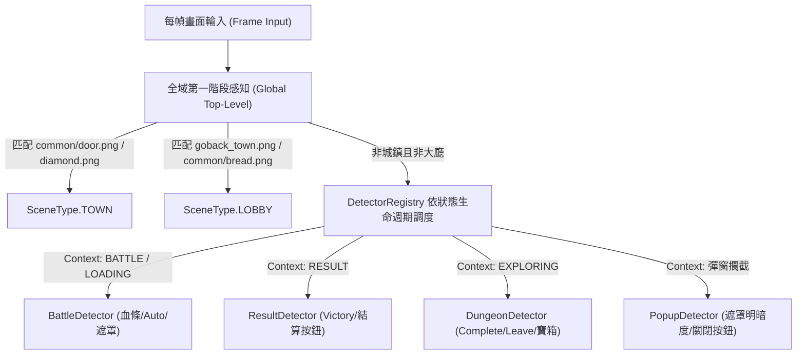

# TODO: 推進 Scoped Perception (DetectorRegistry) 全面遷移規格書 🎯

> **狀態**：規劃中 (Active TODO)  
> **編號**：`[FW-NAV-01]`  
> **上位架構**：[Greenfield-lite Architecture v1 Section 4.2](../architecture/project_arch_greenfield_lite_v1.md#42-範圍化感知與低負載排程)  
> **關聯文件**：[Precondition Contracts](../architecture/precondition_contracts.md) | [Lobby Scene Contract](../features/navigation/lobby_scene_contract.md)  
> **相關核心代碼**：[`utils/scene_detector.py`](../../utils/scene_detector.py) | [`states/state_machine.py`](../../states/state_machine.py)  

---

## 1. 歷史痛點與現狀分析 (Problem Statement)

### 1.1 現狀代碼位置與包袱
在 [`utils/scene_detector.py`](../../utils/scene_detector.py) 中，目前感知層存在對業務配置的強耦合硬特判：
- [`utils/scene_detector.py:246-266`](../../utils/scene_detector.py#L246-L266)：步驟 1 主動路徑仍以 `is_dungeon_mode = config_type in ["dungeon", "mix"]` 進行硬特判守衛。
- [`utils/scene_detector.py:301-313`](../../utils/scene_detector.py#L301-L313)：步驟 3.5 作為排除城鎮與大廳後的過渡期後備防禦，仍在全域輪詢地下城模板。

### 1.2 核心架構衝突 (Architectural Conflict)
1. **「非城鎮且非大廳」絕不代表必然處於地下城**：
   - 客觀遊戲畫面在非城鎮、非大廳時，可能處於：
     - 戰鬥中（`BATTLE`：血條、Auto 按鈕）
     - 戰鬥過場載入中（`LOADING`：黑屏、轉場）
     - 戰鬥結算（`RESULT`：Victory/Defeat、結算按鈕）
     - 領地探索（`DOMAIN`）、首領討伐（`LORD_BOSS`）、魔王討伐（`DEMON_LORDS`）
     - 各類獨立彈窗（告示牌懸賞選單、血之祭壇、珠寶加工廠、抽卡介面、幸運輪盤、背包清理確認彈窗等）
   - 若全域 `detect_scene` 在每幀「非城鎮且非大廳」時盲目輪詢 5 個地下城模板，既浪費 CPU 算力（違反 24/7 掛機低負載目標），又存在非地下城介面背景雜訊誤匹配的風險。
2. **以 Config 代替 Observation 違反單一真相保證**：
   - 當系統因地下城全冷卻切入退守配置（`config["type"] = "stage"`）時，感知層若因 `config_type` 硬特判而拒絕檢測地下城，將導致客觀畫面被主觀設定遮蔽，陷入 `UNKNOWN` 或導航死循環。

---

## 2. 長效架構設計：Scoped Perception (DetectorRegistry)

依據 [Greenfield-lite Architecture v1 Section 4.2](../architecture/project_arch_greenfield_lite_v1.md#42-範圍化感知與低負載排程)，確立以下兩層感知分工：

### 2.1 感知職責嚴格分層
1. **全域第一階段感知 (`GlobalTopLevelDetector`)**：
   - **唯一職責**：極速裁決世界兩大頂層拓撲錨點——**城鎮 (`TOWN`)** 與 **大廳 (`LOBBY`)**。
   - **負載保證**：單幀比對不超過 2 次輕量模板（`goback_town.png` / `door.png`）。
   - **純潔性保證**：全域感知**嚴禁進行任何地下城、關卡、戰鬥、結算等玩法領域細節的模板比對**。
2. **範圍化感知 (`ScopedDetector`)**：
   - 地下城特徵（`dungeons_complete.png`、`leave.png`、`Treasure.png`、`gungeon_godown.png`）完全移出全域，封裝入 `DungeonScopedDetector`。
   - 僅當狀態機處於 `STATE_DUNGEON_EXPLORING` 或與地下城直接關聯的上下文時，由 `DetectorRegistry` 調用。

---

## 3. 重構遷移步驟 (Migration Steps)

- [ ] **Step 1: 建立 `DetectorRegistry` 基礎設施**
  - 定義 `DetectionProfile`（如 `GLOBAL_TOPOLOGY`, `DUNGEON_SCOPE`, `BATTLE_SCOPE`, `RESULT_SCOPE`）。
  - 各 Profile 宣告該生命週期內允許執行的 Detector 集合。
- [ ] **Step 2: 提取 `DungeonScopedDetector`**
  - 將地下城探索與通關特徵自 `SceneDetector` 抽離，下放至 `ExploreHandler` / `DungeonScope`。
- [ ] **Step 3: 徹底移除全域 `SceneDetector` 中的 `config_type` 特判**
  - 清理 `utils/scene_detector.py` 中的步驟 1（`is_dungeon_mode` 區塊）與步驟 3.5（過渡期後備防禦）。
- [ ] **Step 4: 補齊單元測試與效能基準測試**
  - 確保非地下城狀態下地下城模板比對次數為 0。
  - 確保全域幀比對消耗降至最低。
