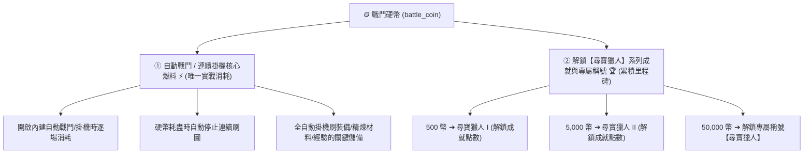

# 🪙 Blackfire Crusade 戰鬥硬幣 (Battle Coin) 全景解析與實戰手冊

> 本文檔依據遊戲實機運作機制與底層數據 `meta_data/raw_tres/meta_datas.tres` 校對，完整記錄「戰鬥硬幣」的核心功能、掛機消耗機制與產出途徑。

---

## 📌 一、貨幣基本定義

* **底層變數 ID (Variable ID)**：`battle_coin`（單一獎勵、背包項目、掉落定義）
* **複數集合鍵 (Plural Key)**：`battle_coins`
* **遊戲繁中名稱**：**戰鬥硬幣 (Battle Coin)**

---

## ⚡ 二、戰鬥硬幣的全部用途 (專一純粹)

在遊戲底層架構中，戰鬥硬幣的定位非常純粹，**僅專注於以下兩大核心用途**：

### 1. 🤖 自動戰鬥與掛機系統 (Auto Battle / Auto Grind) —— 【唯一消耗途徑】
* **掛機機制**：玩家在關卡中開啟自動連續戰鬥/掛機時，每次進入戰鬥會扣除戰鬥硬幣。
* **停止機制**：當戰鬥硬幣耗盡歸零時，連續戰鬥將會自動終止。
* **戰略意義**：長時間掛機刷取精煉材料（如黑暗沼澤鐵礦石、黑暗監獄枷鎖碎片）、高等級經驗與裝備的核心儲備。

### 2. 🏆 【尋寶獵人】系列成就與專屬稱號解鎖
* 🥉 **尋寶獵人 I (`treasure_hunter_1`)**：累計收集 **`500`** 枚戰鬥硬幣。
* 🥈 **尋寶獵人 II (`treasure_hunter_2`)**：累計收集 **`5,000`** 枚戰鬥硬幣。
* 🥇 **尋寶獵人 III (`treasure_hunter_3`)**：累計收集 **`50,000`** 枚戰鬥硬幣 ➔ **解鎖專屬稱號【尋寶獵人 (`treasure_hunter`)】**。

---

## 📦 三、戰鬥硬幣 (`battle_coin`) 全獲取管道清單

| 獲取管道 | 具體途徑與底層位置 | 獲取數量 | 說明 |
| :--- | :--- | :---: | :--- |
| 🎁 **每日重置登入獎勵** | `settings.daily_reset_rewards` | **`10 ~ 50 幣 / 天`** | 每天登入即可免費領取基礎掛機點數 |
| ⚔️ **主線關卡戰鬥掉落** | `level_groups.battle_coins` | **`1 ~ 2 幣 / 場`** | 常規通關主線小怪時隨機掉落 |
| 🏰 **地下城每層通關掉落** | `dungeons.battle_coins` | **`1 ~ 5 幣 / 層`** | 探索地下城各樓層時結算給予 |
| 🌍 **遠征累積經驗里程碑** | `world.expedition_dic` | **`128 / 256 / 512 幣`** | 遠征累積達 12.8萬/25.6萬/51.2萬 經驗時領取 |
| 👹 **大世界特殊精英怪掉落** | 如人類切割者 (`human_cutter`) | **`50 ~ 100 幣`** | 擊敗大世界稀有精英怪時機率爆出高額硬幣 |
| 💎 **商城戰鬥幣補給包** | `battle_coin_packs` | **`300 / 680 / 1280 幣`** | 每日限購一次的掛機硬幣補給包 |

---

## 📊 四、遊戲 5 大貨幣體系定位矩陣

| 貨幣名稱 | 底層變數 ID | 核心定位與戰略價值 |
| :--- | :--- | :--- |
| **戰鬥硬幣** | `battle_coin` | ⚡ **自動戰鬥/掛機刷圖的核心消耗燃料**；解鎖尋寶獵人稱號。 |
| **英雄硬幣** | `hero_coin` | 👑 **酒館招募 6.0 紅色頂級英雄 (12,800 幣)** 與英雄升星。 |
| **遠征代幣** | `expedition_coin` | 📦 兌換無名英雄殘暉（拆英雄幣）、精煉鋼錠、紅裝圖紙。 |
| **榮耀競技場點** | `glory_arena_point` | 💍 競技場商店兌換 1~4 階專屬競技場神戒 (`ring_glory_arena`)。 |
| **常規金幣** | `coin` | 🔨 裝備鍛造強化、寶石打孔鑲嵌、材料合成等基礎開銷。 |