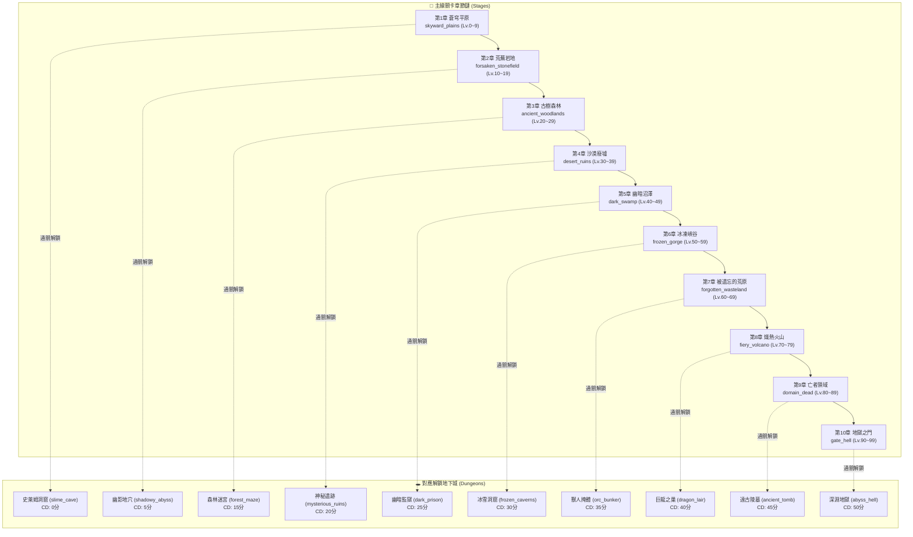

# 🗺️ Blackfire Crusade 全關卡 (Stages) 與地下城 (Dungeons) 完整名稱與變數圖鑑
> 依據遊戲底層核心資料庫 `meta_data/raw_tres/meta_datas.tres` 精確提取編寫，完整收錄主線普通關卡 (`level_groups`)、地下城 (`dungeons`) 之全部名稱、變數識別碼 (ID)、全域機制變數與關聯戰鬥系統。
---
## 🧭 一、關卡 (Stage) 與地下城 (Dungeon) 1 對 1 階梯對應表
在《Blackfire Crusade》的數值架構中，主線關卡與地下城呈**嚴格的等級階梯推進與前置解鎖關係**：每通關一個主線章節，即可解鎖對應等級區間的地下城。

| 階級序號 | 主線關卡名稱 (Stage) | 關卡變數 ID | 怪物等級區間 | 推薦戰力 | 解鎖地下城名稱 (Dungeon) | 地下城變數 ID | 地下城等級 | 刷新冷卻 (CD) |
| :---: | :--- | :--- | :---: | :---: | :--- | :--- | :---: | :---: |
| **第 1 階** | **蒼穹平原 (天空平原)** | `skyward_plains` | Lv. 0 ~ 9 | 無限制 | **黏糊糊的石窟 (史萊姆洞窟)** | `slime_cave` | Lv. 4 ~ 6 | 即時刷新 (0分) |
| **第 2 階** | **荒蕪岩地 (遺棄石原)** | `forsaken_stonefield` | Lv. 10 ~ 19 | 無限制 | **幽影地穴 (幽影深淵)** | `shadowy_abyss` | Lv. 14 ~ 16 | 5 分鐘 |
| **第 3 階** | **古樹森林 (遠古樹林)** | `ancient_woodlands` | Lv. 20 ~ 29 | 無限制 | **森林迷宮** | `forest_maze` | Lv. 24 ~ 26 | 15 分鐘 |
| **第 4 階** | **沙漠廢墟 (沙漠遺跡)** | `desert_ruins` | Lv. 30 ~ 39 | 無限制 | **神秘遺跡** | `mysterious_ruins` | Lv. 34 ~ 36 | 20 分鐘 |
| **第 5 階** | **幽暗沼澤 (黑暗沼澤)** | `dark_swamp` | Lv. 40 ~ 49 | 無限制 | **幽暗監獄 (黑暗監獄)** | `dark_prison` | Lv. 44 ~ 46 | 25 分鐘 |
| **第 6 階** | **冰凍峽谷 (冰霜峽谷)** | `frozen_gorge` | Lv. 50 ~ 59 | 1,800 | **冰雪洞窟 (冰霜洞窟)** | `frozen_caverns` | Lv. 54 ~ 56 | 30 分鐘 |
| **第 7 階** | **遺忘荒地** | `forgotten_wasteland` | Lv. 60 ~ 69 | 2,800 | **獸人掩體 (獸人地堡)** | `orc_bunker` | Lv. 64 ~ 69 | 35 分鐘 |
| **第 8 階** | **熾熱火山** | `fiery_volcano` | Lv. 70 ~ 79 | 3,800 | **巨龍之巢** | `dragon_lair` | Lv. 74 ~ 79 | 40 分鐘 |
| **第 9 階** | **亡者領域 (死者領域)** | `domain_dead` | Lv. 80 ~ 89 | 4,800 | **遠古陵墓 (遠古墓穴)** | `ancient_tomb` | Lv. 84 ~ 89 | 45 分鐘 |
| **第 10 階** | **地獄之門** | `gate_hell` | Lv. 90 ~ 99 | 5,800 | **深淵地獄** | `abyss_hell` | Lv. 94 ~ 99 | 50 分鐘 |

---

## ⚙️ 二、底層全域機制變數清單 (Global Variables)

在 `meta_datas.tres` 中，關卡與地下城模組均定義了控制機制運算的全域常數：

### 1. 主線關卡模組全域變數 (`level_groups`)

| 變數名稱 (Variable Key) | 資料型態 | 數值 / 設定值 | 機制作用說明 |
| :--- | :---: | :--- | :--- |
| `battle_coins` | `List[float]` | `[1.0, 2.0]` | 每場普通戰鬥勝利掉落的戰鬥幣 (Battle Coin) 隨機區間 |
| `gold_coins` | `List[float]` | `[5.0, 10.0]` | 每場普通戰鬥勝利掉落的金幣 (Gold Coin) 隨機區間 |
| `food_per_level` | `Dict[str, float]` | `{'normal': 1.0, 'boss': 2.0}` | 關卡體力/麵包消耗：普通子關卡每次消耗 1 點食物，Boss 關卡消耗 2 點食物 |
| `raid_default_price` | `float` | `10.0` | 關卡快速掃蕩 (Raid) 基準消耗/定價 |
| `raid_boss_offset` | `float` | `2.0` | 掃蕩包含 Boss 之關卡時的額外費用加成 |
| `raid_level_offset` | `float` | `0.0` | 關卡等級掃蕩費用增量偏移 |
| `star_rounds` | `List[float]` | `[30.0, 15.0]` | 關卡評星回合門檻：30 回合內通關評 2 星，15 回合內通關評 3 星滿星 |

### 2. 地下城模組全域變數 (`dungeons`)

| 變數名稱 (Variable Key) | 資料型態 | 數值 / 設定值 | 機制作用說明 |
| :--- | :---: | :--- | :--- |
| `battle_coins` | `List[float]` | `[1.0, 5.0]` | 地下城每場戰鬥勝利掉落的戰鬥幣隨機區間 (1~5 枚) |
| `dungeon_coins` | `List[float]` | `[5.0, 10.0]` | 通關結算時額外給予的地下城代幣隨機區間 |
| `blessings` | `Dict[str, Dict]` | `dam_blessing`, `exp_blessing`, `hp_blessing` | 地下城祭壇三大祝福：傷害+25% (`0.25`)、經驗+25% (`0.25`)、生命+25% (`0.25`) |
| `blessing_prices` | `List[float]` | `[0.0, 20.0, 30.0]` | 祭壇選取祝福的費用曲線：第 1 次免費 (0 幣)，第 2 次 20 幣，第 3 次 30 幣 |
| `skill_card_prices` | `List[float]` | `[0.0, 10.0, 20.0]` | 技能卡牌房購買/抽取技能的費用曲線：第 1 次免費，第 2 次 10 幣，第 3 次 20 幣 |
| `enemy_increase_attr` | `Dict[str, float]` | `{'dam_bouns': 25.0, 'hp_bouns': 50.0}` | 地下城深層 (第 4~5 層) 怪物屬性成長增益：傷害+25%，生命+50% |
| `skip_battle_price_offset` | `float` | `3.0` | 跳過已通關戰鬥房間時的額外代幣費用偏移 |
| `star_max` | `float` | `5.0` | 地下城挑戰最高評價星級 (5 星) |
| `star_unlock` | `float` | `3.0` | 解鎖快速跳過/自動戰鬥特權所需的最低星級 (3 星) |

---

## 🏰 三、主線普通關卡全 10 大章節詳解 (`level_groups`)

每個主線章節固定包含 **10 個子關卡 (Sub-levels, 如 1-1 ~ 1-10)**，並在第 5 關與第 10 關設有小 Boss 與章節大魔王守關。

### 1. 【第 1 章】蒼穹平原 (天空平原) (`skyward_plains`)

- **變數識別碼 (ID)**：`skyward_plains`
- **前置關卡 (`pre_level_group`)**：無 (初始第 1 章，直接開放)
- **解鎖所需累計星數 (`star_to_unlock`)**：⭐ **0 星**
- **推薦戰力門檻 (`required_power`)**：🛡️ **無限制**
- **掃蕩體力價格 (`raid_prices`)**：普通關 **5** / 魔王關 **10** 食物
- **滿星章節寶箱 (`rewards`)**：🎁 **100 gem, 100 hero_coin**
- **關卡掉落任務道具 (`quest_items`)**：`mariana_brooch`
- **關聯懸賞任務 (`quests`)**：`kill_beetle`, `kill_slime`, `kill_boar`, `kill_wolf`, `kill_breeze_sprite`, `kill_boss`, `kill_monster`

#### 📋 10 大子關卡敵方陣容與等級明細表

| 子關卡編號 | 敵方等級 (`enemy_level`) | 守關 Boss (`bosses`) | 出沒怪物清單 (`enemies`) |
| :---: | :---: | :--- | :--- |
| **1-1** | Lv. 0 | — | `beetle_grassland`, `slime_baby_1` |
| **1-2** | Lv. 1 | — | `beetle_grassland`, `slime_baby_1` |
| **1-3** | Lv. 2 | — | `beetle_grassland`, `breeze_sprite` |
| **1-4** | Lv. 3 | — | `beetle_grassland`, `breeze_sprite` |
| **1-5** | Lv. 4 | 🔥 **`breeze_sprite_wind_spirit`** | `breeze_sprite` |
| **1-6** | Lv. 5 | — | `boar_default`, `wolf_thorn`, `beetle_grassland` |
| **1-7** | Lv. 6 | — | `boar_default`, `wolf_thorn`, `beetle_grassland` |
| **1-8** | Lv. 7 | — | `boar_default`, `wolf_thorn`, `beetle_grassland` |
| **1-9** | Lv. 8 | — | `boar_default`, `wolf_thorn`, `beetle_grassland` |
| **1-10** | Lv. 9 | 🔥 **`boar_iron_tusk`** | `boar_default` |

---

### 2. 【第 2 章】荒蕪岩地 (遺棄石原) (`forsaken_stonefield`)

- **變數識別碼 (ID)**：`forsaken_stonefield`
- **前置關卡 (`pre_level_group`)**：`skyward_plains` (蒼穹平原 (天空平原))
- **解鎖所需累計星數 (`star_to_unlock`)**：⭐ **30 星**
- **推薦戰力門檻 (`required_power`)**：🛡️ **無限制**
- **掃蕩體力價格 (`raid_prices`)**：普通關 **6** / 魔王關 **12** 食物
- **滿星章節寶箱 (`rewards`)**：🎁 **200 gem, 200 hero_coin**
- **關卡掉落任務道具 (`quest_items`)**：`mysterious_stone_tablet`
- **關聯懸賞任務 (`quests`)**：無特定任務

#### 📋 10 大子關卡敵方陣容與等級明細表

| 子關卡編號 | 敵方等級 (`enemy_level`) | 守關 Boss (`bosses`) | 出沒怪物清單 (`enemies`) |
| :---: | :---: | :--- | :--- |
| **2-1** | Lv. 10 | — | `phantom_rock`, `desert_raider` |
| **2-2** | Lv. 11 | — | `phantom_rock`, `desert_raider` |
| **2-3** | Lv. 12 | — | `phantom_rock`, `desert_raider`, `lizard_desert` |
| **2-4** | Lv. 13 | — | `phantom_rock`, `desert_raider`, `lizard_desert` |
| **2-5** | Lv. 14 | 🔥 **`lizard_rockspike`** | `lizard_desert` |
| **2-6** | Lv. 15 | — | `lizard_desert`, `spider_rock` |
| **2-7** | Lv. 16 | — | `lizard_desert`, `spider_rock` |
| **2-8** | Lv. 17 | — | `golem_stone`, `lizard_desert`, `spider_rock` |
| **2-9** | Lv. 18 | — | `golem_stone`, `lizard_desert`, `spider_rock` |
| **2-10** | Lv. 19 | 🔥 **`golem_wall_guardian`** | `lizard_desert`, `spider_rock` |

---

### 3. 【第 3 章】古樹森林 (遠古樹林) (`ancient_woodlands`)

- **變數識別碼 (ID)**：`ancient_woodlands`
- **前置關卡 (`pre_level_group`)**：`forsaken_stonefield` (荒蕪岩地 (遺棄石原))
- **解鎖所需累計星數 (`star_to_unlock`)**：⭐ **60 星**
- **推薦戰力門檻 (`required_power`)**：🛡️ **無限制**
- **掃蕩體力價格 (`raid_prices`)**：普通關 **7** / 魔王關 **14** 食物
- **滿星章節寶箱 (`rewards`)**：🎁 **300 gem, 300 hero_coin**
- **關卡掉落任務道具 (`quest_items`)**：無特殊掉落
- **關聯懸賞任務 (`quests`)**：`kill_panther`, `kill_vine_horror`, `kill_frogman`, `kill_bear`, `kill_treant`

#### 📋 10 大子關卡敵方陣容與等級明細表

| 子關卡編號 | 敵方等級 (`enemy_level`) | 守關 Boss (`bosses`) | 出沒怪物清單 (`enemies`) |
| :---: | :---: | :--- | :--- |
| **3-1** | Lv. 20 | — | `panther_forest`, `vine_horror_default` |
| **3-2** | Lv. 21 | — | `panther_forest`, `vine_horror_default` |
| **3-3** | Lv. 22 | — | `panther_forest`, `vine_horror_default`, `frogman_archer` |
| **3-4** | Lv. 23 | — | `panther_forest`, `vine_horror_default`, `frogman_archer` |
| **3-5** | Lv. 24 | 🔥 **`panther_venomous_black`** | `panther_forest` |
| **3-6** | Lv. 25 | — | `bear_forest`, `frogman_archer` |
| **3-7** | Lv. 26 | — | `bear_forest`, `frogman_archer` |
| **3-8** | Lv. 27 | — | `bear_forest`, `frogman_archer`, `treant_mage` |
| **3-9** | Lv. 28 | — | `bear_forest`, `frogman_archer`, `treant_mage` |
| **3-10** | Lv. 29 | 🔥 **`bear_forest_giant`** | `frogman_archer`, `treant_mage` |

---

### 4. 【第 4 章】沙漠廢墟 (沙漠遺跡) (`desert_ruins`)

- **變數識別碼 (ID)**：`desert_ruins`
- **前置關卡 (`pre_level_group`)**：`ancient_woodlands` (古樹森林 (遠古樹林))
- **解鎖所需累計星數 (`star_to_unlock`)**：⭐ **90 星**
- **推薦戰力門檻 (`required_power`)**：🛡️ **無限制**
- **掃蕩體力價格 (`raid_prices`)**：普通關 **8** / 魔王關 **16** 食物
- **滿星章節寶箱 (`rewards`)**：🎁 **400 gem, 400 hero_coin**
- **關卡掉落任務道具 (`quest_items`)**：`relic_desert_ruins`
- **關聯懸賞任務 (`quests`)**：`kill_scorpion`, `kill_sandworm`, `kill_skeleton`

#### 📋 10 大子關卡敵方陣容與等級明細表

| 子關卡編號 | 敵方等級 (`enemy_level`) | 守關 Boss (`bosses`) | 出沒怪物清單 (`enemies`) |
| :---: | :---: | :--- | :--- |
| **4-1** | Lv. 30 | — | `scorpion_giant`, `lizard_petrified`, `sandworm` |
| **4-2** | Lv. 31 | — | `scorpion_giant`, `lizard_petrified`, `sandworm` |
| **4-3** | Lv. 32 | — | `scorpion_giant`, `lizard_petrified`, `sandworm` |
| **4-4** | Lv. 33 | — | `scorpion_giant`, `lizard_petrified`, `sandworm` |
| **4-5** | Lv. 34 | 🔥 **`sandworm_warlord`** | `lizard_petrified`, `scorpion_giant` |
| **4-6** | Lv. 35 | — | `skeleton_warrior`, `skeleton_mage`, `scorpion_giant` |
| **4-7** | Lv. 36 | — | `skeleton_warrior`, `skeleton_mage`, `scorpion_giant` |
| **4-8** | Lv. 37 | — | `skeleton_warrior`, `skeleton_mage`, `scorpion_giant` |
| **4-9** | Lv. 38 | — | `skeleton_warrior`, `skeleton_mage`, `scorpion_giant` |
| **4-10** | Lv. 39 | 🔥 **`skeleton_scorching_king`** | `skeleton_warrior`, `skeleton_mage` |

---

### 5. 【第 5 章】幽暗沼澤 (黑暗沼澤) (`dark_swamp`)

- **變數識別碼 (ID)**：`dark_swamp`
- **前置關卡 (`pre_level_group`)**：`frozen_gorge` (冰凍峽谷 (冰霜峽谷))
- **解鎖所需累計星數 (`star_to_unlock`)**：⭐ **120 星**
- **推薦戰力門檻 (`required_power`)**：🛡️ **無限制**
- **掃蕩體力價格 (`raid_prices`)**：普通關 **9** / 魔王關 **18** 食物
- **滿星章節寶箱 (`rewards`)**：🎁 **500 gem, 500 hero_coin**
- **關卡掉落任務道具 (`quest_items`)**：無特殊掉落
- **關聯懸賞任務 (`quests`)**：`kill_toad`, `kill_sludge_fiend`

#### 📋 10 大子關卡敵方陣容與等級明細表

| 子關卡編號 | 敵方等級 (`enemy_level`) | 守關 Boss (`bosses`) | 出沒怪物清單 (`enemies`) |
| :---: | :---: | :--- | :--- |
| **5-1** | Lv. 40 | — | `frogman_warrior`, `frogman_rogue`, `frogman_hunter` |
| **5-2** | Lv. 41 | — | `frogman_warrior`, `frogman_rogue`, `frogman_hunter` |
| **5-3** | Lv. 42 | — | `frogman_warrior`, `frogman_rogue`, `frogman_hunter` |
| **5-4** | Lv. 43 | — | `frogman_warrior`, `frogman_rogue`, `frogman_hunter` |
| **5-5** | Lv. 44 | 🔥 **`frogman_bog_chieftain`** | `frogman_warrior`, `frogman_rogue`, `frogman_hunter` |
| **5-6** | Lv. 45 | — | `sludge_fiend_default`, `toad_bloodsucker`, `toad_plague` |
| **5-7** | Lv. 46 | — | `sludge_fiend_default`, `toad_bloodsucker`, `toad_plague` |
| **5-8** | Lv. 47 | — | `sludge_fiend_default`, `toad_bloodsucker`, `toad_plague` |
| **5-9** | Lv. 48 | — | `sludge_fiend_default`, `toad_bloodsucker`, `toad_plague` |
| **5-10** | Lv. 49 | 🔥 **`toad_plague_king`** | 無常規怪 (純 Boss 戰) |

---

### 6. 【第 6 章】冰凍峽谷 (冰霜峽谷) (`frozen_gorge`)

- **變數識別碼 (ID)**：`frozen_gorge`
- **前置關卡 (`pre_level_group`)**：`desert_ruins` (沙漠廢墟 (沙漠遺跡))
- **解鎖所需累計星數 (`star_to_unlock`)**：⭐ **150 星**
- **推薦戰力門檻 (`required_power`)**：🛡️ **1800**
- **掃蕩體力價格 (`raid_prices`)**：普通關 **10** / 魔王關 **20** 食物
- **滿星章節寶箱 (`rewards`)**：🎁 **600 gem, 600 hero_coin**
- **關卡掉落任務道具 (`quest_items`)**：`mariana_scattered_supplies`, `ancient_magic_stone`, `frost_scar_page`
- **關聯懸賞任務 (`quests`)**：無特定任務

#### 📋 10 大子關卡敵方陣容與等級明細表

| 子關卡編號 | 敵方等級 (`enemy_level`) | 守關 Boss (`bosses`) | 出沒怪物清單 (`enemies`) |
| :---: | :---: | :--- | :--- |
| **6-1** | Lv. 50 | — | `spider_frozen_egg`, `spider_snowstorm`, `ice_elemental_avalanche` |
| **6-2** | Lv. 51 | — | `spider_frozen_egg`, `spider_snowstorm`, `ice_elemental_avalanche` |
| **6-3** | Lv. 52 | — | `spider_frozen_egg`, `spider_snowstorm`, `ice_elemental_avalanche` |
| **6-4** | Lv. 53 | — | `spider_frozen_egg`, `spider_snowstorm`, `ice_elemental_avalanche` |
| **6-5** | Lv. 54 | 🔥 **`spider_frost_king`** | `spider_frozen_egg` |
| **6-6** | Lv. 55 | — | `demon_snowmount`, `nightshroud_frost_sorcerer`, `giant_frost` |
| **6-7** | Lv. 56 | — | `demon_snowmount`, `nightshroud_frost_sorcerer`, `giant_frost` |
| **6-8** | Lv. 57 | — | `demon_snowmount`, `nightshroud_frost_sorcerer`, `giant_frost` |
| **6-9** | Lv. 58 | — | `demon_snowmount`, `nightshroud_frost_sorcerer`, `giant_frost` |
| **6-10** | Lv. 59 | 🔥 **`behemoth_frost`** | 無常規怪 (純 Boss 戰) |

---

### 7. 【第 7 章】遺忘荒地 (`forgotten_wasteland`)

- **變數識別碼 (ID)**：`forgotten_wasteland`
- **前置關卡 (`pre_level_group`)**：`frozen_gorge` (冰凍峽谷 (冰霜峽谷))
- **解鎖所需累計星數 (`star_to_unlock`)**：⭐ **180 星**
- **推薦戰力門檻 (`required_power`)**：🛡️ **2800**
- **掃蕩體力價格 (`raid_prices`)**：普通關 **11** / 魔王關 **22** 食物
- **滿星章節寶箱 (`rewards`)**：🎁 **900 gem, 900 hero_coin**
- **關卡掉落任務道具 (`quest_items`)**：`abandoned_experimental_container`, `frostoath_clue`
- **關聯懸賞任務 (`quests`)**：無特定任務

#### 📋 10 大子關卡敵方陣容與等級明細表

| 子關卡編號 | 敵方等級 (`enemy_level`) | 守關 Boss (`bosses`) | 出沒怪物清單 (`enemies`) |
| :---: | :---: | :--- | :--- |
| **7-1** | Lv. 60 | — | `orc_stonehelm_grunt`, `orc_ashbone_prophet`, `totem_wastes` |
| **7-2** | Lv. 61 | — | `orc_stonehelm_grunt`, `orc_ashbone_prophet`, `totem_wastes` |
| **7-3** | Lv. 62 | — | `orc_stonehelm_grunt`, `orc_ashbone_prophet`, `totem_wastes` |
| **7-4** | Lv. 63 | — | `orc_stonehelm_grunt`, `orc_ashbone_prophet`, `totem_wastes` |
| **7-5** | Lv. 64 | 🔥 **`orc_harugor`** | `voidborn_hargoth` |
| **7-6** | Lv. 65 | — | `orc_stonehelm_grunt`, `orc_foulblood_shaman`, `wolf_wasteland` |
| **7-7** | Lv. 66 | — | `orc_stonehelm_grunt`, `orc_foulblood_shaman`, `wolf_wasteland` |
| **7-8** | Lv. 67 | — | `orc_stonehelm_grunt`, `orc_foulblood_shaman`, `wolf_wasteland` |
| **7-9** | Lv. 68 | — | `orc_stonehelm_grunt`, `orc_foulblood_shaman`, `wolf_wasteland` |
| **7-10** | Lv. 69 | 🔥 **`orc_gorsak`** | 無常規怪 (純 Boss 戰) |

---

### 8. 【第 8 章】熾熱火山 (`fiery_volcano`)

- **變數識別碼 (ID)**：`fiery_volcano`
- **前置關卡 (`pre_level_group`)**：`forgotten_wasteland` 遺忘荒地
- **解鎖所需累計星數 (`star_to_unlock`)**：⭐ **210 星**
- **推薦戰力門檻 (`required_power`)**：🛡️ **3800**
- **掃蕩體力價格 (`raid_prices`)**：普通關 **12** / 魔王關 **24** 食物
- **滿星章節寶箱 (`rewards`)**：🎁 **800 gem, 800 hero_coin**
- **關卡掉落任務道具 (`quest_items`)**：`scorching_magma_bubble`, `abysscore_fragment`
- **關聯懸賞任務 (`quests`)**：無特定任務

#### 📋 10 大子關卡敵方陣容與等級明細表

| 子關卡編號 | 敵方等級 (`enemy_level`) | 守關 Boss (`bosses`) | 出沒怪物清單 (`enemies`) |
| :---: | :---: | :--- | :--- |
| **8-1** | Lv. 70 | — | `lizard_cinder`, `dragon_blazethroat_hatchling`, `behemoth_blazefiend` |
| **8-2** | Lv. 71 | — | `lizard_cinder`, `dragon_blazethroat_hatchling`, `behemoth_blazefiend` |
| **8-3** | Lv. 72 | — | `lizard_cinder`, `dragon_blazethroat_hatchling`, `behemoth_blazefiend` |
| **8-4** | Lv. 73 | — | `lizard_cinder`, `dragon_blazethroat_hatchling`, `behemoth_blazefiend` |
| **8-5** | Lv. 74 | 🔥 **`behemoth_karrog`** | 無常規怪 (純 Boss 戰) |
| **8-6** | Lv. 75 | — | `fire_elemental_cinder_construct`, `fire_elemental_ember_spirit`, `demon_firecore_imp` |
| **8-7** | Lv. 76 | — | `fire_elemental_cinder_construct`, `fire_elemental_ember_spirit`, `demon_firecore_imp` |
| **8-8** | Lv. 77 | — | `fire_elemental_cinder_construct`, `fire_elemental_ember_spirit`, `demon_firecore_imp` |
| **8-9** | Lv. 78 | — | `fire_elemental_cinder_construct`, `fire_elemental_ember_spirit`, `demon_firecore_imp` |
| **8-10** | Lv. 79 | 🔥 **`fire_elemental_ignar`** | 無常規怪 (純 Boss 戰) |

---

### 9. 【第 9 章】亡者領域 (死者領域) (`domain_dead`)

- **變數識別碼 (ID)**：`domain_dead`
- **前置關卡 (`pre_level_group`)**：`fiery_volcano` (熾熱火山)
- **解鎖所需累計星數 (`star_to_unlock`)**：⭐ **240 星**
- **推薦戰力門檻 (`required_power`)**：🛡️ **4800**
- **掃蕩體力價格 (`raid_prices`)**：普通關 **13** / 魔王關 **26** 食物
- **滿星章節寶箱 (`rewards`)**：🎁 **900 gem, 900 hero_coin**
- **關卡掉落任務道具 (`quest_items`)**：無特殊掉落
- **關聯懸賞任務 (`quests`)**：無特定任務

#### 📋 10 大子關卡敵方陣容與等級明細表

| 子關卡編號 | 敵方等級 (`enemy_level`) | 守關 Boss (`bosses`) | 出沒怪物清單 (`enemies`) |
| :---: | :---: | :--- | :--- |
| **9-1** | Lv. 80 | — | `ghoul_blightgnaw_feeder`, `skeleton_corroded_thrall`, `specter_wailing_maiden` |
| **9-2** | Lv. 81 | — | `ghoul_blightgnaw_feeder`, `skeleton_corroded_thrall`, `specter_wailing_maiden` |
| **9-3** | Lv. 82 | — | `ghoul_blightgnaw_feeder`, `skeleton_corroded_thrall`, `specter_wailing_maiden` |
| **9-4** | Lv. 83 | — | `ghoul_blightgnaw_feeder`, `skeleton_corroded_thrall`, `specter_wailing_maiden` |
| **9-5** | Lv. 84 | 🔥 **`abomination_blosk`** | 無常規怪 (純 Boss 戰) |
| **9-6** | Lv. 85 | — | `undead_nailpierced_husk`, `skeleton_bonekeeper`, `skeleton_gravebound_golem` |
| **9-7** | Lv. 86 | — | `undead_nailpierced_husk`, `skeleton_bonekeeper`, `skeleton_gravebound_golem` |
| **9-8** | Lv. 87 | — | `undead_nailpierced_husk`, `skeleton_bonekeeper`, `skeleton_gravebound_golem` |
| **9-9** | Lv. 88 | — | `undead_nailpierced_husk`, `skeleton_bonekeeper`, `skeleton_gravebound_golem` |
| **9-10** | Lv. 89 | 🔥 **`undead_uzerg`** | 無常規怪 (純 Boss 戰) |

---

### 10. 【第 10 章】地獄之門 (`gate_hell`)

- **變數識別碼 (ID)**：`gate_hell`
- **前置關卡 (`pre_level_group`)**：`domain_dead` (亡者領域 (死者領域))
- **解鎖所需累計星數 (`star_to_unlock`)**：⭐ **270 星**
- **推薦戰力門檻 (`required_power`)**：🛡️ **5800**
- **掃蕩體力價格 (`raid_prices`)**：普通關 **14** / 魔王關 **28** 食物
- **滿星章節寶箱 (`rewards`)**：🎁 **1000 gem, 1000 hero_coin**
- **關卡掉落任務道具 (`quest_items`)**：`disordered_ironworks_clue_1`
- **關聯懸賞任務 (`quests`)**：無特定任務

#### 📋 10 大子關卡敵方陣容與等級明細表

| 子關卡編號 | 敵方等級 (`enemy_level`) | 守關 Boss (`bosses`) | 出沒怪物清單 (`enemies`) |
| :---: | :---: | :--- | :--- |
| **10-1** | Lv. 90 | — | `demon_infernal_enforcer`, `demon_bloodpit_digger`, `demon_firecore_imp` |
| **10-2** | Lv. 91 | — | `demon_infernal_enforcer`, `demon_bloodpit_digger`, `demon_firecore_imp` |
| **10-3** | Lv. 92 | — | `demon_infernal_enforcer`, `demon_bloodpit_digger`, `demon_firecore_imp` |
| **10-4** | Lv. 93 | — | `demon_infernal_enforcer`, `demon_bloodpit_digger`, `demon_firecore_imp` |
| **10-5** | Lv. 94 | 🔥 **`abomination_suture_fiend`** | 無常規怪 (純 Boss 戰) |
| **10-6** | Lv. 95 | — | `demon_boneflame_crawler`, `demon_molthorn_servitor`, `voidborn_soulpeering_eye` |
| **10-7** | Lv. 96 | — | `demon_boneflame_crawler`, `demon_molthorn_servitor`, `voidborn_soulpeering_eye` |
| **10-8** | Lv. 97 | — | `demon_boneflame_crawler`, `demon_molthorn_servitor`, `voidborn_soulpeering_eye` |
| **10-9** | Lv. 98 | — | `demon_boneflame_crawler`, `demon_molthorn_servitor`, `voidborn_soulpeering_eye` |
| **10-10** | Lv. 99 | 🔥 **`demon_kargros`** | `demon_boneflame_crawler` |

---

## 🕳️ 四、10 大地下城全景剖析 (`dungeons`)

地下城固定包含 **5 層 (Floors)**，是遊戲中產出金幣、經驗藥水、精華材料、高階飾品圖紙、命運幣與英雄幣的核心場所。

### 1. 【地下城 No. 1】黏糊糊的石窟 (史萊姆洞窟) (`slime_cave`)

- **變數識別碼 (ID)**：`slime_cave`
- **前置解鎖主線 (`pre_level_group`)**：`skyward_plains` (蒼穹平原 (天空平原))
- **總層數 (`floor`)**：🏛️ **5 層**
- **怪物與 Boss 等級 (`level`)**：📊 **Lv. 4 ~ 6**
- **通關刷新計時 (`refresh_time`)**：⏳ **即時刷新 (0分)**
- **遠征活躍點數 (`expedition_points`)**：🎯 **+1 點**
- **特殊房間配置 (`special_rooms`)**：`skill_card`
- **首次通關獎勵 (`rewards`)**：🎁 **100 gem, 100 hero_coin**
- **任務關聯 (`quests`)**：`kill_slime`, `kill_bat`, `dungeon_finished`
- **專屬任務道具 (`quest_items`)**：無特殊掉落
- **結算寶箱獎勵庫 (`chest_dic`)**：金幣 `5~10` 枚；道具池：`coin`, `exp_potion_2`, `essence_1`, `essence_2`, `fate_coin`

#### 👾 出沒敵方與首領陣容配置

* **常規出沒怪物 (`enemies`)**：`slime_baby_2`, `slime_mage`, `slime_medium`, `bat_cave`
* **Boss 戰隨機陣容池 (`boss_groups`)**：
  - 🔴 首領組合 `slime_dark`：登場敵方包含 `slime_dark_baby`, `slime_dark_baby`, `slime_dark`
  - 🔴 首領組合 `slime_armored`：登場敵方包含 `slime_baby_2`, `slime_armored`
  - 🔴 首領組合 `slime_king`：登場敵方包含 `slime_king`

---

### 2. 【地下城 No. 2】幽影地穴 (幽影深淵) (`shadowy_abyss`)

- **變數識別碼 (ID)**：`shadowy_abyss`
- **前置解鎖主線 (`pre_level_group`)**：`forsaken_stonefield` (荒蕪岩地 (遺棄石原))
- **總層數 (`floor`)**：🏛️ **5 層**
- **怪物與 Boss 等級 (`level`)**：📊 **Lv. 14 ~ 16**
- **通關刷新計時 (`refresh_time`)**：⏳ **5 分鐘 (300,000 ms)**
- **遠征活躍點數 (`expedition_points`)**：🎯 **+1 點**
- **特殊房間配置 (`special_rooms`)**：`skill_card`
- **首次通關獎勵 (`rewards`)**：🎁 **200 gem, 200 hero_coin**
- **任務關聯 (`quests`)**：`kill_spider`, `kill_bat`
- **專屬任務道具 (`quest_items`)**：無特殊掉落
- **結算寶箱獎勵庫 (`chest_dic`)**：金幣 `5~10` 枚；道具池：`coin`, `exp_potion_2`, `essence_1`, `essence_2`, `fate_coin`

#### 👾 出沒敵方與首領陣容配置

* **常規出沒怪物 (`enemies`)**：`spider_baby`, `spider_baby_mage`, `spider_armored`, `bat_cave`
* **Boss 戰隨機陣容池 (`boss_groups`)**：
  - 🔴 首領組合 `spider_shadow_widow`：登場敵方包含 `spider_shadow_widow`, `spider_baby_mage`
  - 🔴 首領組合 `spider_shadow_king`：登場敵方包含 `spider_shadow_king`, `spider_armored`
  - 🔴 首領組合 `bat_darkwing_king`：登場敵方包含 `bat_cave`, `bat_cave`, `bat_darkwing_king`

---

### 3. 【地下城 No. 3】森林迷宮 (`forest_maze`)

- **變數識別碼 (ID)**：`forest_maze`
- **前置解鎖主線 (`pre_level_group`)**：`ancient_woodlands` (古樹森林 (遠古樹林))
- **總層數 (`floor`)**：🏛️ **5 層**
- **怪物與 Boss 等級 (`level`)**：📊 **Lv. 24 ~ 26**
- **通關刷新計時 (`refresh_time`)**：⏳ **15 分鐘 (900,000 ms)**
- **遠征活躍點數 (`expedition_points`)**：🎯 **+2 點**
- **特殊房間配置 (`special_rooms`)**：`skill_card`
- **首次通關獎勵 (`rewards`)**：🎁 **300 gem, 300 hero_coin**
- **任務關聯 (`quests`)**：`kill_mushroom`, `kill_wolf`, `kill_treant`
- **專屬任務道具 (`quest_items`)**：無特殊掉落
- **結算寶箱獎勵庫 (`chest_dic`)**：金幣 `10~15` 枚；道具池：`coin`, `exp_potion_2`, `essence_1`, `essence_2`, `fate_coin`

#### 👾 出沒敵方與首領陣容配置

* **常規出沒怪物 (`enemies`)**：`mushroom_magic`, `wolf_shadowwood`, `treant_guardian`, `treant_mage`
* **Boss 戰隨機陣容池 (`boss_groups`)**：
  - 🔴 首領組合 `mushroom_lord`：登場敵方包含 `mushroom_lord`, `mushroom_magic`
  - 🔴 首領組合 `treant_ancient`：登場敵方包含 `treant_ancient`, `treant_mage`, `treant_mage`
  - 🔴 首領組合 `wolf_shadow_chieftain`：登場敵方包含 `wolf_shadow_chieftain`, `wolf_shadow_chieftain`

---

### 4. 【地下城 No. 4】神秘遺跡 (`mysterious_ruins`)

- **變數識別碼 (ID)**：`mysterious_ruins`
- **前置解鎖主線 (`pre_level_group`)**：`desert_ruins` (沙漠廢墟 (沙漠遺跡))
- **總層數 (`floor`)**：🏛️ **5 層**
- **怪物與 Boss 等級 (`level`)**：📊 **Lv. 34 ~ 36**
- **通關刷新計時 (`refresh_time`)**：⏳ **20 分鐘 (1,200,000 ms)**
- **遠征活躍點數 (`expedition_points`)**：🎯 **+2 點**
- **特殊房間配置 (`special_rooms`)**：`skill_card`
- **首次通關獎勵 (`rewards`)**：🎁 **400 gem, 400 hero_coin**
- **任務關聯 (`quests`)**：無特定任務
- **專屬任務道具 (`quest_items`)**：`relic_mysterious_ruins`, `heroic_statue`
- **結算寶箱獎勵庫 (`chest_dic`)**：金幣 `10~15` 枚；道具池：`coin`, `exp_potion_3`, `essence_1`, `essence_2`, `fate_coin`

#### 👾 出沒敵方與首領陣容配置

* **常規出沒怪物 (`enemies`)**：`skeleton_warrior`, `skeleton_mage`, `specter_ancient`, `golem_ancient_guardian`
* **Boss 戰隨機陣容池 (`boss_groups`)**：
  - 🔴 首領組合 `golem_runic`：登場敵方包含 `golem_runic`, `golem_ancient_guardian`
  - 🔴 首領組合 `specter_cursed_oracle`：登場敵方包含 `specter_ancient`, `specter_ancient`, `specter_cursed_oracle`
  - 🔴 首領組合 `skeleton_kaldor`：登場敵方包含 `skeleton_warrior`, `skeleton_mage`, `skeleton_kaldor`

---

### 5. 【地下城 No. 5】幽暗監獄 (黑暗監獄) (`dark_prison`)

- **變數識別碼 (ID)**：`dark_prison`
- **前置解鎖主線 (`pre_level_group`)**：`dark_swamp` (幽暗沼澤 (黑暗沼澤))
- **總層數 (`floor`)**：🏛️ **5 層**
- **怪物與 Boss 等級 (`level`)**：📊 **Lv. 44 ~ 46**
- **通關刷新計時 (`refresh_time`)**：⏳ **25 分鐘 (1,500,000 ms)**
- **遠征活躍點數 (`expedition_points`)**：🎯 **+2 點**
- **特殊房間配置 (`special_rooms`)**：`skill_card`
- **首次通關獎勵 (`rewards`)**：🎁 **500 gem, 500 hero_coin**
- **任務關聯 (`quests`)**：`kill_undead`, `kill_Voidborn`
- **專屬任務道具 (`quest_items`)**：無特殊掉落
- **結算寶箱獎勵庫 (`chest_dic`)**：金幣 `15~20` 枚；道具池：`coin`, `exp_potion_3`, `essence_1`, `essence_2`, `fate_coin`

#### 👾 出沒敵方與首領陣容配置

* **常規出沒怪物 (`enemies`)**：`skeleton_bone_warden`, `skeleton_eclipse_executioner`, `skeleton_shadow_sentinel`, `undead_soul_overseer`, `human_chained_slave`
* **Boss 戰隨機陣容池 (`boss_groups`)**：
  - 🔴 首領組合 `undead_corrupted_warden`：登場敵方包含 `undead_corrupted_warden`, `skeleton_eclipse_executioner`, `skeleton_eclipse_executioner`
  - 🔴 首領組合 `specter_faceless_terror`：登場敵方包含 `skeleton_bone_warden`, `skeleton_bone_warden`, `specter_faceless_terror`
  - 🔴 首領組合 `voidborn_light_devourer`：登場敵方包含 `voidborn_light_devourer`

---

### 6. 【地下城 No. 6】冰雪洞窟 (冰霜洞窟) (`frozen_caverns`)

- **變數識別碼 (ID)**：`frozen_caverns`
- **前置解鎖主線 (`pre_level_group`)**：`frozen_gorge` (冰凍峽谷 (冰霜峽谷))
- **總層數 (`floor`)**：🏛️ **5 層**
- **怪物與 Boss 等級 (`level`)**：📊 **Lv. 54 ~ 56**
- **通關刷新計時 (`refresh_time`)**：⏳ **30 分鐘 (1,800,000 ms)**
- **遠征活躍點數 (`expedition_points`)**：🎯 **+3 點**
- **特殊房間配置 (`special_rooms`)**：`skill_card`
- **首次通關獎勵 (`rewards`)**：🎁 **600 gem, 600 hero_coin**
- **任務關聯 (`quests`)**：無特定任務
- **專屬任務道具 (`quest_items`)**：無特殊掉落
- **結算寶箱獎勵庫 (`chest_dic`)**：金幣 `15~20` 枚；道具池：`coin`, `exp_potion_3`, `essence_1`, `essence_2`, `design_feet_frozen_warden`, `fate_coin`

#### 👾 出沒敵方與首領陣容配置

* **常規出沒怪物 (`enemies`)**：`wraith_ice`, `demon_snowmount`, `bear_frost`, `ice_elemental_avalanche`, `giant_frost`
* **Boss 戰隨機陣容池 (`boss_groups`)**：
  - 🔴 首領組合 `ice_elemental_kalvia`：登場敵方包含 `ice_elemental_kalvia`
  - 🔴 首領組合 `ghoul_frost`：登場敵方包含 `corpse_grubs`, `ghoul_frost`
  - 🔴 首領組合 `bear_yolda`：登場敵方包含 `bear_frost`, `bear_yolda`

---

### 7. 【地下城 No. 7】獸人掩體 (獸人地堡) (`orc_bunker`)

- **變數識別碼 (ID)**：`orc_bunker`
- **前置解鎖主線 (`pre_level_group`)**：`forgotten_wasteland` 遺忘荒地
- **總層數 (`floor`)**：🏛️ **5 層**
- **怪物與 Boss 等級 (`level`)**：📊 **Lv. 64 ~ 69**
- **通關刷新計時 (`refresh_time`)**：⏳ **35 分鐘 (2,100,000 ms)**
- **遠征活躍點數 (`expedition_points`)**：🎯 **+3 點**
- **特殊房間配置 (`special_rooms`)**：`skill_card`
- **首次通關獎勵 (`rewards`)**：🎁 **700 gem, 700 hero_coin**
- **任務關聯 (`quests`)**：無特定任務
- **專屬任務道具 (`quest_items`)**：`alchemical_core`
- **結算寶箱獎勵庫 (`chest_dic`)**：金幣 `20~25` 枚；道具池：`coin`, `exp_potion_4`, `essence_2`, `essence_3`, `design_necklace_leather_orc`, `fate_coin`

#### 👾 出沒敵方與首領陣容配置

* **常規出沒怪物 (`enemies`)**：`orc_shieldwarden`, `orc_stonehelm_grunt`, `orc_ashbone_prophet`, `orc_foulblood_shaman`, `orc_bonebreaker_raider`
* **Boss 戰隨機陣容池 (`boss_groups`)**：
  - 🔴 首領組合 `wolf_karlther`：登場敵方包含 `wolf_karlther`
  - 🔴 首領組合 `orc_grumor`：登場敵方包含 `orc_grumor`, `orc_foulblood_shaman`
  - 🔴 首領組合 `orc_kraghul`：登場敵方包含 `orc_shieldwarden`, `orc_kraghul`, `orc_foulblood_shaman`

---

### 8. 【地下城 No. 8】巨龍之巢 (`dragon_lair`)

- **變數識別碼 (ID)**：`dragon_lair`
- **前置解鎖主線 (`pre_level_group`)**：`fiery_volcano` (熾熱火山)
- **總層數 (`floor`)**：🏛️ **5 層**
- **怪物與 Boss 等級 (`level`)**：📊 **Lv. 74 ~ 79**
- **通關刷新計時 (`refresh_time`)**：⏳ **40 分鐘 (2,400,000 ms)**
- **遠征活躍點數 (`expedition_points`)**：🎯 **+3 點**
- **特殊房間配置 (`special_rooms`)**：`skill_card`
- **首次通關獎勵 (`rewards`)**：🎁 **800 gem, 800 hero_coin**
- **任務關聯 (`quests`)**：無特定任務
- **專屬任務道具 (`quest_items`)**：`alchemical_core`
- **結算寶箱獎勵庫 (`chest_dic`)**：金幣 `25~30` 枚；道具池：`coin`, `exp_potion_4`, `essence_2`, `essence_3`, `fate_coin`

#### 👾 出沒敵方與首領陣容配置

* **常規出沒怪物 (`enemies`)**：`dragon_rockscale`, `dragon_blazethroat_hatchling`, `dragon_blazescale_egg`, `dragon_blazewing_hatchling`, `lizard_cinder`, `demon_firecore_imp`
* **Boss 戰隨機陣容池 (`boss_groups`)**：
  - 🔴 首領組合 `dragon_karsos`：登場敵方包含 `dragon_karsos`
  - 🔴 首領組合 `dragonkin_sakroth`：登場敵方包含 `dragonkin_sakroth`
  - 🔴 首領組合 `voidborn_azlorth`：登場敵方包含 `behemoth_crystalhorn`, `voidborn_azlorth`

---

### 9. 【地下城 No. 9】遠古陵墓 (遠古墓穴) (`ancient_tomb`)

- **變數識別碼 (ID)**：`ancient_tomb`
- **前置解鎖主線 (`pre_level_group`)**：`domain_dead` (亡者領域 (死者領域))
- **總層數 (`floor`)**：🏛️ **5 層**
- **怪物與 Boss 等級 (`level`)**：📊 **Lv. 84 ~ 89**
- **通關刷新計時 (`refresh_time`)**：⏳ **45 分鐘 (2,700,000 ms)**
- **遠征活躍點數 (`expedition_points`)**：🎯 **+3 點**
- **特殊房間配置 (`special_rooms`)**：`skill_card`
- **首次通關獎勵 (`rewards`)**：🎁 **900 gem, 900 hero_coin**
- **任務關聯 (`quests`)**：無特定任務
- **專屬任務道具 (`quest_items`)**：無特殊掉落
- **結算寶箱獎勵庫 (`chest_dic`)**：金幣 `30~35` 枚；道具池：`coin`, `exp_potion_5`, `essence_3`, `essence_4`, `design_accessory_decay_charm`, `fate_coin`

#### 👾 出沒敵方與首領陣容配置

* **常規出沒怪物 (`enemies`)**：`undead_nailpierced_husk`, `skeleton_bonekeeper`, `skeleton_gravebound_golem`, `specter_wailing_maiden`, `ghoul_blightgnaw_feeder`, `undead_mugrath`
* **Boss 戰隨機陣容池 (`boss_groups`)**：
  - 🔴 首領組合 `skeleton_daros`：登場敵方包含 `skeleton_daros`, `undead_mugrath`
  - 🔴 首領組合 `skeleton_margus`：登場敵方包含 `undead_nailpierced_husk`, `skeleton_margus`
  - 🔴 首領組合 `dragon_therezas`：登場敵方包含 `dragon_therezas`

---

### 10. 【地下城 No. 10】深淵地獄 (`abyss_hell`)

- **變數識別碼 (ID)**：`abyss_hell`
- **前置解鎖主線 (`pre_level_group`)**：`gate_hell` (地獄之門)
- **總層數 (`floor`)**：🏛️ **5 層**
- **怪物與 Boss 等級 (`level`)**：📊 **Lv. 94 ~ 99**
- **通關刷新計時 (`refresh_time`)**：⏳ **50 分鐘 (3,000,000 ms)**
- **遠征活躍點數 (`expedition_points`)**：🎯 **+3 點**
- **特殊房間配置 (`special_rooms`)**：`skill_card`
- **首次通關獎勵 (`rewards`)**：🎁 **1000 gem, 1000 hero_coin**
- **任務關聯 (`quests`)**：無特定任務
- **專屬任務道具 (`quest_items`)**：無特殊掉落
- **結算寶箱獎勵庫 (`chest_dic`)**：金幣 `35~40` 枚；道具池：`coin`, `exp_potion_5`, `essence_3`, `essence_4`, `hellbloom`, `fate_coin`

#### 👾 出沒敵方與首領陣容配置

* **常規出沒怪物 (`enemies`)**：`demon_infernal_enforcer`, `demon_bloodpit_digger`, `demon_firecore_imp`, `demon_boneflame_crawler`, `demon_molthorn_servitor`, `voidborn_soulpeering_eye`
* **Boss 戰隨機陣容池 (`boss_groups`)**：
  - 🔴 首領組合 `demon_azrim`：登場敵方包含 `demon_azrim`
  - 🔴 首領組合 `demon_molthar`：登場敵方包含 `demon_molthar`
  - 🔴 首領組合 `demon_talav`：登場敵方包含 `demon_talav`
  - 🔴 首領組合 `voidborn_ordis`：登場敵方包含 `voidborn_ordis`
  - 🔴 首領組合 `abomination_saron`：登場敵方包含 `abomination_saron`

---

## 🌍 五、關卡與地下城關聯系統延伸 (Related Combat Modes)

除常規主線關卡與地下城外，遊戲中兩者深度驅動了以下高階戰鬥系統：

### 1. 五大冒險領地 (`domains`)

| 領地序號 | 冒險領地名稱 | 變數 ID | 挑戰等級區間 | 解鎖前置主線關卡 / 任務 | 核心首領與隱藏英雄 |
| :---: | :--- | :--- | :---: | :--- | :--- |
| **Domain 1** | **黃金帝國** | `golden_empire` | Lv. 49 ~ 69 | 通關 Stage 6 `frozen_gorge` (`blood_altar_golden_empire`) | 秘銀巫婆、黃金屠拉克、阿爾塔林、金牆守衛 |
| **Domain 2** | **冷誓要塞** | `coldoath_citadel` | Lv. 69 ~ 89 | 通關 Stage 7 `forgotten_wasteland` (`blood_altar_coldoath_citadel`) | 🌟 **寒噬女巫 · 艾卡希雅** (`hero_mage_ecasia`)、霜龍阿祖洛斯 |
| **Domain 3** | **深淵獸巢** | `abyssbeast_lair` | Lv. 79 ~ 99 | 通關 Stage 8 `fiery_volcano` (`blood_altar_abyssbeast_lair`) | 🌟 **深淵暗影 · 維爾贊** (`hero_rogue_vilzaan`)、淵行者戈爾瓦斯 |
| **Domain 4** | **沉潮廢墟** | `sunkentide_ruins` | Lv. 89 ~ 109 | 通關 Stage 9 `domain_dead` (`blood_altar_sunkentide_ruins`) | 🌟 **破浪狂弓 · 奧拉夫** (`hero_archer_olaf`)、深淵噬海獸 |
| **Domain 5** | **紊亂鐵工廠** | `disordered_ironworks` | Lv. 99 ~ 119 | 通關 Stage 10 `gate_hell` (`blood_altar_disordered_ironworks`) | 🌟 **機甲技師 · 格利格** (`hero_knight_glig`)、鐵顎機甲 |

### 2. 首領領主討伐 (`lords`)

7 大領主討伐全部**嚴格綁定對應前置地下城**的通關狀態：

| 領主 ID | 中文名稱 | 等級 | 刷新 CD | 綁定前置地下城變數 (`required_dungeon_id`) |
| :--- | :--- | :---: | :---: | :--- |
| `spider_broodmother` | 育母蜘蛛麗拉西亞 | Lv. 19 | 1 小時 | `shadowy_abyss` (幽影地穴) |
| `wraith_issarion` | 古代惡靈伊瑟倫 | Lv. 39 | 2 小時 | `mysterious_ruins` (神秘遺跡) |
| `ghoul_snow` | 雪山食屍王瓦爾瑪 | Lv. 59 | 3 小時 | `frozen_caverns` (冰雪洞窟) |
| `orc_gul` | 獸人督軍古爾 | Lv. 69 | 3 小時 | `orc_bunker` (獸人掩體) |
| `dragon_krono` | 炎鱗幼龍克羅諾 | Lv. 79 | 3 小時 | `dragon_lair` (巨龍之巢) |
| `sludge_fiend_olg` | 污泥魔物奧爾格 | Lv. 89 | 3 小時 | `ancient_tomb` (遠古陵墓) |
| `demon_samael` | 熔火惡魔薩麥爾 | Lv. 99 | 3 小時 | `abyss_hell` (深淵地獄) |

---

## 📖 六、資料庫欄位與變數字典 (Full Field Reference)

本表收錄於 `meta_datas.tres` 中 `level_groups` 與 `dungeons` 出現的全部底層欄位變數：

### `level_groups` 關卡物件欄位字典

| 欄位變數名稱 | 資料型態 (Type) | 必填/選填 | 意義與系統用途 |
| :--- | :---: | :---: | :--- |
| `levels` | `List[Dict]` | 必填 | 包含 10 個子關卡陣列，每個元素具備 `enemies`, `bosses`, `enemy_level` |
| `pre_level_group` | `str` | 必填 | 前置章節 ID，首章為 `'none'` |
| `star_to_unlock` | `float` | 必填 (除首章) | 解鎖該章節需達成的全遊戲累計獲得星數 |
| `required_power` | `float` | 選填 | 關卡建議/限制最低綜合戰鬥力 (第 6~10 章啟用) |
| `raid_prices` | `List[float]` | 必填 | 快速掃蕩所需食物消耗 `[普通關, Boss關]` |
| `rewards` | `List[Dict]` | 必填 | 達成該章節 30 星滿星時發放之一次性寶箱 (含 `gem`, `hero_coin`) |
| `quests` | `List[str]` | 選填 | 本關卡包含的常規擊殺懸賞任務清單 |
| `quest_items` | `List[str]` | 選填 | 本關卡掉落的任務特殊道具/憑證變數 ID |

### `dungeons` 地下城物件欄位字典

| 欄位變數名稱 | 資料型態 (Type) | 必填/選填 | 意義與系統用途 |
| :--- | :---: | :---: | :--- |
| `floor` | `float` | 必填 | 地下城探索總層數，固定為 `5.0` |
| `level` | `List[float]` | 必填 | 敵方等級範圍 `[最低等級, 最高等級]` |
| `pre_level_group` | `str` | 必填 | 前置解鎖之主線關卡變數 ID |
| `refresh_time` | `float` | 必填 | 通關後的冷卻計時 (毫秒 ms) |
| `expedition_points` | `float` | 必填 | 遠征活躍點數獎勵 (1.0 ~ 3.0) |
| `enemies` | `List[str]` | 必填 | 地下城常規遭遇的小怪名單 |
| `boss_groups` | `List[Dict]` | 必填 | 深層隨機 Boss 戰鬥群組 (含 `id` 與陣容 `enemies`) |
| `chest_dic` | `Dict` | 必填 | 結算寶箱金幣範圍 `coins: [min, max]` 與掉落池 `items: List[str]` |
| `rewards` | `List[Dict]` | 必填 | 首次通關寶箱給予之鑽石 (`gem`) 與英雄幣 (`hero_coin`) |
| `special_rooms` | `List[str]` | 必填 | 特殊功能房間類型 (如 `skill_card` 技能卡房) |
| `quests` | `List[str]` | 選填 | 地下城相關之懸賞擊殺任務 |
| `quest_items` | `List[str]` | 選填 | 地下城產出之特定任務道具變數 ID |

### 🎮 專案程式碼設定映射 (Project Config Mapping)

在專案核心程式碼中，上述關卡與地下城名稱亦由下列設定模組統一定義並進行常數對應：
- `config/defaults.toml`：
  - `[catalog] dungeon_names`：`["黏糊糊的石窟", "幽影地穴", "森林迷宮", "神秘遺跡", "幽暗監獄", "冰雪洞窟"]` (前 6 大高頻掛機地下城)
  - `[base_stage_levels]`：Stage 1~6 之中文名稱 (`蒼穹平原` ~ `冰凍峽谷`) 與進入點範本圖片範疇
- `utils/dungeon_catalog.py`：地下城 1-based 索引檢索與冷卻木牌評估核心服務
- `utils/quest_mapper.py`：懸賞任務標的派發與關卡/地下城狀態轉換路由
