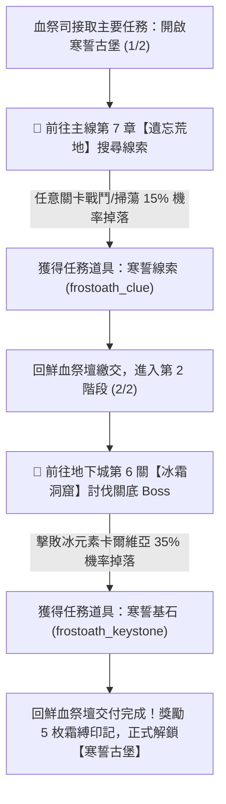

# 🏰 寒誓古堡 (Coldoath Citadel - Domain 2) 完整探索與解鎖指南

> 本文件依據遊戲底層資源 [meta_datas.tres](../../raw_tres/meta_datas.tres) 原始數據整理，全面解析第二冒險領域【寒誓古堡】的前置解鎖任務鏈、線索掉落關卡、探索機制、珍寶池爆率、三大守護首領與 VII 階隱藏英雄解鎖機制。

---

## 🧭 一、任務前置與解鎖全流程（開啟寒誓古堡 1/2 與 2/2）

在鮮血祭壇中，玩家將從血祭司處接取主要任務 **【開啟寒誓古堡】(`blood_altar_coldoath_citadel`)**。該任務分為兩大階段：

### 1. 第一階段：開啟寒誓古堡 (1/2)
* **任務文本**：
  > 「古老的寒誓古堡早已被徹底封印，其位置與入口皆湮沒在時間之中。前往荒蕪淒冷的遺忘荒地搜尋線索，據說那裏隱藏著關於封印真相的指引。」
* **目標物品**：`frostoath_clue`（寒誓線索）x 1
* **掉落關卡**：**主線第 7 章【遺忘荒地】(`forgotten_wasteland`) 的「任意關卡」（第 1 關 ～ 第 10 關）**
* **掉落機率**：**`15%`** (`drop_chance: 0.15`)
* **刷取最佳實務推薦**：
  1. **極速速刷**：若僅想儘快拿到線索，可反覆挑戰或掃蕩 **第 1 關（怪物 Lv.60）**，消耗資源最低、通關速度最快。
  2. **兼顧 5 階獸人裝備材料（推薦）**：
     * 刷 **第 5 關（哈魯戈爾 Lv.64）**：掉落「獸人皮盔圖紙」與哈魯戈爾狂暴斧。
     * 刷 **第 10 關（戈爾薩克 Lv.69）**：掉落「獸人皮腰帶圖紙」。
     * 同時可穩定積累鍛造 5 階獸人皮甲套裝必備的「獸人碎皮」與「圖騰掛墜」。

---

### 2. 第二階段：開啟寒誓古堡 (2/2)
* **目標物品**：`frostoath_keystone`（寒誓基石 / 鑰石）x 1
* **掉落關卡**：**地下城第 6 關【冰霜洞窟】(`frozen_caverns`)**
* **掉落來源**：關底 Boss **【冰元素卡爾維亞】(`ice_elemental_kalvia`)**
* **掉落機率**：**`35%`** (`drop_chance: 0.35`)
* **任務完成獎勵**：
  * **霜縛印記 (`frostbound_sigil`) x 5**（寒誓古堡探索門票）
  * 正式於鮮血祭壇解鎖 **【寒誓古堡】(`coldoath_citadel`)** 領域地圖。

---

## 📊 二、地圖基本資料與探索規則

* **領域名稱**：寒誓古堡 (`coldoath_citadel`)
* **推薦等級**：**Lv. 69 ~ Lv. 89**（建議隊伍平均戰力 3000+）
* **門票消耗**：每次探索固定消耗 **1 枚霜縛印記 (`frostbound_sigil`)**
* **探索遭遇小怪**：
  * 霜痕惡魔石雕 (`demon_frostscar_statue`)
  * 霜爪渡鴉 (`crow_frostclaw`)
  * 冷板殘軀魔像 (`golem_coldplate_husk`)
  * 霜紋誓約魔像 (`golem_Frostetched_vower`)
  * 冰屑餘燼元素 (`ice_elemental_icewisp_ember`)
  * 霜噬魔蝠 (`fiendbat_frostdrain`)
  * 霜語假面虛空使徒 (`voidborn_frostwhisper_mask`)
  * 霜心冰元素 (`ice_elemental_frostheart`)
  * 霜鎖巡鈴魔像 (`golem_frostlock_bellling`)

---

## 🎁 三、古堡珍寶獎勵池（12 大珍寶精確爆率表）

依據遊戲底層 `meta_datas.tres` 的稀有度權重陣列 (`rarity.chances: [100, 40, 20, 10, 5, 2.5, 1.25]`)，古堡珍寶池（總權重 **46.25**）各品階道具精確機率如下：

| 道具名稱 | 道具代碼 (ID) | 稀有度品階 | 抽取權重 (Weight) | 單抽機率 (Single) | 10 連抽命中率 (1 箱) | 10 連期望產出 | 屬性與戰略價值 |
| :--- | :--- | :---: | :---: | :---: | :---: | :---: | :--- |
| **👘 霜誓長袍** | `chest_frostoath_robe` | **6.0 (彩/超越)** | **1.25** | **2.70%** | **23.97%** | 0.27 件 | 法師專屬 6 階神話胸甲，附帶技能 `frostbound_majesty`（冰系傷害+50%、5%冰凍機率）。 |
| **🏹 霜羽箭袋圖紙** | `design_quiver_frostfeather` | **6.0 (彩/超越)** | **1.25** | **2.70%** | **23.97%** | 0.27 張 | 解鎖鍛造 6 階頂級霜羽箭袋（遊俠專屬核心副手）。 |
| **💎 霜龍召喚石圖紙** | `design_summonstone_frostdragon` | **6.0 (彩/超越)** | **1.25** | **2.70%** | **23.97%** | 0.27 張 | 解鎖珠寶工坊合成霜龍召喚石飾品。 |
| **🔨 投擲寒霜戰錘** | `throwing_frost_hammer` | **5.0 (紅/神話)** | **2.50** | **5.41%** | **42.63%** | 0.54 把 | 重型投擲武器，冷卻 5 回合，造成 500~800 點群體冰霜傷害。 |
| **🧿 寒葬護身符** | `amulet_coldburial` | **5.0 (紅/神話)** | **2.50** | **5.41%** | **42.63%** | 0.54 個 | 大型護身符：物防+10、魔防+10、冰霜專精+25、冰霜抗性+25。 |
| **💍 凜冬將至之戒** | `ring_endwinter` | **5.0 (紅/神話)** | **2.50** | **5.41%** | **42.63%** | 0.54 枚 | 5 階傳奇戒指：自帶雙重冰霜專精、雙重冰抗與幸運詞綴。 |
| **🧪 破雪藥水圖紙** | `design_snowbane_potion` | **4.0 (橘/傳說)** | **5.00** | **10.81%** | **68.15%** | 1.08 張 | 解鎖鍊金工坊調製「破雪藥水」。 |
| **🧪 破雪萬能溶劑** | `snowbane_alkahest` | **4.0 (橘/傳說)** | **5.00** | **10.81%** | **68.15%** | 1.08 個 | 調配高級永久聖油與解毒合劑的核心鍊金基質。 |
| **📜 霜息殘頁** | `frostbreath_page` | **4.0 (橘/傳說)** | **5.00** | **10.81%** | **68.15%** | 1.08 頁 | 調配霜誓聖油與高階技能書升級材料。 |
| **🧱 誓約之錠** | `ingot_oathbound` | **4.0 (橘/傳說)** | **5.00** | **10.81%** | **68.15%** | 1.08 塊 | 鍛造 6 階霜誓項鍊與誓約防具的高階金屬錠。 |
| **🪨 永凍玄武岩** | `everfrozen_basalt` | **4.0 (橘/傳說)** | **5.00** | **10.81%** | **68.15%** | 1.08 塊 | 冶煉誓約金屬錠必備礦石（2玄武岩 + 4誓約鎖鏈環 = 1誓約錠）。 |
| **🪙 霜縛印記** | `frostbound_sigil` | **3.0 (紫/史詩)** | **10.00** | **21.62%** | **91.25%** | 2.16 枚 | 古堡專屬門票兼兌換代幣，10連抽可保底回本約 2.16 枚。 |

> 📌 **開箱綜合機率提示**：
> * 開啟一個 **冷誓要塞大寶箱 (`chest_coldoath_citadel`)** 保證執行 **10 次連抽**。
> * 單次 10 連抽獲得 **至少 1 件 6 星彩色超越大獎（霜誓長袍 / 霜羽箭袋 / 霜龍石）** 的綜合機率為：
>   $$1 - (1 - 0.0811)^{10} \approx \mathbf{57.5\%}$$

---

## ❄️ 四、核心套裝與永久飲品

### 1. 【霜誓套裝】(`set_frostoath`) —— 法師頂級冰霜畢業套
* **組件**：
  * **霜誓長袍** (`chest_frostoath_robe`，胸甲，寶藏池/首領掉落)
  * **霜誓項鍊** (`necklace_frostoath`，項鍊，兌換所圖紙打造)
* **套裝技能**：
  * **長袍自帶【霜縛威嚴 (`frostbound_majesty`)】**：魔法傷害 +25%、物理傷害 +25%、攻擊附帶 5% 冰凍機率。
  * **項鍊自帶【不凋霜意 (`witherless_frost_will`)】**：總傷害 +15%、攻擊附帶 5% 霜痕機率。
* **2 件套套裝共鳴效果**：
  * **冰霜專精 (`ice_con`) +15.0**（全隊冰系輸出質變飛躍）。

### 2. 霜誓聖油 (`chrism_frostoath`) —— 永久屬性飲品
* **消耗材料**：霜息殘頁 x 5 + 破雪萬能溶劑 x 5 + 五階精華 x 1
* **使用效果**：**全隊永久 冰霜專精 (`ice_con`) +1.0、冰霜抗性 (`ice_res`) +1.0**
* **使用上限**：每位英雄最多使用 **10 瓶**（永久累計 +10 冰專精 / +10 冰抗性）。

---

## ⚔️ 五、三大守護首領 (Lord Boss) 與隱藏 VII 階英雄解鎖

古堡探索過程中遭遇的首領具備極高的挑戰性與豐厚獎勵：

| 首領名稱 | 首領 ID | 站位與隨從 | 專屬掉落物 | 核心價值與解鎖機制 |
| :--- | :--- | :--- | :--- | :--- |
| 🌟 **寒噬女巫 · 艾卡希雅** | `elf_mage_ecasia` | 後排 (精靈) 召喚：冷板殘軀魔像 | • 誓約頭盔圖紙 (`design_head_oathbound`) • 霜息殘頁 • 誓約之錠 • 艾卡希雅法杖/法典 | 🏆 **擊敗後正式解鎖 VII 階神話法師英雄【寒噬女巫 · 艾卡希雅】(`hero_mage_ecasia`)！** 隨後可於酒館兌換。 |
| **霜龍 · 阿祖洛斯** | `dragon_azulos` | 前排 (巨龍大型Boss) 單體迎戰 | • 誓約護手圖紙 (`design_hands_oathbound`) • 毀滅之石 (`destruction_stone_dragon_azulos`) • 冰霜龍心 (`dragon_heart_frost`) | 冰霜巨龍，具備寒霜吐息與骸骨甲殼護盾；掉落的冰霜龍心為打造霜誓項鍊核心材料。 |
| **冰霜魔像 · 哈爾登** | `golem_haldren` | 前排 (魔像肉盾) 召喚：霜紋誓約魔像 | • 誓約腰帶 (`waist_oathbound`) • 霜誓徽記 (`frostoath_emblem`) • 永凍玄武岩 • 誓約鎖鏈環 | 高額護甲與嘲諷減傷，掉落的「霜誓徽記」為後續挑戰惡魔領主西奧特魯斯 (`demon_theotrus`) 的門票材料。 |

---

## 🏛️ 六、古堡兌換所 (Exchange Shop) 資源兌換優先級指南

在古堡兌換所中，可使用積累的「霜縛印記」兌換珍貴圖紙與物資：

| 兌換項目 | 所需印記代幣 | 優先級評級 | 兌換建議與解析 |
| :--- | :---: | :---: | :--- |
| **霜誓項鍊設計圖** (`design_necklace_frostoath`) | **512 代幣** | 🥇 **第一優先 (畢業裝)** | 湊齊【霜誓 2 件套】的核心圖紙，賦予法師頂級爆發傷害與冰凍控場，強烈建議鎖定直換。 |
| **霜誓聖油設計圖** (`design_chrism_frostoath`) | **256 代幣** | 🥈 **第二優先 (永久面板)** | 解鎖調製永久冰系專精藥水，全隊吃滿 10 瓶可提升 10 點冰專精與 10 點冰抗性。 |
| **冷誓要塞寶箱** (`chest_coldoath_citadel`) | **256 代幣** | 🥉 **第三優先 (搏大獎)** | 保證 10 連抽，有 57.5% 機率開出 6 星彩裝（霜誓長袍 / 霜羽箭袋 / 霜龍石），但若未出貨易落空，建議換完項鍊圖紙後再換。 |
| **投擲寒霜戰錘** (`throwing_frost_hammer`) | **32 代幣** | ⚠️ **應急兌換** | 高額群體冰傷投擲武器，打高難 Boss 爆發壓血可用，平時不需多換。 |
| **破雪藥水** (`snowbane_potion`) | **16 代幣** | ⚠️ **不推薦** | 探索開箱與鍊金可自行調製，無需浪費珍貴印記兌換。 |
