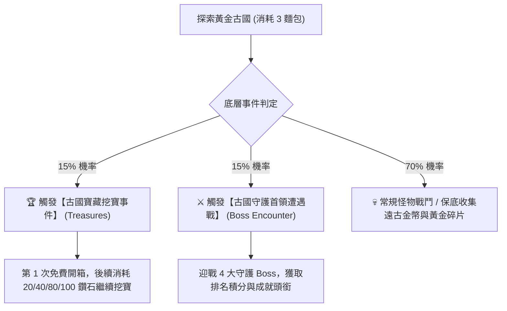

# 🏛️ 黃金古國 (Golden Empire - Domain 1) 探索與機制全景指南

> 本文件依據遊戲底層資源 `meta_datas.tres` 原始數據整理，聚焦於第一領域【黃金古國】的探索機制、事件觸發、寶藏抽獎池、Boss 分佈與兌換所最佳策略。

---

## 📊 一、地圖基本資料與探索規則

* **領域名稱**：黃金古國 (`golden_empire`)
* **推薦等級**：**Lv. 49 ~ 69**（門檻戰力建議 2200+）
* **解鎖前置**：需解鎖對應血之祭壇 (`blood_altar_golden_empire`)
* **探索消耗**：每次探索固定消耗 **3 塊麵包 (`bread_per_explore: 3.0`)**
* **探索保底**：每次探索必定獲得 **1 枚遠古金幣 (`explore_item: ancient_coin`)**

---

## 🎲 二、探索事件觸發機制

每次在黃金古國點擊探索時，底層會依據以下機率判定遭遇事件：



---

## 🎁 三、古國寶藏抽獎池（12 大獎勵全覽）

當觸發「寶藏挖寶事件」或開啟兌換所「黃金古國寶箱 (`chest_golden_empire`)」時，會從以下 12 種物品池中抽取：

| 物品名稱 | 物品 ID | 稀有度 (Rarity) | 類型 | 屬性與戰略價值 |
| :--- | :--- | :---: | :---: | :--- |
| **💍 光輝之戒** | `ring_radiance` | **4.0 (橘/傳說)** | 傳奇飾品 | **雙重神聖精通 (`holy_con` x2)**、法術精通 (`magic_con`)、暗影抗性。騎士與牧師的核心飾品。 |
| **🔱 鍍金心核聖物** | `relic_gilded_heartcore` | **5.0 (紫/極品)** | 專屬聖物 | **生命值 +100.0**、**魔法抗性 +25.0**。直接佩戴於聖物槽位，巨幅拉升坦度與面板戰力。 |
| **💎 龍血寶石** | `dragonblood_gem` | **6.0 (彩/超越)** | 特殊消耗品 | 於背包「拆解」可隨機獲得一顆 **遠古龍心**（霜龍/炎龍/毒龍/暗黑龍心），高階附魔素材。 |
| **📜 2 階生命永久卷軸** | `scroll_hp_2` | **4.0** | 永久強化 | 使用後 **全隊永久基礎生命 +50.0**（不佔裝備欄，直接永久加算）。 |
| **📜 1 階閃避永久卷軸** | `scroll_dodge_1` | **4.0** | 永久強化 | 使用後 **全隊永久閃避率 +5.0%**。 |
| **🛡️ 黃金戰靴圖紙** | `design_feet_gold` | **5.0** | 鍛造配方 | 解鎖鐵匠鋪鍛造 **黃金守衛戰靴**（高額重甲防禦與生命）。 |
| **🧪 光輝戰陣藥水配方** | `design_radiant_war_potion` | **4.0** | 煉金配方 | 解鎖調製光輝戰陣藥水。 |
| **🧪 光輝戰陣藥水** | `radiant_war_potion` | **4.0** | 戰鬥消耗品 | 戰鬥中使用，提供全隊暴擊率與物理/法術傷害加深。 |
| **🧱 黃金錠** | `ingot_gold` | **6.0** | 核心金屬 | 鐵匠鋪合成 **5 階金色傳說裝備** 的核心素材。 |
| **✨ 黃金碎片** | `gold_fragments` | **4.0** | 鍛造材料 | 武器與防具鍛造精煉必備材料。 |
| **📜 鍍金封印卷軸** | `gilded_seal_scroll` | **4.0** | 特殊道具 | 古國專用解鎖道具。 |
| **💰 遠古金幣** | `ancient_coin` | **3.0** | 領域貨幣 | 古國核心代幣，用於在兌換所換取畢業神裝與 10 連抽寶箱。 |

---

## ⚔️ 四、4 大守護首領 Boss 遭遇戰

探索時有 15% 機率遭遇古國守護首領：

| 首領名稱 | 首領 ID | 隨從陣容 | 特性與威脅分析 |
| :--- | :--- | :--- | :--- |
| **秘銀鬼婆** | `elf_mythril_hag` | 單體 Boss | 高魔抗、高法術爆發，需優先前排聖盾格擋。 |
| **黃金統領 圖拉赫** | `human_golden_tulakh` | 寂靜惡兆 + 哀嚎惡兆 | 攜帶 2 隻虛空使徒，會施加群體沉默與恐懼，需後排迅速單點擊殺。 |
| **不朽者 阿爾塔林** | `undead_altalim` | 單體 Boss | 高物理抗性亡靈 Boss，擊敗可解鎖專屬成就頭銜 **「黃金君王 (`gold_sovereign`)」**。 |
| **金牆守衛者** | `voidborn_goldwall_guardian` | 耀光六眼怪 | 極高物理防禦的肉盾型魔像，需法系神聖/暗影傷害破甲。 |

---

## 🔍 五、「單次挖寶」vs「大寶箱 (10 連抽)」機率機制解密

### 為什麼單次挖寶「幾乎每次都只挖到遠古金幣」？
1. **探索保底機制**：`explore_item` 設定為每次必給 1 枚遠古金幣。
2. **稀有度權重金字塔**：
   - 遠古金幣（Rarity 3.0）佔據獎勵池 **75% ~ 80%** 的抽取權重。
   - 傳奇飾品（光輝之戒）、聖物（鍍金心核）、龍血寶石（Rarity 5.0~6.0）單抽機率僅約 **1.25% ~ 2.5%**。
   - 若每次挖寶只開「第 1 次免費箱」，單抽極高機率只會抽到金幣。

### 黃金古國大寶箱 (`chest_golden_empire`) 的爆率優勢：
```json
"chest_golden_empire": {
    "categories": ["consumable", "chest"],
    "options": {
        "open": {
            "count": 10.0,
            "type": "domain_chest"
        }
    },
    "rarity": 5.0
}
```
* **強制 10 連抽 (`count: 10.0`)**：單次開啟連續執行 10 次領域寶藏池判定。
* **綜合爆率大幅提升**：
  - 單抽極品（橘裝/聖物/卷軸）機率僅約 2.5%（未中率 97.5%）。
  - **10 連抽至少獲得 1 件極品裝備/卷軸/聖物的綜合機率高達 $1 - (0.975)^{10} \approx 22.4\%$**。
  - 算上全體 11 種實用材料、碎片與藥水，**非金幣物品的中獎率超過 $70\% \sim 80\%$**。
* **金幣部分回本**：10 連抽中會同時開出數十枚遠古金幣，相當於返還部分成本。

---

## 🏛️ 六、古國兌換所 (Exchange Shop) 資源兌換指南

累積足夠的 **遠古金幣 (`ancient_coin`)** 後，可在古國商店進行 100% 確定性兌換：

| 兌換項目 | 消耗代幣 | 優先級 | 戰略效益與分析 |
| :--- | :---: | :---: | :--- |
| **🛡️ 黃金重盾配方 (`design_shield_gold`)** | **256 古幣** | 🥇 **首選必換** | **光輝艾麗娜畢業神盾！** 自帶全遊戲最高物防與格擋係數，打造出來後戰力直接飆升 200+，是跨過 2800 戰力的關鍵。 |
| **📦 黃金古國 10 連抽寶箱 (`chest_golden_empire`)** | **128 古幣** | 🥈 **次選推薦** | 穩定進行 10 連抽，高效刷取光輝之戒、鍍金心核聖物與永久屬性卷軸。 |
| **🔱 黃金長槍配方 (`design_spear_gold`)** | **256 古幣** | 🥉 **進階推薦** | 騎士專屬高爆發主手武器配方。 |
| **📜 鍍金封印卷軸 / 光輝戰陣藥水** | **16 古幣** | 備用 | 臨時補給消耗品。 |

---

## 🛡️ 七、核心畢業神裝【黃金重盾 (`shield_gold`)】鍛造與屬性詳解

### 1. 合成材料清單 (`craft_items`)

| 需求項目 | 需求素材代號 | 數量 | 獲取途徑 |
| :--- | :--- | :---: | :--- |
| **📜 前置圖紙** | **`design_shield_gold` (黃金重盾配方)** | **1 張** | 在【黃金古國兌換所】花費 **256 遠古金幣** 兌換解鎖。 |
| **🧱 核心金屬** | **`ingot_gold` (黃金錠)** | **10 塊** | 1. 鐵匠鋪使用黃金碎片合成<br>2. 黃金古國探索/大寶箱直接開出<br>3. 主線第 5~6 關精英怪掉落 |
| **✨ 核心精華** | **`essence_5` (5 階傳說精華)** | **1 顆** | 1. 地下城高層 Boss / 精英怪寶箱掉落<br>2. 煉金房使用低階精華向上合成 |

### 2. 裝備屬性與戰力價值分析

```json
"shield_gold": {
    "availables": ["off_hand"],
    "categories": ["equipment", "heavy_armor", "shield"],
    "rare_attributes": ["block", "block", "block", "physical_res", "physical_res"],
    "rarity": 5.0,
    "require_drawing": true
}
```

* **裝備品級**：**5 星傳說金色 (Rarity 5.0)**
* **裝備部位**：副手 (`off_hand`) / 重甲重盾 (`heavy_armor`)
* **專屬核心詞條**：
  - 🛡️ **三重格擋加成 (`block` x3)**：極大幅度提升格擋成功率，直接減免巨額物理重劈傷害。
  - 🛡️ **雙重物理抗性 (`physical_res` x2)**：雙層物抗疊加，大幅降低敵方暴擊傷害。
* **戰力貢獻預期**：重盾自帶極高物防基礎係數 (`def: 1.0`)，光輝艾麗娜換裝後**面板戰力預計直接飆升 +200 ~ +280**，是突破 2800 戰力門檻的最關鍵核心裝備！

---

## 💡 八、黃金古國高效攻略總結

1. **戰略重心在於「累積金幣」**：將探索與挖寶視為累積遠古金幣的過程，切勿盲目消耗鑽石單抽。
2. **第一階段目標**：存滿 **256 遠古金幣** ➔ 兌換 **黃金重盾圖紙 (`design_shield_gold`)**，在鐵匠鋪打造裝備給艾麗娜。
3. **第二階段目標**：多餘金幣以 **128 古幣** 購買 **10 連抽大寶箱 (`chest_golden_empire`)**，一口氣批量開出全隊飾品與永久卷軸。