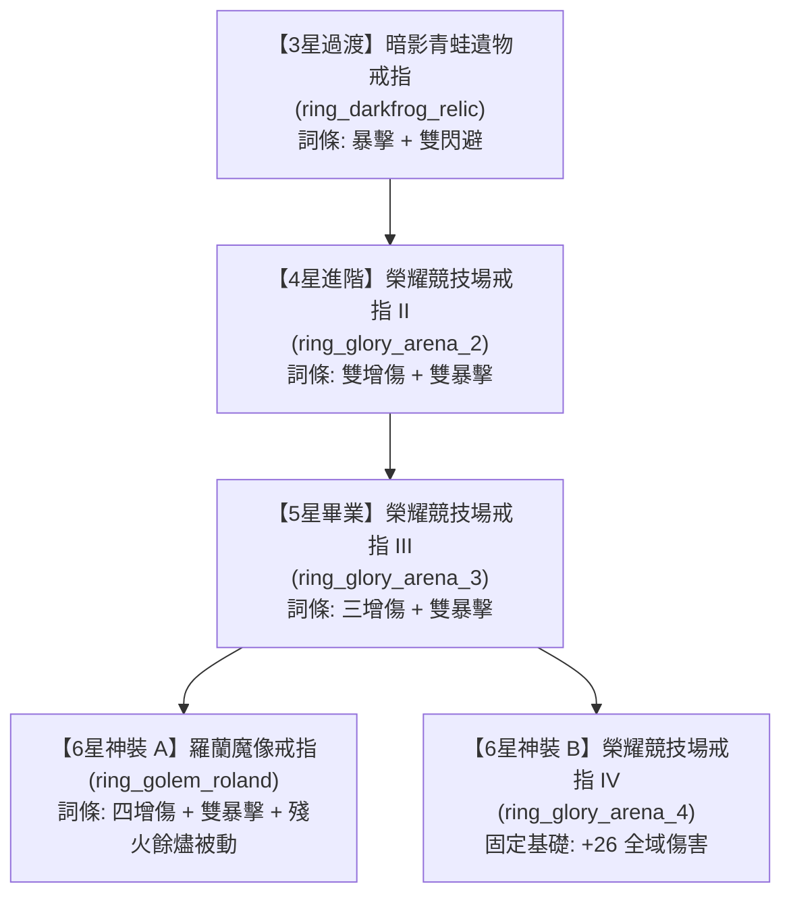

# 弓箭手（遊俠）戒指裝備完整推薦與養成指南 (3星 ~ 6星) 🏹💍

本指南深入解析《黑火遠征》中**遊俠 (Archer)** 體系（特別針對 **五階蛙人弓箭手 `hero_archer_5`** 與 **七階龍裔滅世弓箭手 `hero_archer_7`**）最適合搭配的戒指階梯路徑、詞條收益、掉落取得管道與製作決策。

---

## 🎯 一、核心結論與決策建議 (TL;DR)

### Q: 我在想要不要做 `ring_darkfrog_relic` (暗影青蛙遺物戒指)？
> **強烈推薦：前期與過渡期「非常值得做」！**
> 
> * **原因 1（完美的開荒詞條）**：擁有 `crit`（暴擊率）+ `dodge` × 2（雙閃避率）。弓箭手本身皮薄，雙閃避極大提高推圖容錯率，搭配暴擊可觸發高爆發輸出。
> * **原因 2（素材零衝突且成本親民）**：
>   * 消耗：青蛙眼晶石 (`frog_eye_crystal`) × 4 + 黑色史萊姆黏液 (`dark_slime_mucus`) × 4 + 三階精華 (`essence_3`) × 1。
>   * 這些素材主要來自 **史萊姆洞窟 (`slime_cave`)** 與 **黑暗沼澤 / 遠古樹林 (`dark_swamp` / `ancient_woodlands`)**，不消耗競技場幣，不影響後期核心榮耀競技場戒指的合成鏈！
> * **過渡角色完美適配**：可直接給 **五階蛙人弓箭手 (`hero_archer_5`)** 作為核心保命與暴擊飾品，直到中後期取得 5~6 星戒指為止。

---

## 🏹 二、3 星 ➔ 6 星 弓箭手戒指階梯梯隊

---

## 📋 三、詳細戒指數值與取得途徑

### 🔹 3 星（史詩級 Purple）

#### 1. 🥇 首選推薦：暗影青蛙遺物戒指 (`ring_darkfrog_relic`)
* **屬性池 (`rare_attributes`)**：`crit` (暴擊率), `dodge` (閃避率), `dodge` (閃避率)
* **合成配方**：
  * `frog_eye_crystal` (青蛙眼晶石) × 4
  * `dark_slime_mucus` (黑色史萊姆黏液) × 4
  * `essence_3` (三階精華) × 1
* **素材取得來源**：
  * **青蛙眼晶石**：擊敗關卡/副本中的蛙人族怪物（`frogman_archer`, `frogman_hunter`, `frogman_warrior`，主要分佈於 **黑暗沼澤 `dark_swamp`** 與 **遠古森林 `ancient_woodlands`**）。
  * **黑色史萊姆黏液**：**史萊姆洞窟 (`slime_cave`)** Boss 群組中的 `slime_dark` (黑史萊姆) 或 `slime_dark_baby` (小黑史萊姆)。
  * **三階精華**：由 1 階 ➔ 2 階 ➔ 3 階精華合成，或分解中階裝備獲得。

#### 2. 🔹 基礎底材：榮耀競技場戒指 I (`ring_glory_arena_1`)
* **固定屬性**：`damage: 6.0` (基礎增傷 +6)
* **取得途徑**：榮耀競技場 (`glory_arena`) 商店兌換 / 賽事獎勵。

---

### 🔹 4 星（傳說級 Orange）

#### 1. 🥇 輸出核心：榮耀競技場戒指 II (`ring_glory_arena_2`)
* **屬性池 (`rare_attributes`)**：`damage`, `damage`, `crit`, `crit`（雙增傷 + 雙暴擊）
* **合成配方**：
  * `ring_glory_arena_1` × 4
  * `essence_4` (四階精華) × 1
* **評價**：極致純輸出戒指，提供高額面板傷害與雙重暴擊機率，是弓箭手爆發流質變起點。

#### 2. 🥈 冰霜特化：霜縛之戒 (`ring_frostbinder`)
* **屬性池**：`damage`, `magic_con`, `ice_con`, `ice_con`
* **合成配方**：`ingot_frezon` × 2 + `ice_crystal_shard` × 4 + `essence_4` × 1
* **評價**：適合冰霜屬性英雄；若弓箭手未綁定冰系技能則優先選榮耀競技場戒指。

---

### 🔹 5 星（神話級 Red）

#### 1. 🥇 巔峰純輸出：榮耀競技場戒指 III (`ring_glory_arena_3`)
* **屬性池 (`rare_attributes`)**：`damage`, `damage`, `damage`, `crit`, `crit`（三增傷 + 雙暴擊）
* **合成配方**：
  * `ring_glory_arena_2` × 4
  * `essence_5` (五階精華) × 1
  * （或於競技場商店以 18,000 榮耀點數直接兌換）
* **評價**：5 條詞條全為極品物理/全域增傷與暴擊，無論是給 5 階蛙人還是 7 階滅世弓箭手都能輸出最大化。

---

### 🔹 6 星（超越/不朽級 Rainbow）

#### 1. 👑 終極畢業神戒：羅蘭魔像之戒 (`ring_golem_roland`)
* **職業限制**：全職業通用 (`all`)
* **屬性池 (`rare_attributes`)**：`damage`, `damage`, `damage`, `damage`, `crit`, `crit`（**四增傷 + 雙暴擊！全遊戲物理天花板**）
* **自帶被動技能 (`ember_afterglow` 殘火餘燼)**：
  * 當生命值低於 35% (`hp_rate: 0.35`) 時觸發，賦予高額增益護身（`buff_count: 9.0`），完美彌補弓箭手脆皮容易暴斃的痛點！
* **合成配方**：
  * `ring_glory_arena_3` (五星競技場戒指) × 1
  * `unnamed_hero_afterglow` (無名英雄餘燼) × 16
  * `essence_6` (六階精華) × 1
* **材料獲取來源**：
  * **無名英雄餘燼 (`unnamed_hero_afterglow`)**：
    * 擊敗 Boss **`golem_roland` (魔像羅蘭)** 掉落
    * 遠征商店 (`expedition_exchange_dic`) 兌換 (16 遠征幣/個)
    * 帳號每日重置稀有獎勵機率取得

#### 2. 🥈 穩定常規選擇：榮耀競技場戒指 IV (`ring_glory_arena_4`)
* **固定屬性**：`damage: 26.0` (全域直接增傷 +26)
* **合成配方**：`ring_glory_arena_3` × 4 + `essence_6` × 1

---

## 🎯 四、目標英雄專屬配裝指南

| 目標英雄 | 英雄定位 | 3~4 星推薦 | 5~6 星終極畢業 | 核心分析 |
| :--- | :--- | :--- | :--- | :--- |
| **五階 蛙人弓箭手 (`hero_archer_5`)** | 聖光/劇毒/迅捷爆發 | **`ring_darkfrog_relic`** | **`ring_glory_arena_3`** | 青蛙戒指提供雙閃避與暴擊，極度契合其 `swift_shot` 迅捷戰鬥風格與生存。 |
| **七階 滅世龍裔弓箭手 (`hero_archer_7`)** | 毀滅級單體/全體貫穿 | **`ring_glory_arena_2`** | **`ring_golem_roland`** | 終極追求「四增傷+雙暴擊」，配合其 `draconic_doom_mark` 與 `cataclysmic_arrow` 瞬間清場。 |
