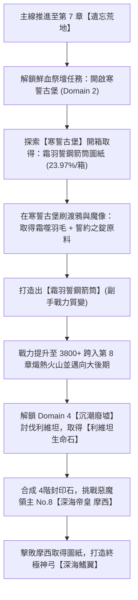

# 🏹 遊俠（弓箭手）頂級神兵與箭筒指南：深海鰭翼 & 霜羽誓鋼箭筒

> 本文件依據遊戲底層資料庫 `meta_datas.tres`（包含 `items`、`demon_lords`、`domains` 與 `characters` 模組）的確切數據整理，記錄遊俠（弓箭手）6 階頂級主手長弓【深海鰭翼】與 6 階副手箭筒【霜羽誓鋼箭筒】的基礎屬性、固有詞條、專屬技能、圖紙取得途徑、挑戰門檻及鍛造材料來源。

---

## 📊 一、兩大神兵面板屬性與特徵對照表

| 裝備名稱 | 底層代碼 (ID) | 裝備部位 | 稀有度階級 | 基礎傷害 (Dam) | 固有詞條 (`rare_attributes`) | 專屬技能 | 技能機制說明 |
| :--- | :--- | :---: | :---: | :---: | :--- | :--- | :--- |
| **深海鰭翼** | `bow_abysseroded_moses` | 主手長弓 (`main_hand`) | **6.0 (紅/神話)** ★ 1星神裝 | 71 ~ 238 (+6 時) | • 傷害 +10 • 暴擊 +10 • 物理增強 +10 | **裂浪激流** (`attack_arrow_wave`) | 普通攻擊附加水浪穿透效果，造成群體/範圍物理傷害。 |
| **霜羽誓鋼箭筒** | `quiver_frostfeather` | 副手箭筒 (`off_hand`) | **6.0 (紅/神話)** | 61 ~ 105 (+4 時) | • 傷害 +10 • 物理增強 +10 • 冰霜增強 +10 | **寒羽紛襲** (`frostfeather_barrage`) | 提升攻擊頻率與箭矢擴散，附帶冰霜屬性增傷與減速/冰凍傾向。 |

---

## 🌊 二、主手長弓：【深海鰭翼】(`bow_abysseroded_moses`)

### 1. 裝備圖紙取得管道
* **圖紙名稱**：`design_bow_abysseroded_moses`（深海鰭翼圖紙）
* **取得來源**：**首領討伐（惡魔領主 Demon Lords）No. 8 ——【深海帝皇 摩西】(`abysseroded_moses`, Lv.109)**。
* **首領討伐解鎖與召喚條件**：
  1. **必備門票**：消耗 **4階 惡魔封印石 (`demon_seal_stone_4`) $\times 1$**（由 4 個 3階封印石以 12.5% 機率合成）。
  2. **專屬祭品**：身上背包必須持有 **【利維坦生命之石】(`life_stone_abysseroded_leviathan`)**。
     * *利維坦生命之石來源*：通關冒險領域 **Domain 4【沉潮廢墟】(`sunkentide_ruins`)** 的關底首領 **【深淵侵蝕·利維坦】(`abysseroded_leviathan`)** 掉落。
* **位置指引**：在首領討伐（惡魔領主）選擇介面中，位於第 3 頁順位第 8 個魔王（需先推進前置章節與地下城解鎖）。

### 2. 鐵匠鋪鍛造所需材料與打法
解鎖圖紙後，於城鎮鐵匠鋪武器鍛造分類打造，需消耗下列材料：

| 材料名稱 | 底層 ID | 需求數量 | 取得方式與掉落地點 |
| :--- | :--- | :---: | :--- |
| **空間碎屑 / 次元碎片** | `dimensional_shard` | **8 個** | **Domain 4【沉潮廢墟】(Lv.89~109)** 的精英怪（深度處刑者、裂隙海德拉）、Boss 利維坦與摩西本體掉落；沉潮廢墟寶箱亦可開出。 |
| **相位鱗片** | `phasing_scales` | **16 個** | **Domain 4【沉潮廢墟】** 魚人族怪物（鰓生戰士/法師/盜賊、鰓生塞爾昆）、深度處刑者與摩西掉落。 |
| **誓約之錠** | `ingot_oathbound` | **16 塊** | 由鐵匠鋪冶煉加工（詳見第四節）。 |
| **深海氣泡** | `deepsea_bubble` | **32 個** | **Domain 4【沉潮廢墟】** 常見深海怪物（礁石潛伏者、深度處刑者、聖所守望者等）掉落。 |
| **六階精華** | `essence_6` | **1 個** | 由 **4 個五階精華 (`essence_5`)** 向上合成，或分解 6 階傳奇裝備產出。 |

---

## ❄️ 三、副手箭筒：【霜羽誓鋼箭筒】(`quiver_frostfeather`)

### 1. 裝備圖紙取得管道
* **圖紙名稱**：`design_quiver_frostfeather`（霜羽誓鋼箭筒圖紙）
* **取得途徑**：**第二冒險領域【寒誓古堡】(Coldoath Citadel - Domain 2, Lv.69~89)** 珍寶池。
* **重要機制確認**：
  * **任何怪物或首領 Boss 皆不會直接掉落此圖紙**。全遊戲底層資料中，該圖紙唯一配置於 `domains.coldoath_citadel.treasures`。
  * **開箱取得方式**：
    1. 在鮮血祭壇完成【開啟寒誓古堡】前置任務鏈（遺忘荒地搜尋線索 + 冰霜洞窟地下城討伐卡爾維亞）。
    2. 消耗門票【霜縛印記 (`frostbound_sigil`)】進入古堡探索並累積代幣。
    3. 兌換並開啟 **冷誓要塞大寶箱 (`chest_coldoath_citadel`)**。
    4. 大寶箱每箱執行 10 次連抽，單抽機率為 **2.70%**，單箱綜合獲得機率約為 **23.97%**。

### 2. 鐵匠鋪鍛造所需材料與打法
解鎖圖紙後，於城鎮鐵匠鋪副手鍛造分類打造，需消耗下列材料：

| 材料名稱 | 底層 ID | 需求數量 | 取得方式與掉落地點 |
| :--- | :--- | :---: | :--- |
| **誓約之錠** | `ingot_oathbound` | **16 塊** | 由鐵匠鋪冶煉加工（詳見第四節）。 |
| **霜噬羽毛** | `frostbitten_feather` | **6 根** | **Domain 2【寒誓古堡】** 專屬小怪 **【霜爪渡鴉】(`crow_frostclaw`)** 掉落。 |
| **六階精華** | `essence_6` | **1 個** | 由 **4 個五階精華 (`essence_5`)** 向上合成。 |

---

## 🧱 四、核心中間材料：【誓約之錠】(`ingot_oathbound`) 冶煉指引

鍛造上述兩件裝備共需消耗 **32 塊誓約之錠**（長弓 16 塊 + 箭筒 16 塊）。誓約之錠不可直接在常規商店購買，需在鐵匠鋪加工熔煉：

### 1. 冶煉合成配方
$$\text{1 塊 誓約之錠} = \mathbf{2 \text{ 顆 永凍玄武岩 (`everfrozen_basalt`)}} + \mathbf{4 \text{ 個 誓鎖鏈環 (`oathlock_chainlink`)}}$$
* 湊齊兩件裝備共需：**64 顆永凍玄武岩** + **128 個誓鎖鏈環**。

### 2. 原料產出與掉落地點
* **產出區域**：**Domain 2【寒誓古堡】(`coldoath_citadel`)**。
* **掉落怪物**：
  * **永凍玄武岩**：霜痕惡魔石雕、霜紋誓約魔像、冷板殘軀魔像、霜鎖巡鈴魔像、首領魔像哈爾德倫等。
  * **誓鎖鏈環**：霜痕惡魔石雕、霜紋誓約魔像、冷板殘軀魔像、霜鎖巡鈴魔像、霜語假面虛空使徒等。
* **寶箱產出**：開啟冷誓要塞大寶箱時，永凍玄武岩與誓約之錠成品亦具備各自 10.81% 的抽取權重。

---

## 🧭 五、養成解鎖與推進順序建議

