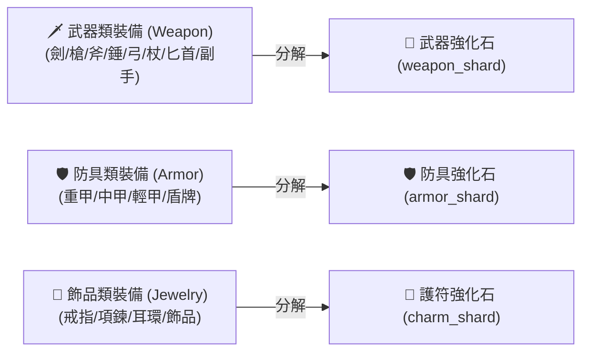
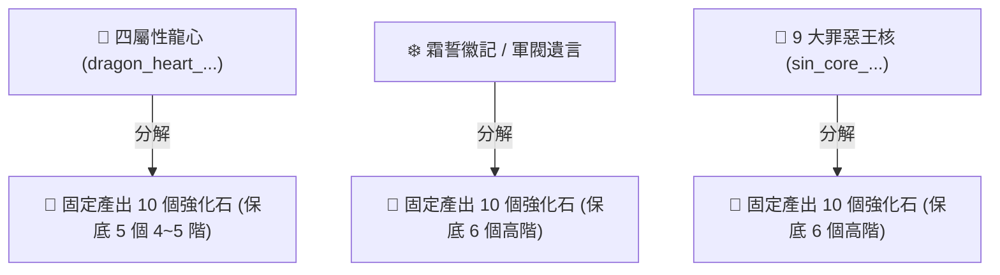

# 💎【裝備強化與分解系統】3階史詩與4階傳奇武器強化石分解與獲取指南

> 本文檔依據遊戲底層原始資料檔 `meta_datas.tres`、分解設定 (`dismantle`)、鐵匠鋪精煉 (`blacksmith.craft_dic`)、強化石分類 (`enhancement_stone`) 與怪物掉落表深度校對編寫。

---

## ⚙️ 一、裝備分解三大核心底層法則

在遊戲中，分解裝備產出的強化石遵循嚴格的**「部位對應」**與**「階級對應」**法則：

1. **部位精確鎖定**：
   * **只有分解「武器類（Weapon）」裝備**（包含主手武器與副手法典/箭筒），才會產出武器強化石。
   * 分解防具或盾牌只會產出防具石 (`armor_shard`)；分解飾品只會產出護符石 (`charm_shard`)。
2. **階級直接對應**：
   * 分解 **🟣 3 階（紫色史詩，`rarity: 3.0`）武器** ➔ 直接產出 **【3 階史詩武器強化石 (`weapon_shard_3`)】**。
   * 分解 **🟠 4 階（橘色傳奇，`rarity: 4.0`）武器** ➔ 直接產出 **【4 階傳奇武器強化石 (`weapon_shard_4`)】**。
3. **4 合 1 精煉合成鏈**：
   $$\text{4 個 1階 (綠)} \longrightarrow \text{1 個 2階 (藍)} \longrightarrow \text{4 個 2階} \longrightarrow \text{1 個 3階 (紫)} \longrightarrow \text{4 個 3階} \longrightarrow \text{1 個 4階 (橘)}$$

---

## 🟣 二、3 階史詩武器強化石 (`weapon_shard_3`)：可分解裝備清單

分解以下 **3 階紫色武器** 均可穩定獲得 3 階史詩武器強化石：

| 武器類型 | 可分解的 3 階紫色武器名稱 (底層 ID) | 主要掉落怪物 / 獲取關卡 |
| :--- | :--- | :--- |
| 🏹 **長弓 / 箭筒** | **【惡魔鋼弓】** (`bow_ingot_demonite`) 【紫色冒險長弓】 (`bow_004 / bow_005`) 【紫色皮質箭筒】 (`quiver_004 / quiver_005`) | 鐵匠鋪低成本打造 / 第 4 章【沙漠遺跡】、第 6 章【黑暗沼澤】小怪掉落 |
| 🔱 **長槍 / 戰斧** | **【沼澤酋長之矛】** (`spear_frogman_bog_chieftain`) **【符文碎塊戰斧】** (`axe_rune_shard`) 【紫色戰士長斧】 (`axe_warrior_5`) | 黑暗沼澤 Boss【泥沼酋長】掉落 / 鐵匠鋪（符文碎片+優質鋼錠）打造 |
| 🗡️ **單手劍 / 匕首**| **【遠古樹人之劍】** (`sword_treant_ancient`) **【骷髏卡爾多之刺】** (`dagger_skeleton_kaldor`) | 地下城【迷霧森林】樹人 Boss 掉落 / 沙漠遺跡【骸骨刺客】掉落 |
| 🔮 **法杖 / 權杖** | **【灼熱骷髏法杖】** (`staff_skeleton_scorching_king`) **【詛咒先知權杖】** (`scepter_specter_cursed_oracle`) **【怨魂法典】** (`book_wraith_core`) | 沙漠遺跡 Boss【灼熱骷髏王】掉落 / 黑暗沼澤精英怪掉落 / 鐵匠鋪打造 |

---

## 🟠 三、4 階傳奇武器強化石 (`weapon_shard_4`)：可分解裝備清單

分解以下 **4 階橘色傳奇武器** 均可直接獲得 4 階傳奇武器強化石：

| 武器類型 | 可分解的 4 階橘色武器名稱 (底層 ID) | 主要掉落怪物 / 獲取關卡 |
| :--- | :--- | :--- |
| 🏹 **長弓 / 箭筒** | **【冰霜食屍鬼之弓】** (`bow_ghoul_frost`) **【霜魔箭筒】** (`quiver_frost_demon`) 【傳說遊俠長弓】 (`bow_hero_theron`) | 🎯 **當前最佳刷點**：第 5 章【冰霜峽谷】關底 Boss【冰霜食屍鬼】高頻掉落 / 鐵匠鋪打造 |
| 🔮 **法杖 / 權杖** | **【冰霜元素法杖】** (`staff_ice_elemental_kalvia`) **【幽魂伊薩里昂法典】** (`book_wraith_issarion`) **【惡魔鋼權杖】** (`scepter_ingot_demonite`) | 冰霜峽谷精英 Boss【冰元素卡爾維亞】掉落 / Lord 首領【幽魂伊薩里昂】掉落 |
| 🗡️ **重錘 / 匕首** | **【腐化守衛重錘】** (`hammer_corrupted_warden`) **【無面恐魔之刺】** (`dagger_faceless_terror`) | 冰霜峽谷 / 黑暗地牢精英怪【腐化守衛】掉落 / 暗影深淵【無面恐魔】掉落 |
| 🪓 **戰斧 / 長槍** | **【哈魯戈爾狂暴斧】** (`axe_orc_harugor`) **【巨熊約爾達長槍】** (`spear_bear_yolda`) | 【遺忘荒地】第 5 關 Boss【哈魯戈爾】掉落 / 冰霜峽谷【巨熊約爾達】掉落 |

---

## ⚡ 四、不打武器的「超速分解捷徑」：直接分解特殊材料

遊戲底層中，部分高級 Boss 材料支援**直接在背包分解**，會一口氣產出大量強化石：

1. 🐉 **四屬性龍心 (`dragon_heart_frost / flame / venom / darkness`)**：
   * 分解 1 顆龍心 ➔ **固定產出 10 個強化石 (保底 5 個 4~5 階高階石)**。
2. ❄️ **霜誓徽記 (`frostoath_emblem`) / 軍閥遺言 (`warlord_last_word`)**：
   * 分解 1 個 ➔ **固定產出 10 個強化石 (保底 6 個 4~5 階高階石)**。
3. 👑 **各大罪惡王核 (`sin_core_...`)**：
   * 分解 1 個 ➔ **固定產出 10 個強化石 (保底 6 個高階強化石)**。

---

## 🎯 五、掛機與發育實務建議

1. **初期與中期衝 2800 戰力**：
   * 多餘的綠/藍裝一鍵分解積攢 1~2 階武器石，在鐵匠鋪合成 3 階紫石與 4 階橘石。
   * 全力掛機 **【第 5 章：冰霜峽谷】**，刷取多餘的 **冰霜食屍鬼弓** 分解直接獲得 4 階橘石，快速將主力武器強化至 **+7**！
