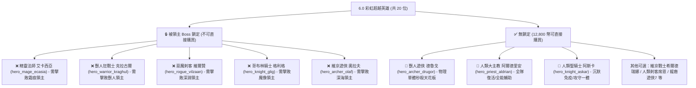

# 👑 12,800 英雄幣首抽指南：全無鎖定 (Unlocked) 頂級彩虹英雄選卡評估報告

> 本報告依據遊戲底層原始資源檔 `meta_datas.tres`，已徹底過濾排除所有被領主 Boss 鎖定 (Locked) 的英雄（如精靈法師艾卡西亞、獸人狂戰克拉古爾等），專門針對**酒館可直接無條件消耗 12,800 英雄幣購買的「無鎖定 6.0 彩虹英雄」**進行深度戰略評估。

---

## 📊 一、底層鎖定狀態全面檢驗清單 (Lock vs Unlocked)

---

## 🎯 二、當前隊伍痛點與替換決策

根據您目前的實際體驗：
1. **🔮 冥語者澤穆爾 (`hero_priest_6`)**：
   - 技能全為「暗影傷害 (Darkness)」，中後期副本大量怪物天生暗抗達 200%，傷害直接被抵銷 60%~80%，輸出時好時壞極不穩定。
2. **🏹 疾弓芬奇 (`hero_archer_5`)**：
   - 純物理傷害，永不被怪物屬性免疫；自帶雙動與 AP+1 技能，發揮扎實穩定。
3. **🛡️ 光輝艾麗娜 (`hero_knight_5`)**：
   - 每級 +5 物防成長 + 全體加甲 + 低血急救，前排非常稱職。

> 💡 **核心決策：首隻 12,800 英雄幣，100% 優先替換【冥語者澤穆爾】！**

---

## 🏆 三、【無鎖定】12,800 彩虹英雄最強推薦 TOP 3

---

### 🥇 首選推薦：【獸人遊俠】德魯戈 (`hero_archer_drugor`)
* **解鎖狀態**：✅ **完全無鎖定 (酒館 12,800 英雄幣可直接購買)**
* **職業 / 種族**：遊俠 (Archer) / 獸人 (`orc`)
* **傷害屬性**：**純物理傷害 (無任何屬性免疫風險)**
* **核心技能機制 (7 技能全開)**：
  - **`爆血處決 (bloodburst_execution)`**：**200% 物理傷害 + 50% 額外加成**，對流血/中毒目標直接造成核彈級單體斬殺。
  - **`血液回收 (blood_recycle)` (被動)**：45% 機率獲得 3 層嗜血 (Bloodlust)。
  - **`赤紅臨界 (crimson_threshold)` (被動)**：暴擊時直接獲得 **行動點 AP +1**。
* **換入後的陣容即時效益**：
  - 陣容變為：**光輝艾麗娜 (前排坦克) + 疾弓芬奇 (中排雙動疊毒) + 德魯戈 (後排處決收割)**。
  - 芬奇的高頻物理與劇毒能持續觸發德魯戈的嗜血與 AP 雙動，**組成雙物理連擊流，徹底解決澤穆爾暗影無效的問題，Boss 戰秒殺速度提升 3 倍以上！**
* **後期終極成型潛力**：
  - 搭配後期的維京戰士或獸人戰士，觸發獸人部族連動 (`tribal_synergy`)，為全遊戲物理傷害天花板。

---

### 🥈 次選推薦：【人類大主教】阿爾德里安 (`hero_priest_aldrian`)
* **解鎖狀態**：✅ **完全無鎖定 (酒館 12,800 英雄幣可直接購買)**
* **職業 / 種族**：牧師 (Priest) / 人類 (`human`)
* **傷害屬性**：神聖傷害 (對惡魔/亡靈具備雙倍負抗性破甲)
* **核心技能機制 (7 技能全開)**：
  - **`使徒復生 (apostolic_revival)` (被動神技)**：**隊友死亡時被動觸發立即滿血復活！全遊戲唯一自帶復活的英雄。**
  - **`祝福之泉 (benediction_fountain)`**：全體持續高額生命回復與負面狀態淨化。
  - **`天堂審判 (heaven_Judicium)`**：神聖破防削抗，大幅提升隊友輸出。
* **換入後的陣容即時效益**：
  - 陣容變為：**光輝艾麗娜 (人類騎士) + 阿爾德里安 (人類牧師) + 疾弓芬奇 (後排物理)**。
  - 與艾麗娜觸發人類 `balance`（全屬性+10%）與 `courage_legion`（軍團勇氣），全隊極致坦度 + 自帶復活，通關掛機 100% 永不翻車！

---

### 🥉 備選推薦：【人類聖騎士】阿斯卡 (`hero_knight_askar`)
* **解鎖狀態**：✅ **完全無鎖定 (酒館 12,800 英雄幣可直接購買)**
* **職業 / 種族**：騎士 (Knight) / 人類 (`human`)
* **核心技能機制**：
  - **`騎士誓約 (knight_sacred_oath)`**：**天生免疫沉默**，暗影/神聖抗性全 +50%。
  - **`穿透聖炎 (piercing_lightflame)`**：200% 神聖傷害單體爆發。
  - **`聖槍衝鋒 (holy_spear_charge)`**：全體物理衝鋒 + 破甲虛弱。
* **換入後效益**：直接將光輝艾麗娜升級為攻守一體的終極前排。

---

## 📋 四、綜合評估與選卡決策對照表

| 評估維度 | 🥇 獸人遊俠 德魯戈 (`hero_archer_drugor`) | 🥈 人類大主教 阿爾德里安 (`hero_priest_aldrian`) |
| :--- | :--- | :--- |
| **解鎖狀態** | ✅ **無鎖定 (可直接 12800 幣購買)** | ✅ **無鎖定 (可直接 12800 幣購買)** |
| **替換對象** | 換掉 冥語者澤穆爾 | 換掉 冥語者澤穆爾 |
| **傷害屬性** | **純物理傷害** (永不被屬性抗性抵銷) | 神聖傷害 + 全體治療 |
| **核心優勢** | 200% 爆血處決、暴擊 AP+1 雙動、Boss 秒殺器 | **被動隊友復活**、全體高額受癒、團隊容錯極限 |
| **陣容連動** | 與芬奇組成「雙物理雙動暴擊組」 | 與艾麗娜組成「人類軍團全屬性 +10%」 |
| **適合玩家取向** | **追求爽快秒怪、極速刷圖、高爆發** | **追求極致穩健、安全通關、掛機不翻車** |

---

### 💡 結論建議：
- 如果您目前最頭痛的是**「打怪傷害不穩定、Boss 打太慢」** ➔ **首選 `hero_archer_drugor` (獸人遊俠 德魯戈)**！
- 如果您目前最想要的是**「全隊極度安全、保證前排不倒、自帶隊友復活」** ➔ **首選 `hero_priest_aldrian` (大主教 阿爾德里安)**！
