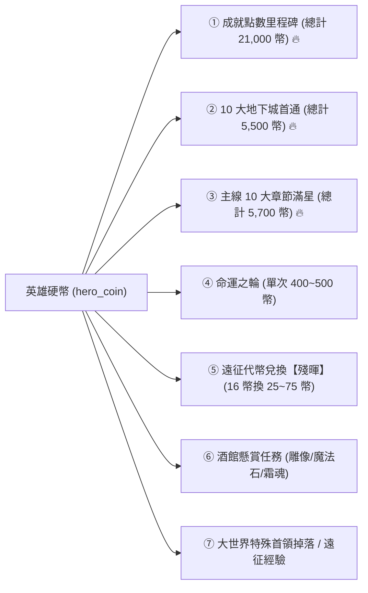

# 🪙 Blackfire Crusade 英雄硬幣 (Hero Coin) 全景解析與獲取手冊

> 本文檔依據遊戲底層數據 `meta_data/raw_tres/meta_datas.tres` 之全域掃描，完整收錄「英雄硬幣」的定價公式、已實裝/未實裝機制、全獲取管道（主線、地下城、成就、特殊道具拆解、大世界掉落等）與實戰集幣路徑。

---

## 📌 一、貨幣基本定義與變數識別

* **底層變數 ID (Variable ID)**：`hero_coin`（單一獎勵、背包項目、任務報酬與掉落定義）
* **複數集合鍵 (Plural Key)**：`hero_coins`（命運之輪等獎勵池結構）
* **遊戲繁中官方名稱**：**英雄幣 (Hero Coin)**

---

## 🏷️ 二、酒館招募英雄定價與退役機制真相

遊戲底層在 `settings.character_summon_costs` 定義了全階級英雄的招募價格；在 `settings.character_decompose_rate` 定義了退役返還係數（**12.5%**）：

| 英雄階級 / 品質星級 | 官方招募價格 (`hero_coin`) | 底層折現預設值 (`hero_coin`) | 實裝狀態與說明 |
| :--- | :---: | :---: | :--- |
| **0 星 (普通 白)** | **`200`** | `25` | 基礎白卡英雄 |
| **1 星 (優秀 綠)** | **`400`** | `50` | 綠色過渡英雄 |
| **2 星 (稀有 藍)** | **`800`** | `100` | 藍色初期英雄 |
| **3 星 (史詩 紫)** | **`1,600`** | `200` | 紫色中期英雄 |
| **4 星 (傳說 橘)** | **`3,200`** | `400` | 橘色核心（如艾麗娜、疾弓芬奇） |
| **5 星 (神話 紅)** | **`6,400`** | `800` | 紅色高階（如冥語者澤穆爾、精靈遊俠6） |
| **6 星 (彩虹 VII階)** | **`12,800`** | `1,600` | 🏆 **頂級彩卡（如獸人遊俠德魯戈、大主教阿爾德里安）** |
| 🛡️ **特殊自選定價** | **`15,600`** | `1,950` | 【神聖裁決者】阿斯卡 (`hero_knight_askar`) 專屬特價 |

> [!WARNING]
> **⚠️ 關於「退役 / 分解英雄」功能的實裝真相**：
> 雖然底層數據寫入了 `character_decompose_rate: 0.125`（12.5% 返還），但遊戲作者在當前 PC/Steam 客戶端畫面上**並未實裝「英雄退役/直接出售英雄」按鈕**。因此目前無法直接將抽到的多餘英雄賣掉折現。

---

## 📦 三、英雄硬幣 (`hero_coin`) 全獲取管道清單 (實裝可領取)

在遊戲中，可實質獲取英雄硬幣的 **7 大核心管道** 如下：



---

### 1. 🏆 成就點數總里程碑 (`achievements.settings.rewards`) —— 【最大金礦：21,000 幣】
只要累積成就點數達到指定里程碑，即可在成就介面領取高額英雄幣與寶石（**累計可獲得 `21,000 英雄幣`**）：

| 成就點數要求 | 英雄幣獎勵 (`hero_coin`) | 附加寶石獎勵 | 成就點數要求 | 英雄幣獎勵 (`hero_coin`) | 附加寶石獎勵 |
| :---: | :---: | :---: | :---: | :---: | :---: |
| **100 點** | **+100 幣** | +100 寶石 | **1,100 點** | **+1,100 幣** | +1,100 寶石 |
| **200 點** | **+200 幣** | +200 寶石 | **1,200 點** | **+1,200 幣** | +1,200 寶石 |
| **300 點** | **+300 幣** | +300 寶石 | **1,300 點** | **+1,300 幣** | +1,300 寶石 |
| **400 點** | **+400 幣** | +400 寶石 | **1,400 點** | **+1,400 幣** | +1,400 寶石 |
| **500 點** | **+500 幣** | +500 寶石 | **1,500 點** | **+1,500 幣** | +1,500 寶石 |
| **600 點** | **+600 幣** | +600 寶石 | **1,600 點** | **+1,600 幣** | +1,600 寶石 |
| **700 點** | **+700 幣** | +700 寶石 | **1,700 點** | **+1,700 幣** | +1,700 寶石 |
| **800 點** | **+800 幣** | +800 寶石 | **1,800 點** | **+1,800 幣** | +1,800 寶石 |
| **900 點** | **+900 幣** | +900 寶石 | **1,900 點** | **+1,900 幣** | +1,900 寶石 |
| **1,000 點** | **+1,000 幣** | +1,000 寶石 | **2,000 點** | **+2,000 幣** | +2,000 寶石 |

---

### 2. 🏰 10 大地下城首通獎勵 (`dungeons.rewards`) —— 【累計 5,500 幣】
通關各大地下城並開啟結算寶箱時一次性給予：

| 地下城名稱 (ID) | 英雄幣獎勵 (`hero_coin`) | 附加寶石獎勵 |
| :--- | :---: | :---: |
| 🔹 **史萊姆洞窟** (`slime_cave`) | **+100 幣** | +100 寶石 |
| 🔹 **幽影深淵** (`shadowy_abyss`) | **+200 幣** | +200 寶石 |
| 🔹 **森林迷宮** (`forest_maze`) | **+300 幣** | +300 寶石 |
| 🔹 **神秘遺跡** (`mysterious_ruins`) | **+400 幣** | +400 寶石 |
| 🔹 **黑暗監獄** (`dark_prison`) | **+500 幣** | +500 寶石 |
| 🔹 **冰霜洞窟** (`frozen_caverns`) | **+600 幣** | +600 寶石 |
| 🔹 **獸人掩體** (`orc_bunker`) | **+700 幣** | +700 寶石 |
| 🔹 **巨龍之巢** (`dragon_lair`) | **+800 幣** | +800 寶石 |
| 🔹 **遠古陵墓** (`ancient_tomb`) | **+900 幣** | +900 寶石 |
| 🔹 **深淵地獄** (`abyss_hell`) | **+1,000 幣** | +1,000 寶石 |

---

### 3. 🗺️ 主線 10 大章節滿星寶箱 (`level_groups.rewards`) —— 【累計 5,700 幣】
達成章節星數挑戰時領取：

| 章節序號 | 章節地圖名稱 | 敵方等級 | 英雄幣獎勵 (`hero_coin`) | 附加寶石獎勵 |
| :---: | :--- | :---: | :---: | :---: |
| 1 | **天空平原** (`skyward_plains`) | Lv. 0~9 | **+100 幣** | +100 寶石 |
| 2 | **遺棄石原** (`forsaken_stonefield`) | Lv. 10~19 | **+200 幣** | +200 寶石 |
| 3 | **遠古樹林** (`ancient_woodlands`) | Lv. 20~29 | **+300 幣** | +300 寶石 |
| 4 | **沙漠遺跡** (`desert_ruins`) | Lv. 30~39 | **+400 幣** | +400 寶石 |
| 5 | **黑暗沼澤** (`dark_swamp`) | Lv. 40~49 | **+500 幣** | +500 寶石 |
| 6 | **冰霜峽谷** (`frozen_gorge`) | Lv. 50~59 | **+600 幣** | +600 寶石 |
| 7 | **遺忘荒地** (`forgotten_wasteland`) | Lv. 60~69 | **+900 幣** | +900 寶石 |
| 8 | **熾熱火山** (`fiery_volcano`) | Lv. 70~79 | **+800 幣** | +800 寶石 |
| 9 | **死者領域** (`domain_dead`) | Lv. 80~89 | **+900 幣** | +900 寶石 |
| 10 | **地獄之門** (`gate_hell`) | Lv. 90~99 | **+1,000 幣** | +1,000 寶石 |

---

### 4. 🌟 特殊道具拆解：「無名英雄的殘暉 (`unnamed_hero_afterglow`)」
* **道具品質**：4 星傳說橘色（`sort_id: 3_open`）
* **拆解效果**：點擊拆解固定隨機開出 **`25 ~ 75` 枚 `hero_coin`**（平均單個 50 幣）。
* **無限制兌換路徑**：前往遠征商店 (`expedition_exchange_dic`)，**每花費 `16 遠征代幣` 即可無限制兌換 1 個殘暉**！

---

### 5. 🎡 命運之輪 (`fate_wheel.hero_coins`)
* 消耗命運幣 (`fate_coin`) 轉動命運之輪，抽中英雄硬幣格單次給予 **`400` 或 `500` 英雄幣**。

---

### 6. 📜 酒館專屬懸賞任務 (`quests`)
* 交付 **20 個英雄雕像 (`heroic_statue`)** ➔ **`+500 英雄幣`**
* 交付 **1 個遠古魔法石 (`ancient_magic_stone`)** ➔ **`+200 英雄幣`**
* 交付 **10 個霜魂水晶 (`frost_wraith_soul_crystal`)** ➔ **`+500 英雄幣`**

---

### 7. 👹 大世界特定精英怪物掉落 (`droppable_currencies`)
* 擊敗大世界特定稀有首領（如 **羅蘭魔像 `golem_roland`** 等）時，有機率直接掉落 **`25 ~ 75` 枚英雄幣**。
* 大世界累積經驗里程碑（12.8萬 / 25.6萬 / 51.2萬）分別獎勵 **+128 / +256 / +512 英雄幣**。
* 帳號升級每次固定獎勵 **+50 英雄幣**。

---

## 🎯 四、最速湊滿 12,800 英雄幣清單與優先級

```
【第 1 優先】成就點數領取 ➔ 檢查「成就頁面」所有已達成但未點擊領取的里程碑（高達上千幣）！
【第 2 優先】遠征代幣兌換 ➔ 到「遠征商店」把所有閒置遠征幣按 16:1 全換成【無名英雄的殘暉】並拆解！
【第 3 優先】通關未打過的地下城 ➔ 史萊姆洞窟至冰霜洞窟等前 6 個地下城首通（直接現拿 2,100 幣）！
【第 4 優先】主線滿星章節寶箱 ➔ 檢查前 6 章主線是否全滿星領完寶箱（直接現拿 2,100 幣）！
```