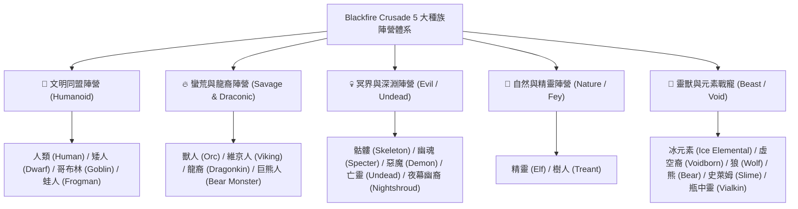

# 🧬 Blackfire Crusade 全英雄種族機制與連動效果全景指南

> 本文件依據遊戲底層資源 `meta_datas.tres` 原始數據整理，全面解析全 21 大種族的基礎體質、天賦特性 (Characteristics)、標籤陣營 (Tags)、專屬種族技能以及跨種族連動機制 (Racial Synergy)。

---

## 🧬 一、全英雄 21 大種族分類與定位全景圖

遊戲中 60 位英雄與戰寵共分屬 **21 個種族**，可歸納為 5 大陣營體系：

---

## 📊 二、21 大種族底層原始體質、天賦特質與專屬技能對照表

根據 `meta_datas.tres` 底層定義，全 21 種族的原始基礎生命、攻擊力區間、標籤陣營、天賦特性 (Characteristics) 與專屬種族技能如下：

| 種族代號 | 種族名稱 | 代表英雄/戰寵 | 基礎生命 (HP) | 基礎傷害 (Dam) | 標籤陣營 (Tags) | 天賦特性 (Characteristics) | 專屬種族技能 (Racial Skills) |
| :--- | :--- | :--- | :---: | :---: | :--- | :--- | :--- |
| `dragonkin` | **龍裔** | `hero_archer_7` | **200.0** | 25.0 ~ 35.0 | `dragon`, `humanoid` | `ancient_bloodline`, `dragon_wisdom`, `experience_epiphany`, `balance` | `draconic_awakening`, `dragonheart_renewal` |
| `orc` | **獸人** | `hero_archer_drugor`, `hero_warrior_kraghul`, `hero_priest_7` | **220.0** | 25.0 ~ 35.0 | `humanoid`, `orc` | `rough_hide`, `sturdy_will`, `frenzied_might`, `sturdy_physique`, `beastly_armor` | `rage_howl`, `tribal_synergy` |
| `viking` | **維京人** | `hero_archer_olaf`, `hero_warrior_hildrena` | **180.0** | 25.0 ~ 35.0 | `humanoid`, `viking` | `balance`, `sturdy_physique`, `rough_hide` | `shieldwall_oath` |
| `dwarf` | **矮人** | `hero_knight_bragos`, `hero_warrior_5` | **135.0** | 5.0 ~ 10.0 | `humanoid` | `sturdy_physique`, `ironclad_resistance` | `soul_stacking` |
| `goblin` | **哥布林** | `hero_knight_glig`, `hero_mage_nobiz` | **115.0** | 8.0 ~ 12.0 | `humanoid` | `swift_initiative`, `brightmind_surge` | `emergency_gear_jump` |
| `elf` | **精靈** | `hero_mage_ecasia`, `hero_archer_1/4/6`, `hero_knight_3` | **125.0** | 8.0 ~ 12.0 | `humanoid` | `swift`, `magic_safeguard` | `soul_stacking` |
| `human` | **人類** | `hero_knight_askar`, `hero_priest_1~3/5/aldrian` | **125.0** | 8.0 ~ 12.0 | `humanoid` | `experience_epiphany`, `balance` | `courage_legion` |
| `frogman` | **蛙人** | `hero_archer_5` | **135.0** | 8.0 ~ 12.0 | `humanoid` | `moist_skin`, `slimy_defense` | `whispers_death`, `flesh_feeder`, `necrophageous_hunger` |
| `treant` | **樹人** | `hero_mage_7`, `hero_warrior_7` | **165.0** | 12.0 ~ 18.0 | `plant`, `humanoid` | `root_connection`, `wooden_skin` | `nature_affinity` |
| `bear_monster` | **暴走巨熊** | `hero_knight_yolda` | **180.0** | 20.0 ~ 30.0 | `humanoid`, `beast` | `rough_hide`, `sturdy_will` | `bear_spirit_awakening`, `feral_fury` |
| `nightshroud` | **夜幕幽裔** | `hero_mage_6`, `hero_rogue_4` | **145.0** | 8.0 ~ 12.0 | `humanoid` | `night_grace`, `scorching_veil`, `magic_safeguard` | `rage_howl`, `tribal_synergy` |
| `skeleton` | **骷髏** | `hero_priest_4`, `hero_rogue_5`, `hero_warrior_6` | **155.0** | 12.0 ~ 17.0 | `evil`, `humanoid` | `bone_resilience`, `dark_affinity` | `skeleton_summon`, `necromancer_protection` |
| `specter` | **幽魂** | `hero_priest_6` | **155.0** | 24.0 ~ 30.0 | `evil`, `spirit` | `dark_affinity`, `incorporeal_form` | `vengeful_spirit` |
| `demon` | **惡魔** | `hero_priest_bathory`, `hero_rogue_vilzaan` | **220.0** | 18.0 ~ 28.0 | `humanoid`, `evil` | `rough_hide`, `sturdy_physique`, `frenzied_might`, `dark_affinity`, `sturdy_will`, `heat_resistance` | `hell_pact`, `hell_power`, `slaughter_flames` |
| `undead` | **亡靈** | `hero_rogue_6` | **165.0** | 12.0 ~ 16.0 | `evil`, `corrupted`, `humanoid` | `decayed_form`, `undead_resilience` | `whispers_death`, `flesh_feeder` |
| `vialkin` | **瓶中靈** | `pet_healing_flashling` | **80.0** | 10.0 ~ 14.0 | `spirit` | `incorporeal_form`, `arcane_resistance`, `magic_safeguard` | `shieldwall_oath` |
| `wolf` | **巨狼** | `pet_hound_boneclaw` | **100.0** | 10.0 ~ 14.0 | `beast` | `sharp_claws`, `swift_initiative` | - |
| `bear` | **戰熊** | `pet_savage_grizzly` | **220.0** | 17.0 ~ 25.0 | `beast` | `rough_hide`, `sturdy_will` | `feral_fury` |
| `ice_elemental` | **冰元素** | `pet_slateshard_bruiser` | **300.0** | 20.0 ~ 30.0 | `elemental` | `coldborne_form`, `frost_power`, `elemental_power` | - |
| `slime` | **史萊姆** | `pet_slime_flame` | **80.0** | 8.0 ~ 10.0 | `corrupted`, `ooze` | `swift`, `venom_barrier` | - |
| `voidborn` | **虛空後裔** | `pet_voidsilver_sentinel` | **200.0** | 20.0 ~ 26.0 | `void` | `void_form`, `void_eye` | - |

---

## 🛡️ 三、核心天賦特性 (Characteristics) 效果明細庫

在遊戲戰鬥中，天賦特性為英雄與怪物提供不可驅散的常駐被動加成：

* **🩸 異常免疫類特質**：
  - `bone_resilience` (骷髏)：**免疫流血 (`bleed_immuned: 1.0`)**、物抗 +20%、魔抗 +20%。
  - `decayed_form` (腐爛之軀)：**免疫流血與中毒 (`bleed_immuned`, `poison_immuned`)**、暗影抗性 +200%、神聖抗性 -50%。
  - `coldborne_form` (冰靈化身)：**免疫冰凍、燃燒、流血、中毒**、**冰抗 +500%**、火抗 +100%、物抗/魔抗 +50%。
  - `incorporeal_form` (靈體形態)：**免疫流血**、**物理抗性 +50%**。
* **⚔️ 攻擊與暴擊加強類特質**：
  - `ancient_bloodline` (遠古血脈)：**暴擊率 +15%**、**暴擊抗性 +50%**、戰鬥生命上限 +25%。
  - `dragon_wisdom` (巨龍智慧)：火焰、冰霜、魔法、毒素四系精通各 **+50%**。
  - `frenzied_might` (狂暴威能)：最大傷害 +10、最小傷害 +5、物理傷害加深 +20%。
  - `brightmind_surge` (靈光爆發)：魔法傷害加深 **+50%**。
  - `sharp_claws` (利爪)：暴擊率 +10%、物理傷害加深 +15%。
  - `void_eye` (虛空之眼)：暴擊率 +10%、命中率 +50%。
* **🛡️ 防禦與抗性類特質**：
  - `ironclad_resistance` (鋼鐵抗性)：**物理抗性 +50%**、**物理防禦 +50.0**。
  - `magic_safeguard` (法術守護)：魔法抗性 +30%、神聖抗性 +30%。
  - `wooden_skin` (樹皮厚皮)：物理抗性 +20%、自然抗性 +50%、火焰抗性 -30%。
  - `root_connection` (根鬚連結)：生命值 +50、自然傷害加深 +30%、受到治療提升 +20%。
  - `dark_affinity` (暗影親和)：暗影傷害加深 +50%、暗影抗性 +200%、受到治療提升 +50%、神聖抗性 -50%。
  - `sturdy_physique` (強健體魄)：生命值 +100、暴擊抗性 +20%。

---

## ⚡ 四、種族專屬技能與連動機制 (Racial Synergy)

1. **獸人部族血怒連動 (`tribal_synergy` & `rage_howl`)**：
   - 同隊配備多位獸人（如狂戰士 `Kraghul` + 遊俠 `Drugor`）時，發動暴擊或造成流血會使全體獸人同時疊加 **「血怒層數 (Bloodlust)」**，觸發額外行動點與超高倍率處決傷害 (`bloodburst_execution`)。
2. **矮人與維京人「前排鋼鐵盾牆」共鳴 (`shieldwall_oath`)**：
   - 矮人 (`Bragos`) 與維京人 (`Hildrena`) 裝備重盾站前排時，天生 `ironclad_resistance`（物抗+50%）能將格擋值轉化為全隊傷害吸收屏障 (`barrier_count`)。
3. **哥布林「齒輪過載與動能重啟」循環 (`emergency_gear_jump`)**：
   - 哥布林騎士 (`Glig`) 與法師 (`Nobiz`) 的技能圍繞「充能層數 (Energy Charge)」與「發條玩具 (Scrap Toys)」，主動技能釋放會互相為全隊哥布林充能，達到層數上限時重置冷卻。
4. **樹人與自然系「生生不息」受癒加成 (`nature_affinity`)**：
   - 樹人自帶 `root_connection` 與 `nature_affinity`，使場上所有自然傷害與治療技能的受癒量提升 20%，並持續為友軍提供護甲外骨骼 (`woodland_aegis`)。

---

## 🎯 五、副本剋制與選卡戰術指南

| 面對敵人類型 / 特殊機制 | 最佳剋制種族推薦 | 剋制原因與戰略價值 |
| :--- | :--- | :--- |
| **面對大量高頻流血 / 劇毒 Boss** (如蜘蛛、蛇蠍、刺客怪) | **骷髏 (`skeleton`)** **亡靈 (`undead`)** **冰元素 (`ice_elemental`)** | **天生 100% 免疫流血與劇毒 (`bleed_immuned / poison_immuned`)**，直接廢除 Boss 的核心 Dot 傷害！ |
| **面對高物理暴擊怪** (如遺忘荒地的碎骨獸人) | **矮人 (`dwarf`)** **獸人 (`orc`)** | 自帶 `ironclad_resistance`（物抗+50%、防禦+50）與 `sturdy_physique`（暴抗+20%），穩固前排血線。 |
| **面對暗影 / 詛咒系地牢** (如暗影深淵、幽靈副本) | **精靈 (`elf`)** **龍裔 (`dragonkin`)** | 高額法術抗性與神聖加深，聖騎士神聖打擊對暗影怪造成 **雙倍破甲與負抗性重創**（暗影怪神聖抗性為 -50%）。 |
| **速刷副本 / 先手秒殺隊** | **哥布林 (`goblin`)** **龍裔 (`dragonkin`)** | 擁有全遊戲最高的 **先攻權 (+2)** 與開局暴擊率，能搶先在怪物出手前直接 AOE 清場。 |
