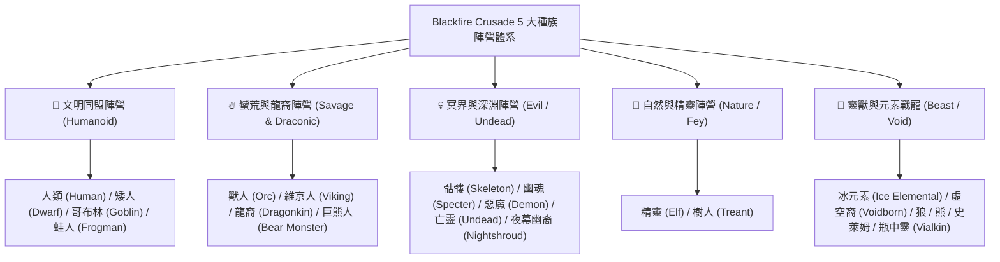

# 🧬 Blackfire Crusade 全英雄種族機制與連動效果全景指南

> 本文件依據遊戲底層資源 `meta_datas.tres` 原始數據整理，全面解析全 21 大種族的基礎體質、天賦特性 (Characteristics)、標籤陣營 (Tags) 以及跨種族技能連動機制 (Racial Synergy)。

---

## 🧬 一、全英雄 21 大種族分類與定位全景圖

遊戲中 60 位英雄與戰寵共分屬 **21 個種族**，可歸納為 5 大陣營體系：

---

## 📊 二、核心種族基礎體質與天生特質表 (Characteristics)

底層數據中，不同種族具備完全不同的**基礎血量 (HP)**、**攻擊區間**與**天賦特性 (Characteristics)**：

| 種族代號 | 代表英雄範例 | 基礎血量 / 傷害 | 天賦特性 (Characteristics) | 底層屬性與免疫加成效果 |
| :--- | :--- | :---: | :--- | :--- |
| **龍裔 (`dragonkin`)** | `hero_archer_7` | **HP 200** / 25~35 | `ancient_bloodline` `dragon_wisdom` `balance` | **暴擊 +15%**、**暴擊抗性 +50%**、**戰鬥生命 +25%**、火/冰/魔/毒四系精通 +50% |
| **獸人 (`orc`)** | `hero_archer_drugor` `hero_warrior_kraghul` | **HP 220** / 25~35 | `rough_hide` `sturdy_will` `frenzied_might` `sturdy_physique` | **生命 +100**、**物理加深 +20%**、物抗 +30%、魔抗 +20%、暴抗 +20%（極致血怒） |
| **維京人 (`viking`)** | `hero_archer_olaf` `hero_warrior_hildrena` | **HP 180** / 25~35 | `sturdy_physique` `rough_hide` `balance` | **生命 +100**、暴擊抗性 +20%、物抗 +10%、全屬性均衡 |
| **矮人 (`dwarf`)** | `hero_knight_bragos` `hero_warrior_5` | **HP 135** / 5~10 | `sturdy_physique` `ironclad_resistance` | **生命 +100**、**物理抗性 +50%**、**物理防禦 +50**（最硬物防盾） |
| **哥布林 (`goblin`)** | `hero_knight_glig` `hero_mage_nobiz` | **HP 115** / 8~12 | `swift_initiative` `brightmind_surge` | **先攻權 +2**、**閃避 +10%**、**魔法精通 +50%**（急速過載） |
| **精靈 (`elf`)** | `hero_mage_ecasia` `hero_archer_1/4/6` | **HP 125** / 8~12 | `swift` `magic_safeguard` | **閃避 +5%**、**先攻 +1**、**法術抗性 +30%**、**神聖抗性 +30%** |
| **人類 (`human`)** | `hero_knight_askar` `hero_priest_1~5` | **HP 125** / 8~12 | `experience_epiphany` `balance` | **經驗獲取提升**、物傷/魔傷/物抗/魔抗全能 +10% |
| **樹人 (`treant`)** | `hero_mage_7` `hero_warrior_7` | **HP 165** / 12~18 | `root_connection` `wooden_skin` | **生命 +50**、自然精通 +30%、受癒 +20%、**物抗 +20%**、**自然抗性 +50%** (火抗 -30%) |
| **骷髏 (`skeleton`)** | `hero_priest_4` `hero_warrior_6` | **HP 155** / 12~17 | `bone_resilience` `dark_affinity` | 🩸 **免疫流血 (Bleed Immune)**、物抗/魔抗 +20%、暗影精通 +50% (神聖抗性 -50%) |
| **幽魂 (`specter`)** | `hero_priest_6` | **HP 155** / 24~30 | `incorporeal_form` `dark_affinity` | 🩸 **免疫流血**、**物理抗性 +50%** (靈體免傷)、暗影抗性 +200% |
| **亡靈 (`undead`)** | `hero_rogue_6` | **HP 165** / 12~16 | `decayed_form` `undead_resilience` | 🩸 **免疫流血 & 中毒**、暗影抗性 +200% (神聖抗性 -50%) |
| **惡魔 (`demon`)** | `hero_priest_bathory` `hero_rogue_vilzaan` | **HP 220** / 18~28 | `frenzied_might` `dark_affinity` `heat_resistance` | **攻擊力 +10**、**火抗 +50%**、暗影精通 +50%、暗影抗性 +200% |
| **冰元素 (`ice_elem`)**| `pet_slateshard_bruiser` | **HP 300** / 20~30 | `coldborne_form` `frost_power` | ❄️ **免疫冰凍/流血/中毒**、**冰霜抗性 +500%**、冰霜傷害 +50% |
| **虛空後裔 (`voidborn`)**| `pet_voidsilver_sentinel` | **HP 200** / 20~26 | `void_form` `void_eye` | **雙抗/虛空精通 +50%**、**暴擊 +10%**、**命中 +50%** |

---

## ⚡ 三、種族專屬技能與連動機制 (Racial Synergy)

種族並非單純數值標籤，在技能機制與陣容搭配中有極強的**共振連動效應**：

### 1. 獸人部族血怒連動 (`tribal_synergy` & `rage_howl`)
* **機制**：獸人英雄（如狂戰士 `Kraghul` + 遊俠 `Drugor`）自帶 `tribal_synergy`（部族連動）。
* **連動效果**：當隊伍中有流血狀態或隊友發動暴擊時，全體獸人同時獲得 **「血怒層數 (Bloodlust)」**，觸發額外行動點與超高倍率處決傷害 (`bloodburst_execution`)。

### 2. 矮人與維京人「前排鋼鐵盾牆」共鳴 (`shieldwall_oath`)
* **機制**：矮人 (`Bragos`) 與維京人 (`Hildrena`) 擁有 `shieldwall_oath`（盾牆誓約）。
* **連動效果**：當裝備重盾站前排時，天生 `ironclad_resistance`（物抗+50%）會直接將格擋值轉化為全隊傷害吸收屏障 (`barrier_count`)，大幅降低後排脆皮受到的範圍波及。

### 3. 哥布林「齒輪過載與動能重啟」循環 (`emergency_gear_jump`)
* **機制**：哥布林騎士 (`Glig`) 與法師 (`Nobiz`) 的技能圍繞「充能層數 (Energy Charge)」與「發條玩具 (Scrap Toys)」。
* **連動效果**：彼此的主動技能釋放會互相為全隊哥布林充能，達到 3~4 層時直接重置冷卻回合並觸發 100% 暴擊的齒輪彈雨。

### 4. 樹人與自然系「生生不息」受癒加成 (`nature_affinity`)
* **機制**：樹人自帶 `root_connection`（根鬚連結）與 `nature_affinity`。
* **連動效果**：場上所有自然傷害與治療技能的受癒量提升 20%，並持續為友軍提供護甲外骨骼 (`woodland_aegis`)。

---

## 🎯 四、屬性剋制與戰術選卡指南 (PvE / 高難副本應用)

| 面對敵人類型 / 特殊機制 | 最佳剋制種族推薦 | 剋制原因與戰略價值 |
| :--- | :--- | :--- |
| **面對大量高頻流血 / 劇毒 Boss** (如蜘蛛、蛇蠍、刺客怪) | **骷髏 (`skeleton`)** **亡靈 (`undead`)** **冰元素 (`ice_elemental`)** | **天生 100% 免疫流血與劇毒 (`bleed_immuned / poison_immuned`)**，直接廢掉 Boss 的核心 Dot 傷害機制！ |
| **面對高物理暴擊怪** (如遺忘荒地的碎骨獸人) | **矮人 (`dwarf`)** **獸人 (`orc`)** | 自帶 `ironclad_resistance`（物抗+50%、防禦+50）與 `sturdy_physique`（暴抗+20%），穩如泰山。 |
| **面對暗影 / 詛咒系地牢** (如暗影深淵、幽靈副本) | **精靈 (`elf`)** **龍裔 (`dragonkin`)** | 高額法術抗性與神聖加深，聖騎士神聖打擊對暗影怪造成 **雙倍破甲與負抗性重創**（暗影怪神聖抗性為 -50%）。 |
| **速刷副本 / 先手秒殺隊** | **哥布林 (`goblin`)** **龍裔 (`dragonkin`)** | 擁有全遊戲最高的 **先攻權 (+2)** 與開局暴擊率，能搶先在怪物出手前直接 AOE 清場。 |