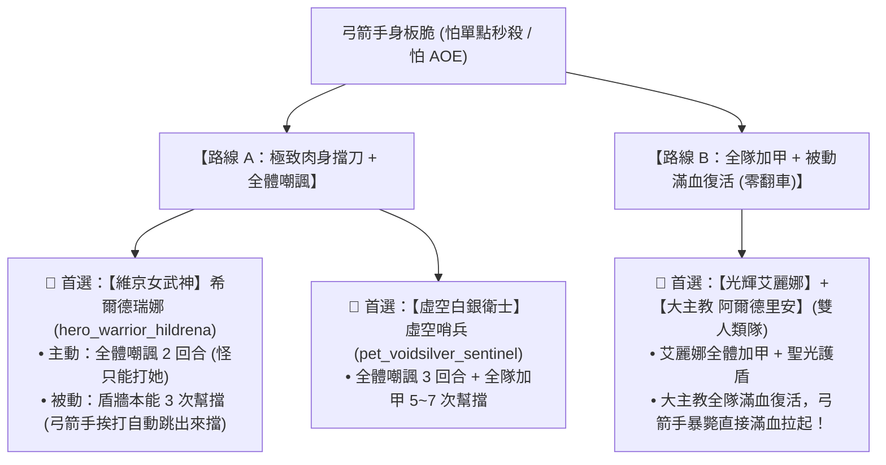

# 🛡️【坦克守護與嘲諷援護全指南】戰士/騎士/寵物 嘲諷、幫擋與護盾機制總表 ⚔️

> 本文檔依據底層原始資料檔 `meta_datas.tres` 的 `characters`、`skills` 與 `buffs` 模組，完整整理全遊戲（1星 ~ 6星）所有具備**「嘲諷（怪只能打坦克）」**、**「援護/幫擋（替隊友肉身擋刀）」**與**「全隊加甲/壁壘護盾」**的英雄與技能清單，專門用於保護身板脆弱的後排遊俠/法師。

---

## 🎯 一、核心防護機制底層定義

1. **🎯 嘲諷 (`provocation`)**：
   - **效果**：強制敵人在 2~3 回合內**只能攻擊該坦克**，後排輸出英雄（如弓箭手）絕對不會被單體普攻或點名技能選中。
2. **🛡️ 援護/幫擋 (`protection`)**：
   - **效果**：坦克獲得援護層數，**當隊友受到攻擊時，坦克會立即強制跳出來「替隊友承受傷害/擋刀」**！
3. **🧱 壁壘護盾 (`barrier`) & 全隊加甲 (`team armor`)**：
   - **效果**：為全隊或後排提供巨額護甲加成或傷害吸收壁壘，防止弓箭手被敵方全屏 AOE 或震地技能秒殺。
4. **👑 滿血復活 (`apostolic_revival`)**：
   - **效果**：隊友陣亡時被動無消耗滿血復活，提供極限防翻車容錯。

---

## 📋 二、全階級「嘲諷 (Taunt) 坦克」清單（強制怪只能打自己）

| 星級品質 | 英雄名稱 (底層 ID) | 職業 / 種族 | 核心嘲諷技能名稱 | 技能機制與嘲諷效果細節 |
| :---: | :--- | :---: | :--- | :--- |
| **1星 綠色** | **初階戰士** (`hero_warrior_2`) | 戰士 / 人類 | `taunt_skill` (戰吼嘲諷) | 主動技能（CD 5R）：**敵方全體嘲諷** + 自身護甲 +30。 |
| **3星 紫色** | **精靈戰士 4** (`hero_warrior_4`) | 戰士 / 精靈 | `taunt_skill` (戰吼嘲諷) | 主動技能（CD 5R）：**敵方全體嘲諷** + 自身護甲 +30。 |
| **5星 紅色** | **骷髏戰士 6** (`hero_warrior_6`) | 戰士 / 骷髏 | `provoked_fury` (激怒嘲諷) | 主動技能（CD 7R）：**嘲諷目標 3 回合** + 自身護甲 +30~60。 |
| **6星 紅色** | **【巨木狂怒戰神】樹靈戰士 7** (`hero_warrior_7`) | 戰士 / 樹人 | `provoked_fury` (激怒嘲諷) | 主動技能（CD 7R）：**嘲諷目標 3 回合** + 自身護甲 +30~60。 |
| **6星 紅色** | **【維京女武神】希爾德瑞娜** (`hero_warrior_hildrena`) | 戰士 / 維京人 | `ironwall_provocation` (鐵壁嘲諷) | 👑 **超強全體嘲諷**（CD 5R）：**敵方全體嘲諷 2 回合** + 自身格擋 3 次 + 加甲。 |
| **6星 紅色** | **【發條機甲騎士】格利格** (`hero_knight_glig`) | 騎士 / 哥布林 | `pressurized_taunt` (充壓嘲諷) | 主動技能（CD 5R）：**嘲諷 3 回合** + **自身直接減傷 3 次 (`damage_reduction`)**。 |
| **6星 紅色** | **【虛空白銀衛士】虛空哨兵** (`pet_voidsilver_sentinel`) | 寵物 / 虛空 | `mass_provoked_fury` (群體激怒嘲諷) | 👑 **全遊戲最強群嘲**（CD 10R）：**敵方全體嘲諷 3 回合** + 護甲 +50~100。 |

---

## 🛡️ 三、全階級「援護/幫擋 (Protection) 坦克」清單（隊友挨打前排肉身擋刀）

| 星級品質 | 英雄名稱 (底層 ID) | 職業 / 種族 | 核心援護/擋刀技能 | 擋刀層數與防禦細節 |
| :---: | :--- | :---: | :--- | :--- |
| **2星 藍色** | **人類戰士 3** (`hero_warrior_3`) | 戰士 / 人類 | `defense_blow` (防禦打擊) `mass_defense` (群體防衛) | 🔹 `defense_blow`：獲得 **3~5 次幫隊友擋刀**。 🔹 `mass_defense`：**全隊加甲 20~40 + 全隊 5~7 次援護幫擋**！ |
| **3星 紫色** | **精靈戰士 4** (`hero_warrior_4`) | 戰士 / 精靈 | `defense_blow` `mass_defense` | 兼具單體擋刀 (3~5 次) 與全隊加甲擋刀 (5~7 次)。 |
| **5星 紅色** | **骷髏戰士 6** (`hero_warrior_6`) | 戰士 / 骷髏 | `mass_defense` (群體防衛) | 主動技能（CD 10R）：**全體加甲 20~40 + 5~7 次援護幫擋**。 |
| **6星 紅色** | **【維京女武神】希爾德瑞娜** (`hero_warrior_hildrena`) | 戰士 / 維京人 | `shieldwall_instinct` (盾牆本能) | 👑 **被動自帶擋刀**：**每回合 45% 機率被動觸發 3 次援護幫擋** + 格擋！弓箭手挨打自動跳出來擋！ |
| **6星 紅色** | **【極凍霜鋼巨獸】冰霜碎石獸** (`pet_slateshard_bruiser`) | 寵物 / 冰元素 | `frozen_plating` (冰霜鍍層) | 主動技能（CD 10R）：**為後排友方提供 5 次援護幫擋 + 5 層冰霜護盾**。 |
| **6星 紅色** | **【虛空白銀衛士】虛空哨兵** (`pet_voidsilver_sentinel`) | 寵物 / 虛空 | `silver_barrier_slam` `mass_defense` | 🔹 碎盾猛擊：獲得 **3~5 次幫擋**。 🔹 群體防衛：**全體加甲 + 5~7 次幫擋**。 |

---

## 🧱 四、全階級「全隊加甲 / 壁壘護盾 (Team Armor & Barrier)」清單（防 AOE 暴斃）

| 星級品質 | 英雄名稱 (底層 ID) | 職業 / 種族 | 核心加盾/加甲技能 | 效果細節 |
| :---: | :--- | :---: | :--- | :--- |
| **3星 紫色** | **人類騎士 4** (`hero_knight_4`) | 騎士 / 人類 | `holy_aegis` (神聖庇護) | 主動技能（CD 15R）：**全隊全體護甲直接暴增 +60 ~ +100**！ |
| **4星 橘色** | **【光輝艾麗娜】(當前前排)** (`hero_knight_5`) | 騎士 / 人類 | `holy_light_blessing` (聖光加護) | 主動技能（CD 10R）：**全隊護甲 +20~40** + 戰意激昂 5~7 層（全隊變硬）。 |
| **6星 紅色** | **【矮人誓約鋼鐵壁壘】布拉戈斯** (`hero_knight_bragos`) | 騎士 / 矮人 | `oathbound_bulwark` `unbroken_vow` (不破誓約) | 🔹 主動提供 3 層壁壘。 🔹 **被動提供 9 層壁壘護盾 + 生命 +45%**（純肉山）。 |
| **7星 紅色** | **【人類大主教】阿爾德里安** (`hero_priest_aldrian`) | 牧師 / 人類 | `apostolic_revival` (使徒復生) | 👑 **終極防禦保險**：弓箭手萬一被秒，**被動直接無消耗「滿血復活」**！ |

---

## 🎯 五、保護脆皮輸出（疾弓芬奇 / 德魯戈）的最佳前排推薦與搭配決策

### 💡 實戰結論速查：
1. **追求「完全不讓怪碰到弓箭手」**：
   - 終極首選 **【維京女武神 希爾德瑞娜 (`hero_warrior_hildrena`)】**，自帶 **「全體嘲諷 + 被動援護幫擋 + 盾牌格擋」**，是全遊戲保護後排最極致的守護戰神！
2. **追求「人類軍團 + 100% 零翻車保險」**：
   - 前排維持 **光輝艾麗娜 (`hero_knight_5`)**（全隊加甲），中排換入 **大主教阿爾德里安 (`hero_priest_aldrian`)**（**被動滿血復活**），雙人類全屬性常駐 +10%，弓箭手即便挨打暴斃也能立刻原地滿血復活繼續輸出！
