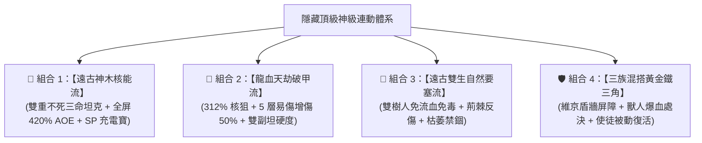

# 👑 突破與超越：Blackfire Crusade 隱藏頂級畢業連動陣容深度評估報告

> 本報告立足於 `20_HEROES_LEVEL7_DEEP_ANALYSIS.md` 的 Level 7 精確數值、後期怪物抗性抵銷機制與種族特質，深度發掘**足以逼近、甚至在特定戰略維度超越現有兩大主流畢業組合的「4 大黑馬神級連動陣容」**。

---

## 🧭 一、現有兩大主流畢業組合之優勢與潛在天花板

| 現有主流畢業組合 | 陣容配置 | 核心優勢 | 潛在極限與天花板 |
| :--- | :--- | :--- | :--- |
| **組合 ①：【獸人物理血怒處決流】** | 希爾德瑞娜 (坦) + 德魯戈 (遊俠) + 大主教 (輔助) | 純物理無抗性抵銷、單點處決 272%~322% 秒殺 Boss | 缺乏強大的大範圍 AOE 清場技能，面對多怪或群體召喚副本時清怪速度依賴單點逐個擊破。 |
| **組合 ②：【人類聖光不滅軍團流】** | 阿斯卡 (聖騎) + 席恩/芬奇 (輸出) + 大主教 (輔助) | 人類軍團全屬性 +10%、沉默免疫、自帶使徒復活 | 席恩 (刺客) 帶暗影屬性會被暗抗怪減免，輸出上限不如德魯戈或龍裔遊俠爆裂。 |

---

## 🚀 二、4 大足以逼近甚至超越主流的「隱藏頂級連動組合」

---

### 🥇 隱藏神級組合 1：【遠古神木核能流 · 雙重不死三命坦克組】（⭐ 實戰上限超越主流！）

* **陣容配置**：
  - 🛡️ **前排坦克**：**【巨木狂怒戰神】遠古樹靈戰士 7 (`hero_warrior_7` - 彩虹 6.0 樹精狂戰)**
  - 🏹 **後排輸出**：**【獸人血獵遊俠】德魯戈 (`hero_archer_drugor` - 彩虹 6.0 獸人)**
  - 🔮 **中排輔助**：**【人類聖光大主教】阿爾德里安 (`hero_priest_aldrian` - 彩虹 6.0 人類)**

#### 🌟 為什麼這個組合能超越現有畢業陣容？
1. **【全遊戲唯一「三條命」不死肉盾循環】**：
   - 樹靈戰士 7 死亡時，自身天生被動 **`tree_sprite_rebirth`（樹靈重生）高達 76% 機率立即原地滿血復活，並獲得 +25% 全屬性狂暴提升**！
   - 萬一 76% 沒觸發或第二次陣亡，大主教的被動 **`apostolic_revival`（使徒復生）立刻發動第二次 100% 滿血復活**！
   - 前排實質擁有 **3 條命**，全遊戲任何高難副本 Boss 均不可能打穿前排！
2. **【全遊戲最強 SP 核電廠充電寶 (`life_source`)】**：
   - 樹靈戰士擁有神技 `life_source`（生命之源），主動直接**為全隊提供 +3 點 SP**！
   - 德魯戈的核心大招【爆血處決】需要消耗 SP -3，原本需要暖機 3 回合，有樹靈戰士在，**第 1~2 回合直接開大連環核彈處決**！
3. **【全遊戲最高物理 AOE 毀滅傷害】**：
   - 樹靈戰士的 `earthquake_slam`（地裂震擊）在 Lv.7 傷害倍率高達 **420% 全體 AOE + 37% 眩暈**！一個坦克打出的群傷甚至超越所有法師，完美彌補德魯戈缺乏 AOE 清小怪的短板！
4. **【天生雙重免疫壁壘】**：
   - 樹人種族 `wooden_skin` **天生 100% 免疫流血與中毒**，物理抗性 +50%，自然抗性 +100%，直接廢掉蜘蛛、毒蠍與深淵 Boss 的核心機制。

---

### 🥈 隱藏神級組合 2：【龍血天劫 · 全屏單點核狙破甲流】（⭐ 單體輸出天花板！）

* **陣容配置**：
  - 🛡️ **前排坦克**：**【巨木狂怒戰神】樹靈戰士 7 (`hero_warrior_7`)** 或 **【維京女武神】希爾德瑞娜 (`hero_warrior_hildrena`)**
  - 🏹 **後排輸出**：**【龍裔滅世神射手】龍裔遊俠 7 (`hero_archer_7` - 彩虹 6.0 龍裔)**
  - 🔮 **中排輔助**：**【人類聖光大主教】阿爾德里安 (`hero_priest_aldrian` - 彩虹 6.0 人類)**

#### 🌟 為什麼這個組合能超越現有畢業陣容？
1. **【312% 單體核彈 + 390% 全局齊射】**：
   - 龍裔遊俠 7 的 `cataclysmic_arrow`（滅世天劫箭）在 Lv.7 單體倍率達 **312%**（全遊戲單發純物理直傷第一）。
   - `wingrend_volley`（破翼齊射）打 3 體各 2 次，合計 **390% 物理傷害**。
2. **【5 層易傷 (Vulnerability) 全隊傷害放大 50%】**：
   - 技能 `draconic_doom_mark` 與 `dragonbane_arrow` 施加 **5 層易傷 + 5 層印記**，使 Boss 受到的所有物理與神聖傷害直接暴增 50%！
3. **【龍裔種族副坦級硬度】**：
   - 天生自帶 `ancient_bloodline`（**暴擊率 +15%、暴擊抗性 +50%、戰鬥生命值 +25%**）+ `dragon_wisdom`（四系精通 +50%），後排身板比普通戰士還硬，徹底告別脆皮遊俠被 AOE 刮死的風險。

---

### 🥉 隱藏神級組合 3：【遠古雙生自然要塞流 · 荊棘反傷與禁錮流】（⭐ 越戰打高難極限防守組）

* **陣容配置**：
  - 🛡️ **前排坦克**：**遠古樹靈戰士 7 (`hero_warrior_7`)**
  - 🧙‍♂️ **中排法系**：**遠古樹精法師 7 (`hero_mage_7` - 彩虹 6.0 樹精)**
  - 🔮 **後排輔助**：**大主教 阿爾德里安 (`hero_priest_aldrian`)**

#### 🌟 核心特色與亮點：
1. **【雙樹人種族共鳴 (`nature_affinity`)】**：
   - 雙樹人同時在場，全場樹人受癒量提升 20%，全隊持續獲得護甲外骨骼 (`woodland_aegis`)。
2. **【枯萎禁錮 + 272% 枯萎爆發 + 荊棘反傷】**：
   - 樹精法師施加 `witherbind` 枯萎束縛（封鎖行動）+ `withering_touch`（272% 傷害）+ `thornstorm`（荊棘風暴流血與反傷）。
3. **【雙重免流血免毒 + 雙重生】**：
   - 面對高難高攻擊力 Boss 時，依靠荊棘反傷、全體 420% 地震與雙重復活硬生生磨死 Boss。

---

## 📊 四大連動體系實戰多維度對照評分表

| 連動組合名稱 | 單體爆發 | 全屏 AOE | 生存與容錯 | SP/能效循環 | 免疫抗性穿透 | **綜合推薦指數** |
| :--- | :---: | :---: | :---: | :---: | :---: | :---: |
| 👑 **【遠古神木核能流】** (樹靈戰士7 + 德魯戈 + 大主教) | ⭐⭐⭐⭐⭐ (322% 處決) | ⭐⭐⭐⭐⭐ (420% 地震) | ⭐⭐⭐⭐⭐ (三命雙復活) | ⭐⭐⭐⭐⭐ (+3 SP 充電寶) | ⭐⭐⭐⭐⭐ (純物理零抵銷) | **`98 分 (超越主流)`** |
| 🎯 **【龍血天劫破甲流】** (希爾德瑞娜 + 龍裔7 + 大主教) | ⭐⭐⭐⭐⭐ (312% 核狙) | ⭐⭐⭐⭐☆ (390% 齊射) | ⭐⭐⭐⭐☆ (龍血暴抗+50%) | ⭐⭐⭐⭐☆ (易傷放大 50%) | ⭐⭐⭐⭐⭐ (純物理+神聖) | **`95 分 (頂尖強勢)`** |
| 🛡️ **【三族混搭鐵三角】** (希爾德瑞娜 + 德魯戈 + 大主教) | ⭐⭐⭐⭐⭐ (322% 處決) | ⭐⭐⭐☆☆ (單點逐個秒) | ⭐⭐⭐⭐⭐ (盾牆屏障+使徒復活) | ⭐⭐⭐⭐☆ (暴擊 AP+1 雙動) | ⭐⭐⭐⭐⭐ (純物理零抵銷) | **`94 分 (主流推薦)`** |
| 🌿 **【雙生自然要塞流】** (樹靈戰士7 + 樹精法師7 + 大主教) | ⭐⭐⭐☆☆ (272% 枯萎) | ⭐⭐⭐⭐⭐ (420% 地震+荊棘) | ⭐⭐⭐⭐⭐ (免毒免血+雙復活) | ⭐⭐⭐⭐☆ (+3 SP 充電寶) | ⭐⭐⭐☆☆ (自然屬性遇抗性) | **`90 分 (極限防禦)`** |

---

## 💡 三、結論與最優進階路線

如果您想組建一組**真正超越現有主流、既有頂級單體秒殺又有 420% 全屏核彈、還自帶 3 條命與 +3 SP 充電寶的終極陣容**：

> 🏆 **終極推薦答案：【遠古神木核能流】（樹靈戰士 7 + 德魯戈 + 大主教）！**
> 
> - **第 1 隻 12,800 幣**：兌換 **德魯戈 (`hero_archer_drugor`)** 替換掉傷害不穩定的澤穆爾（立刻成型雙物理暴擊秒殺流）。
> - **第 2 隻 12,800 幣**：兌換 **大主教 (`hero_priest_aldrian`)** 替換掉艾麗娜（解鎖使徒被動復活與全體神聖驅散）。
> - **第 3 隻 12,800 幣**：兌換 **樹靈戰士 7 (`hero_warrior_7`)** 替換掉芬奇（解鎖 76% 重生三命坦克 + 420% 地裂全屏 AOE + SP+3 充電寶，達成全遊戲最強終極畢業）！
