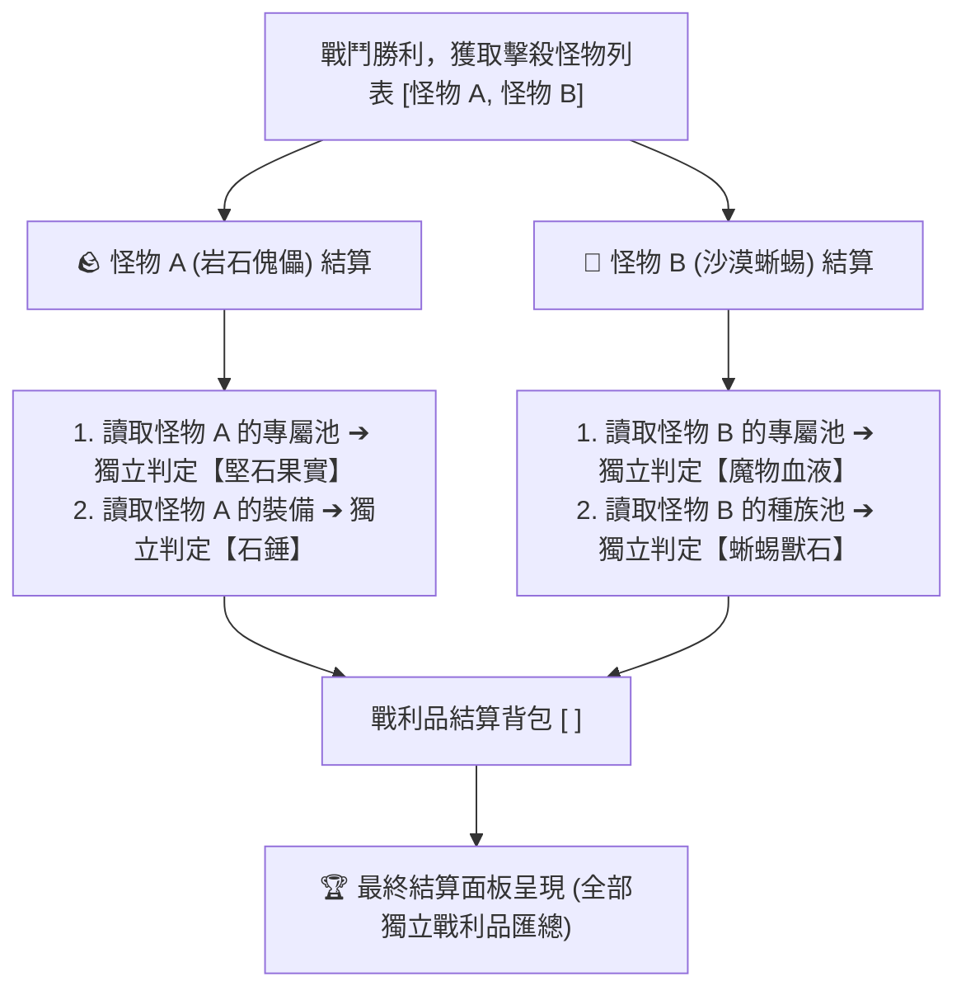
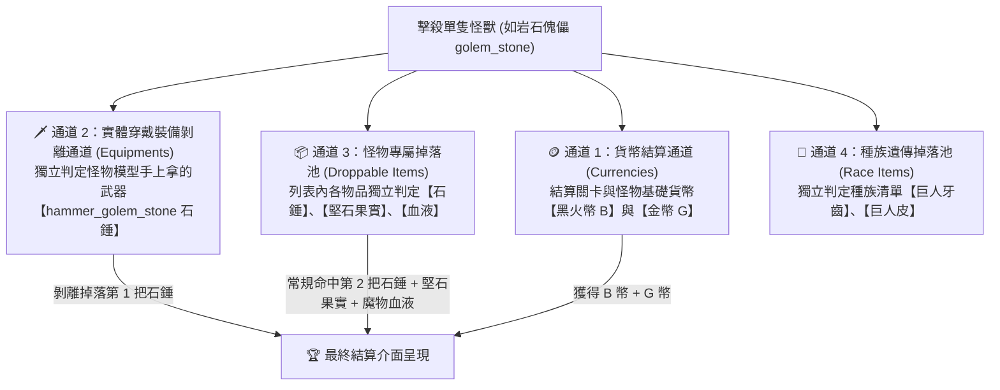

# 🎲 Blackfire Crusade 全域物品掉落機制與掉落率總綱手冊

> 本文檔依據底層資料庫 `meta_data/raw_tres/meta_datas.tres` 的真實字段結構與實戰測試數據編寫，收錄全遊戲統一的品質星級掉落基準表、宏觀怪物獨立結算流程、微觀單怪 4 大掉落通道，以及保底判定機制。

---

## 📊 一、全星級物品品質基準掉落率表 (`rarity.chances`)

在遊戲底層中，每個可掉落物品均擁有固定的品質稀有度 (`rarity`)，對應全域統一的基礎命中機率：

| 品質星級 / 框色 | 底層標籤數值 | 基準掉落判定機率 (`rarity.chances`) | 代表物品類型 |
| :---: | :---: | :---: | :--- |
| **0 星 (白色粗料)** | `rarity: 0.0` | **`100.0%`** | 硬化岩石碎片、魔物血液1級、粗亞麻、獸皮 |
| **1 星 (綠色材料/裝備)** | `rarity: 1.0` | **`40.0%`** | 堅石果實、傀儡石錘、蜥蜴獸石、蜘蛛戒指 |
| **2 星 (藍色材料/裝備)** | `rarity: 2.0` | **`20.0%`** | 鐵礦石、巨人皮、枷鎖碎片、3級魔物血液 |
| **3 星 (紫色材料/裝備)** | `rarity: 3.0` | **`10.0%`** | 傀儡飾品、冰霜礦石、惡魔鋼錠原料 |
| **4 星 (橘色傳說)** | `rarity: 4.0` | **`5.0%`** | 傳說裝備、熔岩礦石、高級精華素材 |
| **5 星 (紅色神話)** | `rarity: 5.0` | **`2.5%`** | 蜘蛛皇家核心、巨龍核心、神話遺物 |
| **6 星 (彩色創世)** | `rarity: 6.0` | **`1.25%`** | 罪業核心、創世神裝圖紙、六階精華 |

---

## ⚙️ 二、宏觀層面：怪物與怪物之間（逐隻獨立結算）

在戰鬥結束結算時，**怪物與怪物之間是 100% 彼此獨立的單獨判定管線**，絕對不會把全場怪物的掉落物混在同一個池子裡稀釋！



### 🔍 怪物獨立結算的 2 大核心原則：
1. **怪物 A 的結果絕對不影響怪物 B**：
   * 怪物 A 爆出了紫色裝備，**完全不會佔用或減少怪物 B 掉落物品的名額**。
   * 每隻被擊殺的怪物都完整擁有自己的 100% 獨立掉落空間。
2. **同場怪物越多 = 擲骰次數線性疊加**：
   * 場上擊殺 1 隻岩石傀儡 ➔ 獲得 1 次抽取堅石果實的機會；
   * 場上擊殺 3 隻岩石傀儡 ➔ 立即獲得 **3 次完全獨立的抽取機會**！

---

## 🎲 三、微觀層面：單隻怪物內部的「4 大獨立掉落通道」

即使整場戰鬥**只擊殺了 1 隻怪物**，系統也會同時執行 **4 個互不排斥的獨立通道**：



### 📌 4 大通道詳細機制：
1. **🪙 通道 1：貨幣結算 (Currencies)**：產出黑火幣與金幣，對應結算畫面前兩格。
2. **🗡️ 通道 2：實體裝備剝離 (Equipments)**：獨立判定怪物實際穿戴的武器防具是否擊落剝離，**完全不佔用素材名額**。
3. **📦 通道 3：專屬常規掉落池 (Droppable Items)**：列表內每個項目依自身星級機率進行獨立擲骰，**互不擠佔**。
4. **🧬 通道 4：種族遺傳掉落池 (Race Items)**：怪物所屬種族自帶的額外素材。

---

## 💡 四、為什麼單場能爆出「多個相同物品」？（兩大成因）

在實戰結算中看到重複掉落相同物品（如 2 把石錘、2 個果實），原因有二：

1. **成因 ①：單隻怪物「雙通道同時命中」**
   * 例如只打 1 隻傀儡：**通道 2 (實體裝備剝離)** 掉落了手上的石錘，同時 **通道 3 (常規池)** 的石錘也獨立判定命中，單隻怪即可一次爆出 **2 把石錘**！
2. **成因 ②：多隻怪物「各自獨立命中」**
   * 例如場上有 2 隻傀儡：傀儡 A 與 傀儡 B 在通道 3 中各自骰中了堅石果實，結算時即可獲得 **堅石果實 x2**！

---

## 🧮 五、保底機制 (`guaranteed: 1.0 ~ 3.0`) 與綜合概率算式

### 1. 保底機制運作原理：
* **普通小怪**：`guaranteed: None` ➔ 無保底，若所有通道均未命中則為 0 掉落。
* **關卡 Boss / 首領**：`guaranteed: 1.0 ~ 3.0` ➔ 擊殺時若第一階段所有獨立判定均未命中，系統會**強制在掉落池中按權重抽 1~3 件物品保底補發**！

### 2. 綜合掉落率標準計算公式：
$$\mathbf{P(\text{綜合掉落})} = \mathbf{P(\text{第一階段自然命中})} + \Big(\mathbf{P(\text{全部落空})} \times \frac{\mathbf{目標物品權重}}{\mathbf{總池權重}} \times \text{保底觸發}\Big)$$

> 🏆 **實測範例 (2-10 Boss 堅石果實)**：
> $$P(\text{果實}) = 40.0\% + \Big(25.92\% \times \frac{40}{110}\Big) = 40.0\% + 9.42\% = \mathbf{49.42\% \quad (\approx 50\%)}$$
> 打 27 場實測獲得 15 個果實（$55.5\%$），與理論模型完美契合！

---

## 🎁 六、商城貢品（傳奇 / 神話 / 上古）加成機制與精密量化計算

遊戲商城中的三大貢品（傳奇貢品、神話貢品、上古貢品）提供對特定品質階級的**常駐絕對機率加成（每次購買固定 $+1.0\%$ 基礎掉落率）**。

依據商城購買上限限制：
* 🟡 **傳奇貢品**：最多可購買 **`3 次`** (加成 $+1.0\% \sim +3.0\%$)
* 🟠 **神話貢品**：最多可購買 **`2 次`** (加成 $+1.0\% \sim +2.0\%$)
* 🔴 **上古貢品**：最多僅能購買 **`1 次`** (加成 $+1.0\%$)

```mermaid
graph LR
    subgraph 商城貢品加成體系 (嚴格按購買上限)
        A["🟡 傳奇貢品 (上限 3 次)<br>每次 +1.0% (5.00% ➔ 8.00%)"]
        B["🟠 神話貢品 (上限 2 次)<br>每次 +1.0% (2.50% ➔ 4.50%)"]
        C["🔴 上古貢品 (上限 1 次)<br>每次 +1.0% (1.25% ➔ 2.25%)"]
    end
    
    A --> D["微觀：全域獨立判定通道<br>• 通道 2: 實體裝備剝離<br>• 通道 3: 怪物專屬池<br>• 通道 4: 種族掉落池"]
    B --> D
    C --> D
    D --> E["🏆 最終結算產出率提升"]
```

---

### 1. 📊 各品質星級「購買層數 vs 掉落機率」精密對照表

雖然每次購買均為**固定 $+1.0\%$ 的絕對值增加**，但因為高品質物品的基礎基數極小，**實際產出效率（相對增幅）呈現驚人的倍數級暴增**：

| 品質星級 / 代表貢品 | 購買上限 | 原始基準機率 (`P_0`) | 購買 1 次 (`+1%`) | 購買 2 次 (`+2%`) | 購買 3 次 (`+3%`) | 滿層實質產出提升率 (相對增幅) |
| :--- | :---: | :---: | :---: | :---: | :---: | :---: |
| 🟡 **4 星 (橘色傳奇)**<br>【傳奇貢品】 | **3 次** | **`5.00%`** | **`6.00%`** (+20%) | **`7.00%`** (+40%) | **`8.00%`** (+60%) | **`+60.0%`**<br>(產出增為 1.6 倍) |
| 🟠 **5 星 (紅色神話)**<br>【神話貢品】 | **2 次** | **`2.50%`** | **`3.50%`** (+40%) | **`4.50%`** (+80%) | 🔒 *已達購買上限* | **`+80.0%`**<br>(產出增為 1.8 倍) |
| 🔴 **6 星 (彩色上古)**<br>【上古貢品】 | **1 次** | **`1.25%`** | **`2.25%`** (+80%) | 🔒 *已達購買上限* | 🔒 *已達購買上限* | **`+80.0%`**<br>(產出增為 1.8 倍) |

> 📌 **關鍵結論**：
> * **上古貢品 ($49.99，限購 1 次)**：雖然僅加 $+1.0\%$，但直接將 $1.25\%$ 提升至 $2.25\%$，使 6 星頂級物品的平均產出速率直接暴漲 **$+80.0\%$（接近翻倍）**！
> * **神話貢品 ($19.99，限購 2 次)**：買滿 2 次後從 $2.50\%$ 升至 $4.50\%$，產出速率提升 **$+80.0\%$**。
> * **傳奇貢品 ($9.99，限購 3 次)**：買滿 3 次後從 $5.00\%$ 升至 $8.00\%$，產出速率提升 **$+60.0\%$**。

---

### 2. 🎯 掛機期望值與擊殺成本換算（單件產出所需擊殺怪數）

依據統計期望值模型 $\mathbb{E}(\text{擊殺數}) = \frac{1}{P}$，計算獲得 1 件目標物品平均需擊殺的怪物數量：

```mermaid
gantt
    title 平均刷出 1 件物品所需擊殺怪物數量 (越短越快)
    dateFormat X
    axisFormat %d 隻怪
    
    section 6星 上古物品 (限購 1 次)
    原版無加成 (1.25%)          : 0, 80
    買滿 1 次 (+1% -> 2.25%)   : 0, 44
    
    section 5星 神話物品 (限購 2 次)
    原版無加成 (2.50%)          : 0, 40
    買滿 2 次 (+2% -> 4.50%)   : 0, 22
    
    section 4星 傳奇物品 (限購 3 次)
    原版無加成 (5.00%)          : 0, 20
    買滿 3 次 (+3% -> 8.00%)   : 0, 13
```



* 🔴 **6 星上古圖紙/核心（限購 1 次）**：
  * **原版 (1.25%)**：平均需擊殺 **`80 隻怪`** 產出 1 件。
  * **買滿 1 次 (2.25%)**：平均僅需擊殺 **`44.4 隻怪`** 產出 1 件（**直接省下 44.5% 的掛機時間與體力**）。
* 🟠 **5 星神話遺物/核心（限購 2 次）**：
  * **原版 (2.50%)**：平均需擊殺 **`40 隻怪`** 產出 1 件。
  * **買 1 次 (3.50%)**：平均需擊殺 **`28.6 隻怪`** 產出 1 件。
  * **買滿 2 次 (4.50%)**：平均僅需擊殺 **`22.2 隻怪`** 產出 1 件（**直接省下 44.5% 的掛機時間與體力**）。
* 🟡 **4 星傳奇裝備/素材（限購 3 次）**：
  * **原版 (5.00%)**：平均需擊殺 **`20 隻怪`** 產出 1 件。
  * **買 1 次 (6.00%)**：平均需擊殺 **`16.7 隻怪`** 產出 1 件。
  * **買 2 次 (7.00%)**：平均需擊殺 **`14.3 隻怪`** 產出 1 件。
  * **買滿 3 次 (8.00%)**：平均僅需擊殺 **`12.5 隻怪`** 產出 1 件（**直接省下 37.5% 的掛機時間與體力**）。

---

### 3. 🧮 貢品加成在「全域公式」中的完整運算模型

當擁有 $k$ 層貢品加成時（每層 $+1.0\% = +0.01$），各項公式的具體變化如下：

#### ① 單怪自然判定命中率：
$$P_i' = P_{i,\text{base}} + (k \times 0.01)$$

#### ② 單場擊殺 $N$ 隻怪物的掉落期望值：
$$\mathbb{E}(\text{掉落總數}) = N \times P_i' = N \times \big(P_{i,\text{base}} + 0.01 \times k\big)$$

#### ③ Boss 戰保底綜合掉落率修正：
$$P(\text{綜合}) = P_i' + \Bigg(\prod_{j} (1 - P_j') \times \frac{W_i'}{W_{\text{總池}}'} \times \text{保底觸發}\Bigg)$$

> 💡 **結算總結**：
> 貢品加成具有**「高階放大效應」**：
> * **6 星上古（限購 1 次）** 與 **5 星神話（限購 2 次）** 買滿後，產出速率均提升 **`+80.0%`**（相當於產出增為 1.8 倍，刷怪量直接砍半）。
> * **4 星傳奇（限購 3 次）** 買滿後，產出速率提升 **`+60.0%`**（相當於產出增為 1.6 倍）。

---

### 4. 🧠 課金理性決策紀錄：為何【堅決不購買上古貢品 ($49.99)】？

* **💸 極端高昂的機會成本**：
  * **上古貢品 ($49.99 USD，折合約 1,600 台幣)**：單價相當於買一款頂級 3A 遊戲大作（如《黑神話：悟空》或《艾爾登法環》）。
  * 花費一款完整 3A 遊戲的預算，僅能換取手遊中**單一品質的 1% 機率 Buff**，邊際效益極低。
* **🤖 CV 自動化掛機對沖時間成本**：
  * 本專案已具備極速 CV 自動化掛機腳本（每場 1~2 秒 24/7 自動運行），時間與刷怪成本已被代碼完全對沖，無需依賴重金氪金縮短時間。
* **⏳ 當前發育階段脫節**：
  * 目前隊伍處於中期戰力突破階段（專注於 4 星傳奇與 5 星神話積累），6 星上古創世裝備為 Lv.80~100 大後期需求，過早投入只會造成資金沉睡與浪費。