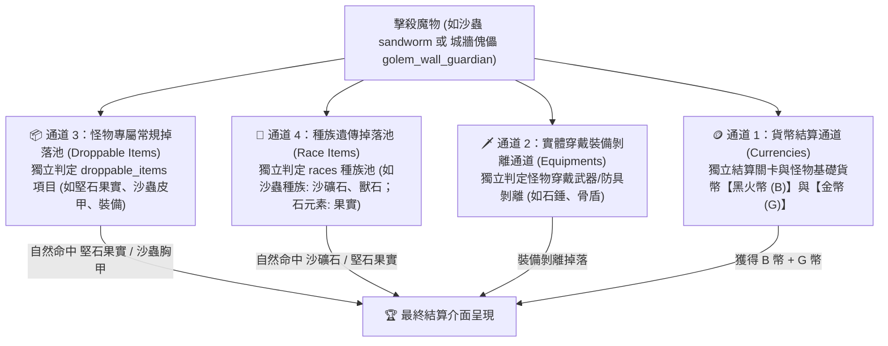

# ⛏️ 優質鋼錠 (`ingot_quality`) 合成配方、掉落通道與精確掉落率計算手冊

> 本文檔依據底層資料庫 [meta_datas.tres](../../../raw_tres/meta_datas.tres) 的真實字段結構與實戰測試數據編寫，收錄優質鋼錠（優質鑄塊）的 3 大替代加工公式、怪物擊殺的 4 大獨立掉落通道、各怪物的分項掉落總表，以及精確的數學掉落率計算模型。

---

## 🛠️ 一、鐵匠鋪加工合成公式（多選一 OR 關係）

在鐵匠鋪加工系統（`blacksmith.processing_dic.ingot.basic`）中，**優質鋼錠 (`ingot_quality`)** 為 1 星綠色鑄塊 (`rarity: 1.0`)，擁有 **3 大多選一的替代加工配方 (OR 關係)**：

```json
"ingot_quality": {
  "categories": ["consumable", "crafting"],
  "processing_items": {
    "ingot_rough": 4.0,       // 配方 1：4 個粗鐵錠 (= 8 個硬化岩石碎片) (OR)
    "sand_ore": 2.0,          // 配方 2：2 個沙礦石 (OR)
    "stoneskin_fruit": 2.0    // 配方 3：2 個堅石果實
  },
  "rarity": 1.0,
  "sort_id": "processing_ingot"
}
```

### 📦 核心等價換算公式：
$$\mathbf{1 	imes 優質鋼錠} = \mathbf{2 	imes 堅石果實} \quad (\mathbf{OR}) \quad \mathbf{2 	imes 沙礦石} \quad (\mathbf{OR}) \quad \mathbf{4 	imes 粗鐵錠} \ (=\mathbf{8 	imes 硬化岩石碎片})$$

---

### 🔨 裝備鍛造需求清單（直接消耗優質鋼錠）：

| 裝備名稱 | 裝備部位 | 品質星級 | 所需優質鋼錠數量 | 其他鍛造素材需求 |
| :--- | :---: | :---: | :---: | :--- |
| 🪓 **符文碎塊之斧 (`axe_rune_shard`)** | 主手單手斧 | 3 星紫 | **`6 個`** | 符文碎塊 (`rune_shard`) x6、三階精華 (`essence_3`) x1 |
| 🛡️ **符文碎塊之盾 (`shield_rune_shard`)** | 副手盾牌 | 3 星紫 | **`6 個`** | 符文碎塊 (`rune_shard`) x6、三階精華 (`essence_3`) x1 |
| 🥋 **符文腰帶 (`waist_runic_girdle`)** | 裝備腰帶 | 3 星紫 | **`4 個`** | 符文碎塊 (`rune_shard`) x4、三階精華 (`essence_3`) x1 |
| 🎽 **骨板重盔胸甲 (`chest_boneplate_helm`)** | 重甲胸甲 | 3 星紫 | **`2 個`** | 冥骨鋼 (`netherbone_teel`) x4、三階精華 (`essence_3`) x1 |
| 📿 **堅硬重鎧項鍊 (`necklace_hard_armor`)** | 飾品項鍊 | 2 星藍 | **`2 個`** | 硬化岩石碎片 (`hardened_rock_shard`) x2、二階精華 (`essence_2`) x1 |
| 🪓 **穿喉投擲斧 (`throwing_throatpiercer_axe`)** | 遠程投擲武器 | 1 星綠 | **`1 個`** | 一階精華 (`essence_1`) x1 |

> 💡 **下游加工升級鏈**：
> * **4 個優質鋼錠** $
ightarrow$ 合成 1 個 **[精煉鋼錠 (`ingot_refined`)](./ingot_refined.md)**

---

## 🎲 二、擊殺單隻怪物的「4 大獨立掉落通道」

當擊殺關卡中的魔物（如第 2 章傀儡或第 4 章沙蟲）時，系統同時執行 **4 大互不干擾的獨立掉落通道**：



### 📌 4 大通道詳細機制：

1. **🪙 通道 1：貨幣結算通道 (Currency Channel)**：
   * 結算怪物擊殺基礎貨幣（黑火幣 `B` + 金幣 `G`）。
2. **🗡️ 通道 2：實體穿戴裝備剝離通道 (Equipments Channel)**：
   * 怪物手上拿的武器（如傀儡石錘、骨盾），獨立進行裝備卸除判定，**完全不佔用素材名額**。
3. **📦 通道 3：怪物專屬常規掉落池 (Droppable Items Channel)**：
   * 列表內每一個項目獨立進行稀有度判定 (`rarity.chances`)。
   * **關鍵特性**：堅石果實屬於 1 星綠料，基準判定機率為 **`40.0%`**。
4. **🧬 通道 4：種族遺傳掉落池 (Race Items Channel)**：
   * 沙蟲種族 (`sandworm`) 自帶專屬素材清單（含沙礦石 `sand_ore`、沙蟲護手、戰寵獸石等）。
   * **關鍵特性**：沙礦石屬於 1 星綠料，在種族池的獨立判定機率為 **`40.0%`**。

---

## 📋 三、核心掉落地圖怪物掉落總表（分項列出）

### 1. 🏰 【第 2 章 第 10 關 Boss】城牆守護傀儡 (`golem_wall_guardian`) —— 🍈 堅石果實核心
* **怪物特性**：中型魔像 / 巨人種族 (`race: giant`)，自帶 `guaranteed: 1.0` 保底。
* **分項掉落清單**：

| 通道類別 | 底層字段名稱 | 掉落物品清單與品質星級 |
| :--- | :--- | :--- |
| **📦 通道 3：專屬掉落池** | `droppable_items` | • 🍈 **堅石果實 (`stoneskin_fruit`)** (1 星綠 - 40%)<br>• 🛡️ **傀儡骨盾 (`shield_golem_wall_guardian`)** (1 星綠 - 40%)<br>• 🩸 **3 級魔物血液 (`monster_blood_3`)** (2 星藍 - 20%)<br>• 📿 **傀儡飾品 (`accessory_golem_wall_guardian`)** (3 星紫 - 10%) |
| **🗡️ 通道 2：穿戴裝備** | `equipments` | • 主手：`hammer_golem_stone` (傀儡石錘)<br>• 副手：`shield_golem_wall_guardian` (傀儡骨盾)<br>• 腰帶：`waist_golem_stone` (傀儡腰帶) |
| **🧬 通道 4：種族掉落池** | `races['giant'].items` | • 🦷 **巨人牙齒 (`giant_teeth`)** (1 星綠)<br>• 🦏 **巨人皮 (`giant_hide`)** (2 星藍) |

---

### 2. 🐛 【第 4 章 第 1~4 關 小怪】沙蟲 (`sandworm`) —— ⏳ 沙礦石核心
* **怪物特性**：普通小怪 / 沙蟲種族 (`race: sandworm`)，出現在第 4 章【荒漠遺跡 `desert_ruins`】前段。
* **分項掉落清單**：

| 通道類別 | 底層字段名稱 | 掉落物品清單與品質星級 |
| :--- | :--- | :--- |
| **📦 通道 3：專屬掉落池** | `droppable_items` | • 🎽 **沙蟲輕鎧胸甲 (`chest_sandworm`)** (2 星藍 - 20%) |
| **🗡️ 通道 2：穿戴裝備** | `equipments` | • *無穿戴裝備* |
| **🧬 通道 4：種族掉落池** | `races['sandworm'].items` | • ⏳ **沙礦石 (`sand_ore`)** (1 星綠 - **`40.0%`**)<br>• 🧤 **沙蟲護手 (`hands_sandworm`)** (1 星綠 - 40%)<br>• 🪨 **沙蟲元素之石 (`elemental_stone_sandworm`)** (2 星藍 戰寵獸石 - 20%)<br>• ⛑️ **沙蟲頭盔 (`head_sandworm`)** (2 星藍 - 20%)<br>• 📜 **沙蟲鱗片 (`sandworm_scale`)** (0 星白 - 100%) |

---

### 3. 👑 【第 4 章 第 5 關 Boss】沙蟲軍閥 (`sandworm_warlord`)
* **怪物特性**：關卡 Boss / 沙蟲種族 (`race: sandworm`)，自帶 `guaranteed: 1.0` 保底。
* **分項掉落清單**：

| 通道類別 | 底層字段名稱 | 掉落物品清單與品質星級 |
| :--- | :--- | :--- |
| **📦 通道 3：專屬掉落池** | `droppable_items` | • 🏹 **沙蟲軍閥長弓 (`bow_sandworm_warlord`)** (2 星藍 - 20%) |
| **🗡️ 通道 2：穿戴裝備** | `equipments` | • *無穿戴裝備* |
| **🧬 通道 4：種族掉落池** | `races['sandworm'].items` | • ⏳ **沙礦石 (`sand_ore`)** (1 星綠 - **`40.0%`**)<br>• 🧤 **沙蟲護手 (`hands_sandworm`)** (1 星綠 - 40%)<br>• 🪨 **沙蟲元素之石 (`elemental_stone_sandworm`)** (2 星藍 - 20%)<br>• ⛑️ **沙蟲頭盔 (`head_sandworm`)** (2 星藍 - 20%)<br>• 📜 **沙蟲鱗片 (`sandworm_scale`)** (0 星白 - 100%) |

---

### 4. 🪨 【第 2 章 第 8~9 關 小怪】岩石傀儡 (`golem_stone`)
* **怪物特性**：普通小怪 / 巨人種族 (`race: giant`)。
* **分項掉落清單**：

| 通道類別 | 底層字段名稱 | 掉落物品清單與品質星級 |
| :--- | :--- | :--- |
| **📦 通道 3：專屬掉落池** | `droppable_items` | • 🍈 **堅石果實 (`stoneskin_fruit`)** (1 星綠 - **`40.0%`**)<br>• 🔨 **傀儡石錘 (`hammer_golem_stone`)** (1 星綠 - 40%)<br>• 🧱 **硬化岩石碎片 (`hardened_rock_shard`)** (0 星白 - 100%)<br>• 🩸 **1 級魔物血液 (`monster_blood_1`)** (0 星白 - 100%) |
| **🗡️ 通道 2：穿戴裝備** | `equipments` | • 主手：`hammer_golem_stone` (傀儡石錘)<br>• 腰帶：`waist_golem_stone` (傀儡腰帶) |
| **🧬 通道 4：種族掉落池** | `races['giant'].items` | • 🦷 **巨人牙齒 (`giant_teeth`)** (1 星綠)<br>• 🦏 **巨人皮 (`giant_hide`)** (2 星藍) |

---

## 🧮 四、精確計算規則（三大原料獲取途徑推導）

### 📊 基準品質掉落機率表 (`rarity.chances`)：
* **0 星 (白色粗料)**：`100.0%`
* **1 星 (綠色材料/裝備)**：`40.0%`
* **2 星 (藍色材料/裝備)**：`20.0%`
* **3 星 (紫色材料/裝備)**：`10.0%`

---

### 🧮 1. 途徑 A：第 2 章 2-10「Boss 果實 + 小怪碎片」雙產物綜合進度模型
* **等價素材需求**：
  $$\mathbf{1 	imes 優質鋼錠} = \mathbf{2 	imes 堅石果實} \quad (\mathbf{OR}) \quad \mathbf{4 	imes 粗鐵錠} \ (=\mathbf{8 	imes 硬化岩石碎片})$$
* **各產物單場合成進度貢獻**：
  1. 🍈 **Boss 堅石果實**：需要 2 顆 $
ightarrow$ 掉率 $49.42\%$，單場進度貢獻 = $rac{1}{2} 	imes 49.42\% = \mathbf{24.71\%}$
  2. 🧱 **小怪硬化岩石碎片**：需要 8 顆 $
ightarrow$ 掉率 $33.33\%$ ($1/3$)，單場進度貢獻 = $rac{1}{8} 	imes 33.33\% = \mathbf{4.17\%}$
* **🎯 單場 2-10 優質鋼錠綜合期望合成進度**：
  $$\mathbf{	ext{單場期望進度}} = \left(rac{1}{2} 	imes 49.42\%
ight) + \left(rac{1}{8} 	imes 33.33\%
ight) = 0.2471 + 0.04167 = \mathbf{0.2888 \quad (28.88\%)}$$
* **📦 合成 1 個優質鋼錠的期望需刷場次**：
  $$\mathbf{	ext{期望總場次}} = rac{1}{0.28876} pprox \mathbf{3.46 \sim 3.5 	ext{ 場}} \quad (pprox \mathbf{17.5 	ext{ 體力}})$$

---

### 🧮 2. 途徑 B：第 4 章 沙礦石 (`sand_ore`) 單場掉落率
* **出怪機制**：第 4 章第 1~4 關每場戰鬥共 3 波，每波隨機刷新 1~2 隻沙蟲 (`sandworm`)，整場平均擊殺 **2 ~ 3 隻沙蟲**。
* **單隻沙蟲種族池命中率**：1 星綠料 $
ightarrow$ 獨立判定命中率 **`40.0%`**。
* **單場整場沙礦石產出期望值**：
  $$	ext{單場期望沙礦石} = 2.5 	imes 40\% = \mathbf{1.0 	ext{ 顆沙礦石 / 場}}$$
* **合成 1 個優質鋼錠需求**：需要 **`2 顆沙礦石`** ➔ **平均需刷 `2 場`** (10 體力)！

---

### 🧮 3. 途徑 C：第 2 章 粗鐵錠直接加工 (`4 x ingot_rough` = `8 x hardened_rock_shard`)
* **出怪機制**：第 2 章第 1~4 關擊殺岩石幻影 (`phantom_rock`)，雙通道 100% 掉落硬化岩石碎片。
* **單場整場碎片期望值**：單場獲得約 **`4 ~ 6 顆硬化岩石碎片`**。
* **合成 1 個優質鋼錠需求**：需要 **`8 顆硬化岩石碎片`** ➔ **平均需刷 `1.5 ~ 2 場`** (約 8 ~ 10 體力)！

---

## ⚖️ 五、終極刷圖效益總結（三大方案全面對比）

| 比較項目 | 方案 A：刷 2-10 (果實 + 碎片雙產物) | 方案 B：刷 4-1~4-4 拿【沙礦石】 | 方案 C：刷 2-1~2-4 加工【粗鐵錠】 |
| :--- | :---: | :---: | :---: |
| **目標配方需求** | **`2 果實`** 或 **`8 碎片`** (雙線推進) | 需要 **`2 顆沙礦石`** | 需要 **`4 粗鐵錠`** (8 顆碎片) |
| **期望需刷場次** | ⚡ **只需 `3.46 ~ 3.5 場`** | 🟢 **需刷 `2 場`** | 🟢 **需刷 `1.5 ~ 2 場`** |
| **體力總消耗** | 🟢 **約 17.5 體力** | 🟢 **10 體力** | ⚡ **約 8 ~ 10 體力** |
| **怪物等級 / 戰力** | Lv.19 Boss (極低門檻) | Lv.30~33 (中等戰力) | Lv.10~13 (極低門檻) |
| **每場通關耗時** | ⚡ **1 秒秒殺** (進場直接秒 Boss) | ⏳ **6 ~ 10 秒** (需打滿 3 波怪) | ⏳ **2 ~ 3 秒** (需打滿 3 波怪) |
| **合成操作成本** | 🟢 直接鐵匠鋪 1 鍵加工 | 🟢 直接鐵匠鋪 1 鍵加工 | 🟡 需先將碎片轉粗鐵錠，再轉優質鋼錠 |
| **核心副產物** | 🍈 堅石果實、🛡️ 傀儡骨盾、📿 紫飾品、3 級血水 | 沙蟲頭盔/護手、沙蟲獸石、2 級血水 | 1 級血水、幻影護足、大量白料 |

---

### 🏆 最終最優刷圖決策：

1. **極速省力與副產物最佳（首選推薦）** ➔ **【方案 A (刷 2-10 Boss)】**：
   * **1 秒秒殺 Boss**，無需等待 3 波刷怪動畫，3.5 場僅需不到 10 秒即可合成 1 個優質鋼錠！
   * 同時收穫傀儡骨盾、紫色飾品與 3 級高級血水，性價比與綜合效益最高。
2. **純體力最省極限（極限壓榨體力）** ➔ **【方案 C (刷 2-1~2-4 粗料加工)】**：
   * 白色粗料穩定產出，只需 1.5~2 場 (8~10 體力) 即可積累 8 顆硬化岩石碎片加工成 1 個優質鋼錠。
3. **戰力充足且順便刷沙蟲獸石** ➔ **【方案 B (刷 4-1~4-4 沙蟲)】**：
   * 平均 2 場即可獲得 2 顆沙礦石，同時可順便刷取沙蟲戰寵獸石 (`elemental_stone_sandworm`) 與沙蟲套裝。
