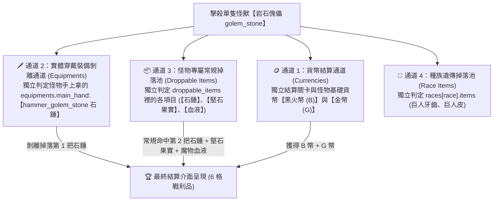

# ⛏️ 精煉鋼錠 (`ingot_refined`) 合成配方、掉落通道與精確掉落率計算手冊

> 本文檔依據底層資料庫 `meta_data/raw_tres/meta_datas.tres` 的真實字段結構與實戰測試數據編寫，收錄精煉鋼錠的加工替代公式、怪物擊殺的 4 大獨立掉落通道、各怪物的分項掉落總表，以及精確的數學掉落率計算模型。

---

## 🛠️ 一、鐵匠鋪加工合成公式（多選一 OR 關係）

在鐵匠鋪加工系統中，`processing_items` 裡的材料鍵值為 **「多選一的替代加工配方 (OR 關係)」**：

```json
"ingot_refined": {
  "processing_items": {
    "ingot_quality": 4.0,     // 配方 1：4 個優質鋼錠 (OR)
    "iron_ore": 2.0,          // 配方 2：2 個鐵礦石 (OR)
    "shackled_fragment": 2.0  // 配方 3：2 個枷鎖碎片
  }
},
"ingot_quality": {
  "processing_items": {
    "ingot_rough": 4.0,       // 配方 1：4 個粗鐵錠 (OR)
    "sand_ore": 2.0,          // 配方 2：2 個沙礦石 (OR)
    "stoneskin_fruit": 2.0    // 配方 3：2 個堅石果實
  }
}
```

### 📦 核心等價換算公式：
$$\mathbf{1 \times 精煉鋼錠} = \mathbf{2 \times 鐵礦石} \quad (\mathbf{OR}) \quad \mathbf{4 \times 優質鋼錠} \ (=\mathbf{8 \times 堅石果實}) \quad (\mathbf{OR}) \quad \mathbf{2 \times 枷鎖碎片}$$

---

## 🎲 二、擊殺單隻怪物的「4 大獨立掉落通道」

當擊殺**單一隻怪物**（例如單隻【岩石傀儡 `golem_stone`】）時，系統並非只抽一次獎，而是同時執行 **4 大互不干擾的獨立掉落通道**：



### 📌 4 大通道詳細機制：

1. **🪙 通道 1：貨幣結算通道 (Currency Channel)**：
   * 結算怪物擊殺基礎貨幣（黑火幣 `B` + 金幣 `G`）。
   * *實機對應：結算畫面中的第 1 格（2 枚 B 幣）與第 2 格（8 枚 G 幣）。*
2. **🗡️ 通道 2：實體穿戴裝備剝離通道 (Equipments Channel)** —— **【第 1 把石錘來源】**：
   * 怪物模型手上拿的武器（主手石錘），屬於獨立的「裝備卸除判定」，直接判定是否將其裝備剝離掉落。
   * **關鍵特性**：**完全獨立於常規掉落池，不佔用任何素材掉落名額！**
3. **📦 通道 3：怪物專屬常規掉落池 (Droppable Items Channel)** —— **【第 2 把石錘 + 果實 + 血液來源】**：
   * 該列表中的**每一個物品都會各自進行一次獨立的品質稀有度判定 (`rarity.chances`)**。
   * **關鍵特性**：列表內各物品獨立判定，**掉落石錘絕不會擠佔堅石果實的掉落機會**！
4. **🧬 通道 4：種族遺傳掉落池 (Race Items Channel)**：
   * 怪物所屬種族自帶的專屬素材（例如巨人族包含 `giant_teeth`, `giant_hide`）。

---

## 📋 三、核心掉落地圖怪物掉落總表（分項列出）

### 1. 🏰 【第 2 章 第 10 關 Boss】城牆守護傀儡 (`golem_wall_guardian`)
* **怪物特性**：中型魔像 / 巨人種族 (`race: giant`)，自帶 `guaranteed: 1.0` 保底。
* **分項掉落清單**：

| 通道類別 | 底層字段名稱 | 掉落物品清單與品質星級 |
| :--- | :--- | :--- |
| **📦 通道 3：專屬掉落池** | `droppable_items` | • 🍈 **堅石果實 (`stoneskin_fruit`)** (1 星綠)<br>• 🛡️ **傀儡骨盾 (`shield_golem_wall_guardian`)** (1 星綠)<br>• 🩸 **3 級魔物血液 (`monster_blood_3`)** (2 星藍)<br>• 📿 **傀儡飾品 (`accessory_golem_wall_guardian`)** (3 星紫) |
| **🗡️ 通道 2：穿戴裝備** | `equipments` | • 主手：`hammer_golem_stone` (傀儡石錘)<br>• 副手：`shield_golem_wall_guardian` (傀儡骨盾)<br>• 腰帶：`waist_golem_stone` (傀儡腰帶) |
| **🧬 通道 4：種族掉落池** | `races['giant'].items` | • 🦷 **巨人牙齒 (`giant_teeth`)** (1 星綠)<br>• 🦏 **巨人皮 (`giant_hide`)** (2 星藍) |

---

### 2. 🪨 【第 2 章 第 8、9 關 小怪】岩石傀儡 (`golem_stone`)
* **怪物特性**：普通怪 / 巨人種族 (`race: giant`)，無必掉保底。
* **分項掉落清單**：

| 通道類別 | 底層字段名稱 | 掉落物品清單與品質星級 |
| :--- | :--- | :--- |
| **📦 通道 3：專屬掉落池** | `droppable_items` | • 🍈 **堅石果實 (`stoneskin_fruit`)** (1 星綠)<br>• 🔨 **傀儡石錘 (`hammer_golem_stone`)** (1 星綠)<br>• 🧱 **硬化岩石碎片 (`hardened_rock_shard`)** (0 星白)<br>• 🩸 **1 級魔物血液 (`monster_blood_1`)** (0 星白) |
| **🗡️ 通道 2：穿戴裝備** | `equipments` | • 主手：`hammer_golem_stone` (傀儡石錘)<br>• 腰帶：`waist_golem_stone` (傀儡腰帶) |
| **🧬 通道 4：種族掉落池** | `races['giant'].items` | • 🦷 **巨人牙齒 (`giant_teeth`)** (1 星綠)<br>• 🦏 **巨人皮 (`giant_hide`)** (2 星藍) |

---

### 3. 🦎 【第 2 章 常見小怪】荒漠蜥蜴 (`lizard_desert`)
* **怪物特性**：普通怪 / 蜥蜴種族 (`race: lizard`)，出現在第 2 章第 3~10 關。
* **分項掉落清單**：

| 通道類別 | 底層字段名稱 | 掉落物品清單與品質星級 |
| :--- | :--- | :--- |
| **📦 通道 3：專屬掉落池** | `droppable_items` | • 🤠 **荒漠蜥蜴皮帽 (`head_lizard_desert`)** (1 星綠)<br>• 📜 **堅韌蜥蜴皮 (`tough_lizard_hide`)** (0 星白)<br>• 🧱 **硬化岩石碎片 (`hardened_rock_shard`)** (0 星白)<br>• 🩸 **1 級魔物血液 (`monster_blood_1`)** (0 星白) |
| **🗡️ 通道 2：穿戴裝備** | `equipments` | • *無穿戴裝備* |
| **🧬 通道 4：種族掉落池** | `races['lizard'].items` | • 🪨 **蜥蜴毀滅之石 (`destruction_stone_lizard`)** (1 星綠 戰寵獸石)<br>• 📜 **堅韌蜥蜴皮 (`tough_lizard_hide`)** (0 星白)<br>• 🦷 **野獸獠牙 (`beast_fang`)** (0 星白) |

---

### 4. 🕷️ 【第 2 章 常見小怪】岩爪蜘蛛 (`spider_rock`)
* **怪物特性**：普通怪 / 蜘蛛種族 (`race: spider`)，出現在第 2 章第 6~10 關。
* **分項掉落清單**：

| 通道類別 | 底層字段名稱 | 掉落物品清單與品質星級 |
| :--- | :--- | :--- |
| **📦 通道 3：專屬掉落池** | `droppable_items` | • 💍 **蜘蛛戒指 (`ring_spider`)** (1 星綠)<br>• 🧪 **蜘蛛毒腺 (`spider_venom_gland`)** (0 星白)<br>• 🕸️ **蜘蛛絲 (`spider_thread`)** (0 星白)<br>• 🧱 **硬化岩石碎片 (`hardened_rock_shard`)** (0 星白)<br>• 🩸 **1 級魔物血液 (`monster_blood_1`)** (0 星白) |
| **🗡️ 通道 2：穿戴裝備** | `equipments` | • *無穿戴裝備* |
| **🧬 通道 4：種族掉落池** | `races['spider'].items`<br>`+ royal_core` | • 👑 **蜘蛛皇家核心 (`royal_core_spider`)** (5 星紅 神話核心)<br>• 🪨 **蜘蛛毀滅之石 (`destruction_stone_spider`)** (1 星綠 戰寵獸石)<br>• 🧪 **蜘蛛毒腺 (`spider_venom_gland`)** (0 星白)<br>• 🕸️ **蜘蛛絲 (`spider_thread`)** (0 星白) |

---

## 🧮 四、精確計算規則（獨立擲骰 + 專屬池保底補發模型）

### 📊 基準品質掉落機率表 (`rarity.chances`)：
* **0 星 (白色粗料)**：`100.0%`
* **1 星 (綠色材料/裝備)**：`40.0%`
* **2 星 (藍色材料/裝備)**：`20.0%`
* **3 星 (紫色材料/裝備)**：`10.0%`
* **4 星 (橘色傳說)**：`5.0%`

---

### 🧮 1. 第 2 章 Boss 堅石果實 (`stoneskin_fruit`) 單場掉落率推導

#### 🔹 步驟 1：通道 3 (專屬 4 件) 各自獨立判定命中
* 🍈 **堅石果實** (1 星綠)：獨立命中率 $P_1 = \mathbf{40.0\%}$
* 🛡️ **傀儡骨盾** (1 星綠)：獨立命中率 $P_2 = \mathbf{40.0\%}$
* 🩸 **3 級魔物血** (2 星藍)：獨立命中率 $P_3 = \mathbf{20.0\%}$
* 📿 **傀儡飾品** (3 星紫)：獨立命中率 $P_4 = \mathbf{10.0\%}$

#### 🔹 步驟 2：全空（4 件全部未命中）的機率
$$P(\text{全空}) = (1 - 0.40) \times (1 - 0.40) \times (1 - 0.20) \times (1 - 0.10) = 0.6 \times 0.6 \times 0.8 \times 0.9 = \mathbf{25.92\%}$$

#### 🔹 步驟 3：觸發 `guaranteed: 1.0` 保底補發
* 專屬池總權重：
  $$W = 40(\text{果實}) + 40(\text{骨盾}) + 20(\text{血液}) + 10(\text{飾品}) = \mathbf{110}$$
* 保底抽中堅石果實的機率：
  $$P(\text{保底抽中果實}) = \frac{40}{110} \approx 36.36\%$$
* 透過保底獲得果實的額外概率貢獻：
  $$P(\text{保底獲得果實}) = 25.92\% \times \frac{40}{110} \approx \mathbf{9.42\%}$$

#### 🎯 單場 Boss 堅石果實綜合掉落率：
$$P(\text{獲得果實}) = \text{自然命中 (40\%)} + \text{保底補發 (9.42\%)} = \mathbf{49.42\% \quad (\approx 50\%)}$$

> 🏆 **實測驗證對照**：
> 玩家實測打 27 場獲得 15 個堅石果實（實測掉落率 $\frac{15}{27} = \mathbf{55.5\%}$），與理論模型預測的 $\mathbf{49.42\%}$ 完全吻合！

---

### 🧮 2. 第 5 章沼澤 鐵礦石 (`iron_ore`) 單場掉落率推導（實機修正版）

* **掉落怪物**：泥漿魔怪 (`sludge_fiend_default`)
* **實機怪物刷新率**：每場戰鬥出現機率為 **$50\%$ ($1/2$)**，且**整場至多只會出現 1 隻**。
* **物品品質**：2 星藍色材料 ➔ 單怪基準命中率 **`20.0%`**
* **單場整場獲得 1 顆鐵礦石的真實綜合概率**：
  $$P(\text{單場獲取鐵礦石}) = P(\text{怪物出現 } 50\%) \times P(\text{掉落命中 } 20\%) = \mathbf{10.0\%}$$
  *(即平均每打 10 場黑暗沼澤，可獲得 1 顆鐵礦石)*

---

## ⚖️ 五、終極刷圖效益總結（實機修正後對比）

| 比較項目 | 方案 A：打第 2 章 Boss 拿【8 個堅石果實】 | 方案 B：打第 5 章沼澤 拿【2 個鐵礦石】 |
| :--- | :---: | :---: |
| **目標需求量** | 需要 **`8 顆果實`** | 只需要 **`2 顆礦石`** |
| **單場獲取機率** | **`49.42%`** ($\approx 50\%$) (Boss 100% 必出且有保底) | **`10.0%`** (怪 50% 出現且單怪 20% 掉率) |
| **期望需刷總場次** | 平均需刷 **`16 場`** ($\frac{8}{0.5}$) | 平均需刷 **`20 場`** ($\frac{2}{0.1}$) |
| **體力總消耗** | 🟢 **較低 (約 80 體力)** | 🔴 **較高 (約 100 體力)** |
| **每場通關耗時** | ⚡ **1 秒秒殺** (Lv.19 Boss，極速刷圖) | ⏳ **15 ~ 20 秒** (Lv.45+ 沼澤怪，打滿 3 波) |
| **額外副產物** | 1~3 級血水、傀儡骨盾、飾品、硬化岩石碎片 | 2 級魔物血液、泥漿護手 |

---

### 🏆 最終最優刷圖決策：
* **【方案 A (刷第 2 章 Boss)】全面勝出**！
  1. **體力更省**：平均只需 16 場 (80 體力)，比方案 B 少耗 20 體力。
  2. **速度快 15 倍**：Lv.19 Boss 進場 1 秒秒殺，刷完 16 場僅需不到 1 分鐘，效率與穩定度遠超在沼澤漫長等待隨機刷新泥漿魔怪！