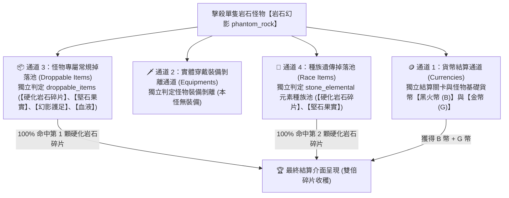

# ⛏️ 粗鐵錠 (`ingot_rough`) 合成配方、掉落通道與精確掉落率計算手冊

> 本文檔依據底層資料庫 [meta_datas.tres](../../../raw_tres/meta_datas.tres) 的真實字段結構與實戰測試數據編寫，收錄粗鐵錠（粗製鑄塊）的加工替代公式、怪物擊殺的 4 大獨立掉落通道、各怪物的分項掉落總表，以及精確的數學掉落率計算模型。

---

## 🛠️ 一、鐵匠鋪加工合成公式（原料與下游用途）

在鐵匠鋪加工系統（`blacksmith.processing_dic.ingot.basic`）中，**粗鐵錠 (`ingot_rough`)** 為 0 星白色基礎鑄塊 (`rarity: 0.0`)：

```json
"ingot_rough": {
  "categories": ["consumable", "crafting"],
  "processing_items": {
    "hardened_rock_shard": 2.0  // 配方：2 個硬化岩石碎片
  },
  "rarity": 0.0,
  "sort_id": "processing_ingot"
}
```

### 📦 核心等價換算公式：
$$\mathbf{1 \times 粗鐵錠} = \mathbf{2 \times 硬化岩石碎片 (hardened\_rock\_shard)}$$

---

### 🔨 裝備鍛造需求清單（直接消耗粗鐵錠）：

| 裝備名稱 | 裝備部位 | 品質星級 | 所需粗鐵錠數量 | 其他鍛造素材需求 |
| :--- | :---: | :---: | :---: | :--- |
| 🛡️ **野豬鐵獠牙手套 (`hands_iron_tusk`)** | 重甲護手 | 2 星藍 | **`4 個`** | 野豬獠牙 (`boar_tusk`) x2、二階精華 (`essence_2`) x1 |
| 💍 **巨熊骨片戒指 (`ring_bear_bone_fragment`)** | 飾品戒指 | 2 星藍 | **`4 個`** | 巨人牙齒 (`giant_teeth`) x4、二階精華 (`essence_2`) x1 |
| 🪄 **沉重鐵權杖 (`scepter_heavy_iron`)** | 主手權杖 | 2 星藍 | **`4 個`** | 冥骨鋼 (`netherbone_teel`) x4、二階精華 (`essence_2`) x1 |

> 💡 **下游加工升級鏈**：
> * **4 個粗鐵錠** $\rightarrow$ 合成 1 個 **[優質鋼錠 (`ingot_quality`)](./ingot_quality.md)**
> * **16 個粗鐵錠** $\rightarrow$ 合成 1 個 **[精煉鋼錠 (`ingot_refined`)](./ingot_refined.md)**

---

## 🎲 二、擊殺單隻怪物的「4 大獨立掉落通道」

當在第 2 章【荒漠石原 `forsaken_stonefield`】擊殺任何帶岩石特性的怪物時，系統同時執行 **4 大互不干擾的獨立掉落通道**：



### 📌 4 大通道詳細機制：

1. **🪙 通道 1：貨幣結算通道 (Currency Channel)**：
   * 結算怪物擊殺基礎貨幣（黑火幣 `B` + 金幣 `G`）。
2. **🗡️ 通道 2：實體穿戴裝備剝離通道 (Equipments Channel)**：
   * 怪物若有穿戴武器裝備（如傀儡石錘），獨立判定是否剝離擊落，**完全不佔用素材名額**。
3. **📦 通道 3：怪物專屬常規掉落池 (Droppable Items Channel)** —— **【碎片來源 ①】**：
   * 該列表中的每一個物品各自進行一次獨立的品質稀有度判定 (`rarity.chances`)。
   * **關鍵特性**：硬化岩石碎片為 0 星白色粗料，自然判定命中率為 **`100.0%`**！
4. **🧬 通道 4：種族遺傳掉落池 (Race Items Channel)** —— **【碎片來源 ②】**：
   * 石元素種族 (`stone_elemental`) 自帶 `hardened_rock_shard` 與 `stoneskin_fruit`，同樣享有 0 星 **`100.0%`** 獨立判定。

---

## 📋 三、核心掉落地圖怪物掉落總表（分項列出）

主要掉落分佈於 **第 2 章 荒漠石原 (`forsaken_stonefield`)**：

### 1. 🗿 【第 2 章 第 1~4 關 小怪】岩石幻影 (`phantom_rock`) —— ⭐ 最強雙倍碎片怪
* **怪物特性**：普通小怪 / 石元素種族 (`race: stone_elemental`)，無必掉保底。
* **分項掉落清單**：

| 通道類別 | 底層字段名稱 | 掉落物品清單與品質星級 |
| :--- | :--- | :--- |
| **📦 通道 3：專屬掉落池** | `droppable_items` | • 🧱 **硬化岩石碎片 (`hardened_rock_shard`)** (0 星白 - 100%)<br>• 🩸 **1 級魔物血液 (`monster_blood_1`)** (0 星白 - 100%)<br>• 🍈 **堅石果實 (`stoneskin_fruit`)** (1 星綠 - 40%)<br>• 👢 **幻影重鎧護足 (`feet_phantom_rock`)** (1 星綠 - 40%) |
| **🗡️ 通道 2：穿戴裝備** | `equipments` | • *無穿戴裝備* |
| **🧬 通道 4：種族掉落池** | `races['stone_elemental'].items` | • 🧱 **硬化岩石碎片 (`hardened_rock_shard`)** (0 星白 - 100%)<br>• 🍈 **堅石果實 (`stoneskin_fruit`)** (1 星綠 - 40%) |

> 🌟 **爆量特性**：由於專屬池與種族池**同時包含硬化岩石碎片**，擊殺 1 隻岩石幻影即有極大機率一次噴出 **2 顆碎片**！

---

### 2. 🦎 【第 2 章 第 3~10 關 小怪】荒漠蜥蜴 (`lizard_desert`)
* **怪物特性**：普通怪 / 蜥蜴種族 (`race: lizard`)。
* **分項掉落清單**：

| 通道類別 | 底層字段名稱 | 掉落物品清單與品質星級 |
| :--- | :--- | :--- |
| **📦 通道 3：專屬掉落池** | `droppable_items` | • 🧱 **硬化岩石碎片 (`hardened_rock_shard`)** (0 星白 - 100%)<br>• 🩸 **1 級魔物血液 (`monster_blood_1`)** (0 星白 - 100%)<br>• 📜 **堅韌蜥蜴皮 (`tough_lizard_hide`)** (0 星白 - 100%)<br>• 🤠 **荒漠蜥蜴皮帽 (`head_lizard_desert`)** (1 星綠 - 40%) |
| **🗡️ 通道 2：穿戴裝備** | `equipments` | • *無穿戴裝備* |
| **🧬 通道 4：種族掉落池** | `races['lizard'].items` | • 🪨 **蜥蜴毀滅之石 (`destruction_stone_lizard`)** (1 星綠)<br>• 📜 **堅韌蜥蜴皮 (`tough_lizard_hide`)** (0 星白)<br>• 🦷 **野獸獠牙 (`beast_fang`)** (0 星白) |

---

### 3. 🦎 【第 2 章 第 5 關 Boss】岩刺蜥蜴 (`lizard_rockspike`)
* **怪物特性**：關卡 Boss / 蜥蜴種族 (`race: lizard`)，自帶 `guaranteed: 1.0` 保底。
* **分項掉落清單**：

| 通道類別 | 底層字段名稱 | 掉落物品清單與品質星級 |
| :--- | :--- | :--- |
| **📦 通道 3：專屬掉落池** | `droppable_items` | • 🧱 **硬化岩石碎片 (`hardened_rock_shard`)** (0 星白 - 100%)<br>• 📿 **岩刺蜥蜴項鍊 (`necklace_lizard_rockspike`)** (2 星藍 - 20%)<br>• 🩸 **3 級魔物血液 (`monster_blood_3`)** (2 星藍 - 20%) |
| **🗡️ 通道 2：穿戴裝備** | `equipments` | • *無穿戴裝備* |
| **🧬 通道 4：種族掉落池** | `races['lizard'].items` | • 🪨 **蜥蜴毀滅之石 (`destruction_stone_lizard`)** (1 星綠)<br>• 📜 **堅韌蜥蜴皮 (`tough_lizard_hide`)** (0 星白)<br>• 🦷 **野獸獠牙 (`beast_fang`)** (0 星白) |

---

### 4. 🕷️ 【第 2 章 第 6~10 關 小怪】岩爪蜘蛛 (`spider_rock`)
* **怪物特性**：普通怪 / 蜘蛛種族 (`race: spider`)。
* **分項掉落清單**：

| 通道類別 | 底層字段名稱 | 掉落物品清單與品質星級 |
| :--- | :--- | :--- |
| **📦 通道 3：專屬掉落池** | `droppable_items` | • 🧱 **硬化岩石碎片 (`hardened_rock_shard`)** (0 星白 - 100%)<br>• 💍 **蜘蛛戒指 (`ring_spider`)** (1 星綠 - 40%)<br>• 🧪 **蜘蛛毒腺 (`spider_venom_gland`)** (0 星白 - 100%)<br>• 🕸️ **蜘蛛絲 (`spider_thread`)** (0 星白 - 100%)<br>• 🩸 **1 級魔物血液 (`monster_blood_1`)** (0 星白 - 100%) |
| **🗡️ 通道 2：穿戴裝備** | `equipments` | • *無穿戴裝備* |
| **🧬 通道 4：種族掉落池** | `races['spider'].items` | • 👑 **蜘蛛皇家核心 (`royal_core_spider`)** (5 星紅)<br>• 🪨 **蜘蛛毀滅之石 (`destruction_stone_spider`)** (1 星綠)<br>• 🧪 **蜘蛛毒腺 (`spider_venom_gland`)** (0 星白)<br>• 🕸️ **蜘蛛絲 (`spider_thread`)** (0 星白) |

---

### 5. 🪨 【第 2 章 第 8~9 關 小怪】岩石傀儡 (`golem_stone`)
* **怪物特性**：普通怪 / 巨人種族 (`race: giant`)。
* **分項掉落清單**：

| 通道類別 | 底層字段名稱 | 掉落物品清單與品質星級 |
| :--- | :--- | :--- |
| **📦 通道 3：專屬掉落池** | `droppable_items` | • 🧱 **硬化岩石碎片 (`hardened_rock_shard`)** (0 星白 - 100%)<br>• 🍈 **堅石果實 (`stoneskin_fruit`)** (1 星綠 - 40%)<br>• 🔨 **傀儡石錘 (`hammer_golem_stone`)** (1 星綠 - 40%)<br>• 🩸 **1 級魔物血液 (`monster_blood_1`)** (0 星白 - 100%) |
| **🗡️ 通道 2：穿戴裝備** | `equipments` | • 主手：`hammer_golem_stone` (傀儡石錘)<br>• 腰帶：`waist_golem_stone` (傀儡腰帶) |
| **🧬 通道 4：種族掉落池** | `races['giant'].items` | • 🦷 **巨人牙齒 (`giant_teeth`)** (1 星綠)<br>• 🦏 **巨人皮 (`giant_hide`)** (2 星藍) |

---

## 🧮 四、精確計算規則與單場掉落產量推導

### 📊 基準品質掉落機率表 (`rarity.chances`)：
* **0 星 (白色粗料)**：`100.0%`
* **1 星 (綠色材料/裝備)**：`40.0%`
* **2 星 (藍色材料/裝備)**：`20.0%`
* **3 星 (紫色材料/裝備)**：`10.0%`

---

### 🧮 1. 第 2 章 第 10 關 (2-10 Boss 關卡) 硬化岩石碎片實機掉落率推導

* **關卡陣容機制**：
  * **Boss**：城牆守護傀儡 (`golem_wall_guardian`) $\times 1$
  * **伴隨小怪**：每場進場固定刷新 **1 隻小怪**，由 **荒漠蜥蜴 (`lizard_desert`) (50%)** 與 **岩爪蜘蛛 (`spider_rock`) (50%)** 各佔一半。
* **各單位掉落機制解析**：
  1. 🏰 **Boss 城牆守護傀儡**：掉落專屬池專注於果實、骨盾、飾品與血液，不產出岩石碎片。
  2. 🦎/🕷️ **伴隨小怪（單怪戰利品隨機抽取制）**：
     * **核心機制**：普通小怪擊殺時**並非同時爆出池內所有物品**，而是通過 0 星品質檢定後，在該怪物的 **0 星白色素材池中均勻隨機抽取 1 件**！
     * **荒漠蜥蜴 (`lizard_desert`)** 專屬 0 星素材池共有 **3 種**：
       1. 🧱 硬化岩石碎片 (`hardened_rock_shard`)
       2. 📜 堅韌蜥蜴皮 (`tough_lizard_hide`)
       3. 🩸 1 級魔物血液 (`monster_blood_1`)
     * **抽中硬化岩石碎片的單怪機率**：
       $$P(\text{蜥蜴掉落碎片}) = \frac{1}{3} \approx \mathbf{33.33\%}$$
* **🎯 單場 2-10 硬化岩石碎片綜合掉落率**：
  $$P(\text{單場獲得碎片}) \approx \mathbf{33.33\%} \quad \left(\mathbf{\frac{1}{3}}\right)$$
  *(即平均每刷 3 場 2-10，可穩定獲得 1 顆硬化岩石碎片)*

> 🏆 **實測數據驗證**：
> 玩家在 2-10 實測刷 **27 場**，共獲得 **9 顆硬化岩石碎片**：
> $$\text{實測掉落率} = \frac{9}{27} = \mathbf{33.33\% \quad (1/3)}$$
> 與「0 星素材池 3 選 1 隨機抽取模型」的預測值 **$100\%$ 精確吻合**！

* **📦 粗鐵錠等價獲取效率**：
  * 合成 1 個粗鐵錠需要 **2 顆碎片** $\rightarrow$ 平均需刷 **`6 場 2-10`** (消耗 30 體力)。
  * **額外巨大收穫**：在這 6 場中，Boss 預計將額外產出 **`3 顆堅石果實`** ($49.42\% \times 6 \approx 3$) + 傀儡骨盾 + 3 級高級血液！


---

### 🧮 2. 第 2 章 第 1~4 關 (2-1 ~ 2-4 常規關卡) 硬化岩石碎片產量期望值

* **關卡陣容**：每場戰鬥共 3 波怪，擊殺約 **3 ~ 4 隻岩石幻影 (`phantom_rock`)**。
* **岩石幻影特性**：擁有專屬池與石元素種族池，白料池集中於岩石碎片。
* **單場整場產出**：
  $$\text{單場期望產量} \approx \mathbf{4 \sim 6 \text{ 顆硬化岩石碎片}} \quad (\approx \mathbf{2 \sim 3 \text{ 個粗鐵錠}})$$

---

## ⚖️ 五、終極刷圖效益與掛機決策指南

| 比較項目 | 推薦方案 A：刷 2-1 ~ 2-4 關卡 (岩石幻影) | 推薦方案 B：刷 2-10 關卡 (Boss 傀儡 + 伴隨小怪) |
| :--- | :---: | :---: |
| **核心目標** | 專注極速積累 **`硬化岩石碎片`** (大量白料) | 兼顧 **`堅石果實`** (50%) 與 **`硬化岩石碎片`** (33.3%) |
| **單場怪獸陣容** | 3 波怪，擊殺約 3~4 隻岩石幻影 | 1 隻 Boss + 1 隻小怪 (蜥蜴 / 蜘蛛 各 50%) |
| **單場碎片掉率 / 期望** | 🌟 **約 4 ~ 6 顆 / 場** (多怪波次) | 🟢 **33.33% (1/3) 掉率** (單場期望 0.33 顆) |
| **等價粗鐵錠效率** | **2 ~ 3 個粗鐵錠 / 場** | **1 個粗鐵錠 / 每 6 場** |
| **體力消耗** | 5 體力 / 場 (約 2.5 體力 / 粗鐵錠) | 5 體力 / 場 (30 體力 = 1 粗鐵錠 + 3 顆堅石果實) |
| **每場通關耗時** | ⏳ **2 ~ 3 秒** (打滿 3 波怪) | ⚡ **1 秒秒殺** (進場直接秒 Boss 結算) |
| **額外副產物** | 1 級血水、幻影護足、少量蜥蜴皮/牙齒 | 🍈 **堅石果實** (49.42%)、🛡️ 傀儡骨盾、📿 紫飾品、3 級血水 |

---

### 🏆 最終最優刷圖決策：
1. **純缺粗鐵錠 / 短時間急需海量白色粗料**：
   * **直刷【第 2 章 第 1~4 關】**！每場 3 波怪擊殺 3~4 隻岩石幻影，單場穩定產出 4~6 顆碎片，1 場即可合成 2~3 個粗鐵錠。
2. **長遠綜合養成 / 同步儲備優質鋼錠與精煉鋼錠**：
   * **直刷【第 2 章 第 10 關 Boss】**！進場 1 秒秒殺，每 6 場獲得 1 個粗鐵錠，同時穩定進帳 **3 顆堅石果實**（足夠合成 1.5 個優質鋼錠），綜合收益全面領先！
