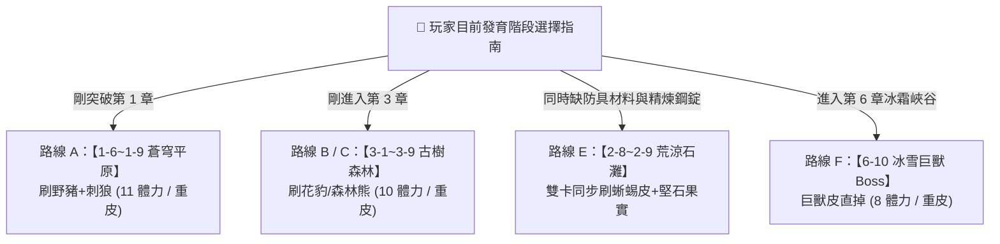

# 🧥 重皮革 (`leather_heavy`) 完整合成樹、怪物掉落通道與精確刷圖場次模型

> 本文檔依據底層資料庫 `meta_data/raw_tres/meta_datas.tres` 的真實字段結構、全域掉落手冊 [Drop_rate.md](../Drop_rate.md) 與精煉鋼錠手冊 [ingot_refined.md](../ingot/ingot_refined.md) 編寫。完整拆解 2 階重皮革 (`leather_heavy`) 的多階級替代合成樹（含 0 階輕皮、1 階中皮與 2~3 階高階皮）、單怪 4 大獨立通道、全地圖掉落怪物清單，以及各掛機關卡的精確掉率與期望刷圖場次。

---

## 🛠️ 一、鐵匠鋪精煉與多階級等價合成樹 (OR 替代關係)

在鐵匠鋪加工系統 (`blacksmith.processing_dic` 與 `items.processing_items`) 中，`leather_heavy` 支援**「低階逐層合成」**與**「高階特化皮革直接替換」**雙軌制。

### 🌳 1. 重皮革完整合成樹結構圖

```mermaid
graph TD
    LH["🧥 2 階重皮革 (leather_heavy)<br>[2 星藍色品級]"]

    %% Direct High-tier substitutes
    LH -->|配方 B (2星藍)| GH["🦏 巨人皮 (giant_hide) x2"]
    LH -->|配方 C (2星藍)| BH["🐻 厚熊皮 (thick_bear_hide) x2"]
    LH -->|配方 D (2星藍)| SH["🐍 蛇皮 (snake_hide) x2"]
    LH -->|配方 E (2星藍)| IF["❄️ 冰原毛皮 (ice_fur) x2"]
    LH -->|配方 F (3星紫)| BMH["👑 巨獸皮 (behemoth_hide) x1"]

    %% Medium Leather Branch
    LH -->|配方 A (OR)| LM["👔 1 階中皮革 (leather_medium) x4<br>[1 星綠色品級]"]

    LM -->|中皮配方 B (1星綠)| LPH["🐆 花豹皮 (leopard_hide) x2"]
    LM -->|中皮配方 C (1星綠)| PS["🦎 石化鱗片 (petrified_scale) x2"]

    LM -->|中皮配方 A (OR)| LL["👕 0 階輕皮革 (leather_light) x4<br>[0 星白色品級]"]

    %% Base White Materials
    LL -->|輕皮配方 1| WP["🐺 狼皮 (wolf_pelt) x2"]
    LL -->|輕皮配方 2| BOH["🐗 野豬皮 (boar_hide) x2"]
    LL -->|輕皮配方 3| FS["🐸 蛙皮 (frog_skin) x2"]
    LL -->|輕皮配方 4| TLH["🦎 堅韌蜥蜴皮 (tough_lizard_hide) x2"]
    LL -->|輕皮配方 5| SWS["🐛 沙蟲鱗片 (sandworm_scale) x2"]
    LL -->|輕皮配方 6| BW["🦇 蝙蝠翅膀 (bat_wing) x4"]
```

---

### 📦 2. 重皮革核心等價換算公式

$$\mathbf{1 \times 重皮革} = \begin{cases}
\mathbf{4 \times 中皮革} = \mathbf{16 \times 輕皮革} = \begin{cases}
\mathbf{32 \times 狼皮} \quad (\text{OR}) \quad \mathbf{32 \times 野豬皮} \\
\mathbf{32 \times 蛙皮} \quad (\text{OR}) \quad \mathbf{32 \times 堅韌蜥蜴皮} \\
\mathbf{32 \times 沙蟲鱗片} \quad (\text{OR}) \quad \mathbf{64 \times 蝙蝠翅膀}
\end{cases} \\
\mathbf{8 \times 花豹皮} \quad (\text{OR}) \quad \mathbf{8 \times 石化鱗片} \\
\mathbf{2 \times 巨人皮} \quad (\text{OR}) \quad \mathbf{2 \times 厚熊皮} \quad (\text{OR}) \quad \mathbf{2 \times 蛇皮} \quad (\text{OR}) \quad \mathbf{2 \times 冰原毛皮} \\
\mathbf{1 \times 巨獸皮} \quad (\text{大後期 3星紫直換})
\end{cases}$$

---

## 🎲 二、擊殺單隻怪物的「4 大獨立掉落通道」與品質機率基準

依據 [Drop_rate.md](../Drop_rate.md) 的底層機制，擊殺單隻怪物時，系統同時執行 **4 大互不干擾的獨立掉落通道**：

| 通道編號 | 通道名稱 | 運作機制與特徵 | 本文皮革素材代表 |
| :---: | :--- | :--- | :--- |
| **🪙 通道 1** | **貨幣結算通道** | 結算關卡黑火幣 (B) 與金幣 (G) | 黑火幣、金幣 |
| **🗡️ 通道 2** | **裝備剝離通道** | 判定怪物實際穿戴的武器/防具是否剝離掉落 | 狼皮靴 (`feet_wolf_pelt`) |
| **📦 通道 3** | **專屬常規掉落池** | 列表內每個物品按品質星級概率獨立擲骰 | 狼皮 (`wolf_pelt`)、堅韌蜥蜴皮 (`tough_lizard_hide`) |
| **🧬 通道 4** | **種族遺傳掉落池** | 怪物所屬種族 (wolf, bear, lizard, panther) 專屬素材 | 厚熊皮 (`thick_bear_hide`)、花豹皮 (`leopard_hide`) |

### 📊 掉落品質星級與基準命中率 (`rarity.chances`)：
* ⚪ **0 星 (白色粗料)**：`rarity: 0.0` ➔ **`100.0%` 必掉** (狼皮、野豬皮、蛙皮、堅韌蜥蜴皮、沙蟲鱗片)
* 🟢 **1 星 (綠色材料)**：`rarity: 1.0` ➔ **`40.0%` 命中** (花豹皮、石化鱗片)
* 🔵 **2 星 (藍色材料)**：`rarity: 2.0` ➔ **`20.0%` 命中** (巨人皮、厚熊皮、蛇皮、冰原毛皮)
* 🟣 **3 星 (紫色材料)**：`rarity: 3.0` ➔ **`10.0%` 命中** (巨獸皮)

---

## 📋 三、皮革素材對應怪物與關卡掉落總表

### 1. 🦏 高階直合皮 (2 星藍 / 3 星紫) 掉落怪物

| 素材名稱 | 底層 ID | 品質 | 代表掉落怪物 (底層 ID) | 掉落通道 | 基準機率 | 登場主要關卡 |
| :--- | :--- | :---: | :--- | :---: | :---: | :--- |
| **巨獸皮** | `behemoth_hide` | 3 星紫 | 冰雪巨獸 (`behemoth_frost`) | 🧬 種族池 | **10.0%** (帶保底) | 6-10 冰霜峽谷 Boss |
| **厚熊皮** | `thick_bear_hide` | 2 星藍 | 森林熊 (`bear_forest`) / 巨熊約爾達 | 🧬 種族池 | **20.0%** | 3-6 ~ 3-9 古樹森林 |
| **巨人皮** | `giant_hide` | 2 星藍 | 岩石傀儡 (`golem_stone`) / 城牆守護者 | 🧬 種族池 | **20.0%** | 2-8 ~ 2-10 荒涼石灘 |
| **蛇皮** | `snake_hide` | 2 星藍 | 詛咒金蛇 (`snake_cursed_golden`) | 🧬 種族池 | **20.0%** | 深淵地牢 / 遺跡關卡 |

---

### 2. 🐆 中階皮 (1 星綠) 掉落怪物

| 素材名稱 | 底層 ID | 品質 | 代表掉落怪物 (底層 ID) | 掉落通道 | 基準機率 | 登場主要關卡 |
| :--- | :--- | :---: | :--- | :---: | :---: | :--- |
| **花豹皮** | `leopard_hide` | 1 星綠 | 森林花豹 (`panther_forest`) | 📦專屬 + 🧬種族 | **40.0% + 40.0%** | 3-1 ~ 3-5 古樹森林 |
| **石化鱗片** | `petrified_scale` | 1 星綠 | 石化蜥蜴 (`lizard_petrified`) | 📦 專屬池 | **40.0%** | 4-1 ~ 4-5 沙漠廢墟 |

---

### 3. 🐺 基礎白皮 (0 星白) 掉落怪物 (100% 必掉)

| 素材名稱 | 底層 ID | 品質 | 代表掉落怪物 (底層 ID) | 掉落通道 | 基準機率 | 登場主要關卡 |
| :--- | :--- | :---: | :--- | :---: | :---: | :--- |
| **野豬皮** | `boar_hide` | 0 星白 | 野豬 (`boar_default`) / 鐵獠牙 | 🧬 種族池 | **100.0%** | 1-6 ~ 1-10 蒼穹平原 |
| **狼皮** | `wolf_pelt` | 0 星白 | 荊棘狼 (`wolf_thorn`) / 廢土狼 | 📦專屬 + 🧬種族 | **100% + 100% (雙倍)** | 1-6 ~ 1-9 蒼穹平原 |
| **堅韌蜥蜴皮**| `tough_lizard_hide`| 0 星白 | 荒漠蜥蜴 (`lizard_desert`) / 焦岩蜥蜴 | 📦專屬 + 🧬種族 | **100% + 100% (雙倍)** | 2-3 ~ 2-10 荒涼石灘 |
| **沙蟲鱗片** | `sandworm_scale` | 0 星白 | 沙蟲 (`sandworm`) | 🧬 種族池 | **100.0%** | 4-1 ~ 4-5 沙漠廢墟 |
| **蛙皮** | `frog_skin` | 0 星白 | 毒蛙 (`toad_bloodsucker` / `toad_plague`)| 🧬 種族池 | **100.0%** | 5-6 ~ 5-9 幽暗沼澤 |

---

## 🧮 四、各掛機關卡精確掉率與期望刷圖場次計算 (Clear Count Calculations)

以下針對玩家不同的發育階段，提供 6 條代表性掛機路線的**單場綜合進度與合成 1 個重皮革 (`leather_heavy`) 的期望場次與體力消耗**：

---

### 🟢 路線 A：【第一章 蒼穹平原 (skyward_plains) 1-6~1-9】（新手最快過渡路線）

* **地圖怪物組**：野豬 (`boar_default`) x1 + 荊棘狼 (`wolf_thorn`) x1
* **單場戰利品產出**：
  * 野豬皮 x1 ($100\%$ 機率) ➔ 進度貢獻 $\frac{1}{32} = \mathbf{3.125\%}$
  * 狼皮 x2 (雙通道 $100\%$ 機率) ➔ 進度貢獻 $\frac{2}{32} = \mathbf{6.25\%}$
* **單場重皮革綜合合成進度**：
  $$\text{單場進度} = 3.125\% + 6.25\% = \mathbf{9.375\%}$$
* **期望刷圖場次與體力消耗**：
  $$\mathbf{N = \frac{1}{0.09375} \approx 10.67 \text{ 場} \quad (\approx 11 \text{ 場})}$$
  * **體力總消耗**：$11 \text{ 場} \times 1 \text{ 體力} = \mathbf{11 \text{ 體力 / 1個重皮}}$！

---

### 🟢 路線 B：【第三章 古樹森林 (ancient_woodlands) 3-1~3-4】（綠皮花豹快刷路線）

* **地圖怪物組**：森林花豹 (`panther_forest`) x1
* **單場戰利品產出**：
  * 花豹皮獨立雙通道命中率：$40\% + 40\% = \mathbf{0.8 \text{ 張/場}}$
  * 需 8 張花豹皮合成 1 個重皮
* **單場重皮革綜合合成進度**：
  $$\text{單場進度} = \frac{0.8}{8} = \mathbf{10.0\%}$$
* **期望刷圖場次與體力消耗**：
  $$\mathbf{N = \frac{1}{0.10} = 10 \text{ 場}}$$
  * **體力總消耗**：$10 \text{ 場} \times 1 \text{ 體力} = \mathbf{10 \text{ 體力 / 1個重皮}}$！

---

### 🟢 路線 C：【第三章 古樹森林 (ancient_woodlands) 3-6~3-9】（厚熊皮直合重皮路線）

* **地圖怪物組**：森林熊 (`bear_forest`) x1
* **單場戰利品產出**：
  * 厚熊皮單怪命中率：$\mathbf{20.0\% \ (0.2 \text{ 張/場})}$
  * 需 2 張厚熊皮合成 1 個重皮
* **單場重皮革綜合合成進度**：
  $$\text{單場進度} = \frac{0.2}{2} = \mathbf{10.0\%}$$
* **期望刷圖場次與體力消耗**：
  $$\mathbf{N = \frac{1}{0.10} = 10 \text{ 場}}$$
  * **體力總消耗**：$10 \text{ 場} \times 1 \text{ 體力} = \mathbf{10 \text{ 體力 / 1個重皮}}$！

---

### 🟢 路線 D：【第四章 沙漠廢墟 (desert_ruins) 4-1~4-4】（雙材料併進效率路線）

* **地圖怪物組**：石化蜥蜴 (`lizard_petrified`) x1 + 沙蟲 (`sandworm`) x1
* **單場戰利品產出**：
  * 石化鱗片 x0.4 (需要 8 張 = $\mathbf{5.0\%}$ 進度)
  * 堅韌蜥蜴皮 x1.0 (需要 32 張 = $\mathbf{3.125\%}$ 進度)
  * 沙蟲鱗片 x1.0 (需要 32 張 = $\mathbf{3.125\%}$ 進度)
* **單場重皮革綜合合成進度**：
  $$\text{單場進度} = 5.0\% + 3.125\% + 3.125\% = \mathbf{11.25\%}$$
* **期望刷圖場次與體力消耗**：
  $$\mathbf{N = \frac{1}{0.1125} \approx 8.89 \text{ 場} \quad (\approx 9 \text{ 場})}$$
  * **體力總消耗**：$9 \text{ 場} \times 2 \text{ 體力} = \mathbf{18 \text{ 體力 / 1個重皮}}$！

---

### 🟢 路線 E：【第二章 荒涼石灘 (forsaken_stonefield) 2-8~2-9】（兼顧精煉鋼錠鋼材路線）

* **地圖怪物組**：荒漠蜥蜴 (`lizard_desert`) x1 + 岩石傀儡 (`golem_stone`) x1
* **單場戰利品產出**：
  * 堅韌蜥蜴皮 x2.0 (雙通道 100% 必掉 ➔ 需要 32 張 = $\mathbf{6.25\%}$ 重皮進度)
  * 岩石傀儡產出堅石果實/岩石碎片 (同步累積 [ingot_refined.md](../ingot/ingot_refined.md) 精煉鋼錠進度！)
* **期望刷圖場次與體力消耗**：
  $$\mathbf{N = \frac{1}{0.0625} = 16 \text{ 場}}$$
  * **體力總消耗**：$16 \text{ 場} \times 1 \text{ 體力} = \mathbf{16 \text{ 體力 / 1個重皮}}$ (同時收割精煉鋼錠材料)！

---

### 🔴 路線 F：【第六章 冰霜峽谷 (frozen_gorge) 6-10】Boss 戰（巨獸皮 3 星紫直掉大招）

* **怪物特性**：Boss 冰雪巨獸 (`behemoth_frost`) 帶有 `guaranteed: 3.0` 三重保底
* **單場戰利品產出**：
  * 巨獸皮 (`behemoth_hide` 3星紫) 綜合保底掉落率 $\approx \mathbf{25.0\%}$
  * **1 張巨獸皮直接等於 1 個重皮**！
* **期望刷圖場次與體力消耗**：
  $$\mathbf{N = \frac{1}{0.25} = 4 \text{ 場}}$$
  * **體力總消耗**：$4 \text{ 場} \times 2 \text{ 體力} = \mathbf{8 \text{ 體力 / 1個重皮}}$（後期大後期效率最高路線）！

---

## 🎯 五、掛機選擇與體力分配最佳策略指南



1. **初期最推薦**：直接前往 **【3-1~3-4 古樹森林】** 掛機，花豹雙通道產出花豹皮，**平均每 10 體力即可穩定合成 1 個重皮革**！
2. **防具+武器雙修推薦**：前往 **【2-8~2-9 荒涼石灘】**，一邊累積堅韌蜥蜴皮（16 場得 1 重皮），一邊收割岩石傀儡的堅石果實與粗鐵錠（同步滿足精煉鋼錠需求）。
