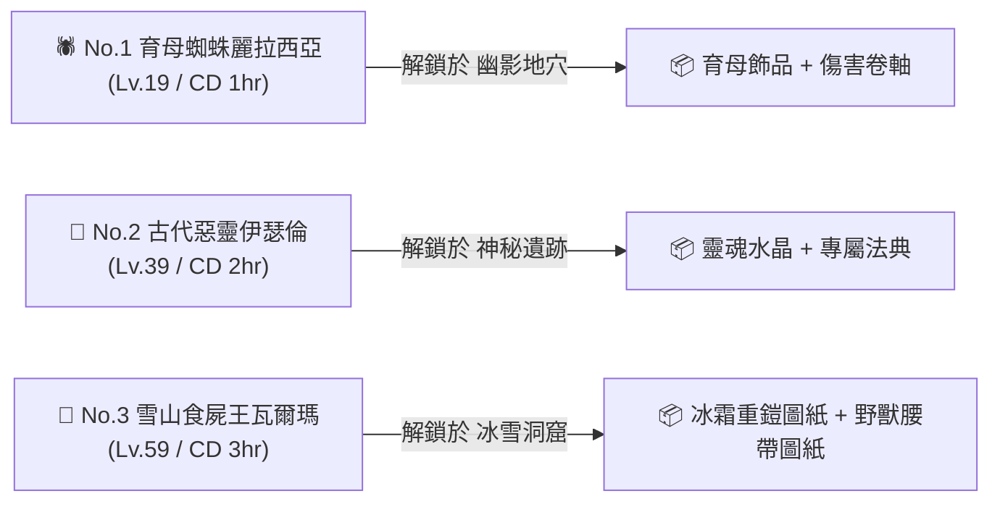

# 👑【首領領主討伐】全領主深度資料庫與機制指南 (Lord Boss Guide)

> 本文檔依據遊戲底層資源檔案 `meta_datas.tres`（模組：`lords`、`characters`、`skills`、`items`、`dungeons` 與 `demon_lords`）精確校對編寫，完整收錄遊戲中所有首領領主（Lord Boss）的解鎖前置、刷新計時、掉落物資、技能倍率與核心機制。

---

## 🧭 一、全 7 大常規領主討伐總覽表

在遊戲介面中，首領領主討伐遵循以下全域規則：
* **每日挑戰上限**：`daily_challenges = 5.0`（每日共用 5 次挑戰次數，介面顯示 5 顆圓點：`○ ● ● ● ●`）。
* **挑戰體力消耗**：`challenge_food = 5.0`（每次挑戰固定消耗 5 點食物/麵包）。
* **冷卻刷新機制**：擊敗或挑戰後進入倒數計時（1 小時、2 小時或 3 小時），冷卻結束方可再次討伐。

| 領主順位 | 領主中文名稱 | 底層 ID | 挑戰等級 | 刷新冷卻 (CD) | 前置解鎖地下城 | 保底品質 | 敵方陣容配置 | 核心掉落特色 |
| :---: | :--- | :--- | :---: | :---: | :--- | :---: | :--- | :--- |
| **No. 1** | **育母蜘蛛麗拉西亞** | `spider_broodmother` | **Lv. 19** | **1 小時** (3600s) | 幽影地穴 (`shadowy_abyss`) | **3 星紫裝** | 單體領主 (前排/大型) | 4星育母飾品、輕甲胸甲、傷害附魔卷軸 |
| **No. 2** | **古代惡靈伊瑟倫** | `wraith_issarion` | **Lv. 39** | **2 小時** (7200s) | 神秘遺跡 (`mysterious_ruins`) | **3 星紫裝** | 單體領主 (中排/大型牧師) | 4星法典、靈魂水晶、魔物之血IV、生命卷軸 |
| **No. 3** | **雪山食屍王瓦爾瑪** | `ghoul_snow` | **Lv. 59** | **3 小時** (10800s) | 冰雪洞窟 (`frozen_caverns`) | **3 星紫裝** | 領主 + 召喚屍蛆 | 5星大護符、冰霜重鎧圖紙、野獸腰帶圖紙 |
| **No. 4** | **獸人督軍古爾** | `orc_gul` | **Lv. 69** | **3 小時** (10800s) | 獸人地堡 (`orc_bunker`) | **4 星橙裝** | 前排獸人盾衛 + 後排古爾 | 6星古爾神杖圖紙、殉道者顱骨、圖騰吊墜 |
| **No. 5** | **炎鱗幼龍克羅諾** | `dragon_krono` | **Lv. 79** | **3 小時** (10800s) | 巨龍之巢 (`dragon_lair`) | **4 星橙裝** | 前排炎鱗龍蛋 + 後排克羅諾 | 6星龍爪重甲護手、龍血寶石、重型投擲爆彈 |
| **No. 6** | **污泥魔物奧爾格** | `sludge_fiend_olg` | **Lv. 89** | **3 小時** (10800s) | 遠古墓穴 (`ancient_tomb`) | **4 星橙裝** | 單體領主 (大型污泥魔) | 6星奧爾格飾品、6星污泥護手圖紙、腐爛之心 |
| **No. 7** | **熔火惡魔薩麥爾** | `demon_samael` | **Lv. 99** | **3 小時** (10800s) | 深淵地獄 (`abyss_hell`) | **4 星橙裝** | 領主 + 召喚熔岩惡魔 | 6星薩麥爾惡魔之核、6星1火紅胸甲圖紙 |

---

## 🕷️ 二、【前三位領主詳解】（對應遊戲首頁看板）

---

### 1. 🕷️ No.1 育母蜘蛛麗拉西亞 (`spider_broodmother`)

* **挑戰等級**：`Lv. 19`
* **體型 / 站位**：大型 (`body_type: large`) / 前排 (`front_row: true`)
* **種族 / 類型**：蜘蛛 (`spider`) / 首領領主 (`enemy_type: lord`)
* **刷新冷卻**：`3,600,000 ms`（**1 小時**）
* **解鎖條件**：通關前置地下城【幽影地穴 (`shadowy_abyss`)】
* **掉落保底等級**：`guaranteed: 3.0`（保底 3 星紫裝）

#### 📦 專屬掉落物資庫 (`droppable_items`)
1. **`accessory_broodmother`**：4 星紫色專屬飾品（自帶技能：`broodmother_command_hero` 育母號令）。
2. **`chest_broodmother`**：4 星紫色輕甲胸甲。
3. **`feet_broodmother`**：3 星輕甲戰靴（需求等級 Lv.19）。
4. **`scroll_damage_1`**：3 星傷害附魔卷軸。
5. *(自帶獸石)*：`elemental_stone_broodmother`（3 星元素獸石）。

#### ⚔️ 實機技能組 (`skills`)
| 技能名稱 / ID | 技能類型 | 消耗 / 冷卻 | 目標範圍 | 底層機制與數值解析 |
| :--- | :---: | :---: | :---: | :--- |
| **利爪猛擊** (`attack_claw`) | 主動物理 | SP +1.0 / 無 CD | 敵方近戰 | 造成 **`100%` 近戰物傷**，附帶 **35% 機率附加 1~3 層流血** (`bleed`)。 |
| **育母號令** (`broodmother_command`) | 主動群體 | SP -3.0 / CD 3 回合 | 敵方全體 | 造成 **`100%` 全體傷害**，附加 **1~3 層中毒**，並召喚 6 隻小蜘蛛協同作戰。 |
| **劇毒爆彈** (`poison_bomb`) | 主動法術 | SP -3.0 / CD 3 回合 | 敵方全體 | 造成 **`150%` 全體毒傷**，附帶 100% 附加 1~3 層中毒 (`poison`)。 |

---

### 2. 👻 No.2 古代惡靈伊瑟倫 (`wraith_issarion`)

* **挑戰等級**：`Lv. 39`
* **體型 / 站位**：大型 (`body_type: large`) / 後排 (`front_row: false`)
* **種族 / 職業**：惡靈幽魂 (`specter`) / 牧師 (`priest`)
* **刷新冷卻**：`7,200,000 ms`（**2 小時**）
* **解鎖條件**：通關前置地下城【神秘遺跡 (`mysterious_ruins`)】
* **掉落保底等級**：`guaranteed: 3.0`（保底 3 星紫裝）

#### 📦 專屬掉落物資庫 (`droppable_items`)
1. **`book_wraith_issarion`**：4 星紫色專屬副手法典（自帶技能：`soul_rend` 靈魂撕裂，需求等級 Lv.39）。
2. **`feet_wraith_issarion`**：3 星重甲戰靴（需求等級 Lv.39）。
3. **`soul_crystal`**：4 星靈魂水晶（重要打造材料，用於鐵匠鋪鍛造 4星神級頭盔 `head_soul_crystal`）。
4. **`monster_blood_4`**：3 星魔物之血 IV（城鎮血之祭壇高階獻祭必備）。
5. **`scroll_hp_1`**：3 星生命附魔卷軸。

#### ⚔️ 實機技能組 (`skills`)
| 技能名稱 / ID | 技能類型 | 消耗 / 冷卻 | 目標範圍 | 底層機制與數值解析 |
| :--- | :---: | :---: | :---: | :--- |
| **復仇打擊** (`attack_vengeful`) | 主動暗影 | SP +1.0 / 無 CD | 隨機 2 人 (遠程) | 造成 **`80%` 暗影傷害**，附帶 **15% 機率附加 1~3 層暗影侵蝕** (`darkness`)。 |
| **靈魂撕裂** (`soul_rend`) | 主動單體 | SP -3.0 / CD 7 回合 | 敵方近戰 | 造成 **`200%` 巨額暗影核彈**，附帶 **100% 附加 5~7 層【生機封鎖】** (`vital_blockade`，**使目標完全無法被治療**)！ |
| **群體詛咒** (`mass_curse`) | 主動減益 | SP -3.0 / CD 7 回合 | 敵方全體 | 造成 **`80%` 全體傷害**，並附加 2~3 層全體減益詛咒。 |

---

### 3. 🧟 No.3 雪山食屍王瓦爾瑪 (`ghoul_snow`)

* **挑戰等級**：`Lv. 59`
* **體型 / 站位**：中型 (`body_type: medium`) / 前排 (`front_row: true`)
* **種族 / 類型**：食屍鬼 (`ghoul`) / 首領領主 (`enemy_type: lord`)
* **刷新冷卻**：`10,800,000 ms`（**3 小時**）
* **解鎖條件**：通關前置地下城【冰雪洞窟 (`frozen_caverns`)】
* **掉落保底等級**：`guaranteed: 3.0`（保底 3 星紫裝）
* **隨從召喚機制**：自帶 `summon_ids: ['corpse_grubs']`（戰鬥中會召喚屍蛆騷擾）。

#### 📦 專屬掉落物資庫 (`droppable_items`)
1. **`amulet_ghoul_snow`**：5 星橘色大型護身符。
2. **`design_chest_frozen_warden`**：4 星【冰霜守衛重鎧】設計圖（**中期最強坦克畢業胸甲**）。
3. **`design_waist_ancient_beast_warden`**：4 星【遠古野獸腰帶】設計圖（**遊俠野獸套核心圖紙**）。
4. **`design_hands_frostbinder`**：4 星【霜縛者護手】設計圖（法系輸出護手）。
5. **`scroll_crit_1`**：4 星暴擊附魔卷軸。

#### ⚔️ 實機技能組 (`skills`)
| 技能名稱 / ID | 技能類型 | 消耗 / 冷卻 | 目標範圍 | 底層機制與數值解析 |
| :--- | :---: | :---: | :---: | :--- |
| **寒冰之爪** (`attack_claw_ice`) | 主動近戰 | SP +1.0 / 無 CD | 敵方近戰 | 造成 **`100%` 冰霜物理傷害**，附帶 **15% 機率附加冰凍** (`freezing`)。 |
| **冰霜重擊** (`thump_frost`) | 主動爆發 | SP 0 / CD 5 回合 | 敵方近戰 | 造成 **`150%` 冰霜重擊**，附帶 **25% 機率使目標陷入冰凍眩暈**。 |
| **殘虐之吻 / 狂暴巨口** (`brutal_maw`) | 主動名刀 | SP -2.0 / CD 5 回合 | 敵方近戰 | 造成 **`160%` 巨額打擊**，附帶 **25% 機率造成 1~3 層創傷**；當血量極低時可觸發回血機制。 |
| **召喚僕從** (`summon_minion`) | 主動召喚 | SP -1.0 / CD 7 回合 | 自身 | 召喚一隻 `corpse_grubs`（腐屍蛆蟲）進入戰場填補前排。 |
| **冰霜掌控** (`frost_control`) | 被動屬性 | 常駐 | 自身 | 提升 **冰霜體質 +20%**、**冰霜抗性 +40%**、**物理防禦 +10%**、**魔法防禦 +10%**。 |
| **腐屍瘴氣** (`corpse_miasma`) | 被動減益 | 常駐 | 敵方全體 | 提升自身 **生命上限 +15%**，並有 **45% 機率對敵方附加 1~3 層虛弱** (`weakness`)。 |

---

## 🪓 三、【後續四位常規領主詳解】(Lv.69 ~ Lv.99)

---

### 4. 🪓 No.4 獸人督軍古爾 (`orc_gul`)

* **挑戰等級**：`Lv. 69`
* **陣容配置**：**雙敵群體戰**
  1. 前排盾衛：**獸人盾衛 (`orc_shieldwarden`)**（Lv.69 戰士，大型坦克）
  2. 後排領主：**獸人古爾 (`orc_gul`)**（Lv.69 牧師，首領領主）
* **刷新冷卻**：`10,800,000 ms`（**3 小時**）
* **解鎖條件**：通關前置地下城【獸人地堡 (`orc_bunker`)】
* **掉落保底等級**：`guaranteed: 4.0`（**保底 4 星傳奇橙裝**）

#### 📦 專屬掉落物資庫 (`droppable_items`)
1. **`design_staff_orc_gul`**：**6 星紅色【古爾之杖】設計圖**（頂級神聖法杖）。
2. **`martyr_cranium`**：5 星殉道者顱骨（高階鍛造必備核心）。
3. **`totem_pelt_pendant`**：4 星圖騰毛皮吊墜。
4. *(自帶裝備)*：`staff_orc_gul`（6星權杖）、`accessory_orc_gul`（6星飾品）、`feet_orc_gul`（6星戰靴）。

#### ⚔️ 雙敵技能組詳解
* **🛡️ 前排 獸人盾衛 (`orc_shieldwarden`)**：
  * `provoked_fury`：嘲諷單體 3 回合 + 增加 30~60 護甲 + 25% 附加虛弱。
  * `spiked_shield_charge`：全體 125% 物理衝撞 + 附加 3~5 層流血。
  * `iron_wall_protect`：常駐火抗 +20%、魔抗 +50%、物抗 +50%。
  * `spiked_counterattack`：被動反擊造成 85% 傷害 + 1~3 層反傷流血。
  * `demonic_mutation`：暗抗 +250%、生命上限 +25%、物魔抗 +50%。
* **🧙‍♂️ 後排 獸人古爾 (`orc_gul`)**：
  * `summon_minion`：前排盾衛死亡後，冷卻 7 回合可再次召喚盾衛。
  * `mass_curse`：全體 80% 暗影傷害 + 全員 2~3 層群體詛咒。
  * `soul_rending_roar`：全體 100% 精神咆哮 + **全體 5 層【生機封鎖 (禁療)】** + 5~7 層虛弱。
  * `wraithbone_shell`：免疫流血 + 雙抗 +10%。

---

### 5. 🐉 No.5 炎鱗幼龍克羅諾 (`dragon_krono`)

* **挑戰等級**：`Lv. 79`
* **陣容配置**：**雙怪陣容**
  1. 前排：**炎鱗龍蛋 (`dragon_blazescale_egg`)**（具備死亡孵化機制）
  2. 後排：**炎鱗幼龍克羅諾 (`dragon_krono`)**（Lv.79 巨龍戰士）
* **刷新冷卻**：`10,800,000 ms`（**3 小時**）
* **解鎖條件**：通關前置地下城【巨龍之巢 (`dragon_lair`)】
* **掉落保底等級**：`guaranteed: 4.0`（**保底 4 星傳奇橙裝**）

#### 📦 專屬掉落物資庫 (`droppable_items`)
1. **`hands_dragon_krono`**：**6 星紅色【克羅諾龍爪護手】**（頂級重甲護手）。
2. **`dragonblood_gem`**：6 星龍血寶石（珍稀特殊消耗品）。
3. **`throwing_dragon_krono`**：5 星重型投擲武器【克羅諾烈焰爆彈】。

#### ⚔️ 雙怪技能組詳解
* **🥚 前排 炎鱗龍蛋 (`dragon_blazescale_egg`)**：
  * `hatch_growth`：每 3 回合自我蓄力，提升孵化召喚強度 2~5 點。
  * `death_hatch`：**死亡時觸發【死亡孵化】**，立即破殼召喚出 `dragon_blazethroat_hatchling`（熾喉幼龍）或 `dragon_blazewing_hatchling`（熾翼幼龍）！
  * `flamebound_body`：火抗 +500%、免疫冰凍、弱冰（冰抗 -50%）。
  * `flameback`：被動反傷 75% 機率附加 3~5 層燃燒。
* **🐲 後排 炎鱗幼龍克羅諾 (`dragon_krono`)**：
  * `summon_minion`：冷卻 7 回合可重新下蛋（召喚炎鱗龍蛋）。
  * `armor_shatter_strike`：單體 220% 碎甲重擊 + 增傷 25%。
  * `flame_charge`：全體 140% 烈焰俯衝 + 25% 機率附加 3~5 層燃燒。
  * `infernal_forge_wrath`：被動觸發 200% 熔爐狂怒，連續打擊 3~5 次。
  * `exsanguinating_spiral`：25% 觸發嗜血旋風，造成 125% 傷害並附加 1~9 層重度流血。
  * `molten_carapace`：護甲加成 +25%，提供 3 層傷害減免。

---

### 6. 🦠 No.6 污泥魔物奧爾格 (`sludge_fiend_olg`)

* **挑戰等級**：`Lv. 89`
* **體型 / 站位**：超大型 (`body_type: large`) / 後排 (`front_row: false`)
* **種族 / 類型**：污泥惡魔 (`sludge_fiend`) / 首領領主 (`enemy_type: lord`)
* **刷新冷卻**：`10,800,000 ms`（**3 小時**）
* **解鎖條件**：通關前置地下城【遠古墓穴 (`ancient_tomb`)】
* **掉落保底等級**：`guaranteed: 4.0`（**保底 4 星傳奇橙裝**）

#### 📦 專屬掉落物資庫 (`droppable_items`)
1. **`accessory_sludge_fiend_olg`**：**6 星紅色專屬飾品【奧爾格污泥核心】**。
2. **`design_hands_sludge_fiend_olg`**：6 星【奧爾格污泥護手】設計圖（法系/輕甲畢業護手）。
3. **`putrid_heart`**：5 星腐爛之心（打造 6 星神飾 `accessory_decay_charm` 的核心材料）。
4. **`void_eye`**：4 星虛空之眼。

#### ⚔️ 實機技能組 (`skills`)
| 技能名稱 / ID | 技能類型 | 消耗 / 冷卻 | 目標範圍 | 底層機制與數值解析 |
| :--- | :---: | :---: | :---: | :--- |
| **劇毒利爪** (`attack_claw_poison`) | 主動普攻 | SP +1.0 / 無 CD | 敵方近戰 | 造成 **`100%` 毒性打擊**，15% 機率附加自身增益。 |
| **腐臭毒球** (`poison_ball`) | 主動遠程 | SP 0 / CD 3 回合 | 敵方遠程單體 | 造成 **`120%` 毒素傷害**，附加 3 回合劇毒。 |
| **瘟疫之肉箭** (`pestilent_flesh_bolts`) | 主動爆發 | SP -3.0 / CD 7 回合 | 隨機 3 人 (遠程) | 造成 **`225% + 50%` 巨額多段毒性轟炸**，45% 機率附加瘟疫疾病。 |
| **泥沼狂暴** (`cursed_aegis_echo`) | 被動特質 | 常駐 | 自身 | 45% 機率觸發 75% 傷害加深，並疊加 1~3 層腐臭外殼。 |
| **毒素激湧** (`venom_surge`) | 被動特質 | 常駐 | 自身 | 傷害加深 +25%，造成傷害時有 75% 機率施加猛毒。 |
| **深淵孳生** (`abyss_brood`) | 被動特質 | 常駐 | 敵方全體 | 45% 機率造成 100% 傷害並散播瘟疫。 |
| **劇毒掌控** (`poison_control`) | 被動屬性 | 常駐 | 自身 | 雙防抗性 +10%、毒性體質 +20%、毒抗 +40%。 |

---

### 7. 👿 No.7 熔火惡魔薩麥爾 (`demon_samael`)

* **挑戰等級**：`Lv. 99`
* **體型 / 站位**：中型 (`body_type: medium`) / 後排 (`front_row: false`)
* **種族 / 職業**：惡魔 (`demon`) / 戰士 (`warrior`)
* **刷新冷卻**：`10,800,000 ms`（**3 小時**）
* **解鎖條件**：通關前置地下城【深淵地獄 (`abyss_hell`)】
* **掉落保底等級**：`guaranteed: 4.0`（**保底 4 星傳奇橙裝**）
* **隨從召喚**：自帶 `summon_ids: ['demon_kargros']`（戰鬥中召喚火焰狂魔卡格羅斯）。

#### 📦 專屬掉落物資庫 (`droppable_items`)
1. **`accessory_demon_samael`**：**6 星紅色專屬飾品【薩麥爾焚燼之核】**（自帶特有技能：`incandescent_clamp` 熾熱夾拑）。
2. **`design_chest_demon_samael`**：**6 星紅色【薩麥爾惡魔重鎧】設計圖**（**1 火星神級終極重鎧**）。
3. **`infernal_plate_shard`**：5 星獄火板甲碎片。
4. *(身上神裝)*：`chest_demon_samael`（6星1火重鎧）、`head_demon_samael`（6星1火重盔）。

#### ⚔️ 實機技能組 (`skills`)
| 技能名稱 / ID | 技能類型 | 消耗 / 冷卻 | 目標範圍 | 底層機制與數值解析 |
| :--- | :---: | :---: | :---: | :--- |
| **裂地突刺** (`attack_burrowrend_strike`) | 主動近戰 | SP +1.0 / 無 CD | 敵方近戰 | 造成 **`100% + 50%` 兩段物火混合打擊**，75% 機率附加 1~3 層流血。 |
| **地殼融滅** (`crust_piercer_meltdown`) | 主動近戰 | SP -2.0 / CD 5 回合 | 敵方近戰 | 造成 **`150% + 150% (共 300%)` 毀滅打擊**，75% 附加 3~5 層流血與 3~5 層燃燒！ |
| **地心噴發** (`crust_venting`) | 主動 AOE | SP -3.0 / CD 5 回合 | 敵方全體 | 造成 **`100% + 75%` 全體熔岩風暴**，連續轟擊 5~7 次，75% 機率施加全體燃燒。 |
| **召喚僕從** (`summon_minion`) | 主動召喚 | SP -1.0 / CD 7 回合 | 自身 | 召喚一隻 `demon_kargros`（狂暴地獄惡魔）進場充當肉盾與輸出。 |
| **殺戮釋放** (`carnage_release`) | 被動特質 | 常駐 | 自身 | 獲得 3 層屏障（格擋 3 次傷害），並獲得 1~5 回合狂怒。 |
| **戰神之軀** (`war_god_body`) | 被動屬性 | 常駐 | 自身 | **天生免疫眩暈** (`stun_immuned: 1.0`)、**暴擊率 +50%**、**暴抗 +100%**、**生命 +200**、**物抗 +50%**、**魔抗 +15%**、**物理體質 +50%**。 |

---

## 🌌 四、【附錄】深淵魔王 (Demon Lords) 系統對照表

除上述 7 位「首領討伐 (Lords)」外，遊戲底層還存在另一組高階「深淵魔王 (`demon_lords`)」系統：

| 魔王名稱 / ID | 挑戰等級 | 每日次數 | 召喚 / 解鎖條件 | 核心機制與對決形式 |
| :--- | :---: | :---: | :--- | :--- |
| **虛空之子 埃爾雷斯** (`voidborn_elres`) | **Lv. 49** | 3 次 | 通關地下城：幽暗監獄 (`dark_prison`) | 虛空吞噬者，純法系高魔抗 |
| **惡魔 納塔爾** (`demon_natar`) | **Lv. 69** | 3 次 | 通關地下城：獸人地堡 (`orc_bunker`) | 雙刀狂暴戰士，高頻流血 |
| **炎核之王** (`demon_firecore_king`) | **Lv. 79** | 3 次 | 通關地下城：巨龍之巢 (`dragon_lair`) | 熔岩火海，超高全體火傷 |
| **食屍鬼 厄爾蘭** (`ghoul_ehrlan`) | **Lv. 89** | 3 次 | 通關地下城：遠古墓穴 (`ancient_tomb`) | 屍腐劇毒與召喚系魔王 |
| **魅魔 莉莉絲** (`demon_lilith`) | **Lv. 99** | 3 次 | 通關地下城：深淵地獄 (`abyss_hell`) | 掉落莉莉絲神弓與神杖，高爆發暗影魅惑 |
| **冰霜魔皇 塞奧特魯斯** (`demon_theotrus`) | **Lv. 99** | 3 次 | 消耗道具：【霜誓徽記】(`frostoath_emblem`) | 終極冰霜魔神，全體冰凍控制 |
| **深淵爬行者 基爾馬斯** (`demon_kyrmas`) | **Lv. 99** | 3 次 | 消耗道具：【戈爾瓦斯聖物】(`relic_abysscrawler_gorvath`) | 深淵觸手與寄生機制 |
| **深淵侵蝕者 摩西** (`abysseroded_moses`) | **Lv. 109** | 3 次 | 消耗道具：【利維坦生命之石】(`life_stone_abysseroded_leviathan`) | 掉落 6 星 1 火神弓圖紙，超高難度巨獸 |
| **軍閥 薩爾斯特** (`demon_sarlst`) | **Lv. 119** | 3 次 | 消耗道具：【督軍最後遺言】(`warlord_last_word`) | 物理近戰天花板魔王 |
| **萬罪之主 瓦爾貢** (`demon_vargon`) | **Lv. 119** | 3 次 | 消耗道具：**集齊 9 大罪核 (`sin_core_*`)** | **遊戲最終極限魔王**，掉落創世級罪之頭像 |
