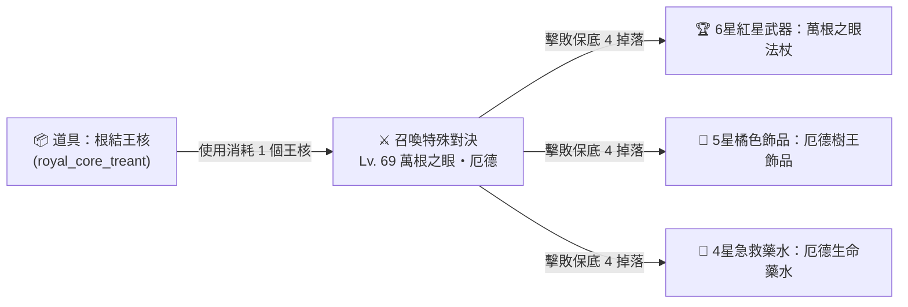
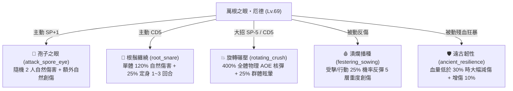
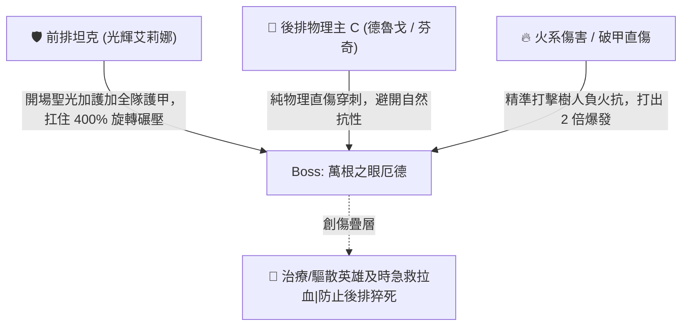

# 🌳【王核召喚領主】萬根之眼・厄德 (Treant Urde) 深度資料庫與討伐指南

> 本文檔依據遊戲底層原始資料檔 `meta_datas.tres`、角色數據庫 `characters.treant_urde`、王核道具 `items.royal_core_treant`、技能庫 `skills` 與掉落表深度校對編寫。

---

## 📌 一、王核道具與召喚機制概覽

| 項目 | 底層數值與設定 | 機制解析 |
| :--- | :--- | :--- |
| **召喚道具名稱** | **根結王核** (`royal_core_treant`) | 5 星橘色王核消耗品 (`royal_core`) |
| **召喚對決怪物** | **【萬根之眼・厄德】** (`treant_urde`) | 樹人領主級 Boss (`enemy_type: lord`) |
| **對決挑戰等級** | **Lv. 69** | 建議全隊戰力達到 **2800 ~ 3200+** 進行挑戰 |
| **掉落保底數量** | **`guaranteed: 4.0` (保底 4 件掉落)** | 每次擊殺保證掉落大量高階專屬裝備與稀有物資 |
| **擊殺成就** | `rc_treant_urde_kill` | 累計擊殺 5 次解鎖專屬頭像 `avatar: treant_urde` |

---

## 🛡️ 二、怪物基礎面板與種族特質

* **底層 ID**：`treant_urde`
* **種族**：樹人 (`treant`)
* **體型**：大型 (`body_type: large`)
* **敵人類型**：領主級首領 (`enemy_type: lord`)
* **種族天賦與抗性機制**：
  * 🔥 **弱點屬性（致命弱火）**：樹人種族天生具備負火焰抗性，**火系傷害（烈焰、燃燒）會造成 1.5 ~ 2.0 倍巨額破甲傷害**！
  * 🌿 **自然親和**：天生具備高額自然抗性 (`nature_res: 100%+`)，免疫常規自然纏繞與中毒。
  * 🛡️ **厚重木甲**：天生擁有極高的物理防禦與減傷護甲。

---

## ⚔️ 三、實機 5 大技能庫深度解析

萬根之眼厄德擁有兼具「全體核彈物理爆發」、「雙目標自然點殺」、「群體定身」與「反傷創傷」的複合技能組：

### 1. 💥 【核心核彈大招】旋轉碾壓 (`rotating_crush`)
* **類型**：主動近戰物理攻擊 | **冷卻**：5 回合 | **SP 消耗**：-5.0
* **目標**：**敵方全體 (Party All)**
* **技能效果**：
  * 造成高達 **`400%` 全體物理 AOE 巨額傷害**！
  * 附帶 **25% 機率使全體目標眩暈 (`stun`)**，失去行動回合。
  * ⚠️ **威脅評估**：這是厄德最強的滅團技，後排脆皮主 C 若無護盾或足夠護甲容易被一招滿血秒殺。

### 2. 🌿 【高頻自然打擊】孢子之眼 (`attack_spore_eye`)
* **類型**：主動遠程自然攻擊 | **SP 產能**：+1.0
* **目標**：隨機 **2 名敵人**
* **技能效果**：
  * 造成自然魔法傷害，並有 15% 機率附加持續自然創傷。

### 3. 🌱 【單體強控】根鬚纏繞 (`root_snare`)
* **類型**：主動遠程自然攻擊 | **冷卻**：5 回合 | **SP 消耗**：-1.0
* **目標**：敵方單體
* **技能效果**：
  * 造成 **120% 自然傷害**。
  * 附帶 **25% 機率定身 (`immobilize`) 1~3 回合**，封鎖目標移動與近戰位移技能。

### 4. 🩸 【被動創傷反彈】潰爛播種 (`festering_sowing`)
* **類型**：被動特質
* **技能效果**：
  * 行動或受擊時，有 25% 機率給攻擊者附加 **`5 層創傷 (trauma_count: 5.0)`**。
  * 創傷層數會隨回合持續扣血，且降低目標受到的治療量。

### 5. 🛡️ 【殘血自保狂暴】遠古韌性 (`ancient_resilience`)
* **類型**：被動特質
* **技能效果**：
  * 生命值低於 **30%** 時觸發：自身獲得 **40% 機率減傷護體**，並常駐提升 **10% 全傷害加成**。

---

## 🎁 四、專屬核心掉落物與神裝價值

擊敗萬根之眼厄德固定觸發 **4 個掉落物 (guaranteed: 4.0)**，核心專屬掉落包括：

| 裝備/道具名稱 (底層 ID) | 稀有度品質 | 適用職業/槽位 | 核心屬性與專屬技能 | 戰略價值 |
| :--- | :---: | :---: | :--- | :--- |
| 🔮 **萬根之眼法杖** (`staff_treant_urde`) | **6 星 紅星神話** | 法師 (Mage) 主手武器 | 自帶 **6 頂級詞條**： 雙全傷 + 雙魔力體質 + 雙自然體質 附帶技能：**【孢子之眼】** | 大後期自然系/高傷法師的頂級神杖，詞條面板極度奢華。 |
| 💍 **厄德樹王飾品** (`accessory_treant_urde`) | **5 星 橘色傳說** | 法師 (Mage) 飾品槽位 | 自帶被動神技： **【潰爛播種 (`festering_sowing`)】** | 佩戴者受擊時可反彈 5 層創傷給敵方，極佳的法系防禦飾品。 |
| 🧪 **厄德生命藥水** (`hp_potion_urde`) | **4 星 紫色品質** | 全職業 消耗品 | **瞬間回復 750 點生命值** (冷卻 3 回合) | 當前階段數值最高的高階急救藥水。 |

---

## 💡 五、萬根之眼・厄德 實戰討伐與陣容克制策略

### 1. 🛡️ 前排加甲防秒殺（應對 400% 旋轉碾壓）：
* 厄德的 `rotating_crush` 在積攢滿 5 SP 後會釋放 400% 全體 AOE。
* **光輝艾莉娜** 必須在戰鬥中維持 **【聖光加護】（全隊護甲 +20~40）** 與 **壁壘護盾**，確保後排遊俠與法師不會被 AOE 順劈秒殺。

### 2. ⚔️ 輸出屬性選擇（純物理 / 火系 為王）：
* 樹人天生擁有極高自然抗性，**切勿使用純自然/劇毒系英雄**（會被大量減免）。
* **首選純物理直傷**（如德魯戈 322% 處決、芬奇雙動暴擊）或 **火系法師**，可直擊其弱點快速壓低血量。

### 3. 🎯 殘血 30% 爆發斬殺：
* 當厄德血量降至 30% 以下時會觸發【遠古韌性】減傷。此時保留大招（如德魯戈的處決核彈），爭取一回合內直接斬殺，避免被其殘血狂暴反撲。
