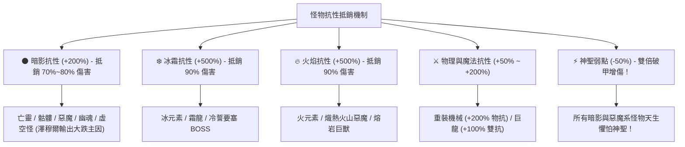

# 👹 Blackfire Crusade 後期怪物全特性與抗性抵銷 (Resistances & Immunities) 深度分析手冊

> 本文檔依據遊戲底層資源 `meta_datas.tres`，全面解析主線中後期（Lv. 60+ ~ Lv. 120+、Domain 1~5 冒險領地、首領討伐 Lord Boss、深淵與亡者領域）所有怪物種族、精英與領主的天賦特性，**重點深度梳理「怪物會完全免疫（抵銷）哪些狀態」與「怪物對哪些傷害屬性具備高額減免/弱點」**。

---

## 🚫 一、全遊戲怪物「完全免疫 (Hard Immunities)」速查表

在挑戰高難度關卡與搭配英雄技能時，若遇到以下怪物種族/特性，相關的負面狀態（Dot/控制）將**100% 被完全抵銷 (無效化)**：

| 免疫狀態類型 | 會抵銷該狀態的怪物種族 (Races) | 觸發特性名稱 (Traits) | 受到直接影響的英雄與流派 |
| :--- | :--- | :--- | :--- |
| 🩸 **流血免疫** (`bleed_immuned`) | **骷髏 (`skeleton`)**、**幽魂 (`specter`)**、**亡靈 (`undead`)**、**冰元素 (`ice_elemental`)**、**火元素 (`fire_elemental`)**、**機械傀儡 (`mech`)**、**石魔像 (`golem`)**、**樹人/植物 (`treant/vine`)**、**虛空裔 (`voidborn`)** | `bone_resilience` `decayed_form` `incorporeal_form` `coldborne_form` `flameforged_form` `silicon_based` `rockskin` `wooden_skin` `void_form` | **遊俠 / 刺客流血體系** （如普通遊俠的 `double_shoot`、`scatter_shot`；芬奇非純物理的流血效果） |
| 🧪 **中毒免疫** (`poison_immuned`) | **亡靈 (`undead`)**、**幽魂 (`specter`)**、**史萊姆 (`slime`)**、**毒蠍/毒蜘蛛 (`spider/scorpion`)**、**冰/火/石元素**、**機械 (`mech`)**、**樹人 (`treant`)**、**虛空 (`voidborn`)** | `venom_barrier` `decayed_form` `incorporeal_form` `coldborne_form` `flameforged_form` `silicon_based` `rockskin` `wooden_skin` `void_form` | **劇毒體系** （如疾弓芬奇的 `toxic_arrow` 劇毒之箭、獸人牧師的劇毒瘟疫） |
| 🤫 **沉默免疫** (`silence_immuned`) | **幽魂 (`specter`)**、**機械傀儡 (`mech`)**、**所有獸人領主 (`orc`)**、**亡靈首領 (`undead`)** | `incorporeal_form` `silicon_based` `sturdy_will` `undead_resilience` | **沉默控制技** （如聖騎士的 `holy_shackles` 神聖枷鎖沉默效果） |
| 💫 **眩暈免疫** (`stun_immuned`) | **幽魂 (`specter`)**、**機械魔像 (`mech/golem`)**、**所有霸體獸人 (`orc`)**、**亡靈 (`undead`)**、**虛空領主 (`voidborn`)** | `incorporeal_form` `silicon_based` `sturdy_will` `undead_resilience` `void_form` | **強控制體系** （如聖騎士 `holy_strike` 眩暈、狂戰士震地眩暈） |
| ❄️ **火焰免疫** (`fire_immuned`) | **極地冰元素 (`ice_elemental`)**、**虛空異變體 (`voidborn`)** | `coldborne_form` `void_form` | **法師火系技能** （火球術、熾烈之怒等完全無效） |
| 🛡️ **嘲諷/挑釁免疫** (`provocation_immuned`) | **機械重裝傀儡 (`mech`)** | `silicon_based` | **前排坦克嘲諷技能** （無法強行吸引仇恨） |

---

## 🛡️ 二、各大元素傷害「抗性減免與抵銷機制」深度剖析

---

### 1. 🌑 暗影傷害抵銷（+200% 暗抗 ➔ 傷害銳減 75%）
* **具備此特性的怪物**：**亡靈 (`undead`)**、**骷髏 (`skeleton`)**、**幽魂 (`specter`)**、**惡魔 (`demon`)**、**食屍鬼 (`ghoul`)**、**虛空異形 (`voidborn`)**。
* **特性來源**：`dark_affinity`、`decayed_form`、`carrion_defense`、`void_form`。
* **戰略影響**：
  > [!WARNING]
  > **這正是【冥語者澤穆爾】在中後期副本感覺「時好時壞、完全沒輸出」的根本原因！**  
  > 澤穆爾的所有主動攻擊（詛咒之語、汲暗之指、黑暗內爆、靈魂撕裂）全為純暗影傷害。打一般野獸或人類怪物很痛，但一進入深淵、地牢、火山或亡者領域，遇到自帶 `darkness_res: 200%` 的怪物時，傷害會被抵銷超過 75%！

---

### 2. ⚡ 神聖傷害剋制與破甲機制（-50% 神聖負抗性 ➔ 增傷 50%）
* **怪物天生弱點**：所有擁有 `dark_affinity`、`decayed_form`、`void_form` 的暗影/亡靈/惡魔怪物，底層設定其 **神聖抗性為 `-50%`**！
* **戰略影響**：
  > [!TIP]
  > **神聖傷害是中後期打暗影與惡魔 Boss 的絕對剋星！**  
  > 聖騎士（如阿斯卡、艾麗娜）與神聖大主教（阿爾德里安）的神聖打擊會觸發「破甲負抗性增傷」，對暗影 Boss 造成毀滅性的 1.5 倍實質傷害。

---

### 3. ❄️ 冰霜抗性抵銷（+500% 冰抗 ➔ 冰傷減免 90%）
* **具備此特性的怪物**：**冰霜元素 (`ice_elemental`)**、**霜龍阿祖洛斯 (`dragon_azulos`)**、**極地巨獸 (`behemoth_frost`)**。
* **特性來源**：`coldborne_form` (`ice_res: +500%`)、`frost_resistance` (`ice_res: +200%`)。
* **戰略影響**：在 Domain 2【冷誓要塞】中，冰法與冰霜技能完全打不動，必須切換純物理或神聖攻擊。

---

### 4. 🔥 火焰抗性抵銷（+500% 火抗 ➔ 火傷減免 90%）
* **具備此特性的怪物**：**火元素 (`fire_elemental`)**、**地獄熔岩犬 (`hellhound`)**、**火山惡魔領主 (`demon_kargros`)**。
* **特性來源**：`flameforged_form` (`fire_res: +500%`)、`heat_resistance` (`fire_res: +100%`)、`rockskin` (`fire_res: +100%`)。
* **戰略影響**：在主線第 8 關【熾熱火山】與惡魔巢穴中，火系法師技能大幅受阻。

---

### 5. ⚔️ 物理與魔法雙抗性抵銷
* **高物抗怪物**：
  - **機械傀儡 (`mech`)**：`mecha_construc` 提供 **物理抗性 +200%**。
  - **食屍巨獸 / 巨龍 (`dragon`)**：`carrion_defense / dragon_scales` 提供 **物理抗性 +100%** 與 **魔法抗性 +100%**。
  - **幽魂 (`specter`)**：`incorporeal_form` 提供 **物理抗性 +50%** 與 **暴擊抗性 +200%**。

---

## 🗺️ 三、中後期 6 大章節與區域怪物特性總覽

### 1. 【遺忘荒地 (Lv. 61~70)】- 蠻荒獸人軍團
* **主要怪物**：`orc_shieldwarden` (盾衛)、`orc_bonebreaker_raider` (碎骨者)、`orc_foulblood_shaman` (薩滿)
* **核心抵銷特性**：
  - `sturdy_will`：**完全免疫沉默與眩暈**。
  - `sturdy_physique`：**暴擊抗性 +20%**，生命值 +100。
  - `beastly_armor`：物抗 +20%、魔抗 +20%。
* **最佳對應策略**：使用**純物理破甲**（芬奇/德魯戈）或**神聖穿透**，集中火力快速秒殺後排回血薩滿。

---

### 2. 【Domain 1：黃金帝國 (Lv. 49~69)】- 金甲守衛與亡靈
* **主要 BOSS**：`elf_mythril_hag` (秘銀巫婆)、`voidborn_goldwall_guardian` (金牆守衛)、`undead_altalim` (阿爾塔林)
* **核心抵銷特性**：
  - `void_form` / `decayed_form`：**完全免疫流血與中毒**。
  - `darkness_res: +200%`：**抵銷 75% 暗影傷害**。
* **最佳對應策略**：使用**神聖傷害**（雙倍破甲弱點）與**高額單體物理暴擊**。

---

### 3. 【Domain 2：冷誓要塞 (Lv. 69~89)】- 極地霜龍與冰霜魔像
* **主要 BOSS**：`dragon_azulos` (霜龍)、`golem_haldren` (冰霜魔像)、`elf_mage_ecasia` (寒噬女巫)
* **核心抵銷特性**：
  - `coldborne_form`：**完全免疫冰凍、流血、中毒與火焰**，**冰霜抗性 +500%**。
  - `ironclad_resistance`：物理防禦極高。
* **最佳對應策略**：禁止使用冰系/火系法術與流血毒素，**全力依靠純物理長弓/重斧與神聖審判**。

---

### 4. 【Domain 3：深淵獸巢 (Lv. 79~99)】- 深淵惡魔與畸變淵行者
* **主要 BOSS**：`demon_vilzaan` (惡魔維爾贊)、`abysscrawler_gorvath` (淵行者)、`behemoth_kazlom` (巨獸)
* **核心抵銷特性**：
  - `dark_affinity` / `heat_resistance`：**暗影抗性 +200%、火焰抗性 +100%**。
  - `vital_blockade` (生機封鎖)：Boss 會對玩家隊伍施加 **5~7 層禁療**。
* **最佳對應策略**：佩戴大主教阿爾德里安進行**全體負面驅散**，使用**神聖聖光核彈剋制其 -50% 弱點**。

---

### 5. 【Domain 4：沉潮廢墟 (Lv. 89~109)】- 沉船幽魂與深海巨怪
* **主要 BOSS**：`viking_olaf` (破浪狂弓)、`abysseroded_leviathan` (深淵海怪)
* **核心抵銷特性**：
  - `incorporeal_form`：**完全免疫流血、中毒、沉默、眩暈**，**暴擊抗性 +200%**。
  - `moist_skin`：火焰抗性 +100%。
* **最佳對應策略**：純物理穩定點殺，不依賴 Dot 與異常狀態控場。

---

### 6. 【Domain 5：紊亂鐵工廠 (Lv. 99~120)】- 重裝機甲與魔像傀儡
* **主要 BOSS**：`goblin_glig` (機甲格利格)、`golem_Frostetched_vower` (霜紋魔像)
* **核心抵銷特性**：
  - `silicon_based`：**全遊戲最強霸體！完全免疫流血、中毒、挑釁、沉默、眩暈**。
  - `mecha_construc`：**物理抗性 +200%、全元素抗性 +150%**。
* **唯一的致命弱點**：`darkness_res: -25%`（機械弱暗影！此時暗影法術與高破甲真傷才能有效破壞機甲核心）。

---

## 💡 四、總結：全遊戲傷害屬性泛用性排行

| 傷害屬性 | 泛用性評級 | 被怪物抵銷/免疫的頻率 | 總結與搭配建議 |
| :--- | :---: | :--- | :--- |
| **純物理傷害** (Physical) | **🌟 SSS (最高)** | ❌ **無任何怪物完全免疫** (僅部分機械有物抗加成) | **全遊戲最穩健、永遠不吃癟的屬性**。這也是為何【獸人遊俠 德魯戈】與【疾弓芬奇】在任何副本都能穩定發揮的核心原因！ |
| **神聖傷害** (Holy) | **🌟 SS (極高)** | ❌ 幾乎無怪免疫 🎯 **對全遊戲 50% 以上怪物具備 -50% 弱點雙倍增傷** | 打惡魔、亡靈、骷髏、深淵怪的絕對利器，聖騎士與大主教不可或缺。 |
| **自然 / 毒素** (Nature / Poison) | **A (中等)** | ⚠️ 約 40% 亡靈/機械/元素怪物 **完全免疫中毒** | 前中期傷害可觀，後期遇到亡靈與機甲關卡時 Dot 輸出會失效。 |
| **冰霜 / 火焰** (Frost / Fire) | **B (偏低)** | ⚠️ 極地關卡冰抗 +500%、火山關卡火抗 +500% | 需依關卡頻繁換裝換隊，無法一套陣容無腦通關。 |
| **暗影傷害** (Darkness) | **C (最不穩定)** | 🚫 **全遊戲 60% 以上中後期怪物自帶 +200% 暗抗** | **冥語者澤穆爾上限高但下限極低的主因**。強烈建議在 12,800 幣存滿後優先換成純物理或神聖系英雄！ |
