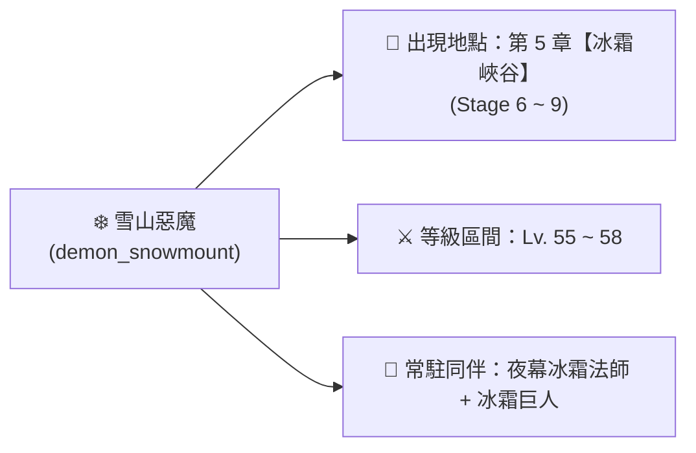
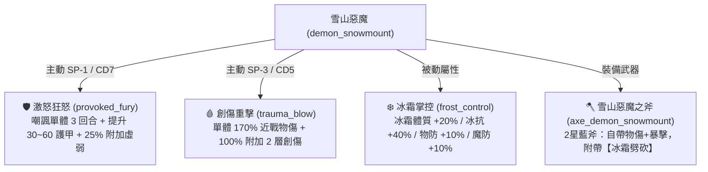
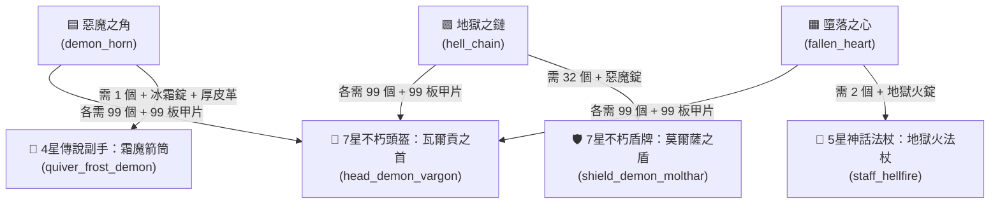
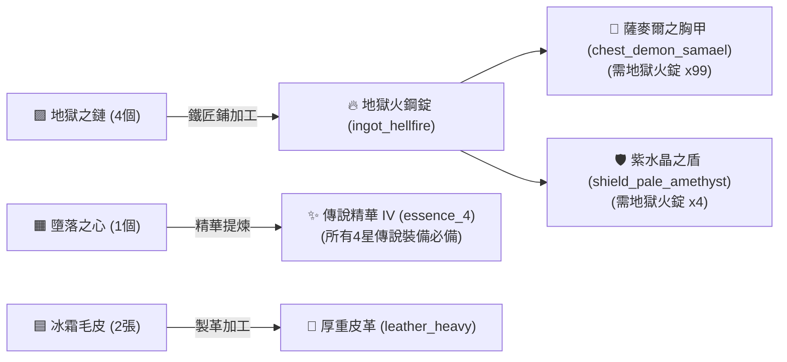

# ❄️【菁英戰士】雪山惡魔 (Demon Snowmount) 深度資料庫與掉落合成指南

> 本文檔依據遊戲底層資料檔 [meta_datas.tres](../../raw_tres/meta_datas.tres)、角色數據庫 `characters.demon_snowmount`、技能庫 `skills`、關卡設定 `level_groups.frozen_gorge` 與鐵匠鋪裝備合成配方深度校對編寫。

---

## 📌 一、怪物基礎數值與關卡分布

| 項目 | 底層數值與設定 | 機制解析 |
| :--- | :--- | :--- |
| **底層 ID** | **`demon_snowmount`** | 遊戲內部唯一標識 |
| **中文名稱** | **雪山惡魔** | 冰雪高原惡魔種族戰士 |
| **種族 / 職業** | **惡魔 (`demon`) / 戰士 (`warrior`)** | 兼具惡魔種族高抗性與狂戰士物理壓制力 |
| **敵人類型 / 體型** | **菁英 (`enemy_type: elite`) / 普通 (`body_type: normal`)** | 具備高防禦、高血量與嘲諷控場能力 |
| **主要出沒關卡** | **第 5 章【冰霜峽谷】(`frozen_gorge`) Stage 6 ~ 9** | 關卡推薦戰力：1400 ~ 1800+ |
| **隨行敵人群體** | 夜幕冰霜法師 (`nightshroud_frost_sorcerer`)、冰霜巨人 (`giant_frost`) | 敵方標準配置為「前排肉盾 + 惡魔嘲諷 + 後排群體冰霜法傷」 |

---

## ⚔️ 二、戰鬥技能與機制深度解析

雪山惡魔擁有兼具「群體嘲諷加防」、「被動冰霜全抗強化」與「近戰必定創傷」的技能組，並配備專屬冰霜戰斧：

### 1. 🛡️【核心控場與自保】激怒狂怒 (`provoked_fury`)
* **類型**：主動遠程技能 | **冷卻**：7 回合 | **SP 消耗**：-1.0
* **目標**：敵方單體 (Party: enemy, Target: range)
* **技能效果**：
  * **嘲諷目標 3 回合 (`provocation_round: 3.0`)**，強制吸引火力。
  * **自身獲得 30 ~ 60 點額外護甲 (`armor_min: 30.0, armor_max: 60.0`)**。
  * 附帶 **25% 機率附加 3 ~ 5 層虛弱 (`weakness`)**，削弱目標輸出能力。

### 2. 🩸【高額單體壓制】創傷重擊 (`trauma_blow`)
* **類型**：主動近戰物理打擊 | **冷卻**：5 回合 | **SP 消耗**：-3.0
* **目標**：敵方近戰目標 (Party: enemy, Target: melee)
* **技能效果**：
  * 造成 **`170%` 近戰物理傷害 (`damage_offset: 1.7`)**。
  * **`100%` 必中附加 2 層創傷 (`trauma_chance: 1.0, trauma_count: 2.0`)**，造成持續流血並降低受治療量。

### 3. ❄️【被動抗性光環】冰霜掌控 (`frost_control`)
* **類型**：被動屬性特質 (`skill_type: attribute`)
* **技能效果**：
  * **冰霜傷害體質**：`+20%` (`ice_con: 20.0`)
  * **冰霜抗性**：`+40%` (`ice_res: 40.0`)
  * **物理抗性**：`+10%` (`physical_res: 10.0`)
  * **魔法抗性**：`+10%` (`magic_res: 10.0`)

### 4. 🪓【專屬武器】雪山惡魔之斧 (`axe_demon_snowmount`)
* **稀有度**：2 星 稀有 (藍階)
* **部位**：主手單手斧
* **自帶詞條**：物理體質 (`physical_con`)、暴擊率 (`crit`)
* **專屬技能**：`attack_slashing_ice` (冰霜劈砍)

---

## 🎁 三、掉落物品全覽

雪山惡魔擊敗後產出基礎金幣、專屬毛皮以及惡魔種族的 3 大核心階級材料：

| 圖標框色 | 稀有度品質 | 掉落物名稱 | 底層 ID | 類型 | 掉落與用途說明 |
| :---: | :---: | :--- | :--- | :--- | :--- |
| 🪙 **金幣** | — | **金幣** | `coin` | 貨幣 | 每次掉落 **3 ~ 5 枚金幣** |
| 🟦 **藍框** | **2 星 稀有** | **冰霜毛皮** | `ice_fur` | 素材 | 專屬掉落，**2 張可加工為 1 張厚重皮革** (`leather_heavy`) |
| 🟦 **藍框** | **2 星 稀有** | **惡魔之角** | `demon_horn` | 核心素材 | 惡魔族材料，用於製作 **霜魔箭筒** 及 **瓦爾貢重盔** |
| 🟪 **紫框** | **3 星 史詩** | **地獄之鏈** | `hell_chain` | 核心素材 | 惡魔族材料，用於製作 **莫爾薩之盾** 及 **地獄火鋼錠** |
| 🟧 **橘框** | **4 星 傳說** | **墮落之心** | `fallen_heart` | 核心素材 | 惡魔族材料，用於製作 **地獄火法杖** 及 **傳說精華 IV** |

---

## 🛡️ 四、掉落材料對應裝備合成矩陣

雪山惡魔掉落的 3 大核心材料 (`demon_horn`、`hell_chain`、`fallen_heart`) 所能合成的全部裝備與完整配方如下：

### 1. 👑【瓦爾貢之首 / 惡魔瓦爾貢重盔】(`head_demon_vargon`)
> 🌟 **全能不朽重盔：同時需要惡魔之角、地獄之鏈、墮落之心各 99 個！**

* **品質階級**：**VII階 不朽/超越 (紅色 / Rarity 6.0)**
* **裝備部位**：頭部重甲 (Heavy Armor Head)
* **限定職業**：**戰士 (狂戰士)**
* **專屬被動技能**：`infernal_pact_echo` (煉獄契約回響)
* **極品詞條 (6 條頂級抗性)**：
  * 物理抗性 (`physical_res`) $\times 3$
  * 魔法抗性 (`magic_res`) $\times 1$
  * 火焰抗性 (`fire_res`) $\times 1$
  * 暗影抗性 (`darkness_res`) $\times 1$
* **完整合成配方**：
  * **惡魔之角 (`demon_horn`) $\times 99$**
  * **地獄之鏈 (`hell_chain`) $\times 99$**
  * **墮落之心 (`fallen_heart`) $\times 99$**
  * 地獄板甲碎片 (`infernal_plate_shard`) $\times 99$
  * 超越精華 VII (`essence_6`) $\times 1$
  * **圖紙需求**：需要圖紙 `design_head_demon_vargon`

---

### 2. 🏹【霜魔箭筒】(`quiver_frost_demon`)
* **品質階級**：**IV階 傳說 (橘階 / Rarity 4.0)**
* **裝備部位**：副手箭筒 (Off-Hand Quiver)
* **限定職業**：遊俠 / 弓箭手副手
* **詞條屬性**：暴擊率 (`crit`) $\times 1$、物理傷害體質 (`physical_con`) $\times 1$、冰霜抗性 (`ice_res`) $\times 2$
* **完整合成配方**：
  * **惡魔之角 (`demon_horn`) $\times 1$**
  * 冰霜鋼錠 (`ingot_frezon`) $\times 4$ *(由 2x 冰霜礦石 或 4x 冰晶碎片 熔煉)*
  * 厚重皮革 (`leather_heavy`) $\times 2$ *(可由雪山惡魔掉落的 2x 冰霜毛皮 `ice_fur` 加工)*
  * 傳說精華 IV (`essence_4`) $\times 1$
  * **圖紙需求**：無 (鐵匠鋪常規可直接打造)

---

### 3. 🛡️【莫爾薩之盾 / 惡魔莫爾薩重盾】(`shield_demon_molthar`)
* **品質階級**：**VII階 不朽/超越 (紅色 / Rarity 6.0)**
* **裝備部位**：副手重盾 (Off-Hand Shield)
* **限定職業**：**戰士 (狂戰士)**
* **專屬主動技能**：`oathbound_aegis` (誓約之庇：自身獲得 9 層護盾並造成暗影爆發)
* **極品詞條**：格擋率 (`block`) $\times 2$、物理抗性 (`physical_res`) $\times 2$、暗影抗性 (`darkness_res`) $\times 2$
* **完整合成配方**：
  * **地獄之鏈 (`hell_chain`) $\times 32$**
  * 惡魔金屬錠 (`ingot_demonite`) $\times 32$ *(由 4x 邪惡靈魂碎片 熔煉)*
  * 詛咒鍛造碎片 (`cursedforged_shard`) $\times 8$
  * 超越精華 VII (`essence_6`) $\times 1$
  * **圖紙需求**：需要圖紙 `design_shield_demon_molthar`

---

### 4. 🔮【地獄火法杖】(`staff_hellfire`)
* **品質階級**：**V階 神話 (紅階 / Rarity 5.0)**
* **裝備部位**：主手法杖 (Main-Hand Staff)
* **限定職業**：元素使 / 法師
* **專屬主動技能**：`attack_shadowflame` (暗影烈焰：造成火+暗影雙重混傷)
* **極品詞條**：魔法傷害體質 (`magic_con`) $\times 1$、火焰傷害體質 (`fire_con`) $\times 4$
* **完整合成配方**：
  * **墮落之心 (`fallen_heart`) $\times 2$**
  * 地獄火鋼錠 (`ingot_hellfire`) $\times 6$ *(由 4x 地獄之鏈 `hell_chain` 熔煉 1 錠，共需 24 個地獄之鏈)*
  * 魔物之血 IV (`monster_blood_4`) $\times 20$
  * 神話精華 V (`essence_5`) $\times 1$
  * **圖紙需求**：需要圖紙 `design_staff_hellfire`

---

## 🔨 五、延伸加工與間接裝備路徑

1. **地獄火鋼錠 (`ingot_hellfire`) 冶煉**：
   * **配方**：`hell_chain` $\times 4 \rightarrow$ `ingot_hellfire` $\times 1$
   * **衍生不朽神裝**：
     * **【薩麥爾之胸甲】(`chest_demon_samael`)**：VII階 不朽戰士重甲，需地獄火鋼錠 $\times 99$ (`hell_chain` $\times 396$) + 熔火鋼錠 $\times 99$ + 超越精華 VII $\times 1$。
     * **【紫水晶之盾 / 蒼白紫晶盾】(`shield_pale_amethyst`)**：VII階 不朽騎士重盾，需地獄火鋼錠 $\times 4$ (`hell_chain` $\times 16$) + 蒼白紫水晶 $\times 8$ + 火焰精華 $\times 6$ + 超越精華 VII $\times 1$。
2. **傳說精華 IV (`essence_4`) 提煉**：
   * **配方**：`fallen_heart` $\times 1 \rightarrow$ `essence_4` $\times 1$（全 IV 階傳說裝備的核心基底精華）。
3. **厚重皮革 (`leather_heavy`) 加工**：
   * **配方**：`ice_fur` $\times 2 \rightarrow$ `leather_heavy` $\times 1$（直接供應遊俠防具與副手打造）。

---

## 💡 六、實戰討伐與陣容克制策略

1. **屬性克制與破防重點**：
   * ❄️ **冰抗極高**：雪山惡魔天生自帶 `+40%` 冰霜抗性與 `+10%` 魔法抗性，**切勿使用純冰系法師進行攻堅**。
   * ⚔️ **推薦輸出體系**：推薦使用**純物理破甲流（刺客/狂戰士）**或**神聖傷害流（聖騎士）**進行定點集火。
2. **應對嘲諷與護甲增益**：
   * 雪山惡魔的 `provoked_fury` 會嘲諷我方輸出並大幅疊加護甲（+30~60 護甲）。
   * 建議配置驅散技能或使用群體 AOE 覆蓋傷害，避免單體主 C 火力被前排惡魔全數吸收。
