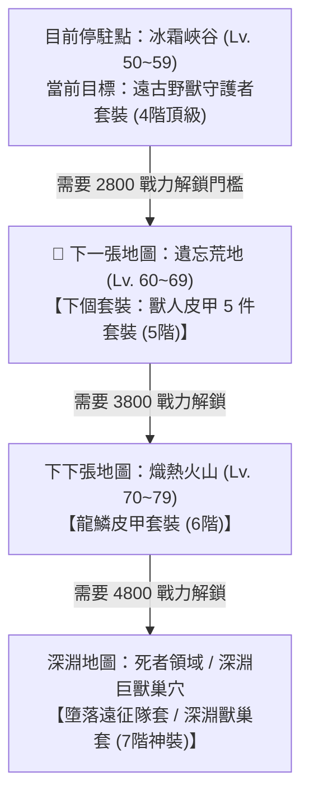

Searched for "recipe"
Ran command: `.\.venv\Scripts\python -c "
from meta_data.tres_parser import parse_tres
data = parse_tres('meta_data/raw_tres/meta_datas.tres')
print('Keys in meta_datas.tres:', list(data.keys()))
for k in data.keys():
    if isinstance(data[k], dict):
        print(f'{k}: {len(data[k])} items, sample keys: {list(data[k].keys())[:5]}')
    elif isinstance(data[k], list):
        print(f'{k}: {len(data[k])} items')
    else:
        print(f'{k}: {type(data[k])}')
"`
Viewed tres_parser.py:1-60
Ran command: `.\.venv\Scripts\python -c "
from meta_data.tres_parser import TresParser
parser = TresParser()
data = parser.parse()
print('Keys:', list(data.keys()))
for k in data.keys():
    if isinstance(data[k], dict):
        print(f'{k}: {len(data[k])} items, sample keys: {list(data[k].keys())[:10]}')
    elif isinstance(data[k], list):
        print(f'{k}: {len(data[k])} items')
"`
Ran command: `.\.venv\Scripts\python -c "
from meta_data.tres_parser import TresParser
import json

parser = TresParser()
data = parser.parse()

bs_craft = data.get('blacksmith', {}).get('craft_dic', {})
items = data.get('items', {})
level_groups = data.get('level_groups', {})

print('=== Blacksmith Craft Categories / Items ===')
print(f'Total craft recipes in blacksmith: {len(bs_craft)}')

# Let us find medium armor, bow, quiver, etc.
archer_items = {}
for item_id, craft_info in bs_craft.items():
    item_meta = items.get(item_id, {})
    equip_type = item_meta.get('type') or item_meta.get('equipment_type') or item_meta.get('sub_type')
    level = item_meta.get('level') or item_meta.get('item_level') or item_meta.get('require_level', 0)
    archer_items[item_id] = {
        'item_meta': item_meta,
        'craft_info': craft_info,
        'level': level
    }

# Print sorted by level
sorted_items = sorted(archer_items.items(), key=lambda x: (x[1]['item_meta'].get('level', 0), x[0]))

for item_id, d in sorted_items:
    im = d['item_meta']
    name = im.get('name', item_id)
    slot = im.get('slot') or im.get('type')
    itype = im.get('item_type')
    materials = d['craft_info'].get('materials') or d['craft_info'].get('require_items') or d['craft_info']
    lvl = im.get('level', 0)
    # filter if relevant to archer or all armor
    print(f'[{lvl}級] ID: {item_id} | Name: {name} | Type: {itype}/{slot} | Mat: {materials}')
"`
Ran command: `.\.venv\Scripts\python -c "
from meta_data.tres_parser import TresParser
import json

parser = TresParser()
data = parser.parse()

items = data.get('items', {})
level_groups = data.get('level_groups', {})
dungeons = data.get('dungeons', {})
characters = data.get('characters', {})

print('=== Level Groups (Maps Progression) ===')
# Let's inspect level_groups structure
maps_info = []
for k, v in level_groups.items():
    if isinstance(v, dict) and ('levels' in v or 'enemy_level' in v or 'name' in v or 'unlock_account_level' in v or 'min_level' in v):
        maps_info.append((k, v))
    else:
        if isinstance(v, dict):
            maps_info.append((k, v))

for k, v in maps_info:
    name = v.get('name', k)
    lvl_min = v.get('min_level', v.get('enemy_level', 0))
    lvl_max = v.get('max_level', 0)
    print(f'Map ID: {k} | Name: {name} | Info: {v.get(\"name\")} | Keys: {list(v.keys())}')
"`
Ran command: `.\.venv\Scripts\python -c "
from meta_data.tres_parser import TresParser

parser = TresParser()
data = parser.parse()

level_groups = data.get('level_groups', {})
for k, v in level_groups.items():
    if isinstance(v, dict):
        print(f'Map: {k} | {v}')
"`
Ran command: `.\.venv\Scripts\python -c "
from meta_data.tres_parser import TresParser
import json

parser = TresParser()
data = parser.parse()

level_groups = data.get('level_groups', {})
items = data.get('items', {})
characters = data.get('characters', {})
blacksmith = data.get('blacksmith', {}).get('craft_dic', {})

# 1. Map progression
maps = {}
for k, v in level_groups.items():
    if isinstance(v, dict) and 'pre_level_group' in v:
        maps[k] = v

# Sort maps by progression
map_order = []
cur = 'none'
while True:
    found = False
    for k, v in maps.items():
        if v.get('pre_level_group') == cur:
            map_order.append(k)
            cur = k
            found = True
            break
    if not found:
        break

print('=== MAP PROGRESSION ===')
for i, m in enumerate(map_order):
    min_lvl = maps[m]['levels'][0].get('enemy_level', 0)
    max_lvl = maps[m]['levels'][-1].get('enemy_level', 0)
    req_pwr = maps[m].get('required_power', 0)
    print(f'Stage {i+1}: {m} (Lv.{int(min_lvl)}~{int(max_lvl)}) | Req Power: {req_pwr}')

# 2. Archer craftable equipment list
print('\n=== ARCHER CRAFTABLE EQUIPMENT (Medium Armor, Bow, Quiver) ===')
target_slots = {
    'chest': blacksmith.get('medium_armor', {}).get('chest', []),
    'feet': blacksmith.get('medium_armor', {}).get('feet', []),
    'hands': blacksmith.get('medium_armor', {}).get('hands', []),
    'head': blacksmith.get('medium_armor', {}).get('head', []),
    'waist': blacksmith.get('medium_armor', {}).get('waist', []),
    'bow': blacksmith.get('weapon', {}).get('bow', []),
    'quiver': blacksmith.get('off_hand', {}).get('quiver', [])
}

# Collect details for each item
equip_details = []
for slot, item_ids in target_slots.items():
    for i_id in item_ids:
        item = items.get(i_id, {})
        equip_details.append({
            'id': i_id,
            'slot': slot,
            'name': item.get('name', i_id),
            'level': item.get('level', 0),
            'rarity': item.get('rarity', 0),
            'attributes': item.get('attributes', {}),
            'craft_items': item.get('craft_items', []),
            'set_name': item.get('set_name', '')
        })

equip_details.sort(key=lambda x: (x['level'], x['slot'], x['id']))

for eq in equip_details:
    craft_str = ', '.join([f\"{c.get('id')}: x{int(c.get('count', 1))}\" for c in eq['craft_items']])
    print(f\"[{eq['level']}級 | {eq['slot'].upper()}] ID: {eq['id']} | Name: {eq['name']} | Set: {eq['set_name']} | Craft: [{craft_str}]\")
"`
Created analyze_archer_gear.py
Ran command: `.\.venv\Scripts\python meta_data/scripts/analyze_archer_gear.py`
Ran command: `.\.venv\Scripts\python -c "
import os, sys
sys.path.append(os.path.dirname(os.path.dirname(os.path.abspath('.'))))
from meta_data.tres_parser import TresParser

data = TresParser().parse()
items = data.get('items', {})
characters = data.get('characters', {})
level_groups = data.get('level_groups', {})

# Let's inspect gear items detailed attributes
target_items = [
    # Beast Warden Set
    'head_ancient_beast_warden', 'chest_ancient_beast_warden', 'hands_ancient_beast_warden', 'waist_ancient_beast_warden', 'feet_ancient_beast_warden',
    # Orc Leather Set
    'head_leather_orc', 'chest_leather_orc', 'hands_leather_orc', 'waist_leather_orc', 'feet_leather_orc',
    # Bows
    'bow_beast_fang', 'bow_ingot_demonite', 'bow_undead_uzerg', 'bow_demon_lilith', 'bow_abysseroded_moses',
    # Quivers
    'quiver_leopard_hide', 'quiver_frost_demon', 'quiver_frostfeather'
]

print('=== GEAR DETAILS & SETS ===')
for item_id in target_items:
    item = items.get(item_id, {})
    name = item.get('name', item_id)
    level = item.get('level', 0)
    slot = item.get('slot') or item.get('type')
    attrs = item.get('attributes', {})
    craft = item.get('craft_items', [])
    craft_str = ', '.join([f\"{c.get('id')}: x{int(c.get('count', 1))}\" for c in craft])
    print(f'[{item_id}] (Lv.{level} {slot}) {name}')
    print(f'   屬性: {attrs}')
    print(f'   合成: {craft_str}\n')

# Check drops for leather_orc and orc_fang and leather_behemoth
print('=== MATERIALS DROP SOURCES ===')
mat_ids = ['leather_behemoth', 'leather_heavy', 'thick_bear_hide', 'behemoth_bone', 'leather_orc', 'orc_fang', 'ingot_refined', 'essence_4', 'essence_5']

for mid in mat_ids:
    sources = []
    for m_name, m_val in level_groups.items():
        if isinstance(m_val, dict) and 'levels' in m_val:
            for lvl in m_val['levels']:
                enemies = lvl.get('enemies', []) + lvl.get('bosses', [])
                for e in enemies:
                    e_info = characters.get(e, {})
                    drops = e_info.get('drops', []) or e_info.get('items', [])
                    for d in drops:
                        did = d.get('id') if isinstance(d, dict) else d
                        if did == mid:
                            sources.append(f'{m_name} -> {e} ({e_info.get(\"name\", e)})')
    # unique
    sources = list(dict.fromkeys(sources))
    print(f'[{mid}]: {len(sources)} sources')
    for s in sources[:5]:
        print(f'   - {s}')
"`
Created analyze_archer_gear.py
Ran command: `.\.venv\Scripts\python meta_data/scripts/analyze_archer_gear.py`
Ran command: `.\.venv\Scripts\python -c "
import os, sys
sys.path.append(os.path.dirname(os.path.dirname(os.path.abspath('.'))))
from meta_data.tres_parser import TresParser

data = TresParser().parse()
items = data.get('items', {})
print('Item sample:', items.get('chest_ancient_beast_warden'))
print('\nLeather orc sample:', items.get('leather_orc'))
print('\nLeather behemoth sample:', items.get('leather_behemoth'))

characters = data.get('characters', {})
# Let us inspect a character in forgotten_wasteland
orc_grunt = characters.get('orc_stonehelm_grunt')
print('\nCharacter sample (orc_stonehelm_grunt):', orc_grunt)

# Let us check alchemy processing
alchemy = data.get('alchemy_hut', {})
print('\nAlchemy keys:', list(alchemy.keys()))
print('Alchemy processing_dic:', alchemy.get('processing_dic'))
print('Alchemy craft_dic:', alchemy.get('craft_dic'))

# Let us check blacksmith processing_dic
bs = data.get('blacksmith', {})
print('\nBlacksmith processing_dic:', bs.get('processing_dic'))
"`
Ran command: `.\.venv\Scripts\python -c "
import os, sys
sys.path.append(os.path.dirname(os.path.dirname(os.path.abspath('.'))))
from meta_data.tres_parser import TresParser

data = TresParser().parse()
items = data.get('items', {})
characters = data.get('characters', {})
level_groups = data.get('level_groups', {})
world = data.get('world', {})
dungeons = data.get('dungeons', {})

print('=== World item chance / drop datas ===')
print('World keys:', list(world.keys()))
print('item_chance_datas keys:', list(world.get('item_chance_datas', {}).keys()) if isinstance(world.get('item_chance_datas'), dict) else 'Not dict')
print('world_enemies sample:', list(world.get('world_enemies', {}).items())[:3] if isinstance(world.get('world_enemies'), dict) else 'Not dict')

# Let us check how items drop in characters or level_groups
for char_id, char_data in characters.items():
    for k in ['droppable_items', 'drops', 'drop_items', 'items', 'quest_items']:
        if char_data.get(k):
            # print first 5
            print(f'Char {char_id} has {k}: {char_data[k]}')
            break
"`
Ran command: `.\.venv\Scripts\python -c "
import os, sys
sys.path.append(os.path.dirname(os.path.dirname(os.path.abspath('.'))))
from meta_data.tres_parser import TresParser

data = TresParser().parse()
characters = data.get('characters', {})
level_groups = data.get('level_groups', {})

# Search for orc monsters droppable_items
orc_chars = [cid for cid in characters.keys() if 'orc' in cid or 'behemoth' in cid or 'bear' in cid]
for cid in orc_chars:
    c = characters[cid]
    drops = c.get('droppable_items', [])
    print(f'{cid}: droppable = {drops}')
"`

根據遊戲底層資料檔 [meta_datas.tres](file:///e:/Side_Project/BlackfireCrusade_tool/meta_data/raw_tres/meta_datas.tres) 的鐵匠鋪合成配方 (`blacksmith.craft_dic`)、地圖掉落 (`level_groups`) 與怪物數據庫 (`characters`)，為您詳細拆解弓箭手的裝備演進路線與材料規劃：

---

### 🗺️ 一、下個弓箭手套裝在哪個地圖？有多遠？

#### 📌 關鍵結論：
1. **下個套裝就在眼前這張門後的【遺忘荒地 (Forgotten Wasteland，Lv. 60~69)】**！
2. **地圖距離 = `0` 張（就在 2800 戰力門檻跨過去的第一張圖）**。
3. **套裝名稱**：**【獸人皮甲 5 件套裝 (`leather_orc`)】**。
4. **過渡期長度**：雖然就在下一張圖，但因為獸人套裝圖紙分散在遺忘荒地的 **第 5 關 Boss（哈魯戈爾）、第 10 關關底 Boss（戈爾薩克）與獸人領主**，且需要累積 32 張獸人皮革，因此「遠古野獸套」會完整陪伴你打穿整個 Lv.60~69 關卡。

---

### 🛡️ 二、兩大階段套裝「屬性、圖紙與材料總消耗」對比表

| 裝備階級與套裝名稱 | 適用地圖與等級 | 涵蓋部位 | 圖紙獲取來源 | 製作整套 5 件【總材料消耗】 |
| :--- | :--- | :--- | :--- | :--- |
| **當前：遠古野獸守護者套裝** (`ancient_beast_warden`) | **冰霜峽谷** (Lv. 50~59) | 頭、胸、手、腰、腳 | **冰霜巨獸 (`behemoth_frost`)** 冰霜峽谷第 10 關關底 Boss | 🔹 **巨獸皮革 (`leather_behemoth`)：`19 張`** (需巨獸毛皮 `behemoth_hide` x38) 🔹 厚重皮革 (`leather_heavy`)：`10 張` 🔹 厚熊皮 (`thick_bear_hide`)：`4 張` 🔹 巨獸之骨 (`behemoth_bone`)：`6 根` 🔹 四階精華 (`essence_4`)：`5 顆` |
| **下個：獸人皮甲 5 件套裝** (`leather_orc`) | **遺忘荒地** (Lv. 60~69) | 頭、胸、手、腰、腳 | 🔹 頭盔：第 5 關 Boss 哈魯戈爾 🔹 腰帶：第 10 關 Boss 戈爾薩克 🔹 護手/鞋：獸人精英怪/將領 🔹 胸甲：獸人領主克拉古爾 | 🔸 **獸人皮革 (`leather_orc`)：`32 張`** (需獸人碎皮 x256 + 圖騰掛墜 x64) 🔸 獸人獠牙 (`orc_fang`)：`10 根` 🔸 精煉金屬錠 (`ingot_refined`)：`2 錠` 🔸 五階精華 (`essence_5`)：`5 顆` |

---

### 🏹 三、弓箭手武器與副手（箭筒）的同步更換節奏

除了防具套裝外，武器與箭筒的替換順序如下：

1. **武器（弓）進階鏈**：
   * **當前主力**：`bow_beast_fang` (**野獸獠牙弓**) ➔ 需野獸獠牙 x6 + 野豬獠牙 x2。
   * **遺忘荒地 / 中期過渡**：`bow_ingot_demonite` (**惡魔鋼弓**) ➔ 需中皮革 x4 + 精紡布料 x2 + 惡魔鋼錠 x4。
   * **後期核彈弓**：`bow_demon_lilith` (**莉莉絲之弓**) 或 `bow_abysseroded_moses` (**摩西深淵弓**)。
2. **副手（箭筒）進階鏈**：
   * **當前主力**：`quiver_frost_demon` (**霜魔箭筒**) ➔ 需冰霜錠 x4 + 厚重皮革 x2 + 惡魔角 x1。
   * **後期畢業**：`quiver_frostfeather` (**霜羽箭筒**) ➔ 需誓約鋼錠 x16 + 霜噬羽毛 x6。

---

### 💡 四、給您的最佳體力與材料投入決策（要打多少野獸皮？）

針對您目前的決策痛點（「要打多少野獸皮做德魯戈的裝備」）：

1. **🎯 剛好湊滿 19 張巨獸皮（38 張巨獸毛皮）即可，【絕不超額刷】**：
   * 遠古野獸守護者 5 件套總共固定消耗 **19 張巨獸皮**（胸 6、手 4、腳 4、腰 3、頭 2）。
   * 只要湊齊 19 張巨獸皮做出野獸套裝，德魯戈穿上後加上艾麗娜的防禦與芬奇的輸出，戰力將**輕鬆突破 2800 門檻**。
2. **🚪 進入遺忘荒地後立刻全面轉火「獸人材料」**：
   * 一旦門檻突破進入遺忘荒地，怪物的掉落會立即切換為「獸人碎皮」、「圖騰掛墜」與「獸人獠牙」。
   * 您將不再需要任何野獸皮，因此**多刷的野獸皮在進入遺忘荒地後會直接失去升級價值**。
3. **⚡ 推薦打造順序（如果材料有限想快速衝戰力）**：
   * **第 1 優先**：**胸甲 (`chest_ancient_beast_warden`)**（6 皮）➔ 基礎血量與雙抗加成最高。
   * **第 2 優先**：**護手 (`hands`) + 戰靴 (`feet`)**（各 4 皮）➔ 提供核心暴擊與攻擊屬性。
   * **第 3 優先**：腰帶（3 皮）與頭盔（2 皮）。