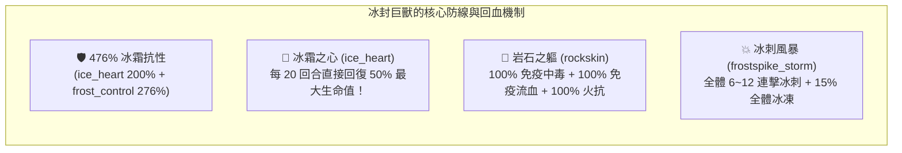

# ⚔️ 二號帳號當前隊伍資訊與冰封峽谷 Final Boss 深度突破指南

> 本文檔專門記錄**玩家二號小帳**之英雄陣容、角色特性與成長規劃。  
> 依據遊戲底層資源 `meta_datas.tres`、關卡設定檔 `frozen_gorge` 與怪物特性資料庫，針對當前卡關之【冰封峽谷 (Lv. 50~59)】Final Boss **冰封巨獸 (`behemoth_frost`)** 提供 100% 精確底層數值診斷與克敵攻略。

---

## 📊 一、二號帳號客觀條件與卡關診斷

| 項目 | 當前狀態 | 底層機制與系統分析 |
| :--- | :--- | :--- |
| **當前關卡目標** | **冰封峽谷 (frozen_gorge) Final Boss (第 10 關)** | 關卡等級 Lv. 59，系統推薦戰力 **`1800`** |
| **玩家當前戰力** | **約 `1800`** | 戰力已達標，但因「屬性被極限剋制」與「輸出結構偏科」導致卡關 |
| **卡關核心 BOSS** | 🦣 **冰封巨獸 (`behemoth_frost`)** | 無職業 / 大型巨獸 (`body_type: large`) / 首領級 (`enemy_type: boss`) |
| **卡關核心痛點** | ① **Boss 瘋狂回血**<br>② **Boss 攻擊爆發高**<br>③ **主 C 冰法傷害全無** | • Boss 擁有 `ice_heart` (冰霜之心)：每 20 回合直接**回血 50%**，並自帶 **+200% 冰抗**！<br>• Boss 擁有 `frost_control` (冰系親和)：Lv.59 提供高達 **+276% 冰抗**！<br>• 合計 **476% 冰抗**，冰封弗莉婭所有技能傷害全部被減免殆盡！ |

---

## 🛡️ 二、二號帳號當前陣容底層數據與技能全覽

```mermaid
graph TD
    subgraph 二號帳號當前陣容（1殘廢C + 3治療/防禦）
        A["🛡️ 光輝艾麗娜 (騎士 / 4.0 橘金) - 前排純坦"]
        B["❄️ 冰封弗莉婭 (法師 / 4.0 橘金) - 唯一主C (被Boss 476% 冰抗完剋)"]
        C["✨ 聖言者露西恩 (牧師 / 4.0 橘金) - 輔助群奶/控制/神聖傷害"]
        D["🧪 治癒小魔瓶 (戰寵 / 3.0 紫色) - 純單體治療/充能 (治療嚴重溢出)"]
    end

    A -->|全隊加甲 + 嘲諷承傷| E["🦣 冰封巨獸 (Lv.59 Boss)"]
    B -.->|純冰系技能：傷害被抵銷 90%+| E
    C -->|神聖傷害 (0%抗性有效) + 眩暈/沉默控制| E
    D -->|持續治療艾麗娜| A
```

### 1. ❄️ 【當前唯一主 C】冰封弗莉婭 (法師 / 傳說 4.0 橘金)
* **底層 ID**：`hero_mage_5` | **稀有度**：4.0 (傳說) | **種族**：人類 (`human`) | **初始裝備**：`staff_mage_5` + `book_mage_5`
* **實機技能解析**：
  - `frostbolt` (**寒冰箭**)：單體遠程，造成 **120% 冰霜傷害** (`damage_type: ice`)，25% 冰凍，CD 3 回合。
  - `frostshot` (**霜射**)：隨機 3 目標，每次造成 **25% 冰霜傷害** (`damage_type: ice`)，CD 5 回合，SP +1。
  - `mass_frost_shield` (**群體霜盾**)：全體友方獲得 30~60 護甲 + 5~7 層冰霜屏障，CD 10 回合，SP -3。
  - `frost_control` (**冰霜掌控**)：被動屬性，提供冰霜親和與抗性。
  - `glacial_impale` (**冰川穿刺**)：隨機 3 目標，每次造成 **80% 冰霜傷害** (`damage_type: ice`)，25% 冰凍，CD 7 回合，SP -3。
* ⚠️ **卡關致命死穴**：**全部 3 個攻擊技能 100% 為冰霜傷害 (`damage_type: ice`)**。面對冰抗高達 476% 的冰封巨獸，造成的實質傷害無限接近於刮痧。

---

### 2. 🛡️ 【前排核心坦克】光輝艾麗娜 (騎士 / 傳說 4.0 橘金)
* **底層 ID**：`hero_knight_5` | **稀有度**：4.0 (傳說) | **種族**：人類 (`human`) | **每級物防成長**：+5.0 (全職業第一)
* **實機技能解析**：
  - `guardian_blow` (**守護一擊**)：近戰物理 120% 傷害，附帶 1~3 層壁壘護盾，CD 3 回合。
  - `resilient_healing` (**堅韌療癒**)：血量低於 50% 時觸發急救，恢復 40~80 生命 + 20 護盾血量與 1~5 層壁壘，CD 5 回合。
  - `holy_light_blessing` (**聖光加護**)：友方全體護甲 +20~40 + 戰意激昂 5~7 層，CD 10 回合（全隊大幅加硬）。
  - `holy_shackles` (**神聖枷鎖**)：遠程神聖傷害 140%，**25% 機率沉默 3~5 回合**，CD 5 回合。
  - `light_shield` (**聖光護盾**)：開局 10% 機率獲得 1~3 層壁壘護盾持續 9 回合。
* 🎯 **定位評價**：極為優秀的團隊主坦，能扛能奶能加甲，神聖枷鎖還能提供關鍵沉默。

---

### 3. ✨ 【治療與控場輔助】聖言者露西恩 (牧師 / 傳說 4.0 橘金)
* **底層 ID**：`hero_priest_5` | **稀有度**：4.0 (傳說) | **種族**：人類 (`human`) | **初始裝備**：`scepter_priest_5` + `book_priest_5`
* **實機技能解析**：
  - `divine_verdict` (**神聖裁決**)：遠程神聖傷害 120%，**25% 機率沉默 2 回合**，CD 3 回合。
  - `holy_strike` (**神聖打擊**)：遠程神聖傷害 120%，**25% 機率擊暈 1 回合**，CD 3 回合。
  - `mass_healing` (**群體治療**)：友方全體恢復 10%~20% 生命值，CD 10 回合，SP -3。
  - `heaven_toll` (**天界喪鐘**)：敵方全體神聖傷害 100%，**25% 機率擊暈**，CD 7 回合，SP -3。
  - `dreadlight_echo` (**懼光迴響**)：被動，攻擊時 15% 機率施加 1~3 層懼光印記。
* 🎯 **隱藏潛力**：所有攻擊均為**神聖傷害 (`damage_type: holy`)**，完全無視 Boss 的 476% 冰抗！並且擁有雙眩暈 + 沉默控制鏈。

---

### 4. 🧪 【輔助戰寵】治癒小魔瓶 (戰寵 / 史詩 3.0 紫色)
* **底層 ID**：`pet_healing_flashling` | **稀有度**：3.0 (史詩) | **種族**：魔瓶族 (`vialkin`)
* **實機技能解析**：
  - `glimmer_heal` (**微光之癒**)：低血量急救單體回血 30~50 點 + 25% 獲得 1 點能量，CD 3 回合。
  - `gleaming_gift` (**微光饋贈**)：友方充能，15% 機率充能 1~2 點能量，CD 5 回合。
  - `instant_droplet` (**速效甘霖**)：單體大回血 80~100 點，CD 5 回合，SP -3。
  - `breath_infusion` (**氣息注劑**)：被動提升 20% 受癒親和。
* ⚠️ **定位矛盾**：當前隊伍已擁有艾麗娜急救回血 + 露西恩群體治療，小魔瓶導致**治療量嚴重超標溢出**，但全隊極度缺乏輸出。

---

## 🦣 三、冰封巨獸 (`behemoth_frost`) 底層機制與數值透視

依據 `characters.behemoth_frost`、`races.behemoth`、`enemy_types.boss` 與 `body_types.large` 交叉計算：



### 1. 完整抗性與免疫清單
| 抗性 / 機制項目 | 底層數值 | 實戰影響與結論 |
| :--- | :---: | :--- |
| **冰霜抗性 (`ice_res`)** | **`476%`** | 由 `ice_heart` (200%) 與 Lv.59 `frost_control` (276%) 構成。**冰法輸出直接報廢**。 |
| **流血免疫 (`bleed_immuned`)** | **`100% (免疫)`** | 來自 `rockskin` 特質，無法靠流血 Dot 刮痧。 |
| **中毒免疫 (`poison_immuned`)** | **`100% (免疫)`** | 來自 `rockskin` 特質，無法靠毒素 Dot 扣血。 |
| **火焰抗性 (`fire_res`)** | **`100%`** | 來自 `rockskin` 特質，火系傷害減半。 |
| **物理抗性 (`physical_res`)** | **約 `135%`** | 體型 (20%) + Boss (30%) + 堅韌體質與硬皮 (75%) + 冰控 (10%)。 |
| **魔法抗性 (`magic_res`)** | **約 `90%`** | 體型 (20%) + Boss (30%) + 硬皮 (30%) + 冰控 (10%)。 |
| **神聖抗性 (`holy_res`)** | **`0% (無抗性 / 弱點突破口)`** | **Boss 沒有任何神聖抗性！神聖傷害可打出 100% 完整全額傷害！** |
| **控制狀態判定** | **無免疫眩暈 / 無免疫沉默** | **Boss 吃眩暈 (`stun`) 與沉默 (`silence`)**，可被露西恩與艾麗娜控場！ |

### 2. 為什麼戰力 1800 會打不過？三大根本原因
1. **傷害被完全吸收**：主 C 弗莉婭打 Boss 就像用冰塊砸冰山，造成的傷害甚至低於每回合的自然波動。
2. **20 回合回血 50%**：Boss 每 20 回合施展一次 `ice_heart`，直接拉回半條血。在缺乏爆發輸出的情況下，Boss 血量永遠維持在高位。
3. **隊伍 3 奶 1 殘 C**：艾麗娜加血加盾、露西恩群奶、小魔瓶單奶，隊伍生存力很強，但戰鬥拖到 30~50 回合後，Boss 連續施放 `frostspike_storm` (冰刺風暴) 和 `attack_tread_ice` (物理踐踏 150%)，全隊終會被磨死。

---

## 💡 四、深度通關攻略：【換英雄】與【蹲養成】雙軌方案

### 方案 A：換英雄方案（強烈推薦，最快質變通關）🥇

> 只要補強**非冰系的直接物理傷害**或**非冰系爆發**，Boss 脆弱的神聖與物理防線將被迅速瓦解！

#### 1. 戰寵替換（最容易實現，立刻釋放輸出）
* **操作**：將【治癒小魔瓶】換下。隊伍已有艾麗娜 + 露西恩雙重治療，完全不需要治療寵。
* **換入目標**：
  - **骨爪獵犬 (`pet_hound_boneclaw` / 4.0 狼寵)**：物理撕咬、狂暴連擊，大幅補充單體物理壓血。
  - **狂暴棕熊 (`pet_savage_grizzly` / 5.0 熊寵)**：野蠻衝撞、野性狂怒，高額物理輸出與破甲。

#### 2. 主 C 替換：【暴擊之翼 諾維娜 (`hero_archer_4` / 3.0 紫色精靈遊俠)】🥇 (當前最佳解法！)
* **為什麼換「諾維娜」打冰封巨獸會大幅超越「冰封弗莉婭」？**
  1. **完全無視 476% 冰抗**：弗莉婭純冰傷害被 Boss 減免 90%+，而諾維娜 4 個技能全部是**純物理傷害 (`damage_type: physical`)**，直接打出 100% 結算！
  2. **開局狂暴暴擊光環 (`rampage_wings`)**：天生被動在戰鬥開局直接提供 **+40%~+76% 暴擊率（持續整整 10 回合）**！配合精靈族天生 10% 暴擊，開局暴擊率直逼 50%~86%！
  3. **3 回合短 CD 致命處決 (`death_shoot`)**：
     - 單發 **160% 物理超高倍率**。
     - 自帶神級特效：**當目標生命值低於 75% 時，100% 必定暴擊 (`cirt_hp_rate: 0.75`)**！
     - 且 CD 僅有 **3 回合**，每 3 回合必定打出一發核彈級物理暴擊！
  4. **破解 Boss 20 回合回血 50% 的死局**：
     - 在艾麗娜加甲扛傷、露西恩神聖打擊+治療輔助下，諾維娜開局 10 回合瘋狂暴擊，配合每 3 回合一次的必定暴擊死神射擊，能在 10~15 回合內（趕在 Boss 回血前）直接將 Boss 斬殺！
  5. **完美避開本帳路線**：
     - 本帳走的是「蛙人芬奇 + 獸人德魯戈」，而小帳使用「精靈諾維娜」，未來可直通「龍裔遊俠 7」或「樹人自然流」，風格截然不同且極具成就感！

---

### 方案 B：蹲一下的養成方案（不換英雄，靠現有陣容硬過）🥈

如果您希望維持當前 4 隻角色通關，必須進行以下針對性戰術調整：

#### 1. 核心轉職：將「聖言者露西恩」扶正為主力核彈
* **原理**：弗莉婭傷害無效，但**露西恩的神聖傷害打 Boss 是 0% 抗性（全額真傷）**！
* **具體養成步驟**：
  - **武器與飾品轉移**：將全隊最高攻擊力的法杖/權杖、魔法攻擊力飾品、龍血寶石**全部裝備給露西恩**。
  - **技能主升**：優先把露西恩的 `divine_verdict` (神聖裁決) 與 `holy_strike` (神聖打擊) 升至滿級（提升基礎倍率與控制機率）。
  - **控制鏈打斷**：露西恩的 25% 眩暈 + 艾麗娜的 25% 沉默，在 Boss 施放大招回合有機會直接打斷！

#### 2. 防具特化：全隊堆疊【冰霜抗性】與【物理護甲】
* Boss 的威脅只有兩種傷害：**冰刺風暴 (冰傷)** 與 **踐踏 (物傷)**。
* **裝備推薦**：
  - 前排艾麗娜裝備 **【冰霜守衛重鎧 (`chest_frozen_warden`)】**（提供高額物防與冰抗）。
  - 佩戴冰抗戒指或飾品。
* 只要全隊冰抗提高 30%~50%，Boss 的冰刺風暴打在身上只剩毛毛雨，全隊血線將極度穩定。

#### 3. 煉金藥水戰略爆發（破局關鍵）
前往城鎮煉金小屋準備以下戰術藥水：
1. **霜盾藥水 (`frost_shield_potion`)**（Tier 2 藍色）：全隊開場獲得 100 點冰霜護盾與抗性，直接無視 Boss 開局前兩輪爆發。
2. **狂怒藥水 (`fury_potion`)**（Tier 3 紫色）：全隊暴擊率 +30%、傷害 +30%，在第 10~15 回合開啟，全力灌死 Boss！
3. **能量藥水 (`energy_potion_1`)**：開局直接給露西恩補 3 點 SP，第一回合直接施放大招打擊與控制！

---

## 📋 五、二號帳號後續行動推薦清單

- [ ] **確認陣容分流策略**：確認將本進度獨立記錄於 `My_progress/二號帳號進度資訊.md`。
- [ ] **更換戰寵**：將治癒小魔瓶替換為輸出型戰寵（如骨爪獵犬或棕熊）。
- [ ] **重分配裝備資源**：把高魔攻武器與寶石優先灌給聖言者露西恩，利用神聖屬性打穿 Boss。
- [ ] **鐵匠鋪打造冰抗防具**：為前排艾麗娜打造【冰霜守衛重鎧】，減免 Boss 傷害。
- [ ] **酒館物色物理主 C**：若有機會，優先招募【疾弓芬奇】或物理遊俠，組建穩定的「坦 + 奶 + 物理 C」黃金三角陣容。
