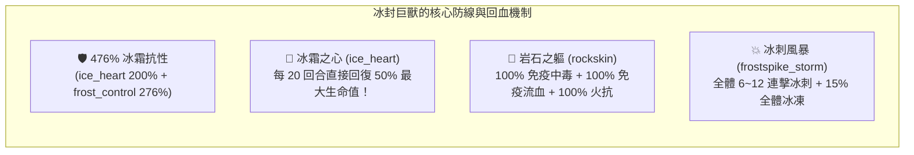
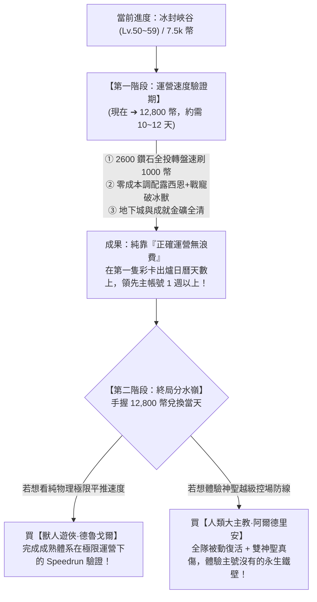

# ⚔️ 二號帳號當前隊伍資訊與冰封峽谷 Final Boss 深度突破指南

> 本文檔專門記錄**玩家二號小帳**之英雄陣容、角色特性與成長規劃。  
> 依據遊戲底層資源 `meta_datas.tres`、關卡設定檔 `frozen_gorge` 與怪物特性資料庫，針對當前卡關之【冰封峽谷 (Lv. 50~59)】Final Boss **冰封巨獸 (`behemoth_frost`)** 提供 100% 精確底層數值診斷與克敵攻略。

---

## 📊 一、二號帳號客觀條件與卡關診斷

| 項目 | 當前狀態 | 底層機制與系統分析 |
| :--- | :--- | :--- |
| **當前關卡目標** | **冰封峽谷 (frozen_gorge) Final Boss (第 10 關)** | 關卡等級 Lv. 59，系統推薦戰力 **`1800`** |
| **玩家當前戰力** | **約 `1800`** | 戰力已達標，但因「屬性被極限剋制」與「輸出結構偏科」導致卡關 |
| **卡關核心 BOSS** | 🦣 **冰封巨獸 (`behemoth_frost`)** | 無職業 / 大型巨獸 (`body_type: large`) / 首領級 (`enemy_type: boss`) |
| **卡關核心痛點** | ① **Boss 瘋狂回血**<br>② **Boss 攻擊爆發高**<br>③ **主 C 冰法傷害全無** | • Boss 擁有 `ice_heart` (冰霜之心)：每 20 回合直接**回血 50%**，並自帶 **+200% 冰抗**！<br>• Boss 擁有 `frost_control` (冰系親和)：Lv.59 提供高達 **+276% 冰抗**！<br>• 合計 **476% 冰抗**，冰封弗莉婭所有技能傷害全部被減免殆盡！ |

---

## 🛡️ 二、二號帳號當前陣容底層數據與技能全覽

```mermaid
graph TD
    subgraph 二號帳號當前陣容（1殘廢C + 3治療/防禦）
        A["🛡️ 光輝艾麗娜 (騎士 / 4.0 橘金) - 前排純坦"]
        B["❄️ 冰封弗莉婭 (法師 / 4.0 橘金) - 唯一主C (被Boss 476% 冰抗完剋)"]
        C["✨ 聖言者露西恩 (牧師 / 4.0 橘金) - 輔助群奶/控制/神聖傷害"]
        D["🧪 治癒小魔瓶 (戰寵 / 3.0 紫色) - 純單體治療/充能 (治療嚴重溢出)"]
    end

    A -->|全隊加甲 + 嘲諷承傷| E["🦣 冰封巨獸 (Lv.59 Boss)"]
    B -.->|純冰系技能：傷害被抵銷 90%+| E
    C -->|神聖傷害 (0%抗性有效) + 眩暈/沉默控制| E
    D -->|持續治療艾麗娜| A
```

### 1. ❄️ 【當前唯一主 C】冰封弗莉婭 (法師 / 傳說 4.0 橘金)
* **底層 ID**：`hero_mage_5` | **稀有度**：4.0 (傳說) | **種族**：人類 (`human`) | **初始裝備**：`staff_mage_5` + `book_mage_5`
* **實機技能解析**：
  - `frostbolt` (**寒冰箭**)：單體遠程，造成 **120% 冰霜傷害** (`damage_type: ice`)，25% 冰凍，CD 3 回合。
  - `frostshot` (**霜射**)：隨機 3 目標，每次造成 **25% 冰霜傷害** (`damage_type: ice`)，CD 5 回合，SP +1。
  - `mass_frost_shield` (**群體霜盾**)：全體友方獲得 30~60 護甲 + 5~7 層冰霜屏障，CD 10 回合，SP -3。
  - `frost_control` (**冰霜掌控**)：被動屬性，提供冰霜親和與抗性。
  - `glacial_impale` (**冰川穿刺**)：隨機 3 目標，每次造成 **80% 冰霜傷害** (`damage_type: ice`)，25% 冰凍，CD 7 回合，SP -3。
* ⚠️ **卡關致命死穴**：**全部 3 個攻擊技能 100% 為冰霜傷害 (`damage_type: ice`)**。面對冰抗高達 476% 的冰封巨獸，造成的實質傷害無限接近於刮痧。

---

### 2. 🛡️ 【前排核心坦克】光輝艾麗娜 (騎士 / 傳說 4.0 橘金)
* **底層 ID**：`hero_knight_5` | **稀有度**：4.0 (傳說) | **種族**：人類 (`human`) | **每級物防成長**：+5.0 (全職業第一)
* **實機技能解析**：
  - `guardian_blow` (**守護一擊**)：近戰物理 120% 傷害，附帶 1~3 層壁壘護盾，CD 3 回合。
  - `resilient_healing` (**堅韌療癒**)：血量低於 50% 時觸發急救，恢復 40~80 生命 + 20 護盾血量與 1~5 層壁壘，CD 5 回合。
  - `holy_light_blessing` (**聖光加護**)：友方全體護甲 +20~40 + 戰意激昂 5~7 層，CD 10 回合（全隊大幅加硬）。
  - `holy_shackles` (**神聖枷鎖**)：遠程神聖傷害 140%，**25% 機率沉默 3~5 回合**，CD 5 回合。
  - `light_shield` (**聖光護盾**)：開局 10% 機率獲得 1~3 層壁壘護盾持續 9 回合。
* 🎯 **定位評價**：極為優秀的團隊主坦，能扛能奶能加甲，神聖枷鎖還能提供關鍵沉默。

---

### 3. ✨ 【治療與控場輔助】聖言者露西恩 (牧師 / 傳說 4.0 橘金)
* **底層 ID**：`hero_priest_5` | **稀有度**：4.0 (傳說) | **種族**：人類 (`human`) | **初始裝備**：`scepter_priest_5` + `book_priest_5`
* **實機技能解析**：
  - `divine_verdict` (**神聖裁決**)：遠程神聖傷害 120%，**25% 機率沉默 2 回合**，CD 3 回合。
  - `holy_strike` (**神聖打擊**)：遠程神聖傷害 120%，**25% 機率擊暈 1 回合**，CD 3 回合。
  - `mass_healing` (**群體治療**)：友方全體恢復 10%~20% 生命值，CD 10 回合，SP -3。
  - `heaven_toll` (**天界喪鐘**)：敵方全體神聖傷害 100%，**25% 機率擊暈**，CD 7 回合，SP -3。
  - `dreadlight_echo` (**懼光迴響**)：被動，攻擊時 15% 機率施加 1~3 層懼光印記。
* 🎯 **隱藏潛力**：所有攻擊均為**神聖傷害 (`damage_type: holy`)**，完全無視 Boss 的 476% 冰抗！並且擁有雙眩暈 + 沉默控制鏈。

---

### 4. 🧪 【輔助戰寵】治癒小魔瓶 (戰寵 / 史詩 3.0 紫色)
* **底層 ID**：`pet_healing_flashling` | **稀有度**：3.0 (史詩) | **種族**：魔瓶族 (`vialkin`)
* **實機技能解析**：
  - `glimmer_heal` (**微光之癒**)：低血量急救單體回血 30~50 點 + 25% 獲得 1 點能量，CD 3 回合。
  - `gleaming_gift` (**微光饋贈**)：友方充能，15% 機率充能 1~2 點能量，CD 5 回合。
  - `instant_droplet` (**速效甘霖**)：單體大回血 80~100 點，CD 5 回合，SP -3。
  - `breath_infusion` (**氣息注劑**)：被動提升 20% 受癒親和。
* ⚠️ **定位矛盾**：當前隊伍已擁有艾麗娜急救回血 + 露西恩群體治療，小魔瓶導致**治療量嚴重超標溢出**，但全隊極度缺乏輸出。

---

## 🦣 三、冰封巨獸 (`behemoth_frost`) 底層機制與數值透視

依據 `characters.behemoth_frost`、`races.behemoth`、`enemy_types.boss` 與 `body_types.large` 交叉計算：



### 1. 完整抗性與免疫清單
| 抗性 / 機制項目 | 底層數值 | 實戰影響與結論 |
| :--- | :---: | :--- |
| **冰霜抗性 (`ice_res`)** | **`476%`** | 由 `ice_heart` (200%) 與 Lv.59 `frost_control` (276%) 構成。**冰法輸出直接報廢**。 |
| **流血免疫 (`bleed_immuned`)** | **`100% (免疫)`** | 來自 `rockskin` 特質，無法靠流血 Dot 刮痧。 |
| **中毒免疫 (`poison_immuned`)** | **`100% (免疫)`** | 來自 `rockskin` 特質，無法靠毒素 Dot 扣血。 |
| **火焰抗性 (`fire_res`)** | **`100%`** | 來自 `rockskin` 特質，火系傷害減半。 |
| **物理抗性 (`physical_res`)** | **約 `135%`** | 體型 (20%) + Boss (30%) + 堅韌體質與硬皮 (75%) + 冰控 (10%)。 |
| **魔法抗性 (`magic_res`)** | **約 `90%`** | 體型 (20%) + Boss (30%) + 硬皮 (30%) + 冰控 (10%)。 |
| **神聖抗性 (`holy_res`)** | **`0% (無抗性 / 弱點突破口)`** | **Boss 沒有任何神聖抗性！神聖傷害可打出 100% 完整全額傷害！** |
| **控制狀態判定** | **無免疫眩暈 / 無免疫沉默** | **Boss 吃眩暈 (`stun`) 與沉默 (`silence`)**，可被露西恩與艾麗娜控場！ |

### 2. 為什麼戰力 1800 會打不過？三大根本原因
1. **傷害被完全吸收**：主 C 弗莉婭打 Boss 就像用冰塊砸冰山，造成的傷害甚至低於每回合的自然波動。
2. **20 回合回血 50%**：Boss 每 20 回合施展一次 `ice_heart`，直接拉回半條血。在缺乏爆發輸出的情況下，Boss 血量永遠維持在高位。
3. **隊伍 3 奶 1 殘 C**：艾麗娜加血加盾、露西恩群奶、小魔瓶單奶，隊伍生存力很強，但戰鬥拖到 30~50 回合後，Boss 連續施放 `frostspike_storm` (冰刺風暴) 和 `attack_tread_ice` (物理踐踏 150%)，全隊終會被磨死。

---

## 💡 四、二號帳號戰略定位：【兩階段驗證法】（運營速度 vs 全新體驗）

針對玩家在「複製主號成熟獸人流驗證發育速度」與「體驗全新陣容新鮮感」之間的兩難抉擇，確立**兩階段演進策略**：



### 1. 為什麼現階段不用急於鎖死終局陣容？
- **運營速度在前期 1~60 級就已體現**：真正的提速來自於「不踩坑、不盲目十抽、鑽石全砸命運之輪收割硬幣、及早清空地下城首通與成就里程碑」。
- **2,600 鑽石的最佳歸宿是【命運之輪】**：
  - 若投給酒館十抽（2,560 鑽），僅有 50% 機率出新卡，抽到重複僅退約 490~600 幣，退幣效率極低。
  - 若投給命運之輪（2,400 鑽轉 2 輪），穩定獲得 **800 ~ 1,000 Hero Coin**，將 5.3k 缺口直接縮小到 4.3k，比每日自然積累提速 3~4 天！
- **冰封峽谷 Boss 零成本即可破局**：隊伍已有艾麗娜（加甲沉默）與露西恩（神聖真傷無視 Boss 476% 冰抗），只要轉移法杖飾品並換輸出戰寵即可通關，不需要花鑽石抽卡救火。

---

## 🎯 五、深度通關攻略：【零成本硬過】與【英雄替換】方案

### 方案 A：零成本硬過方案（強烈推薦，不花鑽石當天通關）🥇
1. **核心轉職：將「聖言者露西恩」扶正為主力核彈**：
   - 弗莉婭冰傷無效，但**露西恩的神聖傷害打 Boss 是 0% 抗性（全額真傷）**！
   - 將全隊最高攻擊力的法杖/權杖、魔攻飾品、龍血寶石**全部裝備給露西恩**。
   - 優先升級 `divine_verdict` (神聖裁決) 與 `holy_strike` (神聖打擊)，提供全額輸出與控制。
2. **戰寵替換（立刻釋放輸出）**：
   - 將「治癒小魔瓶」換下（隊伍已有雙奶，治療嚴重溢出）。
   - 換入背包/大世界現成的物理戰寵（如 **骨爪獵犬** 或 **狂暴棕熊**），補足單體物理壓血。
3. **前排打斷回血**：
   - 艾麗娜的 `holy_shackles`（神聖枷鎖，25% 沉默）與露西恩的眩暈，在 Boss 即將施放 20 回合 `ice_heart` (回血50%) 時有機會直接打斷！

### 方案 B：有備選英雄時的替換方案（若抽到或持有精靈遊俠）🥈
- 若持有或透過紫代幣合成 **暴擊之翼 諾維娜 (`hero_archer_4` / 3.0 紫色精靈遊俠)**：
  - 純物理傷害無視 476% 冰抗。
  - 開局 10 回合自帶 +40%~+76% 暴擊光環。
  - 3 回合短 CD 致命處決（目標血量低於 75% 時 100% 必定暴擊），10~15 回合內迅速斬殺。

---

## 📋 六、二號帳號當前行動方針與執行清單

- [x] **確立二階段策略**：前中期專注「極速運營拿幣」，終局 12,800 幣時再依當時心境選擇德魯戈爾（極致物理）或阿爾德里安（神聖光輝）。
- [ ] **2,600 鑽石投向命運之輪**：等待/轉動命運之輪，收割 800~1,000 Hero Coin，將缺口壓至 4.3k 左右。
- [ ] **隊伍零成本微調通關冰封峽谷**：
  - 將全隊最佳法杖、魔攻飾品集中給予 **聖言者露西恩**（全額 0% 抗性神聖真傷打 Boss）。
  - 將「治癒小魔瓶」替換為輸出型戰寵（骨爪獵犬或棕熊）。
  - 前排艾麗娜留沉默打斷 Boss 20 回合的 50% 回血。
- [ ] **每日例行清單**：維持每日 300 幣產出（遠征幣全換殘暉拆解 + 懸賞任務），預計 10~12 天內達成 12,800 幣里程碑。


紫石
金幣
藍石
藍護身符
藍 打孔垂
藍 護身符
紫護身符*2
橙 打孔
命運必
黃 護身符
黃 強化石
- 英雄必
紅 強化石

約花1500鑽石
優勢是必拿到一些強化材料與打孔石
缺點是無法抽到新角色

---


