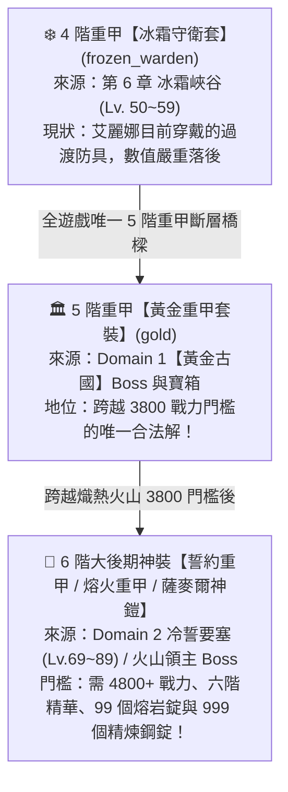
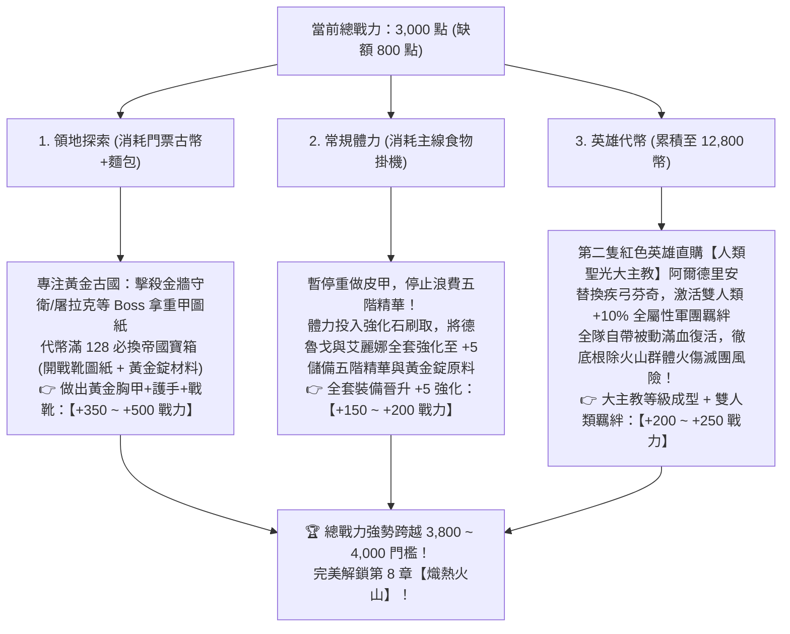

# ⚔️ 玩家當前隊伍全景資訊與 3800 戰力突破指南 (熾熱火山前哨最新修訂版)

> 本文檔依據玩家最新實機進度、底層資料庫 `meta_datas.tres`、關卡與地下城資料庫 `ALL_STAGES_AND_DUNGEONS.md` 與重甲鍛造數據庫，100% 精確校對玩家當前陣容，徹底清除過時階段資訊，並針對**「坦克防具斷層深度剖析」**、**「黃金古國圖紙必要性」**與**「3800 戰力衝刺路徑」**給出終極戰略決策。

---

## 📊 一、當前處境與客觀條件診斷 (最新校準)

| 項目 | 當前真實狀態 | 系統機制與核心限制分析 |
| :--- | :--- | :--- |
| **主線進度目標** | 🎉 **【遺忘荒地全通！】** 目前卡在【第 8 章 熾熱火山 (`fiery_volcano`, Lv. 70~79)】門前 | 系統強制要求總戰力達到 **`3,800`** 才能解鎖挑戰第 8 章。目前總戰力約 **`3,000`**，存在 **`800` 戰力差額**。 |
| **核心主力陣容** | 🛡️ **光輝艾麗娜 (坦)** + 🏹 **疾弓芬奇 (雙動削血)** + 🐺 **獸人德魯戈 (6.0 紅色主 C)** | 隊伍架構運轉極其順暢，德魯戈等級成型，穩居物理爆發秒殺天花板。 |
| **主 C 裝備狀態** | 🐺 **德魯戈裝備第一輪全套畢業！** • 主武：【暴獠折脊弓+7】(5星 5滿極品詞條雙孔) • 副手：【狂顎碎齒筒】(5星 5滿專屬箭筒) • 防具：**5 階【獸族皮甲 5 件套】已全部製作完成** | 德魯戈本體數值已達中期上限。**暫停消耗稀有五階精華反覆重做皮甲洗孔數**，保留材料直奔全隊突破。 |
| **坦克裝備狀態** | 🛡️ **艾麗娜武器副手畢業，但【防具嚴重脫節】！** • 武器：【黃金長槍 (`spear_gold`)】已持有 • 副手：【黃金重盾 (`shield_gold`)】已持有 • **防具（頭/胸/手/腰/腳）：仍為 3~4 階過渡裝** | **這是全隊卡在 3,000 戰力、無法邁向 3,800 的最致命短板**！防具數值落後導致戰力虧損高達 400~600 點，且火山前排易暴斃。 |
| **黃金古國進度** | 🏛️ **盾槍已畢業，代幣全面轉向【黃金寶箱 (128 代幣)】** | 256 代幣核心大件已拿下。剩餘代幣專門換取 128 寶箱（抽黃金戰靴圖紙 + 黃金錠/碎片材料 + 5階飾品聖物）。 |
| **英雄幣儲備進度** | 💰 **第二筆 12,800 英雄幣快速累積中** | 荒地滿星 (900幣) + 獸人地堡 (700幣) 已入庫，鎖定第二隻核心質變英雄：**【人類聖光大主教】阿爾德里安**。 |

---

## 🛡️ 二、坦克裝備下一個在哪？全遊戲重甲全景斷層深度剖析

> [!CRITICAL]
> **全遊戲重甲防具震撼真相**：  
> 在 **4 階冰霜守衛套** 與 **6 階大後期神裝** 之間，全遊戲**唯一成套的 5 階重甲防具，只有【黃金古國的黃金重甲套裝】**！  
> **遺忘荒地 (第 7 章) 與 熾熱火山 (第 8 章) 全圖完全沒有任何重甲防具圖紙！**

### 🗺️ 全遊戲重甲防具階梯全圖速查

### 📋 全遊戲所有重甲防具產出明細對照表：

| 品階 / 星級 | 重甲套裝名稱 | 涵蓋部位 | 圖紙獲取來源與關卡 | 所需核心合成材料 | 實戰評價與當前可行性 |
| :---: | :--- | :--- | :--- | :--- | :--- |
| **4 階 (4.0★)** | **冰霜守衛重鎧套** (`frozen_warden`) | 頭、胸、手、腰、腳 | **第 6 章 冰霜峽谷** (食屍鬼/冰熊/凍窟) | 冰霜鋼錠 (`ingot_frezon`) 四階精華 (`essence_4`) | 艾麗娜當前過渡裝。雙防加成低且偏科冰抗，無法支撐 3800 戰力與火山生存。 |
| **5 階 (5.0★)** 🏆 **唯一解** | **黃金重甲套裝** (`gold`) | **頭、胸、手、腰、腳** *(整套 5 件)* | **Domain 1【黃金古國】** • 胸：金牆守衛 • 頭：阿爾塔林 • 手：黃金屠拉克 • 腰：秘銀巫婆 • 腳：128 帝國寶箱 | **黃金錠 (`ingot_gold`)** (2 個黃金碎片合 1 個錠) **五階精華 (`essence_5`)** | 🌟 **全遊戲唯一 5 階重甲！** 雙物抗+魔抗+高額生命，單件提供 **+100~150 戰力**，5件齊全直拉 **+450~600 戰力**！ |
| **5 階 (5.0★)** 散件 | **靈魂水晶重盔** (`head_soul_crystal`) | 僅頭盔單一部位 | **免圖紙 (鐵匠鋪直做)** | 靈魂水晶 x4 (`wraith_ice`) 精煉鋼錠 x10 五階精華 x1 | 若黃金頭盔圖紙未出，可作為頭盔部位的極佳 5 階替代品。 |
| **6 階 (6.0★)** 極後期 | **誓約重甲套** (`oathbound`) | 頭、手 | **Domain 2 冷誓要塞** (霜龍阿祖洛斯 / 艾卡希雅) | 誓約鋼錠 x18 六階精華 (`essence_6`) | 遙遠的大後期裝備，需通關荒地後挑戰高難冷誓要塞，當前戰力無法挑戰。 |
| **6 階 (6.0★)** 極後期 | **熔火重甲套** (`moltenflare_girdle`) | 手、腰 | **第 8 章領主 Boss** (惡魔卡爾格羅斯) | 熔岩鋼錠 x18 地獄板甲碎片 x3 六階精華 x1 | 鎖在第 8 章火山門後，**沒達到 3800 戰力根本進不去火山**，不可作為前置解。 |
| **6 階 (6.0★)** 終極神鎧 | **遠征騎士鎧 / 薩麥爾鎧** | 僅胸甲 | 大後期首領討伐 | 需 **999 個精煉錠** 或 **99 個地獄火錠** + 六階精華 | 天文數字消耗，屬於 Lv.85~100 終極大後期玩具，中期絕對不要碰。 |

---

### 💡 三、黃金古國的圖紙是否有必要拿？終極決策判定

> **結論：黃金古國的防具圖紙【絕對有必要拿，且是唯一的通關救命稻草】！**

#### 為什麼不能指望「後面的關卡」？
1. **第 7 章【遺忘荒地】**：掉落的全是獸人皮甲（德魯戈已做完），**重甲掉落數為 0**。
2. **第 8 章【熾熱火山】**：掉落的全是龍鱗皮甲（`dragonscale`，遊俠 6 階中甲），**重甲掉落數依然為 0**。
3. **殘酷的現實**：如果您不拿黃金古國的防具圖紙，艾麗娜就**必須穿著 4 階的冰霜守衛套，一路赤身肉搏扛過整個遺忘荒地與熾熱火山，直到打通火山面對 6 階領主為止**！
   - 這在數值上是**完全不可能實現的**：
     - 數值上：沒有 5 階重甲，全隊總戰力永遠在 3,000~3,200 徘徊，**系統甚至根本不允許您進入第 8 章（3,800 強制限制）**！
     - 實戰上：火山怪物的群體連擊高頻火傷，會直接把穿著 4 階過渡裝的艾麗娜瞬間蒸發滅團。

#### 🎯 黃金古國 4 大部位圖紙精準狙擊指南：
黃金古國探索遇到 Boss 時，請依據以下部位優先級鎖定擊殺：
1. 🥇 **【黃金胸甲 (`design_chest_gold`)】—— 絕對核心**：
   * **掉落 Boss**：**金牆守衛 (`voidborn_goldwall_guardian`)**
   * **必要性**：重甲胸甲基礎防禦係數高達 **0.8**（全遊戲第一），單件提供海量物防、雙重物抗、魔抗與生命，**拿到胸甲單件就足以讓艾麗娜硬度翻倍**！
2. 🥈 **【黃金護手 (`design_hands_gold`)】**：
   * **掉落 Boss**：**黃金屠拉克 (`human_golden_tulakh`)**（提供高額格擋與物理防禦）。
3. 🥉 **【黃金腰帶 (`design_waist_gold`)】**：
   * **掉落 Boss**：**秘銀巫婆 (`elf_mythril_hag`)**。
4. 🏅 **【黃金頭盔 (`design_head_gold`)】**：
   * **掉落 Boss**：**阿爾塔林 (`undead_altalim`)**（若遲遲不掉，可直接在鐵匠鋪直做免圖紙的 5 階【靈魂水晶重盔】替代！）。
5. 📦 **【黃金戰靴 (`design_feet_gold`)】**：
   * **獲取途徑**：代幣滿 128 立即購買 **【黃金帝國寶箱】**，開箱保證 10 抽，出貨率高達 **$\approx 46\%$**！

---

### 💎 四、德魯戈裝備策略：立即停止重做洗孔，轉向強化與精華儲備

針對您提到的「刷皮革製作可打孔數更高的獸族皮甲套裝」：

1. **🚫 嚴禁繼續消耗五階精華重新製作**：
   * 德魯戈目前的 5 階獸族皮甲 5 件套已經具備高額的基礎敏捷、暴擊與雙抗，本體已非常強大。
   * 重做一件需要 4~10 張皮革（32~80 個碎片）以及 **1 顆五階精華 (`essence_5`)**。鍛造孔數純屬隨機（0~3 孔），一旦賭輸產出 0~1 孔，五階精華直接沉沒，這會導致後續拿到艾麗娜的黃金防具圖紙時**沒有五階精華可以鍛造**！
2. **🔨 正確的開孔方式：珠寶工坊【打孔錘 (`piercing_hammer_5`)】**：
   * 遊戲內設計了 5 階打孔錘，後續裝備孔數不足可以直接透過打孔錘開槽，絕非透過重做裝備。
3. **⭐ 戰力性價比最高的提升：精準強化至 +5**：
   * 與其賭多一個孔插符文（+20 戰力），不如將現有裝備使用強化石穩定強化至 **+5 以上**。
   * 武器已 +7 畢業；將德魯戈的 5 階皮甲胸甲與護手強化至 +5，帶來滿額的百分比攻防增幅，單件提升 **+30~50 戰力**，且 100% 確定不浪費材料！

---

### 🚀 五、衝刺 3800 戰力門檻的最優行動路線圖

重點: 德魯戈的核心机制就是通过获取或者消耗嗜血层数得到增伤，后面配合VII的兽人战士一回合行动三次打爆发

---

### 📋 六、結論與當前操作指令速查

1. **艾麗娜的防具**：黃金古國的 5 階黃金重甲圖紙**必須拿**！這是通往第 8 章與大後期的唯一橋樑，後面兩大章節完全沒有任何重甲可換。
2. **黃金古國代幣**：嚴禁再存 256（盾和長槍都有了），**每滿 128 立刻兌換【黃金帝國寶箱】**，開出黃金戰靴圖紙與黃金錠。
3. **德魯戈的皮甲**：**立即停止刷皮革洗孔數**！德魯戈 5 件套已齊，孔數交給未來的打孔錘，五階精華保留給艾麗娜製作黃金重甲。
4. **掛機體力去處**：常規體力轉向刷強化素材與五階精華，將現有 5 階裝備全面拉滿至 **+5 強化**，穩步吞併 800 點戰力差額！
