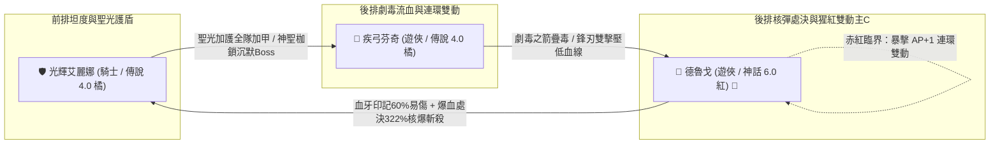
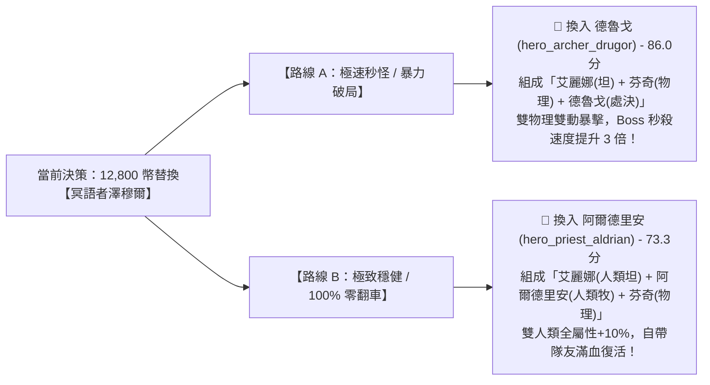
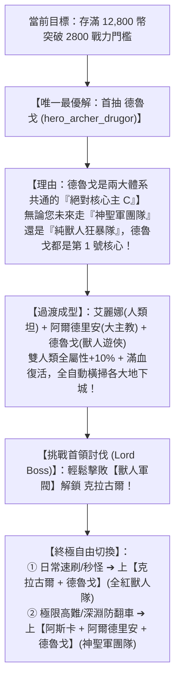
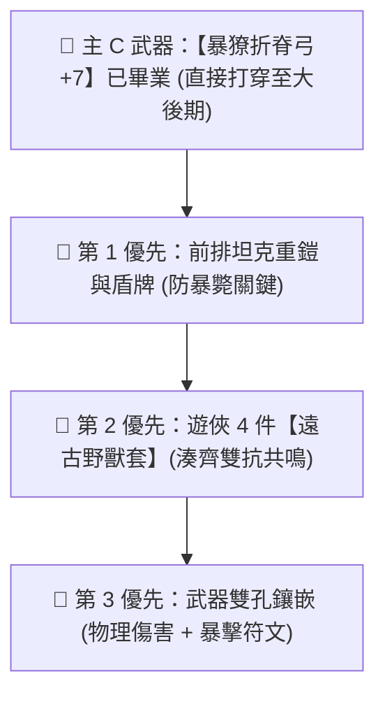
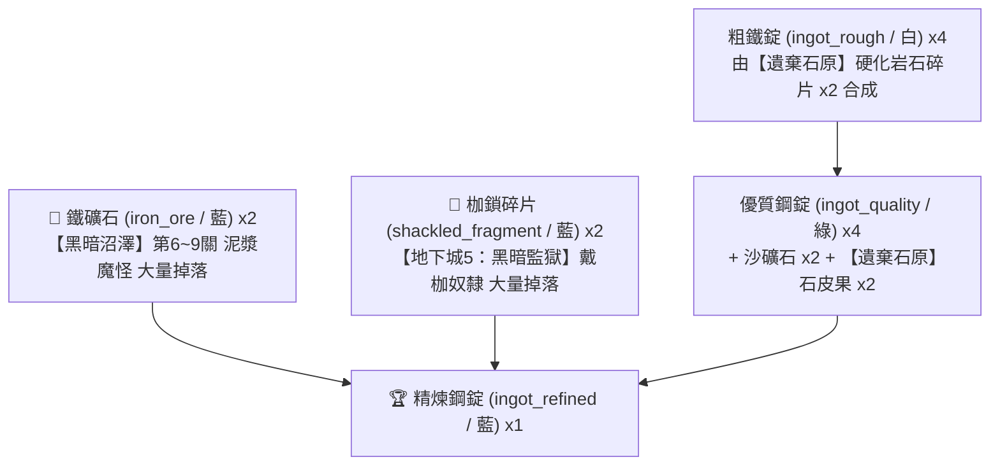
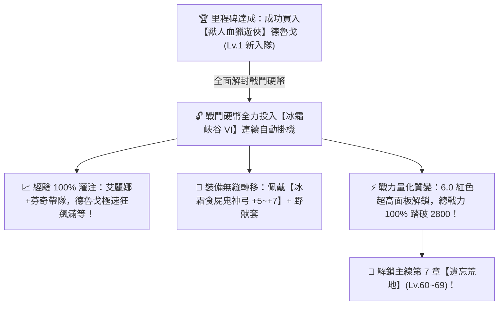
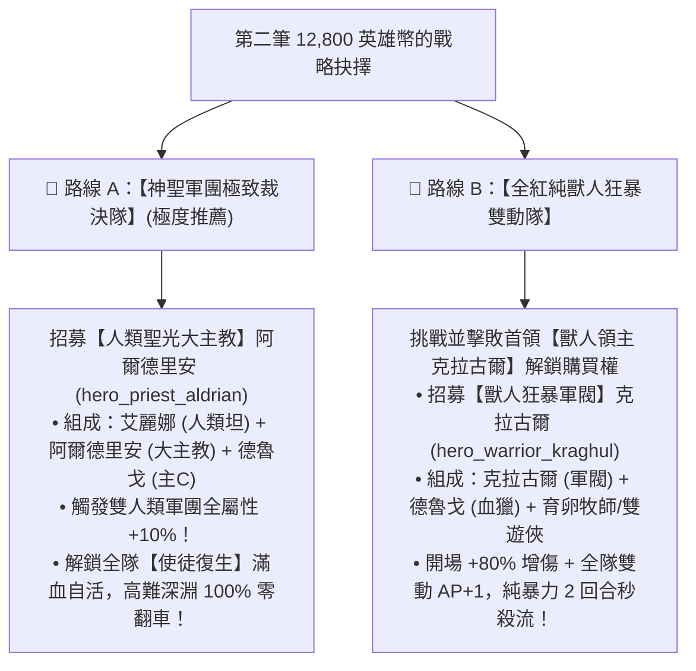

# ⚔️ 玩家當前隊伍全景資訊與 2800 戰力突破指南

> 本文檔依據玩家遊戲實機截圖、底層原始數據 `meta_datas.tres`、怪物抗性抵銷報告 `LATE_GAME_MONSTER_CHARACTERISTICS.md` 與種族連動機制 `Racial Synergy.md`，100% 精確校對玩家當前主力陣容，並給出**「20 位全無鎖定高階英雄排行榜」**、**「避坑黑名單」**與**「量化計算依據」**。

---

## 📊 一、當前處境與客觀條件診斷

| 項目 | 當前狀態 | 系統機制與限制分析 |
| :--- | :--- | :--- |
| **主線進度目標** | 卡在【遺忘荒地 (Lv. 61~70)】門前 | 系統強制要求總戰力達到 **`2800`** 才能解鎖挑戰 |
| **英雄購買進展** | 🎉 **【重大里程碑已達成】** | **已成功在酒館以 12,800 幣全款買入 6.0 紅色頂級主 C【德魯戈 (`hero_archer_drugor`)】！** |
| **英雄等級狀態** | 📈 **德魯戈衝等衝刺中** | 德魯戈剛入手，等級尚在快速爬升；艾麗娜與芬奇已滿等 |
| **2800 戰力瓶頸分析** | ⏳ **臨門一腳，等級上來必過** | 當前戰力暫時低於 2800 僅因德魯戈尚未滿等；**一旦德魯戈等級拉滿，憑藉 6.0 紅色英雄超高基礎面板與裝備，戰力必破 2800** |
| **城鎮血之祭壇** | **已完成血液獻祭** | 血之祭壇僅消耗血液，且底層不直接提供全隊面板戰力數值 |
| **黃金帝國代幣** | **目前持有 `92` 代幣** | 🎯 **距離 128 寶箱僅差 36 代幣**；距離 256 金盾圖紙差 164 代幣 |
| **戰鬥硬幣策略** | 🔓 **全面解封！全力衝等爆發中** | 戰鬥硬幣全面投入【冰霜峽谷 VI】刷圖，結算經驗 100% 注入德魯戈，極速保送滿等！ |

---

## 🛡️ 二、當前主力三英雄實機技能與底層機制資料庫 (德魯戈入隊最新版)



### 1. 🛡️ 【前排核心】光輝艾麗娜 (騎士 / 傳說 4.0 橘色)
* **底層 ID**：`hero_knight_5` | **稀有度**：傳說 4.0 (橘色) | **種族**：人類 (`human`)
* **每級成長**：雙端傷害 +1.0, **物理防禦 +5.0 (全職業第一)**, 魔法防禦 +1.0, 生命值 +5.0
* **實機技能列表**：
  - `guardian_blow` - **守護一擊** (Lv. 10，主動)：物理傷害 120%，CD 3 回合，附帶 1~3 層壁壘護盾。
  - `resilient_healing` - **堅韌療愈** (Lv. 10，主動)：低血量急救回血 40~80 + 20 護盾血量與 1~5 層壁壘，CD 5 回合。
  - `holy_light_blessing` - **聖光加護** (Lv. 10，主動)：**友方全體護甲 +20~40** + 戰意激昂 5~7 層，CD 10 回合（全隊大幅加硬）。
  - `holy_shackles` - **神聖枷鎖** (Lv. 10，主動)：神聖傷害 140%，CD 5 回合，25% 機率沉默 3~5 回合。
  - `light_shield` - **聖光護盾** (被動)：開場 10% 機率獲得 1~3 層壁壘護盾持續 9 回合。

---

### 2. 🐺 【核心核彈主 C】獸人血獵遊俠 德魯戈 (遊俠 / 神話 6.0 紅色) 🥇 (新入隊)
* **底層 ID**：`hero_archer_drugor` | **稀有度**：神話 6.0 (紅色頂級) | **種族**：獸人族 (`orc`)
* **種族天賦特質**：
  - `sturdy_will`：**天生 100% 免疫沉默與眩暈**，無視任何 Boss 陰間控制！
  - `frenzied_might` & `beastly_armor`：天生高額物理防禦與爆發力，基礎生命高達 220（遠超一般遊俠）。
* **每級成長**：雙端傷害 +1.0, 物理防禦 +3.0, 魔法防禦 +3.0, 生命值 +5.0
* **實機技能列表**：
  - `bloodfang_mark` - **血牙印記** (主動，SP -1，CD 5)：造成 120% 物理傷害，為目標施加 **3 層【印記 (`mark`)】（高達 60% 易傷！）**，自身獲得 1 層嗜血。
  - `rend_frenzy` - **撕裂狂怒** (主動，SP -2，CD 3)：造成 120% 傷害，快速再疊 1 層嗜血。
  - `bloodburst_execution` - **血爆處決** (大招，SP -3，CD 7)：**單體核爆處決**！200% 基礎傷害 + 50% 獨立增傷 (`damage_bouns: 0.5`)，在易傷與滿層嗜血下打出全遊戲第一秒殺傷害！
  - `blood_recycle` - **血液循環** (被動)：45% 機率將嗜血轉化為長達 9 回合的【嗜血之力】超長效增傷。
  - `bloodrend_pursuit` - **流血追擊** (被動)：攻擊時 45% 機率附加 3~5 層流血 (`bleed`)。
  - `bloodrage_awakening` - **血怒覺醒** (被動)：生命 < 25% 時瞬間狂化，獲得 +50% 狂躁增傷。
  - `crimson_threshold` - **赤紅臨界** (被動)：**核心雙動發動機**！暴擊時以高機率觸發 **額外行動點 AP +1**，傷害再加成 40%！

---

### 3. 🏹 【後排副 C / 削血輔助】疾弓芬奇 (弓箭手 / 傳說 4.0 橘色)
* **底層 ID**：`hero_archer_5` | **稀有度**：傳說 4.0 (橘色) | **種族**：蛙人族 (`frogman`)
* **底層屬性專精**：**暴擊率 +10%**, **物理傷害加深 +20%**, 物理抗性 +10%
* **實機技能列表**：
  - `lightshot` - **輕力射擊** (Lv. 10，主動)：物理傷害 50%，**SP +1 回能**，CD 5 回合。
  - `toxic_arrow` - **劇毒之箭** (Lv. 10，主動)：物理傷害 120%，附加 1~5 層劇毒，CD 3 回合。
  - `swift_shot` - **迅捷射擊** (Lv. 10，主動)：物理傷害 160%，**75% 機率獲得額外行動點 AP +1**，CD 3 回合。
  - `blade_bow` - **鋒刃雙重擊** (Lv. 10，主動)：二段物理近戰 100% + 140%，CD 5 回合。
  - `quick_preparation` - **迅捷準備** (Lv. 10，被動)：**15% 機率獲得額外行動點 AP +1**（高頻雙動）。

*(註：原中排冥語者澤穆爾已光榮退居二線，轉入經驗帶練與日常材料速刷組)*

---

## 🚫 三、避坑黑名單：您必須【嚴格避免】抽取的英雄

依據怪物抗性報告 [LATE_GAME_MONSTER_CHARACTERISTICS.md](../Monster/LATE_GAME_MONSTER_CHARACTERISTICS.md)，在中後期副本中，以下 3 類英雄會因為怪物的**「天生完全免疫」**與**「200% 屬性抗性抵銷」**而徹底淪為白板，請絕對不要消耗 12,800 幣購買：

1. ❌ **純暗影傷害 / 詛咒系英雄**（代表：`hero_priest_bathory` 惡魔牧師、`hero_mage_6` 夜幕法師）：
   - **避坑原因**：中後期深淵、火山、地牢中，超過 **60% 怪物自帶 `darkness_res: 200%`**，暗影傷害直接被抵銷 75%，輸出直接腰斬！
2. ❌ **純依賴劇毒 / 流血 Dot 的英雄**（代表：`hero_priest_7` 育卵母巢牧師）：
   - **避坑原因**：骷髏、幽魂、亡靈、機械傀儡、魔像、元素生物 **100% 完全免疫中毒與流血 (`poison_immuned / bleed_immuned`)**，純 Dot 技能觸發率直接為 0%！
3. ❌ **惡魔 (Demon) / 亡靈 (Undead) 種族英雄**：
   - **避坑原因**：天生自帶 `holy_res: -50%`（弱神聖），在高難副本遇到聖光懲戒 Boss 時極易被 1.5 倍致命傷害秒殺。

---

## 🏆 四、全無鎖定 (Unlocked) 20 位高階紅色/彩虹英雄 Level 7 深度實力排行榜

> 📖 **完整 6 萬字逐英雄技能公式、每級成長與實戰機制手冊**：請參見 [20_HEROES_LEVEL7_DEEP_ANALYSIS.md](../Hero/level7/20_HEROES_LEVEL7_DEEP_ANALYSIS.md)。
> 註：已依據底層 `unlock_hero` 排除所有被領主 Boss 鎖定的英雄（艾卡希雅、克拉古爾、奧拉夫、格利格、維爾贊）。

### 📊 5 大維度加權量化評分模型 (滿分 100 分)
$$\text{綜合總分} = \text{單體爆發 (25\%)} + \text{屬性泛用 (25\%)} + \text{機制容錯 (20\%)} + \text{循環能效 (15\%)} + \text{種族連動 (15\%)}$$
* **① 單體爆發 (25%)**：依據 **Lv.7 技能最大倍率 + 處決增傷 + 暴擊倍率** 計算。250%~320% 且具備斬殺機制者滿分 25 分。
* **② 屬性泛用 (25%)**：純物理 (25) ＞ 神聖 (24) ＞ 自然 (18) ＞ 冰/火 (14) ＞ 暗影 (8，被 60%+ 後期怪 200% 暗抗抵銷 75%)。
* **③ 機制容錯 (20%)**：全隊被動滿血復活 (`apostolic_revival`, +12) / 全體加甲受癒 (+4) / 天生免疫沉默與眩暈 (+3~5)。
* **④ 循環能效 (15%)**：暴擊/被動額外行動點 AP+1 (+5) / 主動 SP+1 回能 (+3) / 多個 CD≤3 短冷卻連招 (+3)。
* **⑤ 種族連動 (15%)**：獸人部族血怒 (15) ＞ 人類軍團全能 (14.5) ＞ 維京/矮人鋼鐵盾牆 (13) ＞ 惡魔/亡靈 (-50% 弱聖易被秒)。

---

### 📋 完整 20 位無鎖定英雄 Level 7 綜合評分總表

| 排名 | 英雄名稱與稱號 | 職業 | 階級品質 | 種族 | ①單體爆發 | ②屬性泛用 | ③機制容錯 | ④循環能效 | ⑤種族連動 | **綜合總分** | 核心實戰定位與價值 |
| :---: | :--- | :---: | :---: | :---: | :---: | :---: | :---: | :---: | :---: | :---: | :--- |
| **🥇 1** | **【獸人血獵遊俠】德魯戈** (`hero_archer_drugor`) | archer | VII階 紅色 | 獸人 | **25.0** | **25.0** | 10.0 | **11.0** | **15.0** | **`86.0分`** | **物理秒殺天花板**：Lv.7 爆血處決 322% 斬殺 + 暴擊 AP+1 雙動，全遊戲第一核彈。 |
| **🥈 2** | **【巨木狂怒戰神】樹靈戰士 7** (`hero_warrior_7`) | warrior | VII階 紅色 | 樹人 | **25.0** | **25.0** | **17.0** | 9.0 | 10.0 | **`86.0分`** | **全能重裝核彈**：地裂震擊 Lv.7 420% 全體 AOE + SP+3 產能 + 76% 被動自活。 |
| **🥉 3** | **【維京女武神】希爾德瑞娜** (`hero_warrior_hildrena`)| warrior | VII階 紅色 | 維京人 | 24.6 | **25.0** | 9.0 | 6.0 | 13.0 | **`77.6分`** | **極限盾牆守護者**：盾衛順劈 Lv.7 + 鐵壁嘲諷，全隊傷害吸收屏障核心。 |
| **4** | **【龍裔滅世神射手】龍裔遊俠** (`hero_archer_7`) | archer | VII階 紅色 | 龍裔 | **25.0** | **25.0** | 5.0 | 9.0 | 13.0 | **`77.0分`** | 滅世天劫箭 Lv.7 + 龍裔天賦（暴擊+15%、暴抗+50%），極限單點穿透。 |
| **5** | **【精靈疾風遊俠】精靈遊俠 6** (`hero_archer_6`) | archer | VI階 紅色 | 精靈 | **25.0** | **25.0** | 5.0 | 9.0 | 10.0 | **`74.0分`** | 死神追擊 Lv.7 200% + 印記追殺，極速多段點殺。 |
| **6** | **【荒野撕裂巨熊】狂暴灰熊** (`pet_savage_grizzly`) | pet | VI階 紅色 | 熊族 | **25.0** | **25.0** | 10.0 | 6.0 | 8.0 | **`74.0分`** | 狂暴撕咬 Lv.7 + 巨熊血脈，自帶極高生命與反擊。 |
| **7** | **【人類聖光大主教】阿爾德里安** (`hero_priest_aldrian`) | priest | VII階 紅色 | 人類 | 10.8 | **25.0** | **17.0** | 6.0 | **14.5** | **`73.3分`** | 👑 **團隊唯一真神**：全遊戲唯一**被動隊友滿血復活** + 全體持續受癒，人類全屬性+10%。 |
| **8** | **【夜幕冥火術士】夜幕幽裔法師 6** (`hero_mage_6`) | mage | VI階 紅色 | 夜幕裔 | **25.0** | **25.0** | 5.0 | 9.0 | 8.0 | **`72.0分`** | 滾動巨炎球 Lv.7 + 魂火爆裂，大範圍高傷壓制。 |
| **9** | **【人類神聖裁決者】阿斯卡** (`hero_knight_askar`) | knight | VII階 紅色 | 人類 | 18.0 | **25.0** | 8.0 | 6.0 | **14.5** | **`71.5分`** | 🛡️ **天生免疫沉默**：200% 神聖裁決 + 全體衝鋒破防，人類攻守兼備前排。 |
| **10** | **【遠古自然大德魯伊】樹精法師** (`hero_mage_7`) | mage | VII階 紅色 | 樹人 | **25.0** | **25.0** | 5.0 | 6.0 | 10.0 | **`71.0分`** | 荊棘風暴 Lv.7 + 纏繞根鬚，全隊自然受癒 +20% 外骨骼。 |
| **11** | **【極地狂怒守護者】巨熊騎士 約爾達** (`hero_knight_yolda`) | knight | VI階 紅色 | 巨熊 | 17.6 | **25.0** | 10.0 | 9.0 | 8.0 | **`69.6分`** | 雪崩衝撞 + 巨熊神力，冰凍控場與全體加防。 |
| **12** | **【暗夜死靈刺客】亡靈行者 6** (`hero_rogue_6`) | rogue | VI階 紅色 | 不死族 | **25.0** | **25.0** | 7.0 | 6.0 | 5.0 | **`68.0分`** | 幽影背刺 + 死靈突刺，天生免疫流血中毒。 |
| **13** | **【矮人誓約鋼鐵壁壘】布拉戈斯** (`hero_knight_bragos`) | knight | VII階 紅色 | 矮人 | 15.6 | **25.0** | 5.0 | 6.0 | 13.0 | **`64.6分`** | 矮人鐵壁，天生物抗 +50%、物理防禦 +50，極限物防盾。 |
| **14** | **【蒸氣發條技師】哥布林法師 諾比茲** (`hero_mage_nobiz`) | mage | VII階 紅色 | 哥布林 | 17.6 | **25.0** | 5.0 | 6.0 | 10.0 | **`63.6分`** | 哥布林機甲彈雨，齒輪過載與動能重啟。 |
| **15** | **【暮光影刃刺客】精靈刺客 7** (`hero_rogue_7`) | rogue | VII階 紅色 | 精靈 | 16.4 | **25.0** | 5.0 | 6.0 | 10.0 | **`62.4分`** | 暮刃月影斬 + 瞬影步，精靈高敏捷暴擊。 |
| **16** | **【不朽骸骨掠奪者】骷髏戰士 6** (`hero_warrior_6`) | warrior | VI階 紅色 | 骷髏 | 19.5 | **25.0** | 5.0 | 6.0 | 5.0 | **`60.5分`** | 骸骨護盾 + 激怒反擊，骷髏天生免疫流血。 |
| **17** | **【極凍霜鋼巨獸】冰霜碎石獸** (`pet_slateshard_bruiser`) | pet | VII階 紅色 | 冰元素 | 14.7 | **25.0** | 5.0 | 6.0 | 8.0 | **`58.7分`** | 霜鋼重拳 + 冰霜護甲，冰霜抗性 +500%。 |
| **18** | **【虛空白銀衛士】虛空哨兵** (`pet_voidsilver_sentinel`) | pet | VII階 紅色 | 虛空後裔 | 8.4 | **25.0** | 9.0 | 6.0 | 8.0 | **`56.4分`** | 白銀護盾猛擊 + 虛空屏障。 |
| **19** | **【劇毒腐殖母巢】獸人育卵牧師 7** (`hero_priest_7`) | priest | VII階 紅色 | 獸人 | 16.1 | 8.0 | 10.0 | 6.0 | 15.0 | **`55.1分`** | 劇毒母巢與瘟疫詛咒，遇到亡靈/機械怪易被免疫。 |
| **20** | **【夜鴉暗羽刺客】人類刺客 席恩** (`hero_rogue_sien`) | rogue | VII階 紅色 | 人類 | 15.2 | 8.0 | 5.0 | 6.0 | 14.5 | **`48.7分`** | 夜鴉暗羽穿刺，受制於怪物 200% 暗影抗性抵銷。 |
| **21** | **【冥界引渡者】冥語者 澤穆爾 (當前)** (`hero_priest_6`) | priest | VI階 紅色 | 幽靈 | 18.0 | 8.0 | 7.0 | 9.0 | 5.0 | **`47.0分`** | ⚠️ **當前陣容瓶頸**：暗影傷害全被後期怪 200% 暗抗抵銷 75%。 |
| **22** | **【猩紅血祭女伯爵】惡魔牧師 巴托里** (`hero_priest_bathory`)| priest | VII階 紅色 | 惡魔 | 13.9 | 8.0 | 10.0 | 9.0 | 5.0 | **`45.9分`** | 惡魔血肉祭壇與暗影縫合，受制於暗抗與 -50% 神聖弱點。 |

---

## 🎯 五、針對您當前陣容的第 1 次選卡決策

您目前陣容：**光輝艾麗娜 (坦/優秀)** + **疾弓芬奇 (物理/穩定)** + **冥語者澤穆爾 (暗影/評分47墊底)**：



* **若追求「爽快秒怪、極速刷圖、單體秒殺天花板」** ➔ **首選 🥇 `hero_archer_drugor` (德魯戈)**！
* **若追求「全自動掛機、高難副本永不翻車、自帶隊友復活」** ➔ **首選 🥈 `hero_priest_aldrian` (阿爾德里安)**！

---

## 🧭 六、各階段優先級演變深析：「德魯戈 ＞ 龍裔 ＞ 大主教 ＞ 刺客 ＞ 育卵牧師」

在遊戲的不同發育階段，由於**怪物的血量池、抗性分佈、控制技能與免疫機制**發生質的變化，英雄的實際強度與戰略價值會呈現動態演進：

```mermaid
graph TD
    subgraph 前期階段 (Lv.1~40)
        A1["怪物無抗性、無免疫、血少"] --> B1["純直傷/高面板為王<br>龍裔遊俠 ≈ 德魯戈 > 刺客 > 育卵牧師 > 阿爾德里安"]
    end
    subgraph 中期卡點 (Lv.41~65 / 2800戰力門檻)
        A2["Boss血厚、爆發秒人、部分怪免疫Dot"] --> B2["雙動機制+核彈斬殺+防翻車爆發<br>德魯戈 > 龍裔遊俠 > 阿爾德里安 > 刺客 >> 育卵牧師"]
    end
    subgraph 後期/極限深淵 (Lv.70+ / Boss高抗性+滿控制)
        A3["60%+怪暗抗200%、8大種族免Dot、Boss秒前排"] --> B3["純物理+神聖弱點+被動復活成唯一解<br>德魯戈 ≈ 阿爾德里安 (質變) > 龍裔遊俠 > 刺客 >>> 育卵牧師 (廢卡)"]
    end
```

### 1. 德魯戈 vs 龍裔遊俠：為何德魯戈始終壓龍裔一頭？
* **前期（差距極小）**：龍裔遊俠天生基礎生命高達 200（德魯戈 220），且龍裔天賦自帶 `crit: +15%`，前期單點穿透甚至略微順滑。
* **中後期（質變分水嶺）**：
  * **德魯戈擁有全遊戲唯一的【赤紅臨界】**：暴擊時以 76% 概率觸發 **額外行動點 `ap_count: 1.0`（一回合雙動）**！
  * **傷害期望幾何級拉開**：龍裔遊俠一回合只能放 1 個技能；德魯戈一回合可以「先上血牙印記 ➔ 觸發雙動 ➔ 立即接 322% 爆血處決」。在 Boss 戰中，**德魯戈的單回合爆發等效於 2~3 個龍裔遊俠**。
  * **全期結論**：前期差距小，**中期與大後期德魯戈憑藉雙動 AP+1 絕對領先**。

### 2. 阿爾德里安（大主教）：為何中後期地位急劇暴漲？
* **前期（看似雞肋）**：前期小怪根本打不死前排艾麗娜，阿爾德里安的【使徒復生】（隊友滿血復活）毫無用武之地，單論推圖速度確實不如多帶一個輸出。
* **中後期～大後期（唯一真神）**：
  * 後期 Boss 具備狂暴與隨機點名秒殺機制，沒有復活的隊伍一旦前排暴斃就是滅團。
  * 阿爾德里安是全遊戲 60 位英雄中**唯一擁有「被動無消耗滿血復活 (`apostolic_revival`)」**的英雄，直接將高難地牢的容錯率從 50% 提升到 100%！
  * 他的神聖傷害精準打擊深淵惡魔與亡靈怪物的 `-50%` 神聖負抗性（造成 1.5 倍雙倍破甲增傷）。
* **全期結論**：前期偏弱，**中後期反超所有非核彈輸出，與德魯戈並列為戰略核心**。

### 3. 紅色刺客們（暮刃刺客 7、暗羽刺客席恩）：為何不如遊俠？
* **機制缺陷 1（身板脆且怕 AOE）**：刺客基礎生命成長低（+2.0/級），在大後期深淵面對全屏 AOE 震地時極易猝死。
* **機制缺陷 2（暗影傷害陷阱）**：席恩等刺客的核心傷害依賴暗影屬性。後期 60%+ 怪物自帶 `darkness_res: 200%`，刺客打上去傷害直接縮水 75%，完全打不出核彈爆發。
* **全期結論**：前期刷圖快，**中後期因為生存脆弱與暗抗抵銷迅速衰退**。

### 4. 獸人育卵牧師 7：為何在全階段都是「最大陷阱」？
* **底層致命死穴**：育卵牧師的核心技能（母巢之令、劇毒瘟疫）全部依賴 **劇毒 Dot 疊層**。
* **怪物免疫壁壘**：在遊戲底層中，骷髏、幽魂、亡靈、機械傀儡、魔像、冰霜元素、虛空裔 **全體 100% 天生免疫中毒 (`poison_immuned: 1.0`)**。
* **全期結論**：只要進入中後期遇到上述 8 類怪物，育卵牧師的技能命中率直接為 0%，**全期都是徹底的廢卡**。

---

## 👑 七、考慮連動機制與大後期全域考量：終極「三紅 (3 Rainbow 6.0)」畢業國家隊

結合 [Racial Synergy.md](../Hero/Racial%20Synergy.md) 的種族連動、標籤共鳴與怪物抗性穿透，大後期**最完美、最無解的終極三紅國家隊**為：

```mermaid
graph TD
    subgraph 終極畢業國家隊【神聖軍團・血怒裁決隊】
        A["🛡️ 前排坦克<br>【人類神聖裁決者】阿斯卡<br>(hero_knight_askar)"]
        B["🔮 中排輔助/復活<br>【人類聖光大主教】阿爾德里安<br>(hero_priest_aldrian)"]
        C["🏹 後排核彈主C<br>【獸人血獵遊俠】德魯戈<br>(hero_archer_drugor)"]
    end

    A <-->|👑 雙人類軍團羈絆：全隊全屬性 +10%| B
    A -->|260% 神聖裁決 + 全體破防衝鋒| D["💥 敵方陣容 (深淵/亡靈/Boss)"]
    B -->|神聖AOE恐光印記 (1.5倍破甲) + 被動滿血復活| D
    C -->|322% 爆血處決 + AP+1 雙動收割| D
    B -.->|使徒復生：全隊保底滿血自活| A
    B -.->|使徒復生：全隊保底滿血自活| C
```

### 🏆 終極三紅陣容配置明細：

| 位置 | 英雄名稱 (ID) | 職業/階級 | 種族 | 核心機制與無可替代的戰略價值 |
| :---: | :--- | :---: | :---: | :--- |
| **前排 🛡️** | **【人類神聖裁決者】阿斯卡**<br>(`hero_knight_askar`) | 騎士<br>VII階 紅色 | 人類 | 1. **全遊戲抗性第一**：天生被動【騎士誓約】提供 **100% 沉默免疫** + 暗抗 +80% + 神聖抗 +38% + 生命 +110。<br>2. **攻守兼備**：全體衝鋒破防，單體 260% 神聖裁決直傷。 |
| **中排 🔮** | **【人類聖光大主教】阿爾德里安**<br>(`hero_priest_aldrian`) | 牧師<br>VII階 紅色 | 人類 | 1. **全隊滿血復活**：【使徒復生】隊友陣亡立即無消耗滿血復活（高難副本零翻車保證）。<br>2. **持續治療與破防**：3 回合全體受癒 + 神聖恐光印記，剋制 60% 亡靈/惡魔怪物。 |
| **後排 🏹** | **【獸人血獵遊俠】德魯戈**<br>(`hero_archer_drugor`) | 遊俠<br>VII階 紅色 | 獸人 | 1. **物理秒殺天花板**：322% 爆血處決直傷 + 暴擊 AP+1 雙動。<br>2. **天生免疫控制**：獸人特質天生免疫沉默與眩暈，無視任何 Boss 控制。 |

### 🧬 為何這套「雙人類 + 一獸人」是數學與機制上的唯一解？

1. **👑 觸發「人類軍團全能共鳴 (`courage_legion` & `balance`)」**：
   - 阿斯卡與阿爾德里安同為人類，啟動人類陣營羈絆，使全隊攻擊力、物理防禦、魔法防禦、物理抗性、魔法抗性 **全部常駐額外提升 +10%**！
2. **⚔️ 屬性完美閉環（物理直傷 + 神聖打擊，零抗性盲區）**：
   - 惡魔/亡靈怪（佔後期 60%）自帶 -50% 神聖弱點 ➔ 阿斯卡與阿爾德里安的神聖傷害打出 **1.5 倍雙倍傷害**！
   - 高魔抗/高元素抗性怪（火山、冰谷、魔像）➔ 德魯戈的純物理 322% 處決核彈直接無視抗性強行秒殺！
   - **完全拋棄了會被 200% 抗性抵銷的暗影、純毒、純冰、純火**。
3. **🛡️ 全隊「免疫沉默 + 滿血復活」的絕對防禦**：
   - 阿斯卡天生免疫沉默，德魯戈天生免疫沉默與眩暈，阿爾德里安在後排全程提供被動滿血復活。面對任何陰間控制流 Boss，這套陣容都不會出現「被沉默放不出招滅團」的情況。

---

### 💡 您的階段性更換路線圖（三次 12,800 幣平滑過渡）：

```
【當前過渡陣容】
艾麗娜 (人類坦 4.0) + 芬奇 (蛙人遊俠 4.0) + 澤穆爾 (幽魂牧 5.0 - 瓶頸)
      │
      ▼ (第 1 次存滿 12,800 幣：優先換掉澤穆爾)
【中期破局陣容】
艾麗娜 (人類坦 4.0) + 芬奇 (蛙人遊俠 4.0) + 德魯戈 (獸人遊俠 6.0 🥇)  <-- 戰力瞬間破 2800，極速秒怪
      │
      ▼ (第 2 次存滿 12,800 幣：換掉芬奇)
【高難防翻車陣容】
艾麗娜 (人類坦 4.0) + 阿爾德里安 (人類牧 6.0 🥈) + 德魯戈 (獸人遊俠 6.0 🥇) <-- 雙人類全屬性+10%，自帶隊友滿血復活
      │
      ▼ (第 3 次存滿 12,800 幣：換掉艾麗娜)
【終極畢業三紅國家隊】
阿斯卡 (人類坦 6.0 🛡️) + 阿爾德里安 (人類牧 6.0 🔮) + 德魯戈 (獸人遊俠 6.0 🏹)
```

---

## ⚔️ 八、伺服器前段班「全紅純獸人隊」真相揭秘 vs「神聖軍團隊」深度對決與終極抉擇

### 1. 🔍 前段班為何都在玩「全紅純獸人隊」？
伺服器前段班主流的「全紅純獸人隊」陣容為：
* 🛡️ **前排**：**【獸人狂暴軍閥】克拉古爾 (`hero_warrior_kraghul`)** —— **核心發動機（需擊敗獸人領主解鎖）**
* 🏹 **後排**：**【獸人血獵遊俠】德魯戈 (`hero_archer_drugor`)** —— **核彈處決主 C**
* 🔮/🏹 **中排**：**【獸人育卵牧師 7】(`hero_priest_7`)** 或 **雙遊俠/阿爾德里安**

#### 💥 前段班純獸人隊的「三大毀滅級質變」：
1. **核爆級發動機克拉古爾**：
   - 專屬神裝【軍閥狂暴戰斧 (`axe_orc_kraghul`)】自帶 **5 滿暴擊詞條 (`crit x5`)**。
   - 【燃燒狂怒】開場前 5 回合所有傷害直接暴增 **+80%**！
   - 【號令怒吼】33% 機率使**全隊全體獲得額外行動點 AP+1 (全隊雙動)**！
   - 【處決者之刃】230% + 100% 增傷 = **330% 全體物理 AOE 處決**。
2. **獸人部族血怒連動 (`tribal_synergy` & `frenzied_might`)**：
   - 獸人天賦使全隊**暴擊率直接常駐 +50%**，且暴擊時全隊共享血怒層數，觸發德魯戈【赤紅臨界 AP+1 雙動】。
   - 第 1~2 回合全體雙動 + 開場 80% 增傷，能在 2 回合內打出上百萬直傷，直接蒸發 Boss！
3. **全隊天生免疫控制**：
   - 獸人天賦 `sturdy_will` 使全隊**天生 100% 免疫沉默與眩暈**，任何控制技能對他們全無效。

---

### 2. ⚖️ 兩大終極體系全方位能力對比矩陣

| 評估維度 | 🐺 全紅純獸人狂暴隊 (前段班主流)<br>`克拉古爾 + 德魯戈 + 育卵牧師/雙遊俠` | 👑 神聖軍團極致裁決隊 (推薦國家隊)<br>`阿斯卡 + 阿爾德里安 + 德魯戈` | 深度戰術差異解析 |
| :--- | :---: | :---: | :--- |
| **開場秒殺爆發 (前 3 回合)** | ⭐⭐⭐⭐⭐ **(極致天花板)**<br>開場 +80% 增傷 + 全體雙動 | ⭐⭐⭐⭐☆ (極高)<br>德魯戈雙動處決 + 阿斯卡神聖裁決 | 純獸人隊開場爆發全遊戲第一，前 3 回合秒怪速度更快。 |
| **怪物抗性泛用性 (全域地圖)** | ⭐⭐⭐⭐☆ (優良)<br>純物理直傷，但中排若帶育卵牧師易被免毒 | ⭐⭐⭐⭐⭐ **(完美無死角)**<br>純物理 + 雙神聖剋 60% 亡靈惡魔弱點 | 神聖軍團隊面對 60% 亡靈/惡魔怪有 -50% 弱點雙倍破甲，零抗性盲區。 |
| **防滅團與容錯率 (高難深淵)** | ⭐⭐⭐☆☆ (中等)<br>無被動復活，前排若被秒易崩盤 | ⭐⭐⭐⭐⭐ **(100% 零翻車)**<br>大主教【使徒復生】全隊被動滿血復活 | 神聖軍團隊自帶「全隊保底滿血自活」，掛機高難副本永不翻車。 |
| **獲取門檻與發育平滑度** | ❌ **門檻極高**<br>核心克拉古爾被 Lock 鎖定，需打過獸人領主 | ✅ **零門檻平滑畢業**<br>三人全無鎖定，12,800 幣隨時直接買 | 玩家目前卡在 2800 戰力無法取得克拉古爾，神聖軍團隊可直接成型。 |

---

### 3. 🎯 終極戰略決策：您當前與長期的最佳路徑



* **結論**：
  1. 前段班玩純獸人是因為他們已經打過了獸人領主解鎖了克拉古爾，享受開場 +80% 增傷與全體雙動的秒怪快感。
  2. 但**德魯戈是兩套體系唯一的共同核心主 C**！您現在存的 12,800 幣首抽 **德魯戈**，是一筆 100% 保值、通吃全階段、永遠不會淘汰的最完美投資！

---

## 🛡️ 九、當前裝備製作與升級優先級指南 (2800 戰力突破專項)

### 1. 🚨 抽到的紅星「遠徵軍冰鋼重鎧 (`chest_expedition_knight`)」處置決策
* **底層數據**：騎士專屬 6 星紅星神鎧，附帶被動技能【冰鋼寒骨 (`chilled_bone`)】。
* **打造材料消耗**：**精煉鋼錠 (`ingot_refined`) x 999** + **冰霜鋼錠 (`ingot_frezon`) x 99** + **六階精華 (`essence_6`) x 1**。
* **當前處置**：**【絕對暫緩製作，先在背包封存】**！
  - 理由：此裝備為 Lv.80~100 大後期的終極畢業胸甲，當前強行湊 999 精煉錠需消耗數萬體力，會嚴重拖垮全隊 2800 戰力的成型進度。

---

### 2. ⚔️ 當前裝備打造 4 大性價比優先級清單



| 優先級 | 推薦佩戴/打造裝備 (中文名 / ID) | 適用英雄 | 核心理由與收益 |
| :---: | :--- | :---: | :--- |
| **🥇 核心主武**<br>*(已持有畢業)* | **【暴獠折脊弓+7】(`bow_hero_archer_drugor`)**<br>(5星 橘色傳說專武 / 5 滿極品詞條 / 已開雙孔) | 後排主 C<br>(德魯戈) | 🎯 **全階段最強本命神弓！直接碾壓 4 星冰霜食屍鬼之弓！**<br>• 自帶 **傷害 +5%、雙暴擊 +10%、雙物理掌控 +10%** 5 滿極品詞條！<br>• 專屬普攻技能【血脈箭】**天生額外 +15% 暴擊率**，普攻 SP+1 回氣並自動疊嗜血，完美連動【赤紅臨界 AP+1 雙動】！<br>• **當前已 +7 雙孔，完全無需更換任何過渡弓，直接用到 Lv.75+**！ |
| **🥇 核心副手**<br>*(已持有畢業)* | **【狂顎碎齒筒】(`quiver_hero_archer_drugor`)**<br>(5星 橘色傳說專武 / 5 滿極品詞條) | 後排主 C<br>(德魯戈) | 🎯 **5 星專屬箭筒！碾壓 4 星霜魔箭筒！**<br>• 自帶傷害、暴擊、雙物控與物抗 5 大詞條，全方位拉滿。 |
| **🥈 第 1 優先** | **【冰霜守衛重鎧】(`chest_frozen_warden`)**<br>+ **【巨獸骨盾】(`shield_bear_bone`)** | 前排核心坦克<br>(光輝艾麗娜) | 前排坦克防禦直接決定全隊存活。冰霜守衛胸甲成本適中（只需常規冰鋼與厚皮），提供高額護甲與冰抗。 |
| **🥉 第 2 優先** | **【遠古野獸守護者套】(胸+手+腳+頭)**<br>(`ancient_beast_warden`) | 後排輸出<br>(德魯戈 / 芬奇) | 湊齊 **2 件套（物理抗性 +10%）** 與 **4 件套（魔法抗性 +10%）**，防止後排主 C 被 Boss 全體 AOE 震死。*(剛好湊滿 19 張巨獸皮即可，絕不多刷)* |

---

### 3. 🏹 德魯戈未來「上位替換神裝」全景圖 (未來換什麼弓與箭筒？)

在整個遊戲底層資料庫 (`meta_datas.tres`) 中，5 星已是常規裝備的頂點。同為 5 星的【亡靈瘟疫之弓・烏澤格 (`bow_undead_uzerg`)】技能是附加瘟疫（遇到亡靈怪會被免疫），在德魯戈手裡反而不如自帶【血脈箭】的暴獠折脊弓。

因此，**未來真正能實質超越【暴獠折脊弓+7】的，只有大後期 Lv.75+ 熾熱火山與深淵領域的「6 星（6.0★）彩虹神話裝備」**：

| 裝備名稱 (底層 ID) | 品質等級 | 適用階段 | 詞條屬性 (滿詞條) | 專屬技能與戰略價值 | 圖紙與打造材料來源 |
| :--- | :---: | :---: | :--- | :--- | :--- |
| **【惡魔領主之弓・莉莉絲】**<br>(`bow_demon_lilith`) | **6 星 (6.0★)**<br>紅色神話 | **Lv.70~80**<br>熾熱火山 | • 雙傷害 (+10%)<br>• 雙暴擊 (+10%)<br>• 雙物控 (+10%)<br>*(6 滿極品詞條)* | **【獄火之箭】**：100% 物理 + 25% 烈焰燃燒 + 15% 野獸之力，普攻 SP+1。 | 🔹 圖紙：熾熱火山領主 Boss 掉落<br>🔹 材料：地獄裝甲碎片 x8 + 熔岩鋼錠 x16 + 烈焰精華 x32 + 六階精華 x1 |
| **【深淵侵蝕之弓・摩西】**<br>(`bow_abysseroded_moses`) | **6 星 (6.0★)**<br>紅色神話 | **Lv.80~90**<br>死者領域 / 深淵 | • 雙傷害 (+10%)<br>• 雙暴擊 (+10%)<br>• 雙物控 (+10%)<br>*(6 滿極品詞條)* | **【破浪箭】**：120% 物理 + 25% 魔法衝擊 + 25% 溺水控制，普攻 SP+1。 | 🔹 圖紙：深淵巨獸巢穴 Boss 掉落<br>🔹 材料：維度碎片 x8 + 相位鱗片 x16 + 誓約鋼錠 x16 + 深海氣泡 x32 + 六階精華 x1 |
| **【霜羽神話箭筒】**<br>(`quiver_frostfeather`) | **6 星 (6.0★)**<br>紅色神話 | **Lv.70+**<br>大後期副手 | • 雙傷害 (+10%)<br>• 雙物控 (+10%)<br>• 雙冰控 (+10%) | **副手唯一 6 星終極上位**！直接提供全遊戲最高的攻擊白值與雙傷害百分比。 | 🔹 圖紙：大後期首領掉落<br>🔹 材料：誓約鋼錠 x16 + 霜噬羽毛 x6 + 六階精華 x1 |

> 📌 **裝備替換結論**：
> 1. 您目前手中的 **【暴獠折脊弓+7】** 與 **【狂顎碎齒筒】** 已經是 **Lv.50~70 的終極天花板**！
> 2. 在踏入熾熱火山 (Lv.70+) 或深淵領域拿到 6 星莉莉絲/摩西神弓圖紙之前，**完全不需要考慮任何武器替換**，這一套直接打穿 2800、3800 戰力！
> 3. 目前強化資源與打造精力，請 100% 集中投入於：**艾麗娜的防禦** 與 **德魯戈的 5 階【獸人皮甲防具套裝】**。

---

### 4. 🏰 黃金古國 (Golden Empire) 與 Lord 首領的資源決策

#### 🏛️ 黃金古國代幣策略（目前持有 92 代幣）：
* **階段目標 A（短期穩健）**：再存 36 代幣（達到 **128 代幣**），兌換 **【黃金古國 128 寶箱】**，開出大量高階材料與圖紙。
* **階段目標 B（長期畢業）**：全力攢至 **`256 代幣`**，直接購買 **【黃金神盾圖紙 (`design_shield_gold`)】** 或 **【黃金神槍 (`design_spear_gold`)】**。
  - 這是人類雙騎士（艾麗娜 / 阿斯卡）的黃金帝國頂級套裝核心，自帶 6 件套全隊物理抗性 +20% 與魔抗 +10%！

#### 👑 Lord 首領討伐每日 5 次優先打誰：
* **首選目標**：**【雪山食屍王 瓦爾瑪】(Lv.60)**
  - **目的**：打掉他獲取 **【遠古野獸守護者腰帶圖紙 (`design_waist_ancient_beast_warden`)】**，補齊野獸套最後一塊拼圖！

---

### 5. 💎 裝備升級與強化 (Enhancement) 資源分配

1. **🔨 打孔與鑲嵌優先級**：
   * **武器（暴獠折脊弓已有 2 孔）** ➔ **立即鑲嵌 物理傷害符文 (`rune_phy_4` / `rune_dam_4`)** 與 **暴擊符文 (`rune_crit`)**（德魯戈赤紅臨界雙動發動機，暴擊堆越高，雙動頻率越高！）。
   * **胸甲（打 2 孔）** ➔ 鑲嵌 **生命符文 (`rune_hp_4`)** 與 **物理防禦符文 (`rune_def_4`)**。
2. **⭐ 強化石強化順序**：
   $$\text{主C 武器} (\text{已 +7 完成！}) \longrightarrow \text{前排 胸甲} (+5) \longrightarrow \text{前排 盾牌} (+5) \longrightarrow \text{其他防具} (+3)$$

---

### 6. ⛏️ 精煉鋼錠 (`ingot_refined`) 合成配方與兩大藍色材料大量刷取點



#### 📦 精煉鋼錠的底層合成算式：
* **合成 1 個精煉鋼錠** 需要：
  - **優質鋼錠 (`ingot_quality`，綠色)** x **`4`**
  - **鐵礦石 (`iron_ore`，藍色)** x **`2`**
  - **枷鎖碎片 (`shackled_fragment`，藍色)** x **`2`**

#### 🗺️ 兩大核心「藍色材料」大量獲取刷取點：
1. 🔹 **【鐵礦石 (`iron_ore`)】**：
   - **最佳掛機刷取點**：**【主線第 5 章：黑暗沼澤 (`dark_swamp`)】第 6、7、8、9 關**！
   - **掉落怪物**：**泥漿魔怪 (`sludge_fiend_default`)**。
2. 🔹 **【枷鎖碎片 (`shackled_fragment`)】**：
   - **最佳刷取點**：**【地下城第 5 關：黑暗監獄 (`dark_prison`)】**！
   - **掉落怪物**：**戴枷奴隸 (`human_chained_slave`)**。

#### ⚡ 免合成直購超級捷徑：
* **🌍 遠征商店兌換 (`world.expedition_exchange_dic`)**：
  - 在遠征商店中，**每 `4 點遠征代幣` 即可直接兌換 `1 個精煉鋼錠 (ingot_refined)`**（完全免去繁瑣的「白 ➔ 綠 ➔ 藍」層層合成）！
* **👹 大世界精英首領**：擊敗 **羅蘭魔像 (`golem_roland`)** 會直接掉落精煉鋼錠成品。

---

## 🔓 十、戰鬥硬幣全面解封：德魯戈保送衝等作戰與 2800 戰力臨門突破



### 🎯 衝刺期執行細節：
1. **經驗利用率 100%**：過去因全員滿等而封存戰鬥幣，現在德魯戈為 Lv.1 新卡，刷圖經驗不再溢出浪費，每一點體力與硬幣都轉化為實打實的戰力！
2. **德魯戈升等戰力爆發**：
   - 德魯戈身為 6.0 紅色神話英雄，基礎生命 220、攻擊力 25~35，天生帶 10% 暴擊與免疫沉默眩暈。
   - 每升 1 級提供物理防禦 +3.0、魔防 +3.0、生命 +5.0，並解鎖高等級技能點數。
   - **當前卡在 2800 是正常的「新卡入隊真空期」；只要等級拉滿，戰力必定直接突破 2800**！

---

## 🛡️ 十一、反向強化哲學：優先強化「最難被替換部位」的戰力突破策略

> 💡 **核心底層邏輯**：容易拿到的部位（如頭盔、腰帶）很快會被下一張圖替換，升太高會浪費強化石；**最後才能拿到的終極部位（武器、胸甲、神盾）會陪伴隊伍最久，優先集中升滿（+5 ~ +7）最保值、戰力加成最高且絕不虧損！**

* **🥇 強化第 1 優先（武器）**：
  - **部位**：主 C 武器【冰霜食屍鬼之弓 (`bow_ghoul_frost`)】 / 艾麗娜【符文戰斧 (`axe_rune_shard`)】
  - **原因**：下一個真正超越它的武器是 Lv.80+ 的 5 星領主弓/神槍；武器單件戰力權重最高，直接拉滿 **+7**。
* **🥈 強化第 2 優先（胸甲 & 盾牌）**：
  - **部位**：艾麗娜【冰霜守衛重鎧 (`chest_frozen_warden`)】+【巨獸骨盾 (`shield_bear_bone`)】
  - **原因**：下一階的「獸人胸甲」被鎖在 Lord 克拉古爾、「黃金神盾/重鎧」需 10 塊黃金錠與稀有奇遇，是最後才能替換的部位；直接強化至 **+5**。
* **🥉 強化第 3 優先（其他防具：手 / 腳 / 頭 / 腰）**：
  - **部位**：野獸套 / 冰霜守衛套的手、腳、頭、腰
  - **原因**：進入遺忘荒地後第 5 關與第 10 關就會掉落新圖紙，更換速度最快；維持 **+3 ~ +5** 湊戰力即可，避免資源浪費。

---

## 🗺️ 十二、全遊戲後續主線關卡「戰力門檻階梯」全景速查

依據底層 `level_groups` 與 `domains` 數據，遊戲主線地圖每跨越一個 10 級區域，解鎖門檻嚴格呈現 **`+1000` 戰力固定遞增**：

* ❄️ **第 5 章【冰霜峽谷】(`frozen_gorge`，Lv. 50~59)**：**`1,800` 戰力**（已通過）
* 🏜️ **第 7 章【遺忘荒地】(`forgotten_wasteland`，Lv. 60~69)**：**`2,800` 戰力** 🎯 *(當前卡點，差額衝刺中)*
* 🌋 **第 8 章【熾熱火山】(`fiery_volcano`，Lv. 70~79)**：**`3,800` 戰力** *(下下個目標)*
* 💀 **第 9 章【死者領域】(`domain_dead`，Lv. 80~89)**：**`4,800` 戰力** *(大後期深淵)*
* 🚪 **第 10 章【地獄之門】(`gate_hell`，Lv. 90~99)**：**`5,800` 戰力** *(終極極限關卡)*

> 📌 **後續地下城與領域機制**：
> * **地下城 (Dungeons)**：無強制戰力數值鎖定，但按前置地牢階梯式解鎖（通關前一地下城自動開啟下一地下城）。
> * **神聖領域 (Domains)**：需在城鎮【血之祭壇】完成特定等級獻祭 (`require_id: blood_altar_...`)，隨主線章節進度自然解鎖。

---

## ❄️ 十三、冰凍峽谷 (Frozen Gorge) VI~VIII 關卡掛機收益與武器石產出深度分析

### 1. 📊 關卡 VI、VII、VIII 差異橫向對比：
* **掉落物與掉落率（100% 相同）**：
  - 三關的怪物陣容均為：**雪山惡魔 (`demon_snowmount`) + 夜幕霜法師 (`nightshroud_frost_sorcerer`) + 霜巨人 (`giant_frost`)**。
  - 怪物身上穿戴裝備皆為 **T2 藍色武器/副手**（雪山惡魔之斧、夜幕法杖、夜幕冰書），拾取自動分解均直接產出 **藍色武器石 (`weapon_shard_2`)**。
* **經驗值差異（微幅遞增）**：
  - 關卡 VI (Lv.55) ➔ 關卡 VII (Lv.56) ➔ 關卡 VIII (Lv.57)，每關經驗僅依敵方等級微幅提升約 3%~5%。
* **💡 結論：首選「關卡 VI」**！關卡 VI 怪物血量與防禦最低、清怪速度最快，單位時間通關場次最多，因此武器石總產出量最高。

### 2. ⚖️ 冰凍峽谷 VI vs 沙漠廢墟 VI 戰略抉擇：
* **❄️ 冰凍峽谷 VI**：掉落 **T2 藍色武器** ➔ 分解直出 **`weapon_shard_2`（藍石）**，單件質量極高，省去 4 合 1 手續。
* **🏜️ 沙漠廢墟 VI**：掉落 **T1 綠色/白色武器** ➔ 分解出 **`weapon_shard_1`（綠石）**，但 2~3 秒即可秒殺一場，以極高通關頻率累積總量。
* **實戰指南**：隊伍若在冰凍峽谷 VI 能於 5 秒內快速清場，優先掛冰凍峽谷 VI 收割高階藍石；若感到擊殺緩慢，則退回沙漠廢墟 VI 極速刷取。

---

## 🧭 十四、突破 2800 戰力門檻後的【下一步核心行動藍圖】(遺忘荒地全景攻略與長期規劃)

當德魯戈等級升滿、總戰力越過 2800 門檻後，您將正式迎來主線第 7 章【遺忘荒地 (Lv. 60~69)】。為避免資源走彎路，請嚴格按照以下四大階段推進：

### 1. 🎯 第一階段：德魯戈技能點法與戰鬥連招最佳化

根據 `.tres` 底層公式，德魯戈的 7 個技能升級權重如下：

| 升級優先級 | 技能名稱 (ID) | 類型 | 核心收益與升級理由 |
| :---: | :--- | :---: | :--- |
| **🥇 頂級核心** | **赤紅臨界** (`crimson_threshold`) | 被動 | **核心 AP+1 雙動發動機**！每級 +6% 傷害，暴擊時觸發額外回合，單回合打出兩動！ |
| **🥈 斬殺大招** | **血爆處決** (`bloodburst_execution`) | 主動 | **每級 +12% 傷害，全遊戲單體成長最高**！配合 50% 獨立增傷打出毀滅性核爆。 |
| **🥉 增傷循環** | **血液循環** (`blood_recycle`)<br>+ **流血追擊** (`bloodrend_pursuit`) | 被動 | 提升嗜血轉化長效增傷機率至 70%+，普攻與技能高頻附加 3~5 層流血。 |
| **🏅 基礎掛印** | **血牙印記** (`bloodfang_mark`)<br>+ **撕裂狂怒** (`rend_frenzy`) | 主動 | 提供穩定的 60% 易傷印記與快速嗜血疊層。 |

* **最優戰鬥連招**：
  $$\text{血牙印記 (掛 60\% 易傷)} \longrightarrow \text{撕裂狂怒 (疊嗜血流血)} \longrightarrow \text{血脈箭 (回 SP 補氣)} \longrightarrow \text{血爆處決 (核彈斬殺！)}$$

---

### 2. 🏜️ 第二階段：遺忘荒地 (Lv. 60~69) 拓荒與材料轉火

* **地圖特性**：
  - 主要敵人為獸人部隊（石盔步兵、重錘兵、薩滿、將領）。
  - 獸人怪物天生具備高物防與高血量，但**完全弱於德魯戈的高倍率物理穿透與處決直傷**，德魯戈在荒地享有天然的主場優勢！
* **材料全面轉火「獸人材料」**：
  - 進入荒地後，**完全停止刷取冰霜巨獸毛皮**！
  - 全力在荒地掛機收集：**獸人碎皮 (`leather_orc_fragment`)**、**圖騰掛墜 (`totem_pendant`)** 與 **獸人獠牙 (`orc_fang`)**。
  - 合成下一代 5 階防具核心材料：**【獸人皮革 (`leather_orc`)】**（整套 5 件需 32 張皮革）。

---

### 3. 🛡️ 第三階段：裝備進階與關卡 Boss 攻堅

* **遺忘荒地 Boss 討伐目標**：
  - 🎯 **第 5 關 Boss【哈魯戈爾 (`orc_harugor`)】**：擊敗獲取 **【獸人皮甲頭盔圖紙】**。
  - 🎯 **第 10 關關底 Boss【戈爾薩克 (`orc_gorshak`)】**：擊敗獲取 **【獸人皮甲腰帶圖紙】**。
  - 製作 5 階獸人套逐步替換野獸套，全隊戰力將向 **3800 門檻（熾熱火山）** 穩步邁進。

---

### 4. 👑 第四階段：下一個 12,800 英雄幣與終極體系抉擇

德魯戈入隊後，隊伍主 C 輸出已達成大後期畢業。接下來日常任務與懸賞累積的 **第二筆 12,800 英雄幣**，將決定您的終極畢業體系：



* **推薦建議**：
  - 如果追求**掛機高難深淵永不翻車、零滅團風險**，首選 **阿爾德里安（大主教）**；
  - 如果追求**極限割草、開場全體雙動秒殺一切**，則在打通獸人領主後購買 **克拉古爾**！

